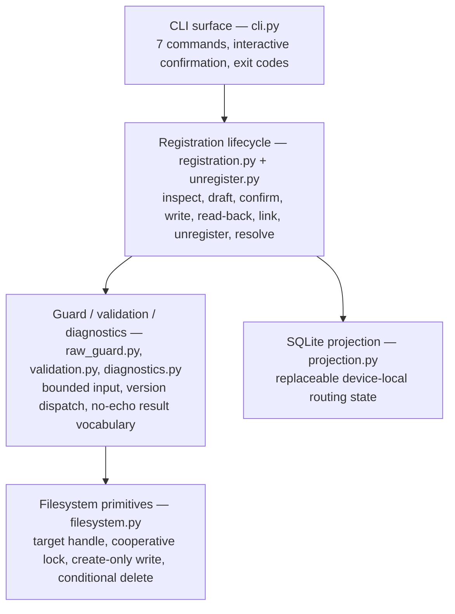
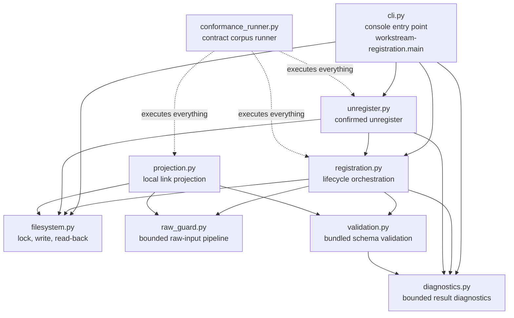

# System Overview

This page is the one-page entry point of the [architecture set](README.md). It states what the system is, its layered architecture, the end-to-end register flow, and the five invariants every other page assumes. Citations are repo-relative (`src/...` file:line) or plan citations (`PLAN:NNN` — the plan file is `docs/plans/2026-08-01-001-feat-workstream-registration-discovery-plan.md`); the frozen contracts under `contracts/workstream-registration/` are the authority when anything disagrees (see the [authority hierarchy](README.md#authority-hierarchy)).

## What the system is

**Point-and-read is the v1 entry path**: an operator points the CLI at a workspace, confirms one exact draft, and the workspace becomes a registered workstream.

Three properties define the design:

1. **Durable marker as authority.** Registration writes one durable, assistant-neutral JSON document — the **marker**, the manifest file at the fixed marker path `.workstream/manifest.json` — inside the workspace (`src/workstream_registration/filesystem.py:147`; path frozen by the 2026-08-07 operator decision, digest `docs/session-digests/2026080702_marker_path_rename_manifest_json.md`). The marker carries the permanent workstream identity, the operator-facing label, the workspace reference, and the record sources. Any conforming reader on any device recognizes the workstream from the marker alone; wiping the assistant's local state never destroys the registration (Outcome 3 of `VISION.md`).
2. **Registration is confirmed and create-only.** Nothing is written before the operator confirms the exact draft (R3, PLAN:95), and the marker write uses exclusive-create semantics so an existing marker is never silently replaced (R4, PLAN:96).
3. **Projection as replaceable local state.** The device-local link projection (a SQLite database) is derived routing state, never authority: deleting it never unregisters a workstream, and a rebuild begins from the markers (`docs/usage/how-it-works.md:66`; `src/workstream_registration/projection.py:1-8`).

## The layered architecture



Each layer depends only on the layers below it, and each owns one concern:

| Layer | Module(s) | Owns |
|---|---|---|
| CLI surface | `cli.py` | The seven commands (`register`, `inspect`, `link`, `rebuild`, `unregister`, `resolve-invalid`, `recover-lock` — `cli.py:488-528`), the interactive preview/confirm sessions (`cli.py:174-377`), the result envelope or human summary (`cli.py:536-552`), and the exit-code mapping (`cli.py:107-120`). |
| Registration lifecycle | `registration.py`, `unregister.py` | The F1-F6 flows: inspect → draft → confirm → create-only write → read-back → verify → link (`registration.py:418-1002`), existing-marker linking (`registration.py:1005`), invalid-marker resolution (`registration.py:1038-1145`), and confirmed conditional unregister (`unregister.py:279-362`). |
| Guard / validation / diagnostics | `raw_guard.py`, `validation.py`, `diagnostics.py` | The bounded raw-input pipeline (`raw_guard.py:264`), bundled Draft 2020-12 validation with version dispatch (`validation.py:206`), and the normalized bounded diagnostic vocabulary (`diagnostics.py:306`). |
| Filesystem primitives | `filesystem.py` | The stable target handle (`filesystem.py:255`), the per-workspace cooperative lock (`filesystem.py:579`), create-only marker writes (`filesystem.py:665`), read-back (`filesystem.py:698`), conditional delete (`filesystem.py:729`), and absence verification (`filesystem.py:751`). |
| SQLite projection | `projection.py` | The transactional, owner-only device-local store (`projection.py:425-603`) and its store-location resolution (`projection.py:161`). |

The module map below shows the real import graph and module responsibilities (identical to the verified map in `docs/usage/how-it-works.md:11-59`):



## The end-to-end register flow

The sequence below is the real call path for a first registration (verified; identical to `docs/usage/how-it-works.md:72-102`). The protocol state names (`inspection` → `draft-ready` → `writing` → `registered`) map onto it; the full state machine is in [state-machine.md](state-machine.md).

```mermaid
sequenceDiagram
    autonumber
    participant Op as Operator (terminal)
    participant Cli as cli.py<br/>register_interactive_cli
    participant Reg as registration.py
    participant Fs as filesystem.py
    participant Prj as projection.py

    Op->>Cli: workstream-registration register <ws> --label ... --record-source ...
    Cli->>Reg: install_default_projection_hook() (cli.py:191)
    Cli->>Reg: inspect(ws) (registration.py:418)
    Reg->>Fs: capture_target_handle(ws) (filesystem.py:255)
    Fs-->>Reg: TargetHandle(workspace, parent | ABSENT)
    Reg-->>Cli: Inspection(state=draft-ready)
    Cli->>Reg: draft(label, record_sources, kind) (registration.py:583)
    Reg-->>Cli: Draft(envelope, digest) — fresh identity (registration.py:610)
    Cli-->>Op: preview + "confirm <digest>" (cli.py:217-229)
    Op->>Cli: confirm <digest> (exact line only)
    Cli->>Reg: confirm(draft, digest) (registration.py:638)
    Cli->>Reg: register(ws, draft, confirmation) (registration.py:843)
    Reg->>Fs: registration_lock(ws) — acquire (filesystem.py:579)
    Note over Reg,Fs: pre-write revalidation; confirmation consumed<br/>(registration.py:864-890)
    Reg->>Fs: write_marker_create_only(ws, bytes, handle) (filesystem.py:665)
    Reg->>Fs: read_marker(ws) — reopen (filesystem.py:698)
    Note over Reg: raw guard + schema re-run; exact identity +<br/>read-back target handle verified<br/>(_readback_and_project, registration.py:961-1002)
    Reg->>Prj: Projection.update(ProjectionInput) (projection.py:425)
    Prj-->>Reg: ProjectionResult(status=linked)
    Reg-->>Cli: RegistrationResult(outcome=registered, identity)
    Cli-->>Op: outcome: registered / identity: <uuid> / exit 0 (cli.py:536-575)
```

In one paragraph: the CLI installs the real projection hook (`cli.py:191`), inspects read-only (`registration.py:418-466`), drafts the canonical confirmation envelope with a fresh identity and an HMAC digest under a process-ephemeral key (`registration.py:583-635`, `registration.py:173-182`), shows a preview with record-source URI content redacted (`cli.py:166-171`, `cli.py:217-229`), and on the exact `confirm <digest>` line revalidates the workspace identity and marker absence, consumes the single-use confirmation, acquires the per-workspace lock, writes the marker with exclusive-create semantics and `os.fsync`, reopens and re-validates, verifies the exact identity and read-back target handle, and links the projection (`registration.py:843-1002`). `registered` (exit 0) is reported only after read-back verification and a linked projection; every other path is a distinct outcome (see [state-machine.md](state-machine.md)).

## The five core invariants

These hold across every flow and every page of this set. Each is enforced structurally in the code, not by convention:

| # | Invariant | Meaning | Enforced at |
|---|---|---|---|
| 1 | **Marker is authority** | Deleting projection state never unregisters a workstream; a rebuild begins from the markers. | `src/workstream_registration/projection.py:1-8` (module contract), `projection.py:493-524` (`remove` is best-effort routing-state cleanup), `unregister.py:257-276` (projection removal never an outcome input) |
| 2 | **Nothing is written before exact confirmation** | The only writes in the protocol (marker creation, lock files, conditional delete) happen after the operator confirms the exact draft/intent; every transition in the protocol table declares `writes_before_confirmation: false` (protocol §13). | `src/workstream_registration/registration.py:864-890` (pre-write revalidation before consumption), `unregister.py:299-327` (confirmation checks before any delete), `cli.py:380-397` (exact `confirm <digest>` line only) |
| 3 | **Create-only writes never replace** | The final marker is opened with exclusive-create semantics; an existing marker is never overwritten, only read (valid) or reported (invalid → `occupied-invalid`). | `src/workstream_registration/filesystem.py:665-695` (`O_CREAT \| O_EXCL`), collision handling `registration.py:921-958` |
| 4 | **Fail closed everywhere** | Validation, locks, ACLs, identity APIs, and read-backs fail closed: on doubt the operation stops with a bounded non-success outcome, never a guess. | `src/workstream_registration/validation.py:181-184` (`_fail_closed`), `filesystem.py:157-185` (identity capture), `filesystem.py:315-333` (liveness check treats failure as alive), `projection.py:110-115` and `projection.py:300-311` (owner-only enforcement), `unregister.py:353-360` (unverifiable absence = stopped) |
| 5 | **No echo** | Record-source URI content is never dereferenced and never emitted: not in diagnostics, previews, `--json`, the projection, or logs. | `src/workstream_registration/diagnostics.py:306-326` (normalizer reads only validator keyword and path), `cli.py:166-171` (URI redacted), `projection.py:17-20` (no URI field in the schema), `validation.py:145-154` (no format checker, no dereference) |

## Next pages

- Why the system is designed this way: [design-decisions.md](design-decisions.md)
- Every state and transition: [state-machine.md](state-machine.md)
- How untrusted input is bounded: [data-and-security.md](data-and-security.md)
- The filesystem and projection mechanics: [filesystem-and-projection.md](filesystem-and-projection.md)
- The verified behavioral explanation with the same diagrams: `docs/usage/how-it-works.md`
