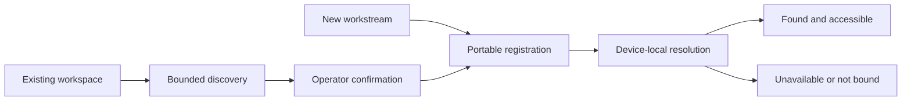

# Ideation: Arjim's Strongest Directions

## Grounding Context

Arjim is a conversational management layer for registered workstreams, not another dashboard or system of record. Its near-term promise is trustworthy awareness while making freshness, coverage, failed checks, unsupported checks, and unknowns explicit.

Durable workstream facts remain in their workspaces and designated authoritative record homes. Arjim's working copy is replaceable. Authority progresses from reading to recommending to drafting to committing; shared writes require current-version checks, explicit attribution, and visible conflict stops. Reliable awareness must precede broader automation.

The project is planning-only. No implementation or institutional solutions corpus exists. External research could not run because the environment had web fetch but no web search, so all surviving bases come directly from `VISION.md` or explicit first-principles reasoning.

Prior work recovered from the former HQ repository contributed useful context to the top idea: a portable routing manifest, device-local bindings, and self-describing workspaces. The refined idea uses only the registration and discovery portions of that work. It deliberately excludes workstream status, progress, next actions, freshness, and operating-process requirements.

## Topic Axes

Decomposition skipped - surprise-me mode.

## Ranked Ideas

1. [Workstream Registration and Discovery](#1-workstream-registration-and-discovery)
2. [Coverage-Driven Authority Escalation](#2-coverage-driven-authority-escalation)
3. [Proposal-to-Audit Closed Loop](#3-proposal-to-audit-closed-loop)
4. [Effort Baseline Engine](#4-effort-baseline-engine)
5. [Per-Workstream Freshness Contract](#5-per-workstream-freshness-contract)
6. [Root-Based Rediscovery, Not Sync](#6-root-based-rediscovery-not-sync)
7. [Coverage Gaps as Primary Feed](#7-coverage-gaps-as-primary-feed)

### 1. Workstream Registration and Discovery

**Description:** Give each workstream a stable, portable identity and a durable location map so Arjim and other authorized assistants can find its workspace and registered authoritative record homes. The concept covers two entry paths: explicitly registering a new workstream and discovering an existing workstream from approved roots or connected systems before the operator confirms its registration. It defines where the work is, not how the workstream should operate or report progress.

The portable registration holds identity and workspace references. Each device resolves those references to what it can actually access.

**Basis:** `direct:` `VISION.md:17-21` defines a workstream, its workspace, and Arjim's responsibility after registration. `VISION.md:96-99` requires locating workspaces and authoritative records across devices. `VISION.md:182` requires identifying each registered workstream's workspace and record homes without relying on operator memory.

**Rationale:** The operator should not carry the map of workstreams and tools mentally. A small registration layer gives assistants portable identity and routing context while leaving status, process, and detailed working conventions inside the workstream's own workspace.

**Downsides:** The authority for registration metadata must be chosen carefully so a central catalog and workspace-local description do not drift. Discovery must remain bounded and operator-confirmed to avoid invasive scans or accidental registration of unrelated folders and systems.

**Confidence:** 94%

**Complexity:** Medium

### 2. Coverage-Driven Authority Escalation

**Description:** Arjim cannot earn greater action authority from acceptance rates alone. Promotion from read to recommend, draft, or commit requires two forms of evidence: reliable behavior at the current tier and adequate verified coverage of the workstream's required record homes. An assistant that performs perfectly on half the workstream is not ready to act on the whole.

**Basis:** `reasoned:` `VISION.md:23-38` orders trustworthy awareness before action, while `VISION.md:141-145` separates authority levels. Binding escalation to both coverage and demonstrated behavior operationalizes that ordering.

**Rationale:** This is the clearest mechanism for Arjim to earn the right to act. It avoids a dangerous shortcut where frequent operator acceptance creates confidence despite hidden or unchecked record homes.

**Downsides:** Coverage thresholds can become bureaucratic or block useful narrow authority. The model needs per-workstream and per-action granularity so a gap in one source does not freeze unrelated safe actions.

**Confidence:** 90%

**Complexity:** High

### 3. Proposal-to-Audit Closed Loop

**Description:** Before a proposed write reaches the operator, it states the intended change, source version, required authority, durable destination, and evidence that will prove success. Acceptance authorizes exactly that proposal; execution records the result; a read-back verifies the authoritative record. The loop is designed forward rather than reconstructed after something goes wrong.

**Basis:** `direct:` `VISION.md:147-157` requires conflict-safe, attributable changes and recoverable communication. `VISION.md:190-194` requires every write to record the operator, assistant, target, time, result, and version check.

**Rationale:** Safe action becomes inspectable rather than ceremonial. The mechanism supports auditability, cross-assistant recovery, and operator confidence without making chat transcripts authoritative.

**Downsides:** The full loop is expensive for trivial changes. It needs proportionality rules, compact records, and failure semantics when execution succeeds but read-back verification cannot run.

**Confidence:** 89%

**Complexity:** Medium

### 4. Effort Baseline Engine

**Description:** Turn the initial 30-day pilot into a passive measurement capability. Arjim records routine visits made to inspect workstream status, the time spent switching among record homes, and which management questions triggered those rounds. Later, every awareness capability is judged against the baseline rather than a subjective sense that management feels easier.

**Basis:** `direct:` `VISION.md:165-181` requires a 30-day baseline and targets at least a 75% reduction in routine tool visits made only to check status.

**Rationale:** This gives Arjim its first low-authority product: observe before acting. It also prevents infrastructure work from masquerading as user value because reduction in management effort becomes measurable.

**Downsides:** Passive activity measurement creates privacy and interpretation risks. Tool visits do not always mean status checking, so the baseline needs lightweight operator correction and strict data minimization.

**Confidence:** 95%

**Complexity:** Medium

### 5. Per-Workstream Freshness Contract

**Description:** Every workstream declares how stale each required record home may become before Arjim must stop calling its information current. The contract expresses operational tolerance, not just a polling interval: an active incident may tolerate minutes while a long-range initiative may tolerate days. Arjim reports contract status and breaches alongside coverage.

**Basis:** `direct:` `VISION.md:126-140` distinguishes current from stale and defines completeness through freshness windows. `VISION.md:203` says targets should adjust to actual work, record-home limits, and realistic windows.

**Rationale:** The vision depends on freshness but leaves governance undefined. Making it a visible contract turns "current" into a testable claim and lets different workstreams carry different risk tolerances.

**Downsides:** Users may not know sensible values, and overly tight windows can create cost or alert fatigue. Arjim should propose defaults while preserving an explicit operator decision.

**Confidence:** 94%

**Complexity:** Medium

### 6. Root-Based Rediscovery, Not Sync

**Description:** A new phone, laptop, or work PC reconstructs the workstream portfolio independently from configured roots and connected systems. It does not copy another device's Arjim cache. When answers differ, Arjim explains the exact access, freshness, connectivity, or capability difference that produced the divergence.

**Basis:** `direct:` `VISION.md:92-106` permits device-specific differences only when exposed. `VISION.md:196-201` requires newly authorized devices to discover workstreams through roots and connections without copying another cache.

**Rationale:** This prevents a synchronization service from becoming a hidden authoritative record. Rediscovery makes cross-device consistency a property of shared durable sources, while explanation makes unavoidable differences trustworthy.

**Downsides:** Independent discovery can be slow, duplicate check traffic, and produce temporarily different results. Some systems may require a brokered connection, so "not sync" cannot mean "no shared infrastructure."

**Confidence:** 96%

**Complexity:** High

### 7. Coverage Gaps as Primary Feed

**Description:** Expired access, unsupported record types, stale checks, and unknown record homes appear as management items that can be resolved, deferred, or knowingly accepted. Findings remain central, but coverage failures no longer disappear into footnotes or technical logs. Arjim actively helps the operator improve the reliability envelope of every future answer.

**Basis:** `direct:` `VISION.md:40-49` makes coverage part of the trustworthy attention view. `VISION.md:126-140` gives inaccessible, unsupported, stale, and unchecked states distinct meanings.

**Rationale:** A reported gap is useful only if someone can close it. Treating gaps as manageable items creates a compounding effect: one restored connection or clarified record home improves many future portfolio answers.

**Downsides:** A prominent gap feed can overwhelm the actual work that needs attention and drift toward dashboard behavior. Ranking must distinguish urgent blind spots from tolerated or low-impact limitations.

**Confidence:** 91%

**Complexity:** Medium

## Rejection Summary

| # | Idea | Reason Rejected |
|---|---|---|
| 1 | Coverage Frame Precedes Every Answer | Scope overrun. Coverage belongs on management claims, not every unrelated interaction. |
| 2 | Unsayable Nothing Pending | Already an explicit vision requirement rather than a distinct improvement direction. |
| 4 | Workspace-First Discovery Architecture | Absorbed into Workstream Registration and Discovery as the existing-workstream discovery path. |
| 5 | Evidence-First Workstream Discovery | Absorbed into Workstream Registration and Discovery; operator confirmation is the important boundary, not inferred registration criteria. |
| 6 | Continuous Wipe-and-Rebuild Auditing | Cost/value mismatch. Continuous simulation is not justified by an eventual repeatable test. |
| 7 | Working Copy as Transient Materialized View | Important architecture principle, but already dictated by the durable-memory requirement. |
| 8 | Authority Ledger | Necessary mechanism inside coverage-driven escalation, not the stronger standalone direction. |
| 9 | Graduated Authority by Demonstration | Subsumed by coverage-driven escalation, which prevents behavioral metrics from outrunning awareness quality. |
| 10 | Cross-Home Entity Drift Detection | Duplicated entities and reconciliation semantics are not established in the vision. |
| 11 | Conflict as Coordination Layer | Adds durable conflict-process machinery beyond the current requirement to stop and report. |
| 12 | Shadow Rehearsal | Universal rehearsal adds ceremony even where existing commit authority is sufficient. |
| 13 | Acceptance Audit Trail | Subsumed by the proposal-to-audit closed loop. |
| 15 | Velocity-Driven Freshness Windows | Change velocity is an incomplete proxy for risk and operational importance. |
| 18 | Cross-Device Awareness Contract | Subsumed by root-based rediscovery, which also produces and explains device-specific differences. |
| 19 | ATC Sector Model | Below ambition floor. Useful metaphor, but not a distinct product mechanism. |
| 20 | Museum Wall-to-Wall Inventory | Renames the existing completeness rule and duplicates stronger coverage ideas. |
| 21 | Court Clerk Docket | Risks creating a secondary event log that duplicates authoritative records. |
| 22 | Consular Representation | Below ambition floor. Metaphorical restatement of bounded authority. |
| 25 | Drift-Driven Freshness Adjustment | Disagreement may reflect differing semantics or ownership rather than stale checks. |
| 27 | Cross-Device Ignorance Alignment | Overlaps root-based rediscovery and its coverage explanation. |
| 28 | Attention Debt as Coverage Shortfall | Risks creating another metric or dashboard without enough decision value. |
| 29 | Freshness-Bound Reconciliation Protocol | Basis refuted. The vision requires stale claims to be labeled, not automatic full reconciliation before any claim. |
| 30 | Authority-Bound Discovery Depth | Conflates permission to inspect structure with permission to act on it. |
