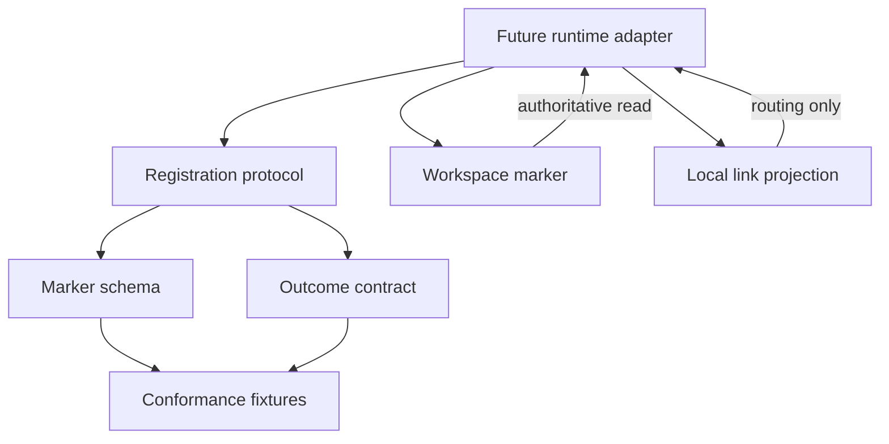
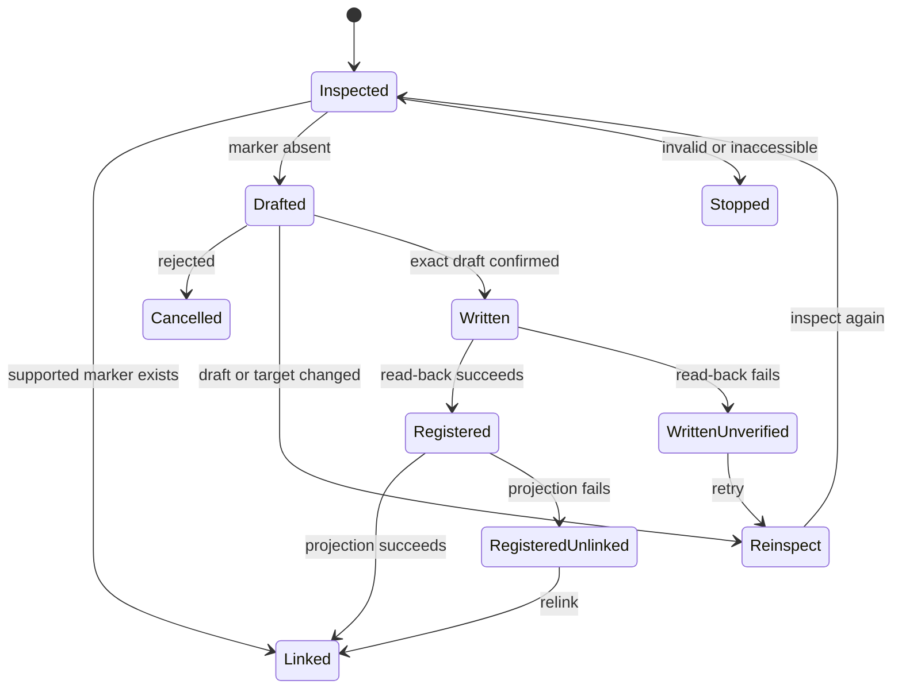

# Workstream Registration and Discovery - Plan

> This is a plain-language rewrite of the original plan, organized with the
> Diataxis framework (separate "why", "what", and "what to do" content). The
> facts, decisions, and requirements are unchanged. Only the wording and the
> structure differ.

## Overview

- **What this plan delivers.** A portable contract for workstream registration. It defines the marker file, the registration steps, the possible outcomes, and the test fixtures, so any future AI runtime registers workstreams the same way.
- **What it does not deliver yet.** A working adapter. Point-and-read registration only works once a runtime and an operator-facing adapter implement this contract and pass its tests.
- **Guiding rule.** Local routing data, device paths, unconfirmed drafts, and regenerated identities must never become the source of truth.
- **Why it matters.** A later adapter can register a workstream from just a folder pointer. No remembered map of tools is needed.

---

## Part 1: Why This Plan Exists

### The Problem

The operator currently keeps a mental map of which tool holds which workstream. That memory is not reliable. Arjim must instead:

- Recognize registered workstreams and their record homes on its own (`VISION.md:182`).
- Rebuild its inventory from workspaces after a clean rebuild (`VISION.md:186`).
- Keep durable memory outside the assistant's working copy (`VISION.md:70`).

A stable, portable registration contract is the first technical step toward all three.

### The Scope

The product scope is point-and-read registration through a durable workspace self-description. This plan builds the portable contract first:

- An assistant-neutral marker file.
- Rules for registration states.
- Explicit outcomes.
- Conformance fixtures.

Filesystem execution, assistant integration, and local inventory persistence are deferred until a runtime is selected.

---

## Part 2: What We Decided

Each decision states what we chose, what we rejected, and why.

### Product Decisions

- **KD1. The workspace owns the registration; registries are only discovery aids.**
  Why: metadata must survive Arjim being replaced. A registry that holds metadata would drift.
  Rejected: an Arjim-owned central catalog.
  Applies to: R4, R11, R12.

- **KD2. A proxy workspace stands in for workspaces that cannot store metadata.**
  Why: some systems and tools cannot store assistant metadata.
  Rejected: forcing the real workspace to hold metadata.
  Applies to: R6, R7.

- **KD3. Arjim generates the identity; the name is just a label.**
  Why: portability must not depend on naming choices.
  Rejected: operator-chosen or workspace-derived identities.
  Applies to: R2, R5, R14.

- **KD4. The self-description is minimal: identity, label, workspace reference, and record homes.**
  Why: registration stays small.
  Rejected: the fuller set in `VISION.md:182` (purpose, lifecycle state, decision record home).
  Applies to: R2, R5.

- **KD5. Arjim drafts, the operator confirms, Arjim writes.**
  Why: operator confirmation is the authority boundary for the write.
  Rejected: operator-authored or owner-authored descriptions.
  Applies to: R2, R3, R4.

- **KD6. Point-and-read is the only working v1 entry path.**
  Why: the smallest valuable slice. Scan and registry paths stay designed but dormant.
  Rejected: all three entry paths working in v1.
  Applies to: R12.

- **KD7. Arjim reads registries but never writes them.**
  Why: publishing pointers is owned outside this feature.
  Rejected: publishing pointers during registration.
  Applies to: R11.

- **KD8. Registration is access-gated.**
  Why: an instance registers only what it can access, matching device limits (`VISION.md:104`).
  Rejected: registering first and flagging access later.
  Applies to: R8, R9.

### Technical Decisions

- **KTD1. Deliver a runtime-neutral contract before an executable adapter.**
  Why: the user wants the portable boundary settled first. The active units produce schemas, protocol text, and fixtures; they do not claim working registration.
  Rejected: selecting TypeScript or Python now.
  Supports: R1-R14.

- **KTD2. The marker lives at `.workstream/workstream.json`.**
  Why: an assistant-neutral namespace that stays portable and extensible.
  Rejected: an Arjim-named path or a root-level marker.
  Supports: R4, R10-R14.

- **KTD3. Version each portable surface independently with JSON Schema Draft 2020-12.**
  Why: machine-readable schemas give runtimes one conformance target. The package release, marker schema, result schema, fixture schema, and protocol each carry their own version, so compatibility is explicit rather than inferred from one shared number. A reader dispatches on the marker version before applying its closed schema; an unknown version is *unsupported*, not *malformed*.
  Rejected: YAML or field-only prose.
  Supports: R2, R5-R7, R9, R10, R14.

- **KTD4. Keep durable and device-local references separate.**
  The marker uses the literal workspace self-reference `.` and locates itself at `.workstream/workstream.json` below the inspected root. Absolute paths, traversal, symlink-resolved paths, and local link locations belong only in adapter state.
  Supports: R2, R9, R13, R14.

- **KTD5. Treat open typed URI references as untrusted data.**
  Each record home carries a namespaced type token and an absolute URI. Version 1 checks syntax and exact duplicate pairs. Validity never authorizes dereferencing. Unsupported type/scheme pairs stay valid data with an unsupported capability status.
  Supports: R2, R7-R9.

- **KTD6. Bind single-use confirmation to a canonical semantic envelope.**
  The envelope includes: the contract versions, every parsed marker field in order, an adapter-supplied stable target handle, and the observed marker absence. The adapter revalidates the same handle before writing and during read-back, and stops if it cannot establish stability.
  Duplicate JSON keys are invalid. Only property ordering and insignificant whitespace may change during serialization.
  Confirmation expires after any write attempt, reinspection, terminal transition, or marker-state change.
  Rejected: conversational approval detached from content.
  Supports: R3, R4.

- **KTD7. An existing supported marker is the registration authority.**
  Linking reads it unchanged. Invalid, unsupported, ambiguous, or conflicting markers stop for operator resolution — never auto-repair or identity regeneration.
  Supports: R4, R9, R14.

- **KTD8. Versioned conformance fixtures are the portable test boundary.**
  Fixture and expectation schemas define inputs, observations, mandatory protocol assertions, and adapter-specific capability assertions. Every future adapter must pass the mandatory corpus before claiming compliance.
  Supports: R1-R14.

- **KTD9. Bound and isolate untrusted marker data.**
  Version 1 limits marker bytes, JSON nesting depth, field lengths, and the record-home count. It rejects duplicate keys, control characters, bidirectional overrides, URI user-info, and local-resource schemes. Labels and URIs are data, not instructions. Results use bounded structured diagnostics without raw marker bodies, full URIs, labels, secrets, or local paths.
  Supports: R8-R10.

---

## Part 3: How It Works

### Actors

- **A1. Operator** — points at workspaces, designates proxy folders, and confirms drafts.
- **A2. Arjim instance** — an assistant on one device. A future adapter inspects, drafts, writes, reads back, and links registrations available on that device.

### Key Flows

- **F1. New folder registration** (R1-R5). A future adapter inspects a folder, produces a contract-valid draft, gets confirmation, creates the marker without replacing anything, reads it back, and derives a local link.
- **F2. Existing registration** (R4, R13, R14). A valid supported marker is linked unchanged. Its identity is never regenerated, and no confirmation is needed because nothing is written.
- **F3. Proxy workspace registration** (R6, R7). The operator designates a regular folder as the metadata workspace. The marker records the proxy kind while record homes point at the real system or tool.
- **F4. Rejected or stale draft** (R3, R4). Rejection writes nothing. A changed draft or target state invalidates confirmation and requires a new draft.
- **F5. Invalid location or marker** (R8-R10). Missing, inaccessible, malformed, unsupported, or conflicting inputs stop registration with a distinct outcome and no overwrite.

### The Design in Brief

The contract separates three things:

1. **Durable workspace truth** — the marker file.
2. **Replaceable device state** — local links.
3. **Runtime-specific execution** — the adapter.

Registration has explicit terminal and recovery states, so interruption cannot create a second identity or turn local state into authority.

---

## Part 4: Requirements

### Registration

- **R1.** The operator can register a workstream by pointing Arjim at its workspace location.
- **R2.** Registration starts with an Arjim-drafted self-description containing an Arjim-generated permanent identity, a mutable label, the workspace reference, and the record-home references.
- **R3.** Nothing is written until the operator confirms the exact draft. Registration completes only after the marker can be read back.
- **R4.** On confirmation, Arjim writes the self-description into the workspace. That marker is the durable registration record and must not silently replace an existing marker.
- **R5.** The operator-facing name is a label. Changing it never substitutes for or changes the identity.

### Proxy Workspaces

- **R6.** When the real workspace cannot store assistant metadata, an operator-designated regular folder serves as the metadata workspace.
- **R7.** The proxy holds the self-description and durable workstream information. Record homes continue to reference the real system or tool.

### Access and Validation

- **R8.** An Arjim instance registers only workspaces it can access on that device. Inaccessible workspaces stay unregistered on that instance.
- **R9.** A missing workspace, non-directory target, write denial, invalid marker, unsupported marker version, or identity conflict produces a distinct non-success outcome without creating or replacing a registration.

### Discovery Readiness

- **R10.** `.workstream/workstream.json` is the only v1 marker that makes a workspace a registration or discovery candidate.
- **R11.** Registries are read-only discovery aids. They point to metadata, never hold it, and linked assistants read the workspace marker directly.
- **R12.** Machine scan and registry consumption are designed to feed the same marker-inspection protocol but do not work in this scope. Point-and-read remains the only planned working entry path.

### Durability

- **R13.** Local inventory is a replaceable projection derived from readable workspace markers. It may retain device-local routing data, but it is never the registration authority.
- **R14.** Reading a valid marker yields the same identity on every device or assistant. Retries and existing-marker linking never regenerate that identity.

### Acceptance Examples

- **AE1. New folder marker** (R1-R5). A confirmed draft for an unmarked folder produces one marker whose read-back value matches the confirmed data and whose identity stays stable.
- **AE2. Existing marker** (R4, R14). A valid supported marker is linked unchanged: no confirmation, no overwrite, no new identity.
- **AE3. Proxy marker** (R6, R7). A proxy marker identifies its folder as the metadata workspace while its record-home URIs point at the real system.
- **AE4. No confirmation** (R3). A rejected or absent confirmation produces no marker and no local link.
- **AE5. Invalid or inaccessible input** (R8-R10). A missing or inaccessible location, invalid marker, unsupported version, or conflict produces a distinct diagnostic and no write.
- **AE6. Name change keeps identity** (R5, R14). Two otherwise valid revisions may differ in label but retain the same identity.
- **AE7. Post-write link failure** (R4, R13). If the marker is written and verified but local linking fails, the marker remains authoritative, and a later relink reuses its identity.

---

## Part 5: Scope and Constraints

### In Scope (Active)

- The v1 marker schema and examples.
- The registration state and authority protocol: existing markers, exact-draft confirmation, conflicts, retries, partial success.
- A portable result and error taxonomy.
- Runtime-neutral conformance fixtures and adapter obligations.

### Deferred to Follow-Up Work

- Select a runtime and validation library.
- Implement filesystem inspection, create-only writes, read-back, and local inventory persistence.
- Add the operator-facing assistant or CLI adapter.
- Run executable end-to-end tests for folder access, permissions, concurrent writes, interruption recovery, and local relinking.

### Deferred for Later

- Machine scan and registry consumption as working entry paths.
- Registry publishing by Arjim.
- Purpose, lifecycle state, and designated decision record home in the marker.
- Workstream status, progress, next actions, and freshness.
- Operating-process requirements.
- Broad proposal-to-audit write-safety and attribution machinery beyond the narrow create-only rule.
- Cross-device root rediscovery and wipe-and-rebuild proof.
- Coverage-driven authority escalation.

### Outside This Product's Identity

- A dashboard or authoritative system of record for workstreams. An assistant's working copy never becomes authoritative (`VISION.md:15`, `VISION.md:70`).

### Dependencies and Assumptions

- `VISION.md` remains the product authority.
- The operator is the sole v1 human actor.
- Version 1 record homes are typed, absolute URI references validated for structure only. Provider access and ownership checks require later adapters.
- Marker files contain no credentials, tokens, private keys, URI user-info, or provider secrets.

### Sources

- `VISION.md` — product authority for durable memory, access honesty, authority, and rebuildability.
- `docs/ideation/2026-08-01-arjim-improvement-ideation.md` — the registration idea and surrounding work relationships.
- `README.md` — confirms the repository is planning-only with no selected stack or test tooling.
- No `docs/solutions/` corpus or implementation precedent exists yet.
- External research was attempted but unavailable (this harness has no web-search capability). No external standard is presented as researched evidence.

---

## Part 6: What Gets Built

The units must be built in this order because each depends on the previous.

### Step 1 — U5. Define the conformance envelope

**Goal.** Establish the portable fixture and expectation formats before any unit creates cases that depend on them.

**Delivers:**
- `contracts/workstream-registration/v1/conformance-case.schema.json`
- `contracts/workstream-registration/v1/expectations.schema.json`
- `tests/contracts/workstream-registration/expectations.json` (with package and fixture-format versions)

**Key rules.** Keep parsed-value cases separate from raw-byte cases. Raw cases carry base64-encoded input inside valid JSON envelopes; expectations identify the stage and outcome without treating the decoded payload as a JSON document. Define which assertions are mandatory protocol conformance and which are runtime capability checks.

**Tests.**
1. A parsed-value envelope identifies its input object and expected schema outcome.
2. A raw-byte envelope identifies its base64 payload and expected pre-parse outcome.
3. An expectation with an unknown fixture path, duplicate path, unsupported fixture-format version, or missing expected stage is invalid.
4. Mandatory protocol assertions stay separate from runtime-specific capability assertions.

**Verify.** The envelope and expectation schemas are closed, versioned, and sufficient to describe every fixture planned by U1-U3.

### Step 2 — U1. Define the version 1 marker contract

**Goal.** Establish the canonical marker schema and the assistant-neutral durable data boundary.

**Delivers:**
- `contracts/workstream-registration/v1/workstream.schema.json`
- `tests/contracts/workstream-registration/valid/folder.json`
- `tests/contracts/workstream-registration/valid/proxy.json`
- `tests/contracts/workstream-registration/valid/label-changed-same-id.json`
- `tests/contracts/workstream-registration/invalid/` fixtures: missing fields, unknown fields, malformed identity, invalid kind, local path leakage, duplicate record homes, relative record-home URI, URI user-info
- `tests/contracts/workstream-registration/raw/` envelopes: invalid UTF-8, duplicate keys, byte-order marks, trailing content, nesting-depth limits

**Key rules.** A versioned closed object with a lowercase UUID identity, bounded label, `folder|proxy` kind, literal `.` workspace reference, and bounded typed absolute record-home URIs. Limits: 64 KiB UTF-8 pre-parse ceiling, maximum JSON nesting depth of 8 containers, 256-character label limit, 64-character ASCII type-token limit, 2,048-character URI limit, 32-record-home limit. Property order and formatting are non-normative.

**Tests.**
1. A folder marker with every required field validates (covers AE1).
2. A proxy marker validates while retaining real-system record-home URIs (covers AE3).
3. Two valid markers with different labels retain the same identity (covers AE6).
4. A marker missing each required field fails with that fixture's expected outcome.
5. A marker with an unknown property, malformed UUID, unsupported kind, or empty label fails.
6. A marker with an absolute or traversing workspace reference, relative or local-resource record-home URI, duplicate type/URI pair, URI user-info, control characters, backslashes, or bidirectional overrides fails.
7. Exact-limit inputs validate; one-over-limit marker bytes, labels, type tokens, URIs, and record-home collections fail with the expected category.
8. Raw envelopes prove duplicate keys, invalid UTF-8, a byte-order mark, and trailing JSON fail before schema validity is considered.
9. Raw inputs at nesting depth 8 reach normal validation; depth 9 stops before schema validation.
10. An instruction-like but otherwise valid label stays data and does not change its expected outcome.

**Verify.** Every fixture is valid JSON, appears once in the expectations manifest, and has an unambiguous expected validity result.

### Step 3 — U2. Specify registration states and authority transitions

**Goal.** Define how any adapter inspects, drafts, confirms, writes, reads back, links, retries, and stops without changing product authority.

**Delivers:**
- `contracts/workstream-registration/v1/registration-protocol.md`
- `tests/contracts/workstream-registration/transitions/new-registration.json`
- `tests/contracts/workstream-registration/transitions/existing-marker.json`
- `tests/contracts/workstream-registration/transitions/rejected-draft.json`
- `tests/contracts/workstream-registration/transitions/stale-confirmation.json`
- `tests/contracts/workstream-registration/transitions/registered-unlinked.json`

**Key rules.** Make read-only inspection, canonical confirmation-envelope comparison, create-only write, authoritative read-back, and replaceable linking separate protocol stages. Anchor inspection, write, and read-back to the same stable target handle. Reject redirected marker-path components. Stop when target stability cannot be established. Define retries by observed marker state so a successful write followed by failure recovers the existing identity. Treat local identity conflicts as blocking evidence only when both marker locations are currently readable; stale projection data stays advisory.

**Tests.**
1. An absent marker progresses from inspection through exact confirmation, write, read-back, and link (covers AE1).
2. A valid existing marker links without draft, confirmation, overwrite, or identity regeneration (covers AE2).
3. Rejection terminates with no write or link (covers AE4).
4. A changed draft or target state invalidates confirmation and returns to inspection.
5. Missing, inaccessible, malformed, unsupported, and conflicting inputs stop with distinct outcomes (covers AE5).
6. A verified marker with failed local linking stays registered and can be relinked idempotently (covers AE7).
7. A write followed by failed read-back enters a visible recovery state and never generates another identity on retry.
8. Label, URI, record-home order, kind, identity, target identity, or marker-presence changes invalidate confirmation; formatting-only serialization changes do not.
9. Redirected metadata paths, final-marker links, target aliases changed after confirmation, and concurrent marker creation stop without a write.
10. An unknown record-home type or scheme is never dereferenced and reports unsupported capability.
11. A parent-component swap or final-marker swap between inspection and write fails target revalidation; read-back from a different target cannot verify registration.
12. Confirmation cannot be reused after a write attempt, reinspection, terminal outcome, or an absent-present-absent marker sequence.

**Verify.** Every state has defined entry conditions, allowed transitions, side effects, terminal outcomes, and retry behavior. No transition writes before exact confirmation.

### Step 4 — U3. Define portable results and conformance expectations

**Goal.** Give adapters one result vocabulary and one machine-readable fixture index.

**Delivers:**
- `contracts/workstream-registration/v1/registration-result.schema.json`
- Result fixtures under `tests/contracts/workstream-registration/transitions/` for registered, linked-existing, cancelled, stopped, and written-unverified outcomes. Reuse `registered-unlinked.json` from U2 for that result expectation.

**Key rules.** One closed bounded envelope that separates protocol outcome, marker validity, observed write/read-back/link effects, verified identity, capability status, and structured adapter diagnostics. Invalid or unsupported markers cannot promote their claimed values to authoritative results. Complete the U5 expectation manifest with every result and transition case.

**Tests.**
1. A successful new registration reports marker write, read-back, and link separately.
2. Existing-marker linking reports the durable identity without claiming a write.
3. Missing, unreadable, unwritable, invalid, unsupported, and conflicting inputs remain distinct.
4. Record-home checks can report `not-checked` without making a structurally valid marker invalid.
5. Written-unverified and registered-unlinked results expose partial success without rollback or false completion.
6. Every schema and transition fixture has exactly one expected outcome in the manifest.
7. Contradictory combinations fail, including registered without matching read-back, linked after an invalid marker, or a write on the existing-marker path.
8. Diagnostics reject raw markers, full URIs, labels, secrets, local paths, oversized messages, and unbounded collections.

**Verify.** The result schema can represent every protocol terminal state, and the expectation manifest has no missing, duplicate, or orphan fixture entries.

### Step 5 — U4. Publish adapter and conformance guidance

**Goal.** Make the contract usable by a later runtime without letting that runtime weaken authority, portability, or verification rules.

**Delivers:**
- `contracts/workstream-registration/README.md`
- `contracts/workstream-registration/v1/compatibility.md`
- Updated `README.md`

**Key rules.** Document independent contract versions, compatibility, marker discovery, untrusted-data handling, adapter obligations, and the active/deferred boundary. Define the Draft 2020-12 validation profile and assign checks that JSON Schema cannot express portably to the protocol. State that an adapter is not compliant until it passes every mandatory fixture plus runtime-specific filesystem and interruption tests.

**Verify.** A new implementer can identify the authoritative schemas, protocol, fixture manifest, compliance bar, and deferred runtime work without reading this planning artifact.

---

## Part 7: How We Verify

The repository has no selected runtime, package manifest, or test runner. This delivery verifies contract completeness and internal consistency. Executable conformance begins with the first runtime delivery.

| Gate | Applies to | Required outcome |
|---|---|---|
| JSON integrity | U5, U1-U3 | Every schema, fixture envelope, and expectation file parses as JSON; decoded raw payloads are exempt. |
| Fixture structure | U5, U1-U3 | Every case conforms to the fixture schema and has one structurally valid expectation entry. |
| Protocol review | U2 | Every documented state has entry conditions, side effects, allowed transitions, and a terminal or recovery path. |
| Result review | U3 | Every documented terminal and partial-success state has a corresponding result case. |
| Fixture inventory | U5, U1-U3 | The expectation manifest has no duplicate, missing, or orphan paths. |
| Traceability | U4 | Adapter guidance cites the schemas, protocol, fixtures, and deferred runtime gates. |

When a runtime is selected, its first delivery must declare compatibility with the contract's Draft 2020-12 validation profile, execute every mandatory fixture, and add integration tests for real folders, permissions, create-only conflicts, target swaps, read-back failure, interruption recovery, and local relinking.

### Definition of Done

- The marker, result, and protocol contracts agree on field names, states, and authority boundaries.
- Every active requirement is cited by at least one implementation unit and covered by a fixture, protocol rule, or documentation obligation.
- Valid, invalid, and transition fixtures cover all acceptance examples that can be proved without a runtime.
- Durable marker data contains no device-local paths or credential fields.
- Existing markers, retries, partial success, and identity conflicts cannot cause silent overwrite or identity regeneration under the protocol.
- The local projection is described only as replaceable routing state.
- The README states plainly that the contract exists but working point-and-read registration remains deferred.
- External-research unavailability is not presented as standards validation.
- Reviewable gates are not presented as executable schema or protocol proof.
- No abandoned schema fields, duplicate fixtures, superseded protocol text, or experimental files remain.

---

## Part 8: Risks and Wider Impact

### Risks

| Risk | Mitigation |
|---|---|
| **Contract without executable proof** — a malformed schema or contradictory fixture can survive manual review. | Keep one expectation manifest, require every fixture to declare its expected result, and make runtime selection include choosing a standards-compliant validator. |
| **Path portability** — persisting local absolute paths would break cross-device identity. | Fixtures reject device paths in the marker and reserve them for local projection examples. |
| **Resource exhaustion** — a shared marker can be hostile before schema validation. | KTD9 sets pre-parse and collection bounds; fixtures cover exact-limit and over-limit inputs. |
| **URI overclaim** — structural validity does not prove access, ownership, or safety. | KTD5 prohibits automatic dereference and distinguishes `not-checked`, `unsupported`, and inaccessible states. |
| **Secret leakage** — URI syntax can hide credentials. | KTD9 rejects obvious carriers and stops diagnostics from echoing sensitive values; later adapters still own secret scanning. |
| **Schema lock-in** — a closed provider enum would force schema changes for every integration. | Keep record-home type tokens open and version behavior, not providers. |

### System-Wide Impact

- **Source control and sync.** The marker may be shared through the workspace's normal storage, but the contract does not require committing it to version control. Ignore, backup, and sync policy stays with the workspace owner.
- **Moves and aliases.** The marker identity survives a workspace move. Device-local links may go stale and must be repaired without editing the marker. Simultaneously available copies of one identity are reported as a collision, not resolved from local cache authority.
- **Concurrent assistants.** Readers may trust only a valid supported marker. Writers must use the KTD6 precondition and the create-only rule. A concurrently created marker wins authority and invalidates the draft.
- **Lifecycle changes.** Version 1 registration adapters do not edit, upgrade, relocate, or delete existing markers. Label-mutation fixtures prove identity invariance only; update and unregistration protocols require separate authority and conflict rules.
- **Schema upgrades.** Future marker versions remain recognizable but unsupported until an adapter declares compatibility. No adapter may rewrite an unsupported marker during registration.
- **Projection rebuilds.** Deleting local routing state never unregisters a workstream. Re-linking begins from the marker and may surface missing, moved, duplicated, or inaccessible workspaces.

### How This Work Fits Together

This contract is the dependency for a future point-and-read adapter and later root-based rediscovery. Coverage-driven authority escalation, proposal-to-audit writes, freshness, and portfolio awareness may consume registered workstreams later, but they do not expand this plan's active scope.

---

## Open Questions

### URI validity and secret policy conflict (P1, feasibility and security lens, confidence 75)

Adapters may disagree on marker validity, and a structurally valid marker may persist a signed URL or token. Decide which URI schemes and credential-bearing components version 1 rejects while keeping unsupported provider types valid but non-dereferenceable.

### Create-only consistency domain is unresolved (P1, adversarial, confidence 75)

Separately synchronized workspace copies can each create a marker and later reveal competing permanent identities. Decide whether version 1 requires strongly consistent exclusive creation or permits weaker storage with an explicit unresolved-collision outcome.
