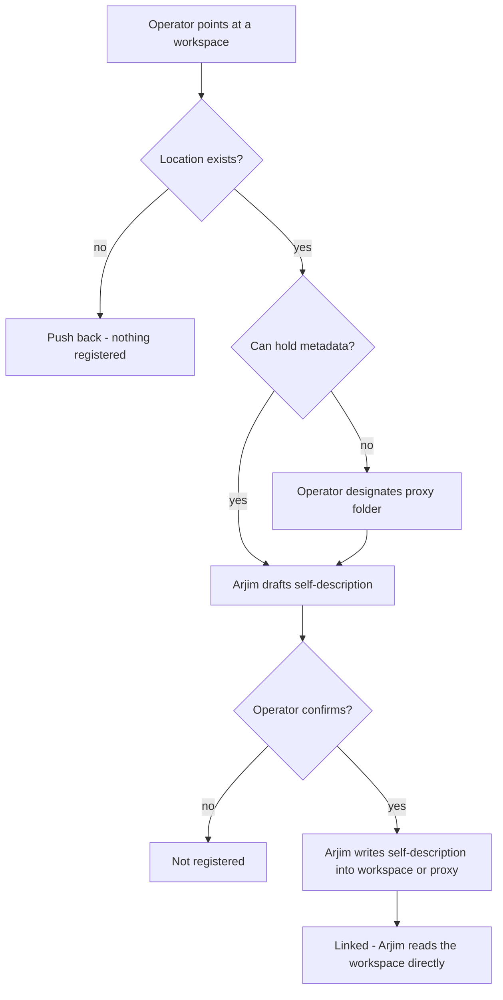

# Workstream Registration and Discovery - Plan

## Goal Capsule

- **Objective:** Give every workstream a durable, portable identity and a self-describing authoritative location, and let the operator register one by pointing Arjim at it — so Arjim can find and read workstreams without the operator carrying the map in their head.
- **Product authority:** `VISION.md`; Arjim becomes responsible for a workstream once it is registered and knows its workspace and record homes (`VISION.md:21`). The surrounding outcomes are not active scope for this plan.
- **Open blockers:** None.

---

## Product Contract

### Summary

V1 establishes registration through point-and-read: the operator points Arjim at a workstream's workspace (or a designated proxy folder when the real workspace is a system or tool that cannot store metadata), Arjim drafts a minimal self-description holding an Arjim-generated identity, the workspace reference, and the authoritative record homes, the operator confirms, and Arjim writes it into the workspace and links it. The workspace is authoritative; registries are read-only discovery aids; machine-scan and registry entry paths are designed but deferred.

### Problem Frame

The operator currently carries a mental map of which tool holds each workstream (`VISION.md:96-99`). VISION requires Arjim to identify each registered workstream's workspace and record homes without relying on operator memory (`VISION.md:182`), to reconstruct the inventory from the workspaces on a clean rebuild (`VISION.md:186`), and to keep workstream memory durable in the workspace rather than only inside an assistant (`VISION.md:70`). None of that can happen until a workstream has a durable identity and a discoverable authoritative location. Registration is the foundation every awareness outcome stands on.

### Key Decisions

- KD1. **Workspace-authoritative registration; registries are discovery aids only** (session-settled: user-directed — chosen over an Arjim-owned central catalog as the record: metadata must survive Arjim replacement, and a registry that holds metadata would drift). The self-description in the workspace is the durable record; a registry only points to where metadata lives, and once an assistant is linked it reads the workspace directly. **Governs R4, R11, R12.**
- KD2. **Proxy workspace for metadata-incapable workspaces** (session-settled: user-directed — chosen over requiring the real workspace to hold metadata: systems and tools cannot always store assistant metadata). A designated regular folder serves as the authoritative workspace location while record homes keep pointing at the real system or tool. **Governs R6, R7.**
- KD3. **Arjim-generated identity; name is a label** (session-settled: user-directed — chosen over operator-chosen or workspace-derived identity: portability must not depend on naming). The identity is generated at first registration and kept in the self-description. **Governs R2, R5, R14.**
- KD4. **Minimal self-description: identity + record homes** (session-settled: user-directed — chosen over the fuller `VISION.md:182` set including purpose, lifecycle state, and decision record home: keeps registration minimal; the rest is deferred).
- KD5. **Arjim drafts, operator confirms, Arjim writes** (session-settled: user-directed — chosen over operator-authored or owner-authored descriptions: operator confirmation is the authority boundary for the write). **Governs R2, R3, R4.**
- KD6. **Point-and-read is the only working v1 entry path** (session-settled: user-directed — chosen over all three sources working in v1: smallest valuable slice; scan and registries stay designed but dormant). **Governs R12.**
- KD7. **Arjim reads registries, never writes them** (session-settled: user-directed — chosen over publishing pointers on registration: publishing is owned outside this feature). **Governs R11.**
- KD8. **Access-gated registration** (session-settled: user-directed — chosen over registering and flagging access later: an instance registers only what it can access, consistent with `VISION.md:104` device limits). **Governs R8, R9.**

### Actors

- A1. **Operator** — registers workstreams, designates proxy folders, and confirms drafts.
- A2. **Arjim instance** — an assistant on one device; drafts, writes, and links registrations it can access on that device.

### Key Flows

- F1. **Point-and-read registration (folder workspace)** — **Covers R1-R5.**
  - **Trigger:** Operator points Arjim at an existing workspace location.
  - **Actors:** A1, A2.
  - **Steps:** Arjim verifies the location exists; drafts a self-description (identity + workspace reference + record homes); operator confirms; Arjim writes the self-description into the workspace and links it.
  - **Outcome:** Workstream registered; durable record lives in the workspace.
- F2. **Proxy workspace registration** — **Covers R6, R7.**
  - **Trigger:** Operator points at a system or tool workspace that cannot store metadata.
  - **Actors:** A1, A2.
  - **Steps:** Arjim recognizes the limitation; operator designates a proxy folder; draft, confirmation, and write happen against the proxy while record homes still reference the real system or tool.
  - **Outcome:** Workstream registered with a durable metadata home.
- F3. **Push-back on non-existent pointer** — **Covers R9.**
  - **Trigger:** Operator points at a location that does not exist.
  - **Steps:** Arjim does not register anything and states what is wrong.
  - **Outcome:** Nothing registered; operator corrected.
- F4. **Inaccessible on this device** — **Covers R8.**
  - **Trigger:** Operator points at a workspace this device cannot access.
  - **Steps:** Arjim does not register it and explains the access limitation.
  - **Outcome:** No registration on this instance; the workstream may still exist elsewhere.

### Requirements

**Registration**

- R1. The operator can register a workstream by pointing Arjim at its workspace location (point-and-read entry).
- R2. Registration starts with an Arjim-drafted self-description containing an Arjim-generated permanent identity, the workspace reference, and the workstream's authoritative record homes.
- R3. Nothing is written until the operator confirms the draft; registration completes only on confirmation.
- R4. On confirmation, Arjim writes the self-description into the workspace; that written self-description is the durable registration record.
- R5. The operator-facing name is a label; it never substitutes for or changes the identity.

**Proxy workspaces**

- R6. When the workstream's real workspace is a system or tool that cannot store metadata for assistants, a regular folder designated by the operator serves as the authoritative workspace location (proxy workspace).
- R7. The proxy workspace holds the self-description and other durable workstream information; record homes in the self-description continue to reference the real system or tool.

**Access and validation**

- R8. An Arjim instance registers only workspaces it can access on that device; an inaccessible workspace is not registered by that instance.
- R9. Pointing at a non-existent workspace location does not register anything; Arjim pushes back and says what is wrong.

**Discovery readiness**

- R10. The self-description is the marker that makes a workspace recognizable as a workstream candidate to discovery; nothing else qualifies a folder or system as a candidate.
- R11. Registries are read-only discovery aids for Arjim: they point to where workstream metadata lives, never hold it, and once an assistant is linked it reads the workspace directly.
- R12. Machine-scan and registry-consumption entry paths are designed to work from the same self-description marker but are not required to function in v1; point-and-read is the only working path.

**Durability**

- R13. The linked inventory is derived from workspace self-descriptions, so Arjim's working copy remains replaceable and the inventory can be reconstructed from the workspaces (per `VISION.md:186`).
- R14. Reading a workspace's self-description yields the same identity on any device or assistant, keeping registration knowledge portable.

### Acceptance Examples

- AE1. **Happy path (folder workspace)** — **Covers R1-R5.** Given an existing folder workspace, when the operator points Arjim at it and confirms the drafted self-description, then Arjim writes the self-description into the folder, generates the identity, and the workstream is linked.
- AE2. **Proxy workspace** — **Covers R6, R7.** Given a workstream whose real workspace is a system that cannot store metadata, when the operator designates a proxy folder, then the self-description is written to the proxy and its record homes still point at the real system.
- AE3. **Non-existent pointer** — **Covers R9.** Given the operator points at a location that does not exist, when registration is attempted, then Arjim pushes back and registers nothing.
- AE4. **Inaccessible on this device** — **Covers R8.** Given a workspace that exists but that this device cannot access, when the operator attempts registration, then Arjim does not register it and explains the access limitation.
- AE5. **Name change keeps identity** — **Covers R5, R14.** Given a registered workstream whose label is changed, when Arjim re-reads the self-description, then the identity is unchanged.

### Scope Boundaries

**Deferred for later**

- Machine-scan and registry consumption as working entry paths (v1 is point-and-read only).
- Registry publishing by Arjim; publishing is owned outside this feature.
- Purpose, lifecycle state, and designated decision record home in the self-description (the remainder of `VISION.md:182`).
- Workstream status, progress, next actions, and freshness (excluded from this idea per the ideation doc).
- Operating-process requirements.
- Write-safety and attribution machinery (proposal-to-audit closed loop, ideation idea #3).
- Cross-device rediscovery and the wipe-and-rebuild reconstruction test (root-based rediscovery, ideation idea #6).
- Coverage-driven authority escalation (ideation idea #2).

**Outside this product's identity**

- A dashboard or system of record for workstreams; Arjim's working copy never becomes authoritative (`VISION.md:15`, `VISION.md:70`).

### Dependencies / Assumptions

- `VISION.md` is the product authority for this feature.
- The operator is the sole v1 actor; other people's assistants (VISION Outcome 6) are future work.
- Registration assumes the workspace location is readable on the device at registration time (the access gate).

### Outstanding Questions

**Deferred to Planning**

- Which record-home types registration must support at v1 (e.g., Planner, SharePoint, email, repositories).
- How "can access" is determined per workspace and record home on a given device.
- The structural form of the self-description.

### Sources / Research

- `VISION.md` — product authority; cited lines 15, 21, 70, 96-99, 104, 182, 186.
- `docs/ideation/2026-08-01-arjim-improvement-ideation.md` — idea #1 (Workstream Registration and Discovery) with its basis and rejection summary; this plan is the deepened form of that idea.
- `README.md` — project status (planning-only).

---

<!-- ce-section: work-relationships -->
## How This Work Fits Together

This plan owns workstream registration (point-and-read) and the self-description design. The other directions in `docs/ideation/2026-08-01-arjim-improvement-ideation.md` are the current understanding of the surrounding work, not a committed roadmap:

- Coverage-driven authority escalation (idea #2)
  - Depends on registration: escalation operates on registered workstreams' record homes.
- Proposal-to-audit closed loop (idea #3)
  - Depends on registration: writes target registered record homes.
- Effort baseline engine (idea #4)
  - Can proceed independently of registration.
- Per-workstream freshness contract (idea #5)
  - Depends on registration: freshness applies to a workstream's record homes.
- Root-based rediscovery, not sync (idea #6)
  - Depends on registration: consumes the self-description as the marker for rediscovery.
- Coverage gaps as primary feed (idea #7)
  - Depends on awareness outcomes and registration.
