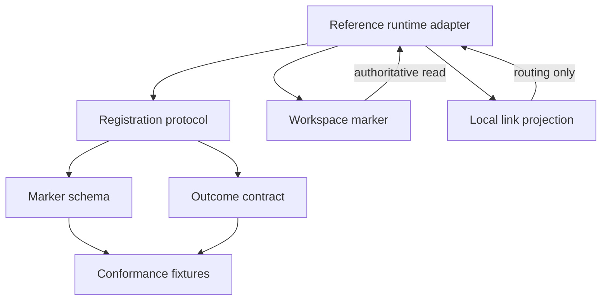
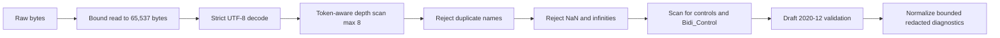
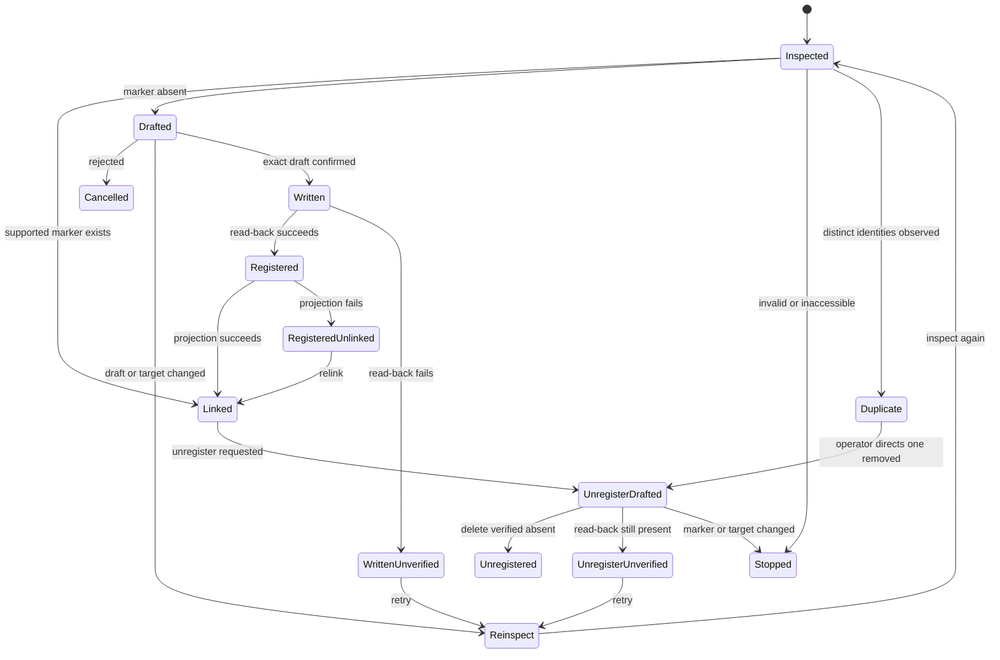

# Workstream Registration and Discovery - Plan

## How to Read This Plan

Use this document as the canonical implementation plan. The sections have different jobs:

- **Goal Capsule** — the short version of the objective, active delivery, and stop conditions.
- **Product Contract** — why this work matters, what behavior is required, and what is explicitly out of scope.
- **Planning Contract** — the technical decisions and design constraints an implementation agent must follow.
- **Implementation Units** — the work to perform, in dependency order, with exact files and verification rules.
- **Verification Contract** — the executable and review gates for this delivery.
- **Definition of Done** — the final completion checklist.

### Agent Execution Rules

1. Treat `VISION.md` and the decisions marked `session-settled` as authoritative.
2. Implement the active scope in dependency order: the contract surfaces first (U5, U1-U3, U4), then the reference Python adapter (U6-U11). The runtime is resolved to CPython 3.14.x + `jsonschema` 4.26.x (KTD11); do not reopen the stack choice.
3. Follow the implementation-unit dependencies and sequencing; do not begin a dependent unit early.
4. Treat the marker as durable authority and local inventory as replaceable projection state.
5. Use the verification gates and Definition of Done as completion criteria; executable runtime tests exist from U6 onward.

## Goal Capsule

- **Objective:** Deliver a portable, assistant-neutral contract for workstream registration plus a reference adapter on the resolved runtime (CPython 3.14.x + `jsonschema` 4.26.x) so runtimes recognize the same workspace, identity, record homes, and registration outcomes and the adapter passes the contract's conformance fixtures.
- **Product authority:** `VISION.md`; this contract is the durable foundation for registered-workstream awareness, and the reference adapter proves the contract is implementable.
- **Active delivery:** The marker schema, registration and unregister protocol, result taxonomy (including `unregistered` and `duplicate-registration`), conformance fixtures, integration guidance, and the reference Python adapter with its executable conformance runner.
- **Stop condition:** Do not claim point-and-read registration works until the reference adapter implements the contract and passes its fixtures, the official JSON Schema Test Suite for Draft 2020-12, and Bowtie conformance.
- **Trust test:** The contract must prevent local routing state, device paths, unconfirmed drafts, or identity regeneration from becoming authoritative.
- **Work-reduction test:** A later adapter must let the operator register from a workspace pointer without supplying a remembered map of tools; this contract makes that behavior consistent across adapters.

---

## Product Contract

### Summary

The product scope remains point-and-read registration through a durable workspace self-description. This plan now delivers the portable contract first — an assistant-neutral marker, registration and unregister state rules, explicit outcomes (including `unregistered` and `duplicate-registration`), conformance fixtures, and integration guidance — and then a reference adapter on the resolved runtime (KTD11) that implements the contract, executes its fixture corpus, and passes the external Draft 2020-12 conformance suites.

**Product Contract preservation:** restructured, no scope change: R2 now names the existing label requirement, and KD4 now cites the full minimal self-description already implied by R2 and R5. Enrichment to implementation-ready adds the reference runtime and adapter as active delivery; it does not change product behavior or R/A/F/AE scope. Refined, no scope change: KD10's URI policy now states that adapters never inspect URI content for credentials, tokens, or other secrets, leaving content judgment to the operator (2026-08-01).

### Problem Frame

The operator currently carries a mental map of which tool holds each workstream (`VISION.md:84`). Arjim must identify registered workstreams and their authoritative record homes without relying on that memory (`VISION.md:182`), reconstruct inventory from workspaces after a clean rebuild (`VISION.md:186`), and keep durable memory outside an assistant's working copy (`VISION.md:70`). A stable, portable registration contract is the first technical foundation for those outcomes.

### Key Decisions

The `session-settled` annotations record decisions already made during planning. Do not reopen those choices unless a documented open question or a new user decision changes them.

- KD1. **Workspace-authoritative registration; registries are discovery aids only** (session-settled: user-directed — chosen over an Arjim-owned central catalog as the record: metadata must survive Arjim replacement, and a registry that holds metadata would drift). **Governs R4, R11, R12.**
- KD2. **Proxy workspace for metadata-incapable workspaces** (session-settled: user-directed — chosen over requiring the real workspace to hold metadata: systems and tools cannot always store assistant metadata). **Governs R6, R7.**
- KD3. **Arjim-generated identity; name is a label** (session-settled: user-directed — chosen over operator-chosen or workspace-derived identity: portability must not depend on naming). **Governs R2, R5, R14.**
- KD4. **Minimal self-description: identity, label, workspace reference, and record homes** (session-settled: user-directed — chosen over the fuller `VISION.md:182` set including purpose, lifecycle state, and decision record home: registration stays small). **Governs R2, R5.**
- KD5. **Arjim drafts, operator confirms, Arjim writes** (session-settled: user-directed — chosen over operator-authored or owner-authored descriptions: operator confirmation is the authority boundary for the write). **Governs R2, R3, R4.**
- KD6. **Point-and-read is the only working v1 entry path** (session-settled: user-directed — chosen over all three sources working in v1: smallest valuable slice; scan and registries stay designed but dormant). **Governs R12.**
- KD7. **Arjim reads registries, never writes them** (session-settled: user-directed — chosen over publishing pointers on registration: publishing is owned outside this feature). **Governs R11.**
- KD8. **Access-gated registration** (session-settled: user-directed — chosen over registering and flagging access later: an instance registers only what it can access, consistent with `VISION.md:104` device limits). **Governs R8, R9.**
- KD9. **Confirmed conditional unregister** (session-settled: user-directed — chosen over a no-delete v1: unregister is the operator's durable way to resolve a duplicate registration and to retire a workstream). A confirmed conditional delete removes a marker only if it still matches the confirmed identity and verifies absence by read-back. **Governs R15, R16.**
- KD10. **Accept any valid-looking record-home URI; warn on malformed ones** (session-settled: user-directed — chosen over rejecting schemes or credential components: adapters must not disagree on validity, and unsupported providers stay valid but non-dereferenceable). URI validity is syntactic only; a malformed URI warns without invalidating the marker. Adapters never inspect URI content for credentials, tokens, or other secrets; the operator decides what the marker may contain. **Governs R2, R7-R9.**

### Actors

- A1. **Operator** — points to workspaces, designates proxy folders, and confirms exact drafts.
- A2. **Arjim instance** — an assistant on one device; a future adapter inspects, drafts, writes, reads back, and links registrations available on that device.

### Key Flows

- F1. **New folder registration** — **Covers R1-R5.** A future adapter inspects an existing folder, produces a contract-valid draft, obtains confirmation for that draft, creates the marker without replacement, reads it back, and derives a local link.
- F2. **Existing registration** — **Covers R4, R13, R14.** A valid supported marker is linked unchanged; its identity is never regenerated and no confirmation is required because registration does not write.
- F3. **Proxy workspace registration** — **Covers R6, R7.** The operator designates a regular folder as the metadata workspace; the marker records proxy kind while record homes point to the real system or tool.
- F4. **Rejected or stale draft** — **Covers R3, R4.** Rejection writes nothing. A material draft or target-state change invalidates confirmation and requires a new draft.
- F5. **Invalid location or marker** — **Covers R8-R10.** Missing, inaccessible, malformed, unsupported, or conflicting inputs stop registration with a distinct outcome and no overwrite.
- F6. **Unregister and duplicate resolution** — **Covers R15, R16.** The operator confirms an unregister draft bound to the marker's exact identity; Arjim conditionally deletes the marker and verifies absence by read-back. A duplicate registration stops for operator-directed resolution: one party unregisters its marker and the survivor's identity stays canonical.

### Requirements

The requirements below define observable product behavior. The technical decisions later in this document constrain how an adapter may satisfy them.

**Registration**

- R1. The operator can register a workstream by pointing Arjim at its workspace location.
- R2. Registration starts with an Arjim-drafted self-description containing an Arjim-generated permanent identity, a mutable operator-facing label, the workspace reference, and authoritative record-home references.
- R3. Nothing is written until the operator confirms the exact draft; registration completes only after the authoritative marker can be read back.
- R4. On confirmation, Arjim writes the self-description into the workspace; that marker is the durable registration record and must not silently replace an existing marker.
- R5. The operator-facing name is a label; changing it never substitutes for or changes the identity.

**Proxy workspaces**

- R6. When the real workspace cannot store assistant metadata, an operator-designated regular folder serves as the authoritative metadata workspace.
- R7. The proxy holds the self-description and durable workstream information; record homes continue to reference the real system or tool.

**Access and validation**

- R8. An Arjim instance registers only workspaces it can access on that device; inaccessible workspaces remain unregistered on that instance.
- R9. A missing workspace, non-directory target, write denial, invalid marker, unsupported marker version, or identity conflict produces a distinct non-success outcome without creating or replacing a registration.

**Discovery readiness**

- R10. `.workstream/workstream.json` is the only v1 marker that makes a workspace a registration or discovery candidate.
- R11. Registries are read-only discovery aids: they point to metadata, never hold it, and linked assistants read the workspace marker directly.
- R12. Machine scan and registry consumption are designed to feed the same marker-inspection protocol but do not function in this scope; point-and-read remains the only planned working entry path.

**Durability**

- R13. Local inventory is a replaceable projection derived from readable workspace markers and may retain device-local routing data without becoming registration authority.
- R14. Reading a valid marker yields the same identity on every device or assistant; retries and existing-marker linking never regenerate that identity.

**Unregistration and duplicate registration**

- R15. The operator can unregister a workstream; Arjim drafts an unregister intent bound to the marker's exact identity, obtains confirmation, performs a conditional delete that fails if the marker changed since confirmation, and completes only when read-back verifies absence.
- R16. When one workspace is observed under two distinct valid identities, registration and unregister report a `duplicate-registration` outcome and stop for operator-directed resolution; one party unregisters its marker and the survivor's identity remains canonical. Identical copies of a marker that share one identity are not duplicates.

### Acceptance Examples

- AE1. **New folder marker** — **Covers R1-R5.** A valid confirmed draft for an unmarked folder produces one marker whose read-back value matches the confirmed data and whose identity remains stable.
- AE2. **Existing marker** — **Covers R4, R14.** A valid supported marker is linked unchanged without confirmation, overwrite, or a new identity.
- AE3. **Proxy marker** — **Covers R6, R7.** A proxy marker identifies its folder as the metadata workspace while its record-home URIs point to the real system.
- AE4. **No confirmation** — **Covers R3.** A rejected or absent confirmation produces no marker and no local link.
- AE5. **Invalid or inaccessible input** — **Covers R8-R10.** A missing or inaccessible location, invalid marker, unsupported version, or conflict produces a distinct diagnostic and no write.
- AE6. **Name change keeps identity** — **Covers R5, R14.** Two otherwise valid revisions may differ in label while retaining the same identity.
- AE7. **Post-write link failure** — **Covers R4, R13.** If the marker is written and verified but local linking fails, the marker remains authoritative and a later relink reuses its identity.
- AE8. **Unregister** — **Covers R15.** A confirmed unregister deletes the marker, verifies absence by read-back, and reports `unregistered`; a later re-registration generates a fresh identity.
- AE9. **Duplicate registration** — **Covers R16.** Two distinct valid identities for one workspace report `duplicate-registration` and stop; unregistering one leaves the survivor canonical with its identity unchanged.
- AE10. **Warned record home** — **Covers R2, R7-R9, R11.** A marker whose record home carries a malformed URI or a local-resource scheme remains valid and readable; the affected record home reports non-dereferenceable capability with a structured warning and no dereference. Adapters never inspect URI content for credentials, tokens, or other secrets; the operator decides what the marker may contain.

### Scope Boundaries

#### Active in This Plan

- Version 1 marker schema and examples.
- Registration and unregister state and authority protocol, including existing markers, exact-draft confirmation, confirmed conditional delete, duplicate registrations, retries, and partial success.
- Portable result, warning, and error taxonomy, including `unregistered` and `duplicate-registration` outcomes.
- Runtime-neutral conformance fixtures and adapter obligations.
- Reference runtime and adapter on CPython 3.14.x + `jsonschema` 4.26.x: raw-input guard, bundled-schema Draft 2020-12 validation, normalized redacted diagnostics, create-only write and read-back, confirmed conditional delete, replaceable local projection, operator-facing CLI, and the conformance runner that executes the fixture corpus and the external Draft 2020-12 suites.
- Executable tests for the raw guard, validation pipeline, filesystem lifecycle, interruption recovery, local relinking, and conformance.

#### Deferred for Later

- Machine scan and registry consumption as working entry paths.
- Registry publishing by Arjim.
- Purpose, lifecycle state, and designated decision record home in the marker.
- Workstream status, progress, next actions, and freshness.
- Operating-process requirements.
- Broad proposal-to-audit write-safety and attribution machinery beyond this contract's narrow create-only and conditional-delete rules.
- Cross-device root rediscovery and wipe-and-rebuild proof.
- Coverage-driven authority escalation.

#### Outside This Product's Identity

- A dashboard or authoritative system of record for workstreams; an assistant's working copy never becomes authoritative (`VISION.md:15`, `VISION.md:70`).

### Dependencies / Assumptions

- `VISION.md` remains product authority.
- The operator is the sole v1 human actor.
- The reference runtime is CPython 3.14.x with `jsonschema` 4.26.x and the standard-library `sqlite3` module; exact patch versions are pinned at implementation start and must pass the conformance corpus before the adapter declares compatibility (KTD11).
- Version 1 record homes are typed, absolute URI references validated for structure only; any syntactically valid URI is accepted regardless of scheme or credential-bearing components, and malformed ones warn. Provider access and ownership checks require later adapters.
- Record-home URIs are accepted as untrusted data; adapters never dereference them, never inspect them for credentials, tokens, or other secrets, and diagnostics never echo them. The operator decides what content the marker may carry.
- Unregister uses the same operator-confirmation authority as registration; no adapter deletes a marker without a confirmed exact identity.
- The reference adapter declares and tests its supported filesystem profile; network or synchronized filesystems are not assumed compliant without separate tests.

### Sources / Research

- `VISION.md` — product authority for durable memory, access honesty, authority, and rebuildability.
- `docs/ideation/2026-08-01-arjim-improvement-ideation.md` — registration idea and surrounding work relationships.
- `README.md` — confirms the repository is planning-only with no selected stack or test tooling; now superseded by the runtime resolution below.
- No `docs/solutions/` corpus or implementation precedent exists yet.
- `docs/research/2026-08-01-workstream-registration-runtime-stack.md` — the runtime and Draft 2020-12 validation-stack assessment this plan's KTDs adopt: it recommends CPython 3.14.x + `jsonschema` 4.26.x with `Draft202012Validator`, an adapter-owned bounded raw-input guard, normalized redacted diagnostics, exclusive-create plus read-back filesystem lifecycle, cooperative-lock conditional delete, and `sqlite3` for the local projection. It also fixes the raw limits (64 KiB UTF-8, depth 8, label 256, type 64, URI 2,048, 32 homes), the `Bidi_Control` prohibited set, the requirement to bundle schemas and block network `$ref`, the keep-format-assertion-disabled rule, and the mandatory conformance checks (contract corpus, official JSON Schema Test Suite, Bowtie). Its primary-source citations [S1]-[S30] back the load-bearing claims in the KTDs.

---

## Planning Contract

This section is the implementation boundary. An agent may choose details that are not decided here, but it must not contradict these technical decisions or expand the active scope.

### Key Technical Decisions

- KTD1. **Deliver a runtime-neutral contract before an executable adapter** (session-settled: user-directed — chosen over selecting the stack before the portable boundary settled: the contract is the durable artifact and stays runtime-neutral even after the reference runtime is resolved). The contract units (U5, U1-U3) still produce schemas, protocol text, and fixtures first; the adapter units (U6-U11) then implement that contract on the resolved runtime. **Supports R1-R14.**
- KTD2. **Use `.workstream/workstream.json` as the assistant-neutral marker** (session-settled: user-directed — chosen over an Arjim-named path and a root-level marker: the namespace stays portable and extensible). **Supports R4, R10-R14.**
- KTD3. **Version each portable contract surface independently with JSON Schema Draft 2020-12** (session-settled: user-approved — chosen over YAML or field-only prose: machine-readable schemas give runtimes one conformance target). The package release, marker schema, result schema, fixture schema, and protocol each carry an identifier; compatibility is explicit rather than inferred from one shared number. A reader dispatches on the marker version before applying its closed schema, so an unknown version is unsupported rather than malformed. **Supports R2, R5-R7, R9, R10, R14.**
- KTD4. **Keep durable and device-local references separate.** Version 1 uses the literal workspace self-reference `.` and lexically locates the marker at `.workstream/workstream.json` below the inspected root. Absolute paths, traversal, symlink-resolved paths, and local link locations belong only in adapter state; the workspace reference never carries a device path. Record-home URIs are not workspace references and are accepted per KTD5. **Supports R2, R9, R13, R14.**
- KTD5. **Use open typed URI references as untrusted data.** Each record home carries a namespaced type token and absolute URI. Version 1 accepts any syntactically well-formed URI regardless of scheme or content and warns on malformed URIs; validity never authorizes dereferencing. Adapters never inspect URI content for credentials, tokens, or other secrets; the operator decides what the marker may contain. Unsupported type/scheme pairs remain valid data with unsupported capability status. **Supports R2, R7-R9.**
- KTD6. **Bind single-use confirmation to a canonical semantic envelope** (session-settled: user-approved — chosen over conversational approval detached from content: changed data or target state must not inherit authority). The envelope includes contract versions, every parsed marker field in order, an adapter-supplied stable target handle, and observed marker absence. The adapter revalidates the same handle before writing and during read-back, and stops if it cannot establish that stability. Duplicate JSON keys are invalid; only property ordering and insignificant whitespace may change during serialization. Confirmation expires after any write attempt, reinspection, terminal transition, or marker-state change. **Supports R3, R4.**
- KTD7. **Treat an existing supported marker as registration authority.** Linking reads it unchanged. Invalid, unsupported, ambiguous, or conflicting markers stop for operator resolution rather than repair or identity regeneration. **Supports R4, R9, R14.**
- KTD8. **Make versioned conformance fixtures the portable test boundary.** Fixture and expectation schemas define inputs, observations, mandatory protocol assertions, and adapter-specific capability assertions. Every future adapter must pass the mandatory corpus before claiming protocol compliance. **Supports R1-R14.**
- KTD9. **Bound and isolate untrusted marker data.** Version 1 limits marker bytes, JSON nesting depth, field lengths, and record-home count; rejects duplicate keys, controls, and bidirectional overrides; accepts any valid-looking record-home URI and warns on malformed ones; and treats labels and URIs as data rather than assistant instructions. Results use bounded structured diagnostics without raw marker bodies, full URIs, labels, secrets, or local paths. **Supports R8-R10.**
- KTD10. **Unregister is a confirmed conditional delete that mirrors KTD6 with the presence precondition inverted.** Confirmation binds to the marker's exact identity, the stable target handle, and observed marker presence with that exact identity; the delete proceeds only if the marker still matches at write time, and completes only when read-back verifies absence. A changed marker, target, or identity invalidates confirmation and stops without deleting. **Supports R15, R16.**
- KTD11. **Resolve the reference runtime to CPython 3.14.x + `jsonschema` 4.26.x, using `Draft202012Validator` explicitly** (session-settled: user-directed — chosen over Java 25/networknt/Jackson and Node 24/Ajv per the weighted runtime assessment: the standard library covers the remaining adapter responsibilities with the smallest dependency and operational footprint). The adapter bundles trusted schemas and meta-schemas, blocks network `$ref` retrieval, keeps Draft 2020-12 `format` assertion disabled, uses `sqlite3` for the replaceable local projection, and must pass the contract corpus plus the official JSON Schema Test Suite and Bowtie before declaring compatibility. Exact patch versions are pinned at implementation start. **Supports R2, R8-R14.**
- KTD12. **Bound and guard raw input before any schema validation.** The adapter owns the raw-input pipeline: read at most 65,537 bytes to distinguish an allowed 65,536-byte marker from an oversized one; require strict UTF-8 decoding; count container depth with a token-aware scanner that ignores braces/brackets inside strings and rejects depth above 8; reject duplicate object member names via the decoder's duplicate-preserving pair hook; reject `NaN` and positive/negative infinity; and scan decoded string names and values for the fixture-defined prohibited controls and `Bidi_Control` set. Raw checks run before JSON Schema instance validation. **Supports KTD9, R8-R10.**
- KTD13. **Normalize all parser and validator failures into bounded, adapter-owned diagnostics.** Native validator messages and parameters may embed instance values, property names, URIs, labels, secrets, snippets, or local paths and must never be emitted. The adapter maps failures to a small versioned vocabulary of phase, stable code, bounded safe path, and count, and caps both the number of diagnostics and total serialized size. **Supports KTD9, R8-R10.**
- KTD14. **Use the portable filesystem lifecycle and interruption recovery baseline.** After confirmation, open the final marker path with exclusive-create semantics, write the complete bounded document, flush and request file synchronization, close, reopen, re-run the raw guards and schema validation, and verify exact identity before reporting registration and updating the projection. Interruption that leaves a partial or invalid marker must be reported as occupied and invalid, never overwritten. Conditional delete uses a cooperative per-workspace lock, bounded read and exact identity comparison, an immediate re-read and re-compare, delete, and absence read-back, with the residual non-cooperating-writer race documented. The adapter declares and tests its supported filesystem profile. **Supports KTD6, KTD10, R3, R4, R15, R16.**

### High-Level Technical Design

The contract separates durable workspace truth from replaceable device state and runtime-specific execution.



The adapter applies a fixed raw-input pipeline before any JSON Schema instance validation, because the schema cannot preserve facts the parser discards (duplicate names, exact byte size, non-finite constants, raw encoding) (KTD12, KTD13):



The registration write and read-back follow the portable lifecycle baseline (KTD14): exclusive-create open, complete write, flush and file synchronization, close, reopen, re-run raw guards and schema validation, verify exact identity, then report registered and update the projection. Interruption at any stage must leave an occupied-invalid path that a later inspection reports but never overwrites.

The protocol has explicit terminal and recovery states so interruption cannot create a second identity or convert local state into authority.



### Output Structure

The paths below are the intended deliverables for the active scope. Contract files land first; adapter files land with the runtime units that own them.

```text
contracts/
  workstream-registration/
    README.md
    v1/
      workstream.schema.json
      registration-result.schema.json
      conformance-case.schema.json
      expectations.schema.json
      registration-protocol.md
      compatibility.md
tests/
  contracts/
    workstream-registration/
      expectations.json
      raw/
      valid/
      invalid/
      warn/
      transitions/
src/
  workstream_registration/
    raw_guard.py            # bounded read, strict UTF-8, depth, duplicates, constants, bidi
    validation.py           # bundled-schema Draft 2020-12 validation
    diagnostics.py          # normalized redacted diagnostics
    filesystem.py           # exclusive create, sync, read-back, conditional delete, lock
    registration.py         # inspect, draft, confirm, write, read-back, link
    unregister.py           # confirmed conditional delete
    projection.py           # sqlite3 replaceable local projection
    cli.py                  # operator-facing CLI
    conformance_runner.py   # corpus + external suite execution
pyproject.toml              # pinned CPython 3.14.x, jsonschema 4.26.x, test runner
tests/
  adapters/
    python/
      test_raw_guard.py
      test_validation.py
      test_diagnostics.py
      test_filesystem.py
      test_registration.py
      test_unregister.py
      test_projection.py
      test_cli.py
      test_conformance_runner.py
```

### Sequencing

1. **U5 — Conformance envelope:** Define the fixture schemas, expectation manifest, and adapter-obligation rules that constrain every fixture.
2. **U1 — Marker contract:** Establish the marker schema and valid examples before defining workflow results.
3. **U2 — State protocol:** Define the registration states and authority transitions against the marker schema.
4. **U3 — Results:** Define the result taxonomy and complete the versioned negative and transition corpus.
5. **U4 — Guidance:** Publish the final guidance after the schemas, protocol, and fixtures cover the full active scope.
6. **U6 — Runtime scaffold:** Stand up the pinned CPython 3.14.x + `jsonschema` 4.26.x project and the conformance runner skeleton.
7. **U7 — Raw-input guard:** Implement the bounded raw pipeline (KTD12) and its fixtures.
8. **U8 — Validation and diagnostics:** Load bundled schemas, validate with `Draft202012Validator`, and normalize redacted diagnostics (KTD11, KTD13).
9. **U9 — Registration and filesystem lifecycle:** Implement inspect, draft, confirm, create-only write, read-back, link, and interruption recovery (KTD14).
10. **U10 — Unregister and conditional delete:** Implement the confirmed conditional delete with lock and absence read-back.
11. **U11 — Operator CLI and conformance:** Wire the CLI, run the full corpus and external suites, and produce the compatibility declaration.

The dependency graph is `U5 -> U1 -> U2 -> U3 -> U4 -> U6 -> U7 -> U8 -> U9 -> U10 -> U11`. U5 is a prerequisite for every other unit; U2 also depends on U1, U3 and U4 depend on all preceding contract units, and each adapter unit depends on the preceding adapter units.

### Risks & Dependencies

- **Contract without executable proof:** A malformed schema or contradictory fixture can survive manual review. Mitigation: keep one expectation manifest, require every fixture to declare its expected result, and make the reference adapter execute every fixture with the standards-compliant validator chosen under KTD11 before it claims compliance.
- **Path portability:** Persisting local absolute paths in the workspace reference would break cross-device identity. Mitigation: fixtures reject device paths in the workspace reference and reserve them for local projection examples; record-home URIs may be local-resource but remain untrusted, non-dereferenceable data.
- **Resource exhaustion:** A shared marker can be hostile before schema validation. Mitigation: KTD9 sets pre-parse and collection bounds, and fixtures cover exact-limit and over-limit inputs.
- **URI overclaim:** Structural validity does not prove access, ownership, or safety. Mitigation: KTD5 prohibits automatic dereference, warns on malformed URIs, and distinguishes `not-checked`, `unsupported`, and inaccessible states.
- **Secret leakage:** URI syntax can hide credentials. Mitigation: the contract never inspects URI content for secrets, so no adapter needs to judge secret-bearing content; the operator decides what the marker may contain, and diagnostics never echo URIs, labels, or secrets.
- **Schema lock-in:** A closed provider enum would force schema changes for every integration. Mitigation: keep record-home type tokens open and version behavior, not providers.
- **Unsafe parser defaults:** Python's decoder accepts duplicate keys and `NaN`/infinities by default, and can auto-detect UTF-16/UTF-32. Mitigation: KTD12 configures duplicate-preserving hooks and constant rejection, decodes strictly as UTF-8 first, and owns depth via a token-aware scan; fixtures cover each case.
- **Validator messages leak data:** Native `jsonschema` messages can embed instance values, property names, URIs, labels, secrets, or local paths. Mitigation: KTD13 maps only structural fields to bounded adapter-owned codes and caps count and serialized size; no-echo assertions run in the conformance suite.
- **Depth is adapter-owned:** The standard decoder has no contract-level depth limit. Mitigation: the U7 token-aware scanner enforces depth 8 before materializing the object; depth-8 and depth-9 fixtures prove the boundary.
- **`sqlite3` availability and filesystem semantics:** `sqlite3` is optional at CPython build time, and exclusive-create, durability, and network-mount behavior vary by OS and filesystem. Mitigation: U6 requires a `sqlite3`-included build, and the verification contract requires the adapter to declare and test a supported filesystem profile rather than assume network or synchronized filesystems.
- **Conditional delete has no atomic primitive:** No standard API atomically deletes only if current content matches. Mitigation: KTD14 uses a cooperative lock, exact re-read and identity comparison, delete, and absence read-back, and the residual non-cooperating-writer race is documented.

### System-Wide Impact

- **Source control and sync:** The marker may be shared through the workspace's normal storage, but the contract does not require committing it to version control. Ignore, backup, and sync policy stays with the workspace owner.
- **Moves and aliases:** The marker identity survives a workspace move. Device-local links may become stale and must be repaired without editing the marker. Simultaneously available copies of one identity are reported as a `duplicate-registration` outcome, resolved by operator-directed unregister, not from local cache authority.
- **Concurrent assistants:** Readers may trust only a valid supported marker. Writers must use the KTD6 precondition and create-only rule; a concurrently created marker wins authority and invalidates the draft. Unregisters must use the KTD10 conditional-delete rule; a concurrently changed or recreated marker stops the delete.
- **Lifecycle changes:** Version 1 registration adapters do not edit, upgrade, or relocate existing markers. Deletion is supported only through the confirmed conditional unregister protocol (KTD10) and reports `unregistered` on verified absence. Label mutation fixtures prove identity invariance only; update and upgrade protocols require separate authority and conflict rules.
- **Schema upgrades:** Future marker versions remain recognizable but unsupported until an adapter declares compatibility. No adapter may rewrite an unsupported marker during registration.
- **Projection rebuilds:** Deleting local routing state never unregisters a workstream. Re-linking begins from the marker and may surface missing, moved, duplicated, or inaccessible workspaces; a surfaced duplicate stops for operator-directed unregister.
- **Cross-platform filesystem behavior:** Exclusive-create, file synchronization, and durability semantics differ by OS and filesystem; network and synchronized mounts are weaker than local ones. Mitigation: the adapter declares a supported filesystem profile, and conformance testing distinguishes ordinary local filesystems, symbolic-link behavior, network filesystems, read-only paths, and each interruption stage (KTD14).
- **Adapter dependency footprint:** The adapter runs on CPython 3.14.x and adds `jsonschema` as the only non-stdlib runtime dependency; `sqlite3` is stdlib but optional at build time. Mitigation: the compatibility declaration records the pinned versions and requires a build that includes `sqlite3` (KTD11).
- **CI conformance cost:** The official JSON Schema Test Suite Draft 2020-12 subset and Bowtie must run against the exact pinned configuration in release CI, and Bowtie pass figures can drift between releases. Mitigation: record a fresh Bowtie figure in `compatibility.md` at each compatibility declaration rather than citing historical percentages.

---

## Implementation Units

### Unit Index

| U-ID | One-line title | Files touched | Depends on |
|---|---|---|---|
| U5 | Conformance envelope | `contracts/.../v1/conformance-case.schema.json`, `expectations.schema.json`, `tests/.../expectations.json` | — |
| U1 | Version 1 marker contract | `contracts/.../v1/workstream.schema.json`, `tests/.../{valid,invalid,warn,raw}/` | U5 |
| U2 | Registration states and authority transitions | `contracts/.../v1/registration-protocol.md`, `tests/.../transitions/` | U5, U1 |
| U3 | Portable results and conformance expectations | `contracts/.../v1/registration-result.schema.json`, `tests/.../transitions/` | U5, U1, U2 |
| U4 | Adapter and conformance guidance | `contracts/.../README.md`, `v1/compatibility.md`, repo `README.md` | U5, U1-U3 |
| U6 | Runtime scaffold and conformance runner | `pyproject.toml`, `src/workstream_registration/` skeleton, `conformance_runner.py` | U4 |
| U7 | Raw-input guard | `src/workstream_registration/raw_guard.py`, `tests/adapters/python/test_raw_guard.py` | U6, U5 |
| U8 | Bundled-schema Draft 2020-12 validation and diagnostics | `validation.py`, `diagnostics.py`, `test_validation.py`, `test_diagnostics.py` | U7, U1, U5 |
| U9 | Registration, filesystem lifecycle, interruption recovery | `filesystem.py`, `registration.py`, `test_filesystem.py`, `test_registration.py` | U8, U2, U3 |
| U10 | Confirmed conditional unregister and local projection | `unregister.py`, `projection.py`, `test_unregister.py`, `test_projection.py` | U9, U3 |
| U11 | Operator CLI and full conformance | `cli.py`, `test_cli.py`, `test_conformance_runner.py`, `compatibility.md` | U10, U4 |

### U5. Define the conformance envelope

**Execution position:** First. This unit defines the fixture vocabulary used by U1-U3.

- **Goal:** Establish the portable fixture and expectation formats before any unit creates cases that depend on them.
- **Requirements:** R1-R14; KTD3, KTD8, KTD9.
- **Dependencies:** None.
- **Files:**
  - Create `contracts/workstream-registration/v1/conformance-case.schema.json`.
  - Create `contracts/workstream-registration/v1/expectations.schema.json`.
  - Create `tests/contracts/workstream-registration/expectations.json` with package and fixture-format versions.
- **Approach:** Separate parsed-value cases from raw-byte cases. Raw cases carry base64-encoded input inside valid JSON envelopes; expectations identify the stage and outcome without treating the decoded payload as a JSON document. Define which assertions are mandatory protocol conformance, which are runtime capability checks, and which observations are non-blocking warnings (valid marker, warned record home).
- **Patterns to follow:** Independent version ownership in KTD3 and portable fixture authority in KTD8.
- **Test scenarios:**
  1. A parsed-value envelope identifies its input object and expected schema outcome.
  2. A raw-byte envelope identifies its base64 payload and expected pre-parse outcome.
  3. An expectation with an unknown fixture path, duplicate path, unsupported fixture-format version, or missing expected stage is invalid.
   4. Mandatory protocol assertions remain separate from runtime-specific capability assertions.
   5. A warning expectation is distinct from a failure expectation; both are mandatory outcomes, and a fixture can be valid-with-warnings.
- **Verification:** The envelope and expectation schemas are closed, versioned, and sufficient to describe every fixture planned by U1-U3 without forward invention.

### U1. Define the version 1 marker contract

**Execution position:** Second, after U5.

- **Goal:** Establish the canonical marker schema and assistant-neutral durable data boundary.
- **Requirements:** R2, R5-R7, R10, R14; KTD2-KTD5, KTD9, KTD10.
- **Dependencies:** U5.
- **Files:**
  - Create `contracts/workstream-registration/v1/workstream.schema.json`.
  - Create `tests/contracts/workstream-registration/valid/folder.json`.
  - Create `tests/contracts/workstream-registration/valid/proxy.json`.
  - Create `tests/contracts/workstream-registration/valid/label-changed-same-id.json`.
  - Create `tests/contracts/workstream-registration/invalid/` fixtures for missing fields, unknown fields, malformed identity, invalid kind, device-path leakage in the workspace reference, and duplicate record homes.
  - Create `tests/contracts/workstream-registration/warn/` fixtures for malformed record-home URIs and local-resource schemes; each warns without invalidating the marker. No fixture requires the adapter to detect credentials, tokens, or other secrets in URI content.
  - Create `tests/contracts/workstream-registration/raw/` envelopes for invalid UTF-8, duplicate keys, byte-order marks, trailing content, and nesting-depth limits.
- **Approach:** Define a versioned closed object with a lowercase UUID identity, bounded label, `folder|proxy` kind, literal `.` workspace reference, and bounded typed absolute record-home URIs. Set a 64 KiB UTF-8 pre-parse ceiling, a maximum JSON nesting depth of 8 containers, a 256-character label limit, 64-character ASCII type-token limit, 2,048-character URI limit, and 32-record-home limit. Keep property order and formatting non-normative. Record-home validity is syntactic only: any URI that parses is accepted regardless of scheme or credential-bearing components; a URI that fails to parse produces a structured warning and the affected record home reports non-dereferenceable capability. Diagnostics never echo full URIs, labels, or secrets.
- **Patterns to follow:** Stable IDs and authority language in this plan; sensitive-data boundary in `VISION.md`.
- **Test scenarios:**
  1. Covers AE1. A folder marker with every required field validates.
  2. Covers AE3. A proxy marker validates while retaining real-system record-home URIs.
  3. Covers AE6. Two valid markers with different labels retain the same identity.
   4. A marker missing each required field fails with that fixture's expected schema outcome.
   5. A marker with an unknown property, malformed UUID, unsupported kind, or empty label fails.
   6. A marker containing an absolute or traversing workspace reference, duplicate type/URI pair, controls, backslashes, or bidirectional overrides fails.
   7. Exact-limit inputs validate; one-over-limit marker bytes, labels, type tokens, URIs, and record-home collections fail with the expected category.
   8. Base64-backed raw envelopes prove duplicate keys, invalid UTF-8, a byte-order mark, and trailing JSON fail before schema validity is considered.
   9. Raw inputs at nesting depth 8 reach normal validation; depth 9 stops before schema validation.
   10. An instruction-like but otherwise valid label remains data and does not change its expected protocol outcome.
   11. Covers AE10. A record home with a local-resource scheme or an unsupported type remains a valid marker whose record home reports non-dereferenceable capability with a warning.
   12. Covers AE10. A record home whose URI fails to parse produces a warning and non-dereferenceable capability, but the marker remains valid; a marker with both a malformed record home and a structural defect is invalid for the structural defect only. A URI containing user-info, token-like content, or other secret-looking material is not inspected and does not change validity.
- **Verification:** Every fixture is valid JSON, appears once in the expectations manifest created by U5, and has an unambiguous expected validity result.

### U2. Specify registration states and authority transitions

**Execution position:** Third, after U5 and U1.

- **Goal:** Define how any adapter inspects, drafts, confirms, writes, reads back, links, retries, and stops without changing product authority.
- **Requirements:** R1, R3, R4, R8-R10, R13-R16; F1-F6; KTD1, KTD6, KTD7, KTD10.
- **Dependencies:** U5, U1.
- **Files:**
  - Create `contracts/workstream-registration/v1/registration-protocol.md`.
  - Create `tests/contracts/workstream-registration/transitions/new-registration.json`.
  - Create `tests/contracts/workstream-registration/transitions/existing-marker.json`.
  - Create `tests/contracts/workstream-registration/transitions/rejected-draft.json`.
  - Create `tests/contracts/workstream-registration/transitions/stale-confirmation.json`.
  - Create `tests/contracts/workstream-registration/transitions/registered-unlinked.json`.
  - Create `tests/contracts/workstream-registration/transitions/unregister-confirmed.json`.
  - Create `tests/contracts/workstream-registration/transitions/duplicate-registration.json`.
- **Approach:** Make read-only inspection, canonical confirmation-envelope comparison, create-only write, confirmed conditional delete, authoritative read-back, and replaceable linking separate protocol stages. Anchor inspection, write, delete, and read-back to the same stable target handle; reject redirected marker-path components and stop when equivalent target stability cannot be established. Define retries by observed marker state so a successful write followed by failure recovers the existing identity, and a successful delete followed by failed read-back enters a visible recovery state. Treat local identity conflicts as blocking evidence only when both marker locations are currently readable; stale projection data remains advisory. Unregister mirrors KTD6's envelope with the presence precondition inverted; a `duplicate-registration` outcome stops for operator-directed unregister and never auto-resolves or regenerates identity.
- **Execution note:** Start from the transition fixtures so protocol prose cannot omit a terminal or recovery state.
- **Patterns to follow:** The authority levels and unknown-state rules in `VISION.md`; KTD6-KTD7.
- **Test scenarios:**
  1. Covers AE1. An absent marker progresses from inspection through exact confirmation, write, read-back, and link.
  2. Covers AE2. A valid existing marker links without draft, confirmation, overwrite, or identity regeneration.
  3. Covers AE4. Rejection terminates with no write or link.
  4. A changed draft or target state invalidates confirmation and returns to inspection.
  5. Covers AE5. Missing, inaccessible, malformed, unsupported, and conflicting inputs stop with distinct outcomes.
  6. Covers AE7. A verified marker with failed local linking remains registered and can be relinked idempotently.
  7. A write followed by failed read-back enters a visible recovery state and never generates another identity on retry.
  8. Label, URI, record-home order, kind, identity, target identity, or marker-presence changes invalidate confirmation; formatting-only serialization changes do not.
  9. Redirected metadata paths, final-marker links, target aliases changed after confirmation, and concurrent marker creation stop without a write.
  10. An unknown record-home type or scheme is never dereferenced and reports unsupported capability.
  11. A parent-component swap or final-marker swap between inspection and write fails target revalidation; read-back from a different target cannot verify registration.
  12. Confirmation cannot be reused after a write attempt, reinspection, terminal outcome, or an absent-present-absent marker sequence.
  13. Covers AE8. A confirmed unregister deletes the marker, verifies absence by read-back, and reports `unregistered`.
  14. Covers AE9. Two distinct valid identities for one workspace report `duplicate-registration` and stop for operator-directed resolution.
  15. A conditional delete fails without deleting when the marker, target, or identity changed since confirmation, or the marker is already absent.
  16. Identical marker copies that share one identity are linked normally and never reported as `duplicate-registration`.
  17. Unregister confirmation cannot be reused after a delete attempt, reinspection, terminal outcome, or a present-absent-present marker sequence.
- **Verification:** Every state has defined entry conditions, allowed transitions, side effects, terminal outcomes, and retry behavior; no transition writes before exact confirmation.

### U3. Define portable results and conformance expectations

**Execution position:** Fourth, after U5, U1, and U2.

- **Goal:** Give adapters one result vocabulary and one machine-readable fixture index.
- **Requirements:** R3, R4, R8-R10, R13, R15, R16; KTD8, KTD9, KTD10.
- **Dependencies:** U5, U1, U2.
- **Files:**
  - Create `contracts/workstream-registration/v1/registration-result.schema.json`.
  - Add result fixtures under `tests/contracts/workstream-registration/transitions/` for registered, linked-existing, cancelled, stopped, written-unverified, unregistered, and duplicate-registration outcomes; reuse `registered-unlinked.json` from U2 for that result expectation.
- **Approach:** Define a closed bounded envelope that separates protocol outcome, marker validity, observed write/read-back/link effects, verified identity, capability status, and structured adapter diagnostics. Invalid or unsupported markers cannot promote their claimed values to authoritative results. Complete the U5 expectation manifest with every result and transition case.
- **Patterns to follow:** `VISION.md` distinctions between current, unavailable, unsupported, and not checked.
- **Test scenarios:**
  1. A successful new registration reports marker write, read-back, and link separately.
  2. Existing-marker linking reports the durable identity without claiming a write.
  3. Missing, unreadable, unwritable, invalid, unsupported, and conflicting inputs remain distinct.
   4. Record-home checks can report `not-checked` without making a structurally valid marker invalid; malformed or unsupported record homes warn and report non-dereferenceable capability without invalidating the marker. URI content is never inspected for credentials, tokens, or other secrets.
  5. Written-unverified and registered-unlinked results expose partial success without rollback or false completion.
  6. Every schema and transition fixture has exactly one expected outcome in the manifest.
  7. Contradictory combinations fail, including registered without matching read-back, linked after an invalid marker, or a write on the existing-marker path.
  8. Diagnostics reject raw markers, full URIs, labels, secrets, local paths, oversized messages, and unbounded collections.
  9. An `unregistered` result reports the deleted identity and verified absence without claiming a write.
  10. A `duplicate-registration` result reports both distinct verified identities and stops without auto-resolution, write, or regeneration.
   11. A result can carry bounded non-blocking warnings for malformed or unsupported record homes while remaining a valid outcome; warnings never echo raw URIs, labels, secrets, or local paths.
- **Verification:** The result schema can represent every protocol terminal state, and the expectation manifest has no missing, duplicate, or orphan fixture entries.

### U4. Publish adapter and conformance guidance

**Execution position:** Fifth, after U5 and U1-U3, before the adapter units.

- **Goal:** Make the contract usable by the reference adapter and later runtimes without allowing them to weaken authority, portability, or verification rules.
- **Requirements:** R1-R16; KTD1-KTD14.
- **Dependencies:** U5, U1-U3.
- **Files:**
  - Create `contracts/workstream-registration/README.md`.
  - Create `contracts/workstream-registration/v1/compatibility.md`.
  - Update `README.md`.
- **Approach:** Document independent contract versions, compatibility, marker discovery, untrusted-data handling, adapter obligations (including confirmed conditional unregister and duplicate handling), and the active/deferred boundary. Define the Draft 2020-12 validation profile and assign checks that cannot be expressed portably in JSON Schema (raw byte cap, strict UTF-8, depth, duplicates, non-finite constants, `Bidi_Control`, normalized diagnostics) to the protocol. State that an adapter is not compliant until it passes every mandatory fixture plus runtime-specific filesystem, delete, and interruption tests; the reference adapter's `compatibility.md` declares which of those it satisfies.
- **Patterns to follow:** Plain-language product boundaries in `README.md` and `VISION.md`.
- **Test scenarios:** Test expectation: none -- documentation-only unit.
- **Verification:** A new implementer can identify the authoritative schemas, protocol, fixture manifest, compliance bar, and the reference runtime without reading this planning artifact.

---

## Reference Adapter Units

These units build the reference adapter on the resolved runtime (KTD11). They consume the contract surfaces produced by U5, U1-U3, and U4 and must not begin before those dependencies settle.

### U6. Stand up the runtime scaffold and conformance runner

**Execution position:** Sixth, after U4.

- **Goal:** Create the pinned Python project and a running conformance-runner skeleton so every later unit has a place to execute and verify.
- **Requirements:** R8-R14; KTD11, KTD8.
- **Dependencies:** U4.
- **Files:**
  - Create `pyproject.toml` pinning CPython 3.14.x and `jsonschema` 4.26.x, with the selected test runner.
  - Create `src/workstream_registration/` package skeleton and `tests/adapters/python/` test tree.
  - Create `src/workstream_registration/conformance_runner.py` skeleton that can load the U5 expectation manifest and run zero fixtures.
- **Approach:** Pin exact patch versions and record the resolved versions in the compatibility declaration. Require a CPython build that includes stdlib `sqlite3`. Keep network `$ref` resolution off by default and bundle schema loading paths for the later validation unit. Establish the test command that the verification contract will use.
- **Patterns to follow:** KTD11 pinning discipline; the research's common runner sequence.
- **Test scenarios:**
  1. `pyproject.toml` resolves against the pinned versions and the project installs in editable mode.
  2. The conformance runner loads the expectation manifest and reports zero fixtures with a defined exit code.
  3. The test runner discovers `tests/adapters/python/` and runs an empty suite.
  4. A CPython build without `sqlite3` fails an explicit capability check rather than crashing later.
- **Verification:** `pip install -e .` succeeds, `pytest` runs, and the runner executes against the U5 manifest.

### U7. Implement the raw-input guard

**Execution position:** Seventh, after U6.

- **Goal:** Reject hostile or malformed raw input before any JSON Schema instance is materialized.
- **Requirements:** R8-R10; KTD9, KTD12.
- **Dependencies:** U6, U5.
- **Files:**
  - Create `src/workstream_registration/raw_guard.py`.
  - Create `tests/adapters/python/test_raw_guard.py`.
- **Approach:** Bound the read to 65,537 bytes so an allowed 65,536-byte input is distinguishable from an oversized one. Decode strictly as UTF-8; do not feed raw bytes to `json.loads` because it can auto-detect UTF-16/UTF-32. Use a token-aware scanner to enforce container depth 8 while ignoring braces/brackets inside strings. Configure the decoder with a duplicate-preserving `object_pairs_hook` and a `parse_constant` that rejects `NaN`, `Infinity`, and `-Infinity`. Post-decode, scan string names and values against the fixture-defined prohibited controls and `Bidi_Control` set.
- **Patterns to follow:** KTD12; the research's raw-input pipeline ordering.
- **Test scenarios:**
  1. A 65,536-byte input passes; a 65,537-byte input fails with the over-limit code.
  2. Malformed UTF-8 and UTF-16/UTF-32 bytes are rejected, not silently replaced or auto-detected.
  3. Depth 8 reaches normal validation; depth 9 fails; braces and brackets inside strings do not advance the depth count.
  4. Duplicate object names at root and nested levels fail before schema validation.
  5. `NaN`, `Infinity`, and `-Infinity` tokens fail.
  6. Raw unescaped controls and escaped controls that decode into string values are rejected per the policy scan.
  7. Every fixture-defined `Bidi_Control` code point in keys and values is rejected.
  8. Exact-limit label, type-token, URI, and record-home collection values pass; one-over values fail with the expected category.
- **Verification:** All U5 raw-byte fixtures pass through the guard with the expected terminating phase and codes.

### U8. Implement bundled-schema Draft 2020-12 validation and normalized diagnostics

**Execution position:** Eighth, after U7.

- **Goal:** Validate parsed markers with the exact Draft 2020-12 dialect against bundled schemas, and normalize every outcome into bounded redacted diagnostics.
- **Requirements:** R2, R5-R7, R9-R14; KTD3, KTD11, KTD13.
- **Dependencies:** U7, U1, U5.
- **Files:**
  - Create `src/workstream_registration/validation.py` and `src/workstream_registration/diagnostics.py`.
  - Create `tests/adapters/python/test_validation.py` and `tests/adapters/python/test_diagnostics.py`.
- **Approach:** Explicitly instantiate `Draft202012Validator`; never rely on an implicit latest-draft default. Bundle the contract schemas and the Draft 2020-12 meta-schemas under the package, load them from the package path only, and disable any network `$ref` retrieval. Keep generic `format` assertion disabled. Map `ValidationError` structural fields (validator, bounded safe path, phase) into the versioned diagnostic vocabulary; never pass through native messages, instance values, property names, URIs, labels, secrets, snippets, or local paths. Enforce diagnostic count and serialized-size caps.
- **Patterns to follow:** KTD3 dialect selection; KTD13 normalization; the research's no-echo rule.
- **Test scenarios:**
  1. A valid folder and proxy marker validate and yield the expected identity.
  2. Unknown properties at every closed-object level fail; unsupported marker versions report unsupported rather than malformed.
  3. A `$ref` to a non-bundled or network resource fails closed with no outbound access.
  4. Record-home URIs with unusual schemes, user-info, or token-like content validate as untrusted data without `format` assertion, are never inspected for secrets, and are never dereferenced.
  5. Diagnostics emit only stable codes and bounded safe paths; canary labels, URIs, and secrets never appear in any output.
  6. Diagnostic count and serialized-size caps are enforced on large or many-error inputs.
- **Verification:** Every U5 parsed-value envelope passes with the expected result; no-echo assertions hold.

### U9. Implement registration, the filesystem lifecycle, and interruption recovery

**Execution position:** Ninth, after U8.

- **Goal:** Implement inspect, draft, exact confirmation, create-only write, read-back, and link using the portable filesystem baseline.
- **Requirements:** R1-R5, R8-R10, R13, R14; F1-F5; KTD6, KTD7, KTD14.
- **Dependencies:** U8, U2, U3.
- **Files:**
  - Create `src/workstream_registration/filesystem.py` and `src/workstream_registration/registration.py`.
  - Create `tests/adapters/python/test_filesystem.py` and `tests/adapters/python/test_registration.py`.
- **Approach:** Implement inspection read-only against the stable target handle, rejecting redirected marker-path components. Draft the minimal self-description, bind single-use confirmation to the KTD6 canonical semantic envelope, and revalidate the same handle before writing and during read-back. Open the final path with exclusive-create semantics, write the complete bounded document, flush and `os.fsync`, close, reopen, re-run the U7 and U8 pipelines, and verify exact identity before reporting registered. On read-back failure, enter `written-unverified` and never regenerate identity. Update the projection only after authoritative completion.
- **Patterns to follow:** KTD6, KTD14; the research's portable lifecycle baseline.
- **Test scenarios:**
  1. Covers AE1. An absent marker progresses through exact confirmation, create-only write, read-back, and link.
  2. Covers AE2. A valid existing marker links unchanged with no confirmation, write, or new identity.
  3. Covers AE3. A proxy marker writes with proxy kind and real-system record-home URIs.
  4. Covers AE4. Rejection writes nothing and creates no link.
  5. Covers AE5. Missing, inaccessible, unwritable, malformed, unsupported, and conflicting inputs stop with distinct outcomes and no write.
  6. Covers AE7. A verified marker with failed projection update remains registered and relinks idempotently.
  7. Exclusive-create fails on an existing path with a distinct outcome; a concurrently created marker wins authority and invalidates the draft.
  8. Interruption after create, during write, after flush, after close, and before read-back leaves a state that later inspection reports as occupied-invalid and never overwrites.
  9. Read-back from a different target cannot verify registration.
- **Verification:** U2 transition fixtures for new registration, existing marker, rejected draft, and registered-unlinked pass against the implementation.

### U10. Implement confirmed conditional unregister and local projection

**Execution position:** Tenth, after U9.

- **Goal:** Implement the confirmed conditional delete (KTD10, KTD14) and the replaceable `sqlite3` local projection.
- **Requirements:** R13, R15, R16; F6; KTD10, KTD14, KTD11.
- **Dependencies:** U9, U3.
- **Files:**
  - Create `src/workstream_registration/unregister.py` and `src/workstream_registration/projection.py`.
  - Create `tests/adapters/python/test_unregister.py` and `tests/adapters/python/test_projection.py`.
- **Approach:** Mirror KTD6's envelope with presence inverted: bind confirmation to exact identity, stable target handle, and observed presence. On confirm, acquire the cooperative per-workspace lock, read and revalidate, compare exact identity, re-read and re-compare while holding the lock, delete, and verify absence by read-back; then rebuild the projection. Document the residual non-cooperating-writer race. Store projection rows in a transactional `sqlite3` database under an adapter-owned local location with schema/version metadata and marker-identity stales detection; allow full rebuild from inspected markers; treat projection write failure as retriable local state that never modifies the marker.
- **Patterns to follow:** KTD10, KTD14; the research's conditional-delete and projection design basis.
- **Test scenarios:**
  1. Covers AE8. A confirmed unregister deletes the marker, verifies absence, and reports `unregistered`.
  2. A changed marker, target, or identity since confirmation fails the conditional delete without deleting; an already-absent marker stops without deleting.
  3. A present-absent-present sequence invalidates the confirmation.
  4. Covers AE9. Two distinct valid identities report `duplicate-registration` and stop for operator-directed resolution; unregistering one leaves the survivor canonical.
  5. Identical marker copies sharing one identity are linked normally and never reported as duplicates.
  6. Projection updates are transactional; a failed update leaves the marker authoritative and is retriable.
  7. Rebuild reconstructs inventory from readable markers; stale entries are detected and repaired without editing markers.
  8. Deleting projection state never unregisters a workstream; relink reuses the existing identity.
- **Verification:** U3 unregister and duplicate-registration result fixtures pass; projection rebuild and staleness tests pass.

### U11. Wire the operator CLI and run full conformance

**Execution position:** Eleventh, after U10.

- **Goal:** Expose point-and-read registration, linking, unregister, and duplicate resolution through an operator-facing CLI, and prove conformance by executing the full corpus and external suites.
- **Requirements:** R1, R3, R4, R13-R16; F1-F6; KTD1, KTD6, KTD10, KTD11, KTD13.
- **Dependencies:** U10, U4.
- **Files:**
  - Create `src/workstream_registration/cli.py` and a console-script entry in `pyproject.toml`.
  - Create `tests/adapters/python/test_cli.py` and `tests/adapters/python/test_conformance_runner.py`.
  - Produce `contracts/workstream-registration/v1/compatibility.md` declaring the adapter's compliance.
- **Approach:** Wire CLI subcommands to the U9/U10 flows with exact-draft confirmation surfaced to the operator and bounded redacted diagnostics. Complete the conformance runner to feed raw-byte fixtures through U7 and parsed-value envelopes through U8, compare stable result fields against the U5 manifest, assert diagnostic caps and no-echo guarantees, and fail on any mismatch. Run the official JSON Schema Test Suite Draft 2020-12 subset and Bowtie against the pinned configuration in CI, and record the fresh Bowtie pass figure in the compatibility declaration.
- **Patterns to follow:** KTD13 diagnostics; the research's common runner sequence and external conformance checks.
- **Test scenarios:**
  1. CLI `register <folder>` produces a marker and reports registered; existing-marker invocation links without confirmation or rewrite.
  2. CLI unregister on a confirmed identity reports `unregistered`; identity mismatch stops without deleting.
  3. A duplicate-registration stop surfaces both identities and requires operator-directed resolution.
  4. Full conformance run passes every mandatory fixture with exactly one expected outcome per fixture.
  5. Canary labels, URIs, credentials, and secrets never appear in CLI output, diagnostics, or logs.
  6. Official Draft 2020-12 suite subset passes on the pinned configuration; Bowtie reports a fresh figure.
- **Verification:** The CLI exercises the full registration and unregister lifecycle end-to-end; the conformance runner, official suite, and Bowtie are green in CI; `compatibility.md` declares compliance.

---

## Verification Contract

The repository selects its first runtime in this delivery: CPython 3.14.x + `jsonschema` 4.26.x with a `pytest`-based test runner (KTD11). Contract units (U5, U1-U3) verify completeness and internal consistency; adapter units (U6-U11) verify executable behavior.

| Gate | Applies to | Required outcome |
|---|---|---|
| JSON integrity | U5, U1-U3 | Every schema, fixture envelope, and expectation file parses as JSON; decoded raw payloads are exempt. |
| Fixture structure | U5, U1-U3 | Every case conforms to the fixture schema and has one structurally valid expectation entry. |
| Protocol review | U2 | Every documented state has entry conditions, side effects, allowed transitions, and a terminal or recovery path. |
| Result review | U3 | Every documented terminal and partial-success state has a corresponding result case. |
| Fixture inventory | U5, U1-U3 | The expectation manifest has no duplicate, missing, or orphan paths. |
| Traceability | U4 | Adapter guidance cites the schemas, protocol, fixtures, and the reference runtime. |
| Install and test harness | U6 | `pip install -e .` resolves pinned versions; `pytest` runs; the conformance runner executes against the U5 manifest. |
| Raw guard | U7 | Every U5 raw-byte fixture passes through the guard with the expected terminating phase and codes. |
| Validation and diagnostics | U8 | Every U5 parsed-value envelope passes; bundled-only `$ref`, `format` assertion disabled, no-echo and caps enforced. |
| Registration lifecycle | U9 | U2 new-registration, existing-marker, rejected-draft, and registered-unlinked transitions pass; create-only, read-back, and interruption recovery tests pass. |
| Unregister and projection | U10 | U3 unregister and duplicate-registration fixtures pass; conditional-delete, absence read-back, and projection rebuild/staleness tests pass. |
| CLI and conformance | U11 | CLI end-to-end flows pass; full corpus, official Draft 2020-12 suite, and Bowtie are green in CI; `compatibility.md` declares compliance with a fresh Bowtie figure. |

The runtime's first delivery must declare compatibility with the contract's Draft 2020-12 validation profile, execute every mandatory fixture, and add integration tests for real folders, permissions, create-only conflicts, confirmed conditional deletes, duplicate-registration resolution, target swaps, read-back failure, interruption recovery, and local relinking. Conformance testing must distinguish local filesystems, symbolic-link behavior, network or synchronized filesystems, read-only paths, abrupt termination stages, and concurrent cooperating attempts, matching the research's filesystem compatibility declaration.

---

## Definition of Done

- The marker, result, and protocol contracts agree on field names, states, and authority boundaries.
- Every active requirement is cited by at least one implementation unit and covered by a fixture, protocol rule, or documentation obligation.
- Valid, invalid, and transition fixtures cover all acceptance examples.
- The reference adapter on CPython 3.14.x + `jsonschema` 4.26.x (pinned patch versions) implements the contract and passes every mandatory fixture, the official JSON Schema Test Suite for Draft 2020-12, and Bowtie with a recorded fresh pass figure.
- The raw-input guard enforces the 64 KiB byte ceiling, strict UTF-8, container depth 8, duplicate-name rejection, non-finite constant rejection, and the prohibited-control/`Bidi_Control` policy before any schema validation.
- Durable marker data keeps the workspace reference literal (never a device path) and rejects dedicated credential fields; record-home URIs are accepted as untrusted data that is never dereferenced, never inspected for secrets, and never echoed.
- Existing markers, retries, partial success, and identity conflicts cannot cause silent overwrite, silent delete, or identity regeneration under the protocol.
- Registration uses exclusive-create, flush, file synchronization, close, read-back, and exact-identity verification before reporting; interruption leaves an occupied-invalid path that is never overwritten.
- The local projection is replaceable, rebuildable `sqlite3` routing state that never becomes authority.
- Unregister requires operator confirmation of the exact identity, performs a conditional delete that fails on any change, and verifies absence by read-back; duplicates never auto-resolve.
- Diagnostics are bounded, redacted, and never echo URIs, labels, secrets, or local paths.
- The README states plainly that the contract exists and that point-and-read registration works through the reference adapter; machine scan and registry consumption remain deferred.
- Reviewable gates are not presented as executable schema or protocol proof beyond the gates that actually execute.
- No abandoned schema fields, duplicate fixtures, superseded protocol text, or experimental files remain in the change.

---

<!-- ce-section: work-relationships -->
## How This Work Fits Together

This contract and its reference adapter are the dependency for a later point-and-read operator workflow and root-based rediscovery. Coverage-driven authority escalation, proposal-to-audit writes, freshness, and portfolio awareness may consume registered workstreams later, but they do not expand this plan's active scope.

---

## Deferred / Open Questions

### From 2026-08-01 review

- **URI validity and secret policy conflict is resolved** — Record-home contract (P1, feasibility and security-lens, confidence 75)

  Adapters may disagree on marker validity, and a structurally valid marker may persist a signed URL or token. **Resolved (2026-08-01):** version 1 accepts any syntactically valid record-home URI regardless of scheme or credential-bearing components; malformed URIs warn without invalidating the marker (KD10, KTD5, KTD9). Unsupported providers remain valid data with non-dereferenceable capability, diagnostics never echo URIs, labels, or secrets, and adapters never inspect URI content for credentials, tokens, or other secrets.

- **Create-only consistency domain is resolved** — System-Wide Impact (P1, adversarial, confidence 75)

  Separately synchronized workspace copies can each create a marker and later reveal competing permanent identities. **Resolved (2026-08-01):** version 1 permits weaker storage — it does not require strongly consistent exclusive creation — and surfaces distinct identities as a `duplicate-registration` outcome that stops for operator-directed unregister (R15, R16; KTD10). Identical marker copies sharing one identity remain valid markers and are not duplicates.

### From the 2026-08-01 runtime resolution

- **Reference runtime is resolved** — Runtime and validation stack (P1, planning, confidence Medium-High on stack choice, High on the enabling facts)

  The stack was unresolved before this pass; the plan carried no executable runtime. **Resolved (2026-08-01):** the reference runtime is CPython 3.14.x + `jsonschema` 4.26.x with `Draft202012Validator`, an adapter-owned bounded raw guard, normalized redacted diagnostics, exclusive-create plus read-back lifecycle, cooperative-lock conditional delete, and `sqlite3` projection (KTD11-KTD14), adopted from `docs/research/2026-08-01-workstream-registration-runtime-stack.md`.

- **Open (non-blocking): pin exact patch versions at implementation start.** The research verified the 3.14.x and 4.26.x lines but did not pin patch versions; the adapter pins exact patches in U6 before claiming compatibility. Confidence in current release numbers is High; exact pinning is a U6 implementation step, not a planning blocker.

### From the 2026-08-01 operator decision

- **Record-home URI secret inspection is removed** — Product Contract (P2, operator-directed, confidence High)

  The plan previously hedged between accepting credential-bearing URIs and warning on them. **Resolved (2026-08-01):** adapters never inspect record-home URI content for credentials, tokens, or other secrets; the operator decides what the marker may contain. The contract keeps syntactic validity (a malformed URI warns without invalidating the marker), never-dereference, and no-echo diagnostics, but drops the URI user-info and signed-URL-token warning cases and all secret-scanning obligations (KD10, KTD5, KTD9). This supersedes the "later adapters own secret scanning" assumption.
