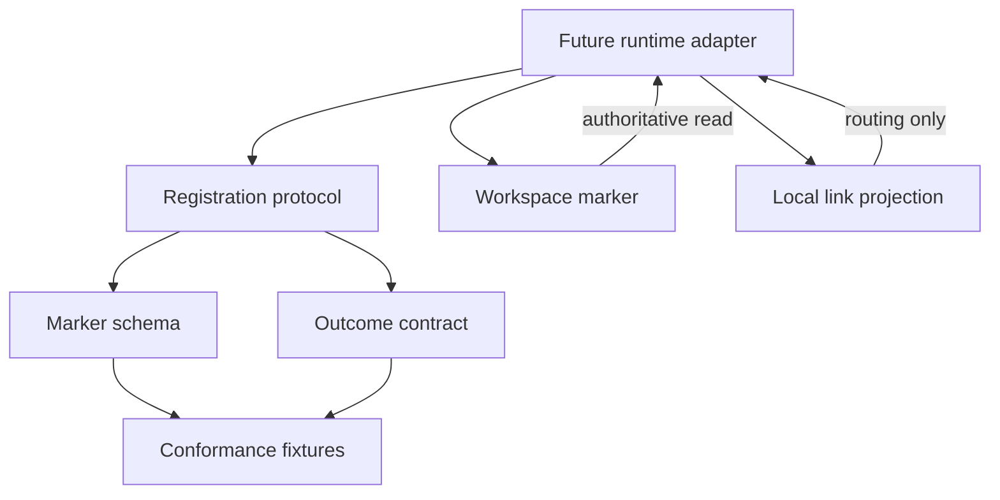
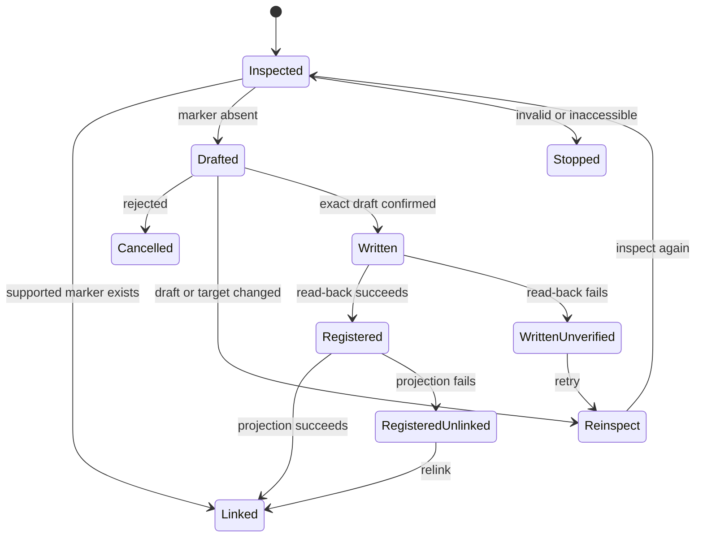

# Workstream Registration and Discovery - Plan

## How to Read This Plan

Use this document as the canonical implementation plan. The sections have different jobs:

- **Goal Capsule** — the short version of the objective, active delivery, and stop conditions.
- **Product Contract** — why this work matters, what behavior is required, and what is explicitly out of scope.
- **Planning Contract** — the technical decisions and design constraints an implementation agent must follow.
- **Implementation Units** — the work to perform, in dependency order, with exact files and verification rules.
- **Verification Contract** — the review gates for this requirements-only delivery.
- **Definition of Done** — the final completion checklist.

### Agent Execution Rules

1. Treat `VISION.md` and the decisions marked `session-settled` as authoritative.
2. Implement only the active scope. Do not select a runtime or build a working adapter in this delivery.
3. Follow the implementation-unit dependencies and sequencing; do not begin a dependent unit early.
4. Treat the marker as durable authority and local inventory as replaceable projection state.
5. Use the verification gates and Definition of Done as completion criteria, not as claims that executable runtime tests already exist.

## Goal Capsule

- **Objective:** Define a portable, assistant-neutral contract for workstream registration so future runtimes can recognize the same workspace, identity, record homes, and registration outcomes.
- **Product authority:** `VISION.md`; this contract lays the durable foundation for registered-workstream awareness but does not yet deliver a working registration adapter.
- **Active delivery:** The marker schema, registration protocol, result taxonomy, conformance fixtures, and integration guidance.
- **Stop condition:** Do not claim point-and-read registration works until a runtime and operator-facing adapter implement the contract and pass its fixtures.
- **Trust test:** The contract must prevent local routing state, device paths, unconfirmed drafts, or identity regeneration from becoming authoritative.
- **Work-reduction test:** A later adapter must let the operator register from a workspace pointer without supplying a remembered map of tools; this contract makes that behavior consistent across adapters.

---

## Product Contract

### Summary

The product scope remains point-and-read registration through a durable workspace self-description. This plan implements the portable contract first: an assistant-neutral marker, registration state rules, explicit outcomes, and conformance fixtures. Filesystem execution, assistant integration, and local inventory persistence are deferred until a runtime is selected.

**Product Contract preservation:** restructured, no scope change: R2 now names the existing label requirement, and KD4 now cites the full minimal self-description already implied by R2 and R5.

### Problem Frame

The operator currently carries a mental map of which tool holds each workstream (`VISION.md:84`). Arjim must identify registered workstreams and their authoritative record homes without relying on that memory (`VISION.md:182`), reconstruct inventory from workspaces after a clean rebuild (`VISION.md:186`), and keep durable memory outside an assistant's working copy (`VISION.md:70`). A stable, portable registration contract is the first technical foundation for those outcomes.

### Key Decisions

The `session-settled` annotations record decisions already made during planning. Do not reopen those choices unless a documented open question or a new user decision changes them.

- KD1. **Workspace-authoritative registration; registries are discovery aids only** (session-settled: user-directed — chosen over an Arjim-owned central catalog as the record: metadata must survive Arjim replacement, and a registry that holds metadata would drift). **Governs R4, R11, R12.**
- KD2. **Proxy workspace for metadata-incapable workspaces** (session-settled: user-directed — chosen over requiring the real workspace to hold metadata: systems and tools cannot always store assistant metadata). **Governs R6, R7.**
- KD3. **Arjim-generated identity; name is a label** (session-settled: user-directed — chosen over operator-chosen or workspace-derived identity: portability must not depend on naming). **Governs R2, R5, R14.**
- KD4. **Minimal self-description: identity, label, workspace reference, and record homes** (session-settled: user-directed — chosen over the fuller `VISION.md:182` set including purpose, lifecycle state, and decision record home: registration stays small). **Governs R2, R5.**
- KD5. **Arjim drafts, operator confirms, Arjim writes** (session-settled: user-directed — chosen over operator-authored or owner-authored descriptions: operator confirmation is the authority boundary for the write). **Governs R2, R3, R4.**
- KD6. **Point-and-read is the only working v1 entry path** (session-settled: user-directed — chosen over all three sources working in v1: smallest valuable slice; scan and registries stay designed but dormant). **Governs R12.**
- KD7. **Arjim reads registries, never writes them** (session-settled: user-directed — chosen over publishing pointers on registration: publishing is owned outside this feature). **Governs R11.**
- KD8. **Access-gated registration** (session-settled: user-directed — chosen over registering and flagging access later: an instance registers only what it can access, consistent with `VISION.md:104` device limits). **Governs R8, R9.**

### Actors

- A1. **Operator** — points to workspaces, designates proxy folders, and confirms exact drafts.
- A2. **Arjim instance** — an assistant on one device; a future adapter inspects, drafts, writes, reads back, and links registrations available on that device.

### Key Flows

- F1. **New folder registration** — **Covers R1-R5.** A future adapter inspects an existing folder, produces a contract-valid draft, obtains confirmation for that draft, creates the marker without replacement, reads it back, and derives a local link.
- F2. **Existing registration** — **Covers R4, R13, R14.** A valid supported marker is linked unchanged; its identity is never regenerated and no confirmation is required because registration does not write.
- F3. **Proxy workspace registration** — **Covers R6, R7.** The operator designates a regular folder as the metadata workspace; the marker records proxy kind while record homes point to the real system or tool.
- F4. **Rejected or stale draft** — **Covers R3, R4.** Rejection writes nothing. A material draft or target-state change invalidates confirmation and requires a new draft.
- F5. **Invalid location or marker** — **Covers R8-R10.** Missing, inaccessible, malformed, unsupported, or conflicting inputs stop registration with a distinct outcome and no overwrite.

### Requirements

The requirements below define observable product behavior. The technical decisions later in this document constrain how an adapter may satisfy them.

**Registration**

- R1. The operator can register a workstream by pointing Arjim at its workspace location.
- R2. Registration starts with an Arjim-drafted self-description containing an Arjim-generated permanent identity, a mutable operator-facing label, the workspace reference, and authoritative record-home references.
- R3. Nothing is written until the operator confirms the exact draft; registration completes only after the authoritative marker can be read back.
- R4. On confirmation, Arjim writes the self-description into the workspace; that marker is the durable registration record and must not silently replace an existing marker.
- R5. The operator-facing name is a label; changing it never substitutes for or changes the identity.

**Proxy workspaces**

- R6. When the real workspace cannot store assistant metadata, an operator-designated regular folder serves as the authoritative metadata workspace.
- R7. The proxy holds the self-description and durable workstream information; record homes continue to reference the real system or tool.

**Access and validation**

- R8. An Arjim instance registers only workspaces it can access on that device; inaccessible workspaces remain unregistered on that instance.
- R9. A missing workspace, non-directory target, write denial, invalid marker, unsupported marker version, or identity conflict produces a distinct non-success outcome without creating or replacing a registration.

**Discovery readiness**

- R10. `.workstream/workstream.json` is the only v1 marker that makes a workspace a registration or discovery candidate.
- R11. Registries are read-only discovery aids: they point to metadata, never hold it, and linked assistants read the workspace marker directly.
- R12. Machine scan and registry consumption are designed to feed the same marker-inspection protocol but do not function in this scope; point-and-read remains the only planned working entry path.

**Durability**

- R13. Local inventory is a replaceable projection derived from readable workspace markers and may retain device-local routing data without becoming registration authority.
- R14. Reading a valid marker yields the same identity on every device or assistant; retries and existing-marker linking never regenerate that identity.

### Acceptance Examples

- AE1. **New folder marker** — **Covers R1-R5.** A valid confirmed draft for an unmarked folder produces one marker whose read-back value matches the confirmed data and whose identity remains stable.
- AE2. **Existing marker** — **Covers R4, R14.** A valid supported marker is linked unchanged without confirmation, overwrite, or a new identity.
- AE3. **Proxy marker** — **Covers R6, R7.** A proxy marker identifies its folder as the metadata workspace while its record-home URIs point to the real system.
- AE4. **No confirmation** — **Covers R3.** A rejected or absent confirmation produces no marker and no local link.
- AE5. **Invalid or inaccessible input** — **Covers R8-R10.** A missing or inaccessible location, invalid marker, unsupported version, or conflict produces a distinct diagnostic and no write.
- AE6. **Name change keeps identity** — **Covers R5, R14.** Two otherwise valid revisions may differ in label while retaining the same identity.
- AE7. **Post-write link failure** — **Covers R4, R13.** If the marker is written and verified but local linking fails, the marker remains authoritative and a later relink reuses its identity.

### Scope Boundaries

#### Active in This Plan

- Version 1 marker schema and examples.
- Registration state and authority protocol, including existing markers, exact-draft confirmation, conflicts, retries, and partial success.
- Portable result and error taxonomy.
- Runtime-neutral conformance fixtures and adapter obligations.

#### Deferred to Follow-Up Work

- Select a runtime and validation library.
- Implement filesystem inspection, create-only writes, read-back, and local inventory persistence.
- Add the operator-facing assistant or CLI adapter.
- Run executable end-to-end tests for folder access, permissions, concurrent writes, interruption recovery, and local relinking.

#### Deferred for Later

- Machine scan and registry consumption as working entry paths.
- Registry publishing by Arjim.
- Purpose, lifecycle state, and designated decision record home in the marker.
- Workstream status, progress, next actions, and freshness.
- Operating-process requirements.
- Broad proposal-to-audit write-safety and attribution machinery beyond this contract's narrow create-only rule.
- Cross-device root rediscovery and wipe-and-rebuild proof.
- Coverage-driven authority escalation.

#### Outside This Product's Identity

- A dashboard or authoritative system of record for workstreams; an assistant's working copy never becomes authoritative (`VISION.md:15`, `VISION.md:70`).

### Dependencies / Assumptions

- `VISION.md` remains product authority.
- The operator is the sole v1 human actor.
- Version 1 record homes are typed, absolute URI references validated for structure only; provider access and ownership checks require later adapters.
- Marker files contain no credentials, tokens, private keys, URI user-info, or provider secrets.

### Sources / Research

- `VISION.md` — product authority for durable memory, access honesty, authority, and rebuildability.
- `docs/ideation/2026-08-01-arjim-improvement-ideation.md` — registration idea and surrounding work relationships.
- `README.md` — confirms the repository is planning-only with no selected stack or test tooling.
- No `docs/solutions/` corpus or implementation precedent exists yet.
- External research was attempted but unavailable because this harness has no web-search capability; no external standard is presented as researched evidence.

---

## Planning Contract

This section is the implementation boundary. An agent may choose details that are not decided here, but it must not contradict these technical decisions or expand the active scope.

### Key Technical Decisions

- KTD1. **Deliver a runtime-neutral contract before an executable adapter** (session-settled: user-directed — chosen over selecting TypeScript or Python now: the user wants the portable boundary settled first). The active units produce schemas, protocol text, and fixtures; they do not claim working registration. **Supports R1-R14.**
- KTD2. **Use `.workstream/workstream.json` as the assistant-neutral marker** (session-settled: user-directed — chosen over an Arjim-named path and a root-level marker: the namespace stays portable and extensible). **Supports R4, R10-R14.**
- KTD3. **Version each portable contract surface independently with JSON Schema Draft 2020-12** (session-settled: user-approved — chosen over YAML or field-only prose: machine-readable schemas give runtimes one conformance target). The package release, marker schema, result schema, fixture schema, and protocol each carry an identifier; compatibility is explicit rather than inferred from one shared number. A reader dispatches on the marker version before applying its closed schema, so an unknown version is unsupported rather than malformed. **Supports R2, R5-R7, R9, R10, R14.**
- KTD4. **Keep durable and device-local references separate.** Version 1 uses the literal workspace self-reference `.` and lexically locates the marker at `.workstream/workstream.json` below the inspected root. Absolute paths, traversal, symlink-resolved paths, and local link locations belong only in adapter state. **Supports R2, R9, R13, R14.**
- KTD5. **Use open typed URI references as untrusted data.** Each record home carries a namespaced type token and absolute URI. Version 1 checks syntax and exact duplicate pairs, but validity never authorizes dereferencing; unsupported type/scheme pairs remain valid data with unsupported capability status. **Supports R2, R7-R9.**
- KTD6. **Bind single-use confirmation to a canonical semantic envelope** (session-settled: user-approved — chosen over conversational approval detached from content: changed data or target state must not inherit authority). The envelope includes contract versions, every parsed marker field in order, an adapter-supplied stable target handle, and observed marker absence. The adapter revalidates the same handle before writing and during read-back, and stops if it cannot establish that stability. Duplicate JSON keys are invalid; only property ordering and insignificant whitespace may change during serialization. Confirmation expires after any write attempt, reinspection, terminal transition, or marker-state change. **Supports R3, R4.**
- KTD7. **Treat an existing supported marker as registration authority.** Linking reads it unchanged. Invalid, unsupported, ambiguous, or conflicting markers stop for operator resolution rather than repair or identity regeneration. **Supports R4, R9, R14.**
- KTD8. **Make versioned conformance fixtures the portable test boundary.** Fixture and expectation schemas define inputs, observations, mandatory protocol assertions, and adapter-specific capability assertions. Every future adapter must pass the mandatory corpus before claiming protocol compliance. **Supports R1-R14.**
- KTD9. **Bound and isolate untrusted marker data.** Version 1 limits marker bytes, JSON nesting depth, field lengths, and record-home count; rejects duplicate keys, controls, bidirectional overrides, URI user-info, and local-resource schemes; and treats labels and URIs as data rather than assistant instructions. Results use bounded structured diagnostics without raw marker bodies, full URIs, labels, secrets, or local paths. **Supports R8-R10.**

### High-Level Technical Design

The contract separates durable workspace truth from replaceable device state and runtime-specific execution.



The protocol has explicit terminal and recovery states so interruption cannot create a second identity or convert local state into authority.



### Output Structure

The paths below are the intended deliverables. Create only the files assigned to the active implementation units; do not add runtime code or experimental files as part of this plan.

```text
contracts/
  workstream-registration/
    README.md
    v1/
      workstream.schema.json
      registration-result.schema.json
      conformance-case.schema.json
      expectations.schema.json
      registration-protocol.md
      compatibility.md
tests/
  contracts/
    workstream-registration/
      expectations.json
      raw/
      valid/
      invalid/
      transitions/
```

### Sequencing

1. **U5 — Conformance envelope:** Define the fixture schemas, expectation manifest, and adapter-obligation rules that constrain every fixture.
2. **U1 — Marker contract:** Establish the marker schema and valid examples before defining workflow results.
3. **U2 — State protocol:** Define the registration states and authority transitions against the marker schema.
4. **U3 — Results:** Define the result taxonomy and complete the versioned negative and transition corpus.
5. **U4 — Guidance:** Publish the final guidance after the schemas, protocol, and fixtures cover the full active scope.

The dependency graph is `U5 -> U1 -> U2 -> U3 -> U4`. U5 is a prerequisite for every other unit; U2 also depends on U1, and U3 and U4 depend on all preceding units shown in their unit definitions.

### Risks & Dependencies

- **Contract without executable proof:** A malformed schema or contradictory fixture can survive manual review. Mitigation: keep one expectation manifest, require every fixture to declare its expected result, and make runtime selection include choosing a standards-compliant validator.
- **Path portability:** Persisting local absolute paths would break cross-device identity. Mitigation: fixtures reject device paths in the marker and reserve them for local projection examples.
- **Resource exhaustion:** A shared marker can be hostile before schema validation. Mitigation: KTD9 sets pre-parse and collection bounds, and fixtures cover exact-limit and over-limit inputs.
- **URI overclaim:** Structural validity does not prove access, ownership, or safety. Mitigation: KTD5 prohibits automatic dereference and distinguishes `not-checked`, `unsupported`, and inaccessible states.
- **Secret leakage:** URI syntax can hide credentials. Mitigation: KTD9 rejects obvious carriers and prevents diagnostics from echoing sensitive values; later adapters still own secret scanning.
- **Schema lock-in:** A closed provider enum would force schema changes for every integration. Mitigation: keep record-home type tokens open and version behavior, not providers.

### System-Wide Impact

- **Source control and sync:** The marker may be shared through the workspace's normal storage, but the contract does not require committing it to version control. Ignore, backup, and sync policy stays with the workspace owner.
- **Moves and aliases:** The marker identity survives a workspace move. Device-local links may become stale and must be repaired without editing the marker. Simultaneously available copies of one identity are reported as a collision, not resolved from local cache authority.
- **Concurrent assistants:** Readers may trust only a valid supported marker. Writers must use the KTD6 precondition and create-only rule; a concurrently created marker wins authority and invalidates the draft.
- **Lifecycle changes:** Version 1 registration adapters do not edit, upgrade, relocate, or delete existing markers. Label mutation fixtures prove identity invariance only; update and unregistration protocols require separate authority and conflict rules.
- **Schema upgrades:** Future marker versions remain recognizable but unsupported until an adapter declares compatibility. No adapter may rewrite an unsupported marker during registration.
- **Projection rebuilds:** Deleting local routing state never unregisters a workstream. Re-linking begins from the marker and may surface missing, moved, duplicated, or inaccessible workspaces.

---

## Implementation Units

### U5. Define the conformance envelope

**Execution position:** First. This unit defines the fixture vocabulary used by U1-U3.

- **Goal:** Establish the portable fixture and expectation formats before any unit creates cases that depend on them.
- **Requirements:** R1-R14; KTD3, KTD8, KTD9.
- **Dependencies:** None.
- **Files:**
  - Create `contracts/workstream-registration/v1/conformance-case.schema.json`.
  - Create `contracts/workstream-registration/v1/expectations.schema.json`.
  - Create `tests/contracts/workstream-registration/expectations.json` with package and fixture-format versions.
- **Approach:** Separate parsed-value cases from raw-byte cases. Raw cases carry base64-encoded input inside valid JSON envelopes; expectations identify the stage and outcome without treating the decoded payload as a JSON document. Define which assertions are mandatory protocol conformance and which are runtime capability checks.
- **Patterns to follow:** Independent version ownership in KTD3 and portable fixture authority in KTD8.
- **Test scenarios:**
  1. A parsed-value envelope identifies its input object and expected schema outcome.
  2. A raw-byte envelope identifies its base64 payload and expected pre-parse outcome.
  3. An expectation with an unknown fixture path, duplicate path, unsupported fixture-format version, or missing expected stage is invalid.
  4. Mandatory protocol assertions remain separate from runtime-specific capability assertions.
- **Verification:** The envelope and expectation schemas are closed, versioned, and sufficient to describe every fixture planned by U1-U3 without forward invention.

### U1. Define the version 1 marker contract

**Execution position:** Second, after U5.

- **Goal:** Establish the canonical marker schema and assistant-neutral durable data boundary.
- **Requirements:** R2, R5-R7, R10, R14; KTD2-KTD5, KTD9.
- **Dependencies:** U5.
- **Files:**
  - Create `contracts/workstream-registration/v1/workstream.schema.json`.
  - Create `tests/contracts/workstream-registration/valid/folder.json`.
  - Create `tests/contracts/workstream-registration/valid/proxy.json`.
  - Create `tests/contracts/workstream-registration/valid/label-changed-same-id.json`.
  - Create `tests/contracts/workstream-registration/invalid/` fixtures for missing fields, unknown fields, malformed identity, invalid kind, local path leakage, duplicate record homes, relative record-home URI, and URI user-info.
  - Create `tests/contracts/workstream-registration/raw/` envelopes for invalid UTF-8, duplicate keys, byte-order marks, trailing content, and nesting-depth limits.
- **Approach:** Define a versioned closed object with a lowercase UUID identity, bounded label, `folder|proxy` kind, literal `.` workspace reference, and bounded typed absolute record-home URIs. Set a 64 KiB UTF-8 pre-parse ceiling, a maximum JSON nesting depth of 8 containers, a 256-character label limit, 64-character ASCII type-token limit, 2,048-character URI limit, and 32-record-home limit. Keep property order and formatting non-normative.
- **Patterns to follow:** Stable IDs and authority language in this plan; sensitive-data boundary in `VISION.md`.
- **Test scenarios:**
  1. Covers AE1. A folder marker with every required field validates.
  2. Covers AE3. A proxy marker validates while retaining real-system record-home URIs.
  3. Covers AE6. Two valid markers with different labels retain the same identity.
  4. A marker missing each required field fails with that fixture's expected schema outcome.
  5. A marker with an unknown property, malformed UUID, unsupported kind, or empty label fails.
  6. A marker containing an absolute or traversing workspace reference, relative or local-resource record-home URI, duplicate type/URI pair, URI user-info, controls, backslashes, or bidirectional overrides fails.
  7. Exact-limit inputs validate; one-over-limit marker bytes, labels, type tokens, URIs, and record-home collections fail with the expected category.
  8. Base64-backed raw envelopes prove duplicate keys, invalid UTF-8, a byte-order mark, and trailing JSON fail before schema validity is considered.
  9. Raw inputs at nesting depth 8 reach normal validation; depth 9 stops before schema validation.
  10. An instruction-like but otherwise valid label remains data and does not change its expected protocol outcome.
- **Verification:** Every fixture is valid JSON, appears once in the expectations manifest created by U5, and has an unambiguous expected validity result.

### U2. Specify registration states and authority transitions

**Execution position:** Third, after U5 and U1.

- **Goal:** Define how any adapter inspects, drafts, confirms, writes, reads back, links, retries, and stops without changing product authority.
- **Requirements:** R1, R3, R4, R8-R10, R13, R14; F1-F5; KTD1, KTD6, KTD7.
- **Dependencies:** U5, U1.
- **Files:**
  - Create `contracts/workstream-registration/v1/registration-protocol.md`.
  - Create `tests/contracts/workstream-registration/transitions/new-registration.json`.
  - Create `tests/contracts/workstream-registration/transitions/existing-marker.json`.
  - Create `tests/contracts/workstream-registration/transitions/rejected-draft.json`.
  - Create `tests/contracts/workstream-registration/transitions/stale-confirmation.json`.
  - Create `tests/contracts/workstream-registration/transitions/registered-unlinked.json`.
- **Approach:** Make read-only inspection, canonical confirmation-envelope comparison, create-only write, authoritative read-back, and replaceable linking separate protocol stages. Anchor inspection, write, and read-back to the same stable target handle; reject redirected marker-path components and stop when equivalent target stability cannot be established. Define retries by observed marker state so a successful write followed by failure recovers the existing identity. Treat local identity conflicts as blocking evidence only when both marker locations are currently readable; stale projection data remains advisory.
- **Execution note:** Start from the transition fixtures so protocol prose cannot omit a terminal or recovery state.
- **Patterns to follow:** The authority levels and unknown-state rules in `VISION.md`; KTD6-KTD7.
- **Test scenarios:**
  1. Covers AE1. An absent marker progresses from inspection through exact confirmation, write, read-back, and link.
  2. Covers AE2. A valid existing marker links without draft, confirmation, overwrite, or identity regeneration.
  3. Covers AE4. Rejection terminates with no write or link.
  4. A changed draft or target state invalidates confirmation and returns to inspection.
  5. Covers AE5. Missing, inaccessible, malformed, unsupported, and conflicting inputs stop with distinct outcomes.
  6. Covers AE7. A verified marker with failed local linking remains registered and can be relinked idempotently.
  7. A write followed by failed read-back enters a visible recovery state and never generates another identity on retry.
  8. Label, URI, record-home order, kind, identity, target identity, or marker-presence changes invalidate confirmation; formatting-only serialization changes do not.
  9. Redirected metadata paths, final-marker links, target aliases changed after confirmation, and concurrent marker creation stop without a write.
  10. An unknown record-home type or scheme is never dereferenced and reports unsupported capability.
  11. A parent-component swap or final-marker swap between inspection and write fails target revalidation; read-back from a different target cannot verify registration.
  12. Confirmation cannot be reused after a write attempt, reinspection, terminal outcome, or an absent-present-absent marker sequence.
- **Verification:** Every state has defined entry conditions, allowed transitions, side effects, terminal outcomes, and retry behavior; no transition writes before exact confirmation.

### U3. Define portable results and conformance expectations

**Execution position:** Fourth, after U5, U1, and U2.

- **Goal:** Give adapters one result vocabulary and one machine-readable fixture index.
- **Requirements:** R3, R4, R8-R10, R13; KTD8, KTD9.
- **Dependencies:** U5, U1, U2.
- **Files:**
  - Create `contracts/workstream-registration/v1/registration-result.schema.json`.
  - Add result fixtures under `tests/contracts/workstream-registration/transitions/` for registered, linked-existing, cancelled, stopped, and written-unverified outcomes; reuse `registered-unlinked.json` from U2 for that result expectation.
- **Approach:** Define a closed bounded envelope that separates protocol outcome, marker validity, observed write/read-back/link effects, verified identity, capability status, and structured adapter diagnostics. Invalid or unsupported markers cannot promote their claimed values to authoritative results. Complete the U5 expectation manifest with every result and transition case.
- **Patterns to follow:** `VISION.md` distinctions between current, unavailable, unsupported, and not checked.
- **Test scenarios:**
  1. A successful new registration reports marker write, read-back, and link separately.
  2. Existing-marker linking reports the durable identity without claiming a write.
  3. Missing, unreadable, unwritable, invalid, unsupported, and conflicting inputs remain distinct.
  4. Record-home checks can report `not-checked` without making a structurally valid marker invalid.
  5. Written-unverified and registered-unlinked results expose partial success without rollback or false completion.
  6. Every schema and transition fixture has exactly one expected outcome in the manifest.
  7. Contradictory combinations fail, including registered without matching read-back, linked after an invalid marker, or a write on the existing-marker path.
  8. Diagnostics reject raw markers, full URIs, labels, secrets, local paths, oversized messages, and unbounded collections.
- **Verification:** The result schema can represent every protocol terminal state, and the expectation manifest has no missing, duplicate, or orphan fixture entries.

### U4. Publish adapter and conformance guidance

**Execution position:** Last, after U5 and U1-U3.

- **Goal:** Make the contract usable by a later runtime without allowing it to weaken authority, portability, or verification rules.
- **Requirements:** R1-R14; KTD1-KTD9.
- **Dependencies:** U5, U1-U3.
- **Files:**
  - Create `contracts/workstream-registration/README.md`.
  - Create `contracts/workstream-registration/v1/compatibility.md`.
  - Update `README.md`.
- **Approach:** Document independent contract versions, compatibility, marker discovery, untrusted-data handling, adapter obligations, and the active/deferred boundary. Define the Draft 2020-12 validation profile and assign checks that cannot be expressed portably in JSON Schema to the protocol. State that an adapter is not compliant until it passes every mandatory fixture plus runtime-specific filesystem and interruption tests.
- **Patterns to follow:** Plain-language product boundaries in `README.md` and `VISION.md`.
- **Test scenarios:** Test expectation: none -- documentation-only unit.
- **Verification:** A new implementer can identify the authoritative schemas, protocol, fixture manifest, compliance bar, and deferred runtime work without reading this planning artifact.

---

## Verification Contract

The repository has no selected runtime, package manifest, or test runner. This delivery verifies contract completeness and internal consistency; executable conformance begins with the first runtime delivery.

| Gate | Applies to | Required outcome |
|---|---|---|
| JSON integrity | U5, U1-U3 | Every schema, fixture envelope, and expectation file parses as JSON; decoded raw payloads are exempt. |
| Fixture structure | U5, U1-U3 | Every case conforms to the fixture schema and has one structurally valid expectation entry. |
| Protocol review | U2 | Every documented state has entry conditions, side effects, allowed transitions, and a terminal or recovery path. |
| Result review | U3 | Every documented terminal and partial-success state has a corresponding result case. |
| Fixture inventory | U5, U1-U3 | The expectation manifest has no duplicate, missing, or orphan paths. |
| Traceability | U4 | Adapter guidance cites the schemas, protocol, fixtures, and deferred runtime gates. |

When a runtime is selected, its first delivery must declare compatibility with the contract's Draft 2020-12 validation profile, execute every mandatory fixture, and add integration tests for real folders, permissions, create-only conflicts, target swaps, read-back failure, interruption recovery, and local relinking.

---

## Definition of Done

- The marker, result, and protocol contracts agree on field names, states, and authority boundaries.
- Every active requirement is cited by at least one implementation unit and covered by a fixture, protocol rule, or documentation obligation.
- Valid, invalid, and transition fixtures cover all acceptance examples that can be proved without a runtime.
- Durable marker data contains no device-local paths or credential fields.
- Existing markers, retries, partial success, and identity conflicts cannot cause silent overwrite or identity regeneration under the protocol.
- The local projection is described only as replaceable routing state.
- The README states plainly that the contract exists but working point-and-read registration remains deferred.
- External-research unavailability is not presented as standards validation.
- Reviewable gates are not presented as executable schema or protocol proof.
- No abandoned schema fields, duplicate fixtures, superseded protocol text, or experimental files remain in the change.

---

<!-- ce-section: work-relationships -->
## How This Work Fits Together

This contract is the dependency for a future point-and-read adapter and later root-based rediscovery. Coverage-driven authority escalation, proposal-to-audit writes, freshness, and portfolio awareness may consume registered workstreams later, but they do not expand this plan's active scope.

---

## Deferred / Open Questions

### From 2026-08-01 review

- **URI validity and secret policy conflict** — Record-home contract (P1, feasibility and security-lens, confidence 75)

  Adapters may disagree on marker validity, and a structurally valid marker may persist a signed URL or token. Decide which URI schemes and credential-bearing components version 1 rejects while keeping unsupported provider types valid but non-dereferenceable.

- **Create-only consistency domain is unresolved** — System-Wide Impact (P1, adversarial, confidence 75)

  Separately synchronized workspace copies can each create a marker and later reveal competing permanent identities. Decide whether version 1 requires strongly consistent exclusive creation or permits weaker storage with an explicit unresolved-collision outcome.
