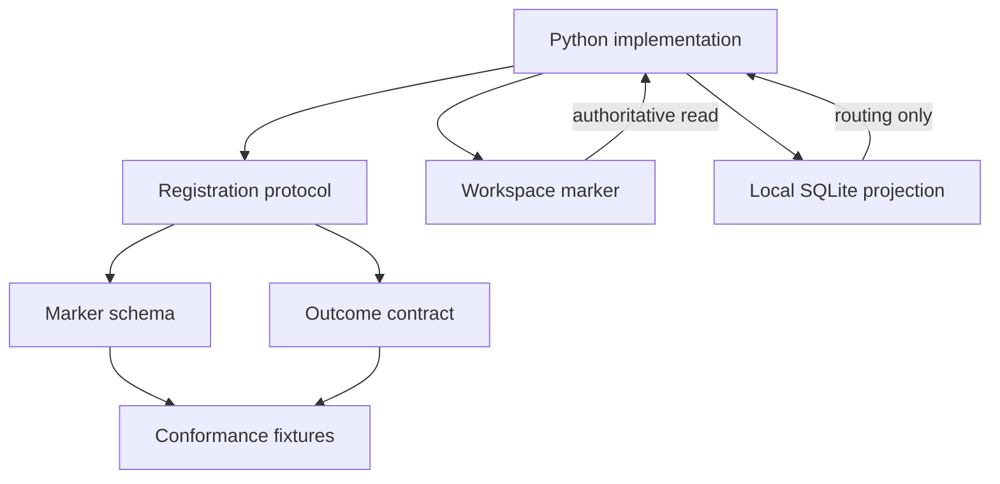
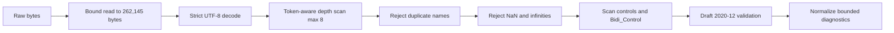

# Workstream Registration and Discovery - Plan

## How to Read This Plan

Use this document as the canonical implementation plan. The sections have different jobs:

- **Goal Capsule** — the objective, product value, trust boundary, and stop condition.
- **Product Contract** — the observable behavior, stable identifiers, and scope boundaries.
- **Planning Contract** — the technical decisions and design constraints for the Python implementation.
- **Implementation Units** — the work to perform in dependency order, with files and verification rules.
- **Verification Contract** — the executable and review gates for this delivery.
- **Definition of Done** — the final completion checklist.

### Agent Execution Rules

1. Treat `VISION.md` and decisions marked `session-settled` as authoritative.
2. Implement the active scope as one Python product on CPython 3.14.x with `jsonschema` 4.26.x; do not reopen the runtime choice.
3. Follow the implementation-unit dependencies and sequencing; do not begin a dependent unit early.
4. Treat `.workstream/workstream.json` as durable workspace authority and local inventory as replaceable projection state.
5. Use the Verification Contract and Definition of Done as completion criteria. Do not claim point-and-read registration works before the complete Python lifecycle and project conformance corpus pass.

## Goal Capsule

- **Objective:** Deliver a Python implementation of point-and-read workstream registration on CPython 3.14.x with `jsonschema` 4.26.x. It must recognize the same durable workspace marker, identity, record sources, and registration outcomes across devices while keeping local routing state replaceable.
- **Product authority:** `VISION.md`; this work makes the durable-memory foundation of Outcome 3 real and prepares the safe management capability in Outcome 4. It does not deliver portfolio awareness, status, or broader automation.
- **Active delivery:** The marker schema, registration and unregister protocol, result vocabulary, conformance fixtures, Python package, bounded validation pipeline, filesystem lifecycle, SQLite projection, operator CLI, and project conformance runner.
- **Trust test:** Registration must not turn a local cache, device path, unconfirmed draft, malformed or inaccessible state, secret-bearing diagnostic, or regenerated identity into authoritative workstream memory.
- **Work-reduction test:** An operator can point the Python CLI at a workspace, confirm one exact draft, and later relink or rebuild local inventory from the workspace without carrying a remembered map of tools.
- **Stop condition:** Do not claim point-and-read registration works until the Python CLI completes the authoritative write/read-back lifecycle and every mandatory project fixture and integration gate passes.

## Product Contract

### Summary

The product delivers point-and-read registration through a durable workspace self-description. The v1 implementation is Python-only: it provides the assistant-neutral marker as portable workspace data, the registration and unregister authority rules, explicit outcomes including `unregistered`, conformance fixtures, and the Python runtime behavior that proves those rules can be executed safely.

The JSON marker, schemas, result vocabulary, protocol text, and fixtures remain portable data and behavioral contracts. Executable behavior for this delivery belongs to `src/workstream_registration/`; there is no separate runtime-neutral implementation layer or general implementation package.

### Problem Frame

The operator currently carries a mental map of which tool holds each workstream (`VISION.md:84`). Arjim must identify registered workstreams and their authoritative record sources without relying on that memory (`VISION.md:182`), reconstruct inventory from workspaces after a clean rebuild (`VISION.md:186`), and keep durable memory outside its working copy (`VISION.md:70`). A small Python registration implementation is the first executable foundation for those outcomes.

### Key Decisions

The `session-settled` annotations record decisions already made during planning. Do not reopen those choices unless a documented open question or a new user decision changes them.

- KD1. **Workspace-authoritative registration; registries are discovery aids only** (session-settled: user-directed — metadata must survive Arjim replacement, and a registry that holds metadata would drift). **Governs R4, R11, R12.**
- KD2. **Proxy workspace for metadata-incapable workspaces** (session-settled: user-directed — systems and tools cannot always store assistant metadata). **Governs R6, R7.**
- KD3. **Arjim-generated identity; name is a label** (session-settled: user-directed — portability must not depend on naming). **Governs R2, R5, R14.**
- KD4. **Minimal self-description: identity, label, workspace reference, and record sources** (session-settled: user-directed — registration stays small rather than including the fuller future workstream description). **Governs R2, R5.**
- KD5. **Arjim drafts, operator confirms, Arjim writes** (session-settled: user-directed — operator confirmation is the authority boundary for the write). **Governs R2, R3, R4.**
- KD6. **Point-and-read is the only working v1 entry path** (session-settled: user-directed — scan and registries remain designed but dormant). **Governs R12.**
- KD7. **Arjim reads registries, never writes them** (session-settled: user-directed — registry publishing is outside this feature). **Governs R11.**
- KD8. **Access-gated registration** (session-settled: user-directed — an instance registers only what it can access on that device). **Governs R8, R9.**
- KD9. **Confirmed conditional unregister** (session-settled: user-directed — a confirmed conditional delete retires a workstream without deleting a changed marker). **Governs R15.**
- KD10. **Accept any valid-looking record-source URI; warn on malformed ones** (session-settled: user-directed — unsupported providers remain valid data, and the Python implementation never dereferences or inspects URI content for credentials, tokens, or other secrets). **Governs R2, R7-R9.**

### Actors

- A1. **Operator** — points to workspaces, designates proxy workspaces, and confirms exact drafts.
- A2. **Arjim instance** — the Python implementation on one device; it inspects, drafts, writes, reads back, and links registrations available on that device.

### Key Flows

- F1. **New workspace registration** — **Covers R1-R5.** The implementation inspects an existing workspace, produces a contract-valid draft, obtains confirmation for that draft, creates the marker without replacement, reads it back, and derives a local link.
- F2. **Existing registration** — **Covers R4, R13, R14.** A valid supported marker is linked unchanged; its identity is never regenerated and no confirmation is required because registration does not write.
- F3. **Proxy workspace registration** — **Covers R6, R7.** The operator designates a folder as the proxy workspace; the marker records proxy kind while record sources point to the real system or tool.
- F4. **Rejected or stale draft** — **Covers R3, R4.** Rejection writes nothing. A material draft or target-state change invalidates confirmation and requires a new draft.
- F5. **Invalid location or marker** — **Covers R8-R10.** Missing, inaccessible, malformed, unsupported, or conflicting inputs stop registration with a distinct outcome and no overwrite.
- F6. **Unregister** — **Covers R15.** The operator confirms an unregister draft bound to the marker's exact identity; the implementation conditionally deletes the marker and verifies absence by read-back.

### Requirements

The requirements below define observable product behavior. The technical decisions later in this document constrain how the Python implementation may satisfy them.

**Registration**

- R1. The operator can register a workstream by pointing Arjim at its workspace location.
- R2. Registration starts with an Arjim-drafted self-description containing an Arjim-generated permanent identity, a mutable operator-facing label, the workspace reference, and authoritative record-source references.
- R3. Nothing is written until the operator confirms the exact draft; registration completes only after the authoritative marker can be read back.
- R4. On confirmation, Arjim writes the self-description into the workspace; that marker is the durable registration record and must not silently replace an existing marker.
- R5. The operator-facing name is a label; changing it never substitutes for or changes the identity.

**Proxy workspaces**

- R6. When the real workspace cannot store assistant metadata, an operator-designated folder serves as the proxy workspace.
- R7. The proxy holds the self-description and durable workstream information; record sources continue to reference the real system or tool.

**Access and validation**

- R8. An Arjim instance registers only workspaces it can access on that device; inaccessible workspaces remain unregistered on that instance.
- R9. A missing workspace, non-directory target, write denial, invalid marker, unsupported marker version, or identity conflict produces a distinct non-success outcome without creating or replacing a registration.

**Discovery readiness**

- R10. `.workstream/workstream.json` is the only v1 marker that makes a workspace a registration or discovery candidate.
- R11. Registries are read-only discovery aids: they point to metadata, never hold it, and linked assistants read the workspace marker directly.
- R12. Machine scan and registry consumption are designed to feed the same marker-inspection protocol but do not function in this scope; point-and-read remains the only planned working entry path.

**Durability**

- R13. Local inventory is a replaceable projection derived from readable workspace markers and may retain device-local routing data without becoming registration authority. In v1, relink and rebuild accept explicit operator-supplied workspace roots or paths; automatic root scanning remains deferred. The operator must know where each workspace lives, including any proxy workspace: v1 cannot recover locations it is never pointed at, for proxy and regular workspaces alike.
- R14. Reading a valid marker yields the same identity on every device or assistant; retries and existing-marker linking never regenerate that identity.

**Unregistration**

- R15. The operator can unregister a workstream; Arjim drafts an unregister intent bound to the marker's exact identity, obtains confirmation, performs a conditional delete within the declared cooperative-writer filesystem profile, and completes only when read-back verifies absence. If the implementation cannot establish that cooperation, it stops without deleting; the residual race from non-cooperating external writers is disclosed rather than represented as an atomic guarantee.

### Acceptance Examples

- AE1. **New workspace marker** — **Covers R1-R5.** A valid confirmed draft for an unmarked workspace produces one marker whose read-back value matches the confirmed data and whose identity remains stable.
- AE2. **Existing marker** — **Covers R4, R14.** A valid supported marker is linked unchanged without confirmation, overwrite, or a new identity.
- AE3. **Proxy marker** — **Covers R6, R7.** A proxy marker identifies the proxy workspace as the metadata workspace while its record-source URIs point to the real system.
- AE4. **No confirmation** — **Covers R3.** A rejected or absent confirmation produces no marker and no local link.
- AE5. **Invalid or inaccessible input** — **Covers R8-R10.** A missing or inaccessible location, invalid marker, unsupported version, or conflict produces a distinct diagnostic and no write.
- AE6. **Name change keeps identity** — **Covers R5, R14.** Two otherwise valid revisions may differ in label while retaining the same identity.
- AE7. **Post-write link failure** — **Covers R4, R13.** If the marker is written and verified but local linking fails, the marker remains authoritative and a later relink reuses its identity.
- AE8. **Unregister** — **Covers R15.** A confirmed unregister deletes the marker, verifies absence by read-back, and reports `unregistered`; a later re-registration generates a fresh identity.
- AE9. **Warned record source** — **Covers R2, R7-R9, R11.** A marker whose record source carries a malformed URI or a local-resource scheme remains valid and readable; the affected record source reports non-dereferenceable capability with a structured warning and no dereference. URI content is not inspected for credentials, tokens, or other secrets.

### Scope Boundaries

#### Active in This Plan

- Version 1 marker schema and examples.
- Registration and unregister state and authority protocol, including existing markers, exact-draft confirmation, confirmed conditional delete, retries, and partial success.
- Portable workspace-data contracts: result vocabulary, warning and error taxonomy, schemas, protocol text, and conformance fixtures.
- Python 3.14.x implementation with `jsonschema` 4.26.x: raw-input guard, bundled Draft 2020-12 validation, normalized bounded diagnostics, create-only write and read-back, confirmed conditional delete, replaceable SQLite projection, operator CLI, and project conformance runner.
- Executable tests for raw input, validation, filesystem lifecycle, interruption recovery, local relinking, unregister, projection, CLI, and conformance.

#### Deferred for Later

- Machine scan and registry consumption as working entry paths.
- Registry publishing by Arjim.
- Purpose, lifecycle state, and designated decision record source in the marker.
- Workstream status, progress, next actions, and freshness.
- Operating-process requirements.
- Broad proposal-to-audit write-safety and attribution machinery beyond this contract's narrow create-only and conditional-delete rules.
- Cross-device root rediscovery and wipe-and-rebuild proof.
- Coverage-driven authority escalation.
- Any second runtime, runtime-selection abstraction, or general implementation package.

#### Outside This Product's Identity

- A dashboard or authoritative system of record for workstreams; an assistant's working copy never becomes authoritative (`VISION.md:15`, `VISION.md:70`).

### Dependencies / Assumptions

- `VISION.md` remains product authority.
- The operator is the sole v1 human actor.
- The implementation target is CPython 3.14.x with `jsonschema` 4.26.x and the standard-library `sqlite3` module; exact patch versions are pinned at implementation start and must pass the project corpus.
- Version 1 record sources are typed, absolute URI references validated for structure only; any syntactically valid URI is accepted regardless of scheme or credential-bearing components, and malformed ones warn. Record-source URIs are RFC 3986 ASCII; non-ASCII content must be percent-encoded, so the 2,048-character field limit is also a 2,048-byte budget. Provider access and ownership checks are deferred.
- Record-source URIs are accepted as untrusted data; the implementation never dereferences them, never inspects them for credentials, tokens, or other secrets, and diagnostics never echo them. The operator decides what content the marker may carry.
- Unregister uses the same operator-confirmation authority as registration; no delete occurs without a confirmed exact identity.
- The supported filesystem profile is declared and tested; network or synchronized filesystems are not assumed compliant.

### Sources / Research

- `VISION.md` — product authority for durable memory, access honesty, authority, and rebuildability.
- `docs/ideation/2026-08-01-arjim-improvement-ideation.md` — registration idea and surrounding work relationships.
- `README.md` — confirms the repository is planning-only before implementation.
- `docs/research/2026-08-01-workstream-registration-runtime-stack.md` — runtime assessment adopted for CPython 3.14.x, `jsonschema` 4.26.x, `Draft202012Validator`, bounded raw input, normalized diagnostics, filesystem lifecycle, conditional delete, and SQLite projection.
- `docs/raid.md` — current risks, assumptions, issues, and dependencies reconciled by this rewrite.

## Planning Contract

This section is the implementation boundary. An implementation may choose details that are not decided here, but it must not contradict these decisions or expand the active scope.

### Key Technical Decisions

- KTD1. **Deliver one Python implementation on the resolved runtime.** The v1 product runtime is CPython 3.14.x with `jsonschema` 4.26.x and `Draft202012Validator`; exact patch versions are pinned at implementation start. There is no separate implementation layer, runtime-selection layer, SDK, or second-runtime compatibility obligation. **Supports R1-R15.**
- KTD2. **Use `.workstream/workstream.json` as the assistant-neutral marker.** The namespace stays portable and extensible while executable behavior remains in the Python package. **Supports R4, R10-R14.**
- KTD3. **Version each workspace-data contract surface independently with JSON Schema Draft 2020-12** (session-settled: user-approved — independent surface versions keep marker, result, fixture, and protocol evolution explicit). The package release, marker schema, result schema, fixture schema, and protocol each carry an identifier; a reader dispatches on marker version before applying its closed schema. **Supports R2, R5-R7, R9, R10, R14.**
- KTD4. **Keep durable and device-local references separate.** Version 1 uses the literal workspace self-reference `.` and locates the marker at `.workstream/workstream.json` below the inspected root. Absolute paths, traversal, symlink-resolved paths, and local link locations belong only in implementation state. **Supports R2, R9, R13, R14.**
- KTD5. **Use open typed URI references as untrusted data** (session-settled: user-directed under KD10). Each record source carries a namespaced type token and absolute URI. Any syntactically well-formed URI is accepted regardless of scheme or content; malformed URIs warn. Record-source URIs are RFC 3986 ASCII; non-ASCII content must be percent-encoded, so the 2,048-character field limit is also a 2,048-byte budget. Unsupported type/scheme pairs remain valid data with unsupported capability status. Acceptance is not a recommendation to store live credentials: the operator owns the shared-workspace content decision, and the implementation neither generates nor inspects URI content for credentials, tokens, or other secrets. **Supports R2, R7-R9.**
- KTD6. **Bind single-use confirmation to a canonical semantic envelope.** The envelope includes contract versions, every parsed marker field in order, a stable target handle defined by the declared filesystem profile, and observed marker absence. The expected first-registration parent transition is represented explicitly as `.workstream: ABSENT -> created-parent-identity`; that transition is permitted only when the workspace-directory identity remains unchanged and is not itself a handle mismatch. A retry that observes an existing `.workstream` parent with no marker is a no-transition confirmation variant: the captured parent identity must match, the marker must remain absent, and the draft is revalidated before writing. The implementation revalidates the same workspace identity before writing, captures and revalidates the newly created parent identity, and verifies the marker during read-back. A new operator inspection, a second write attempt, terminal transition, or marker-state change expires unused confirmation; the current attempt consumes confirmation only after pre-write revalidation and the expected parent transition succeed. Duplicate JSON keys are invalid; property ordering and insignificant whitespace may change during serialization. The CLI presents a field summary — label, local paths, and structural fields shown; record-source URI content redacted — plus an in-memory HMAC-SHA-256 digest of this envelope using a process-ephemeral key; the key and digest are never persisted or logged, and full record-source URI content is never echoed. **Supports R3, R4.**
- KTD7. **Treat an existing supported marker as registration authority.** Linking reads it unchanged. Invalid, unsupported, ambiguous, or conflicting markers stop for operator resolution rather than repair or identity regeneration. **Supports R4, R9, R14.**
- KTD8. **Make versioned conformance fixtures the project test boundary.** Fixture and expectation schemas define inputs, observations, mandatory protocol assertions, and Python capability assertions. The Python implementation must pass the mandatory corpus before claiming protocol compliance. **Supports R1-R14.**
- KTD9. **Bound and isolate untrusted marker data.** Version 1 limits marker bytes, JSON nesting depth, field lengths, and record-source count; rejects duplicate keys, controls, and bidirectional overrides; accepts valid-looking record-source URIs and warns on malformed ones; and treats labels and URIs as data rather than instructions. Results use bounded structured diagnostics without raw marker bodies, full record-source URIs, or secrets; labels and local paths may be included. **Supports R8-R10.**
- KTD10. **Unregister is a confirmed conditional delete with the presence precondition inverted.** Confirmation binds to the marker's exact identity, stable target handle, and observed marker presence. Delete proceeds only within the declared cooperative-writer filesystem profile, after exact re-read and comparison, and completes only when read-back verifies absence. If cooperation cannot be established, or a changed marker, target, or identity is observed, the implementation stops without deleting and reports `changed-marker-stopped`; recovery requires a fresh inspection, a new unregister draft, and a new confirmation. The non-cooperating-writer time-of-check/time-of-use race is a documented residual limitation, not a claimed atomic guarantee. **Supports R15.**
- KTD11. **Guard raw input before schema validation.** Read at most 262,145 bytes to distinguish an allowed 262,144-byte marker from an oversized one; require strict UTF-8; count container depth with a token-aware scanner that ignores brackets inside strings and rejects depth above 8; reject duplicate names, `NaN`, and infinities; and scan decoded names and values for the prohibited controls and `Bidi_Control` set. **Supports KTD9, R8-R10.**
- KTD12. **Normalize parser and validator failures into bounded Python-owned diagnostics.** Native messages and parameters may embed instance values, property names, URI content, secrets, or snippets and must never be emitted. Map structural fields into a small versioned vocabulary of phase, stable code, bounded safe path, count, and, where useful, the operator-facing label and affected local path under length caps. **Supports KTD9, R8-R10.**
- KTD13. **Use the filesystem lifecycle and interruption-recovery baseline.** After confirmation, acquire the per-workspace lock before parent or marker creation, create the `.workstream` parent directory without replacement when absent, open the final marker with exclusive-create semantics, write the complete bounded document, flush and request synchronization, close, reopen, rerun raw and schema validation, and verify exact identity before reporting registration and updating the projection. An interrupted partial or invalid marker is occupied and invalid and is never overwritten; inspection reports `occupied-invalid` and only an explicit operator-confirmed resolution may remove it. The cooperative lock at `.workstream/.registration.lock` is itself created with exclusive-create semantics and contains bounded JSON metadata `{owner_id, pid, target_handle, started_at, lease_until}`. Registration, unregister, and invalid-marker resolution acquire it with a bounded timeout and release it on normal or exceptional exit. A lock is stale only when its lease has expired and its owner process is no longer alive (or the declared platform-equivalent liveness check says so); recovery requires an in-process confirmation whose target handle matches the lock metadata and current workspace. The non-cooperating-writer race is documented as a residual limitation. **Supports KTD6, KTD10, R3, R4, R15.**

For the declared local filesystem profile, a stable target handle is a tuple of the filesystem identity of the inspected workspace directory and the identity of its `.workstream` parent, captured with platform directory/file identity APIs rather than a path string. When `.workstream` is absent at inspection, the parent component is the explicit `ABSENT` sentinel and that sentinel-to-created-parent transition is part of the canonical confirmation envelope; revalidation must confirm the workspace identity is unchanged before accepting the new parent identity. Symlink aliases are equivalent only when they resolve to the same captured identities; parent substitution, redirected marker components, or a different workspace directory identity invalidates the confirmation. The profile records the supported identity APIs and the fail-closed result when they are unavailable.

### High-Level Technical Design

The Python implementation separates durable workspace truth from replaceable device state.



Raw input follows this order before JSON Schema validation:



Registration uses exclusive create, complete write, flush, file synchronization, close, read-back, repeat validation, exact identity verification, and only then projection update. Unregister uses the cooperative lock and exact-identity conditional-delete sequence. Local projection failure never changes the marker.

### Output Structure

The intended implementation files are:

```text
contracts/
  workstream-registration/
    README.md
    v1/
      workstream.schema.json
      registration-result.schema.json
      conformance-case.schema.json
      expectations.schema.json
      registration-protocol.md
      compatibility.md
tests/
  contracts/
    workstream-registration/
      expectations.json
      raw/
      valid/
      invalid/
      warn/
      transitions/
src/
  workstream_registration/
    raw_guard.py
    validation.py
    diagnostics.py
    filesystem.py
    registration.py
    unregister.py
    projection.py
    cli.py
    conformance_runner.py
pyproject.toml
tests/
  python/
    test_raw_guard.py
    test_validation.py
    test_diagnostics.py
    test_filesystem.py
    test_registration.py
    test_unregister.py
    test_projection.py
    test_cli.py
    test_conformance_runner.py
```

### Sequencing

1. **U5 — Conformance envelope:** Define fixture schemas, expectation manifest, and Python obligation rules.
2. **U1 — Marker contract:** Establish the marker schema and examples.
3. **U2 — State protocol:** Define registration and unregister states and authority transitions.
4. **U3 — Results:** Define result vocabulary and complete the negative and transition corpus.
5. **U4 — Python implementation guidance:** Publish the contract and its concrete Python support profile.
6. **U6 — Runtime scaffold:** Stand up the pinned Python project and runner skeleton.
7. **U7 — Raw-input guard:** Implement the bounded raw pipeline.
8. **U8 — Validation and diagnostics:** Load bundled schemas, validate with `Draft202012Validator`, and normalize diagnostics.
9. **U9 — Registration lifecycle:** Implement inspect, draft, confirm, create-only write, read-back, link, and interruption recovery.
10. **U10 — Unregister and projection:** Implement conditional delete and the replaceable SQLite projection.
11. **U11 — CLI and conformance:** Wire the operator surface and run the complete project corpus.

The dependency graph is `U5 -> U1 -> U2 -> U3 -> U4 -> U6 -> U7 -> U8 -> U9 -> U10 -> U11`. U5 is a prerequisite for every other unit; U2 depends on U1; U3 and U4 depend on the preceding contract units; each implementation unit depends on its preceding implementation unit.

### Risks & Dependencies

- **Contract without executable proof:** A malformed schema or contradictory fixture can survive manual review. Mitigation: one expectation manifest, every fixture declares its expected result, and the Python runner executes every fixture before claiming compatibility.
- **Path portability:** Device paths in the workspace reference would break cross-device identity. Mitigation: fixtures reject device paths in the workspace reference and reserve them for local projection state.
- **Resource exhaustion:** A shared marker can be hostile before schema validation. Mitigation: KTD9 sets pre-parse and collection bounds, including a coarse 262,145-byte bounded read cap; exact byte-ceiling conformance fixtures are deferred (RAID X-001, 2026-08-02).
- **URI overclaim:** Structural validity does not prove access, ownership, or safety. Mitigation: KTD5 prohibits dereference and distinguishes `not-checked`, `unsupported`, and inaccessible states.
- **Secret leakage:** URI syntax can contain sensitive-looking content. Mitigation: the implementation never inspects URI content for secrets and diagnostics never echo record-source URI content or secrets; labels and local paths may be emitted, so the operator keeps secrets out of labels. The operator decides what the marker may contain.
- **Schema lock-in:** A closed provider enum would force schema changes per integration. Mitigation: record-source type tokens remain open data and capability is reported separately.
- **Unsafe parser defaults:** Python's decoder accepts duplicate keys, non-finite constants, and alternate encodings unless configured. Mitigation: KTD11 owns strict decoding, depth, duplicate detection, and constant rejection.
- **Validator messages leak data:** Native `jsonschema` messages can embed instance values and paths. Mitigation: KTD12 maps structural fields to bounded codes and runs no-echo assertions.
- **SQLite and filesystem variability:** `sqlite3` can be absent from a CPython build, and filesystem semantics vary. Mitigation: U6 requires SQLite capability and the compatibility declaration names the tested local filesystem profile.
- **Conditional delete has no atomic compare-and-delete primitive:** Mitigation: KTD13 uses a lock, exact re-check, delete, and absence read-back while documenting the residual race.

### System-Wide Impact

- **Source control and sync:** The marker may be shared through normal workspace storage; commit, backup, and sync policy remains with the workspace owner.
- **Moves and aliases:** Marker identity survives a workspace move. Device-local links may become stale and are repaired without editing the marker.
- **Concurrent assistants:** Readers trust only a valid supported marker. Writers use the confirmation precondition and create-only rule; unregister stops when the marker changes.
- **Lifecycle changes:** v1 does not edit, upgrade, or relocate existing markers. Deletion is supported only through confirmed conditional unregister and reports `unregistered` on verified absence.
- **Projection rebuilds:** Deleting local routing state never unregisters a workstream. Relinking begins from the marker and may surface moved, duplicated, or inaccessible workspaces.
- **Filesystem profile:** Exclusive create, synchronization, symbolic-link behavior, permissions, interruptions, and concurrent cooperating attempts are tested for the declared local profile. Network and synchronized mounts are not silently treated as compliant.
- **Dependency footprint:** The implementation uses CPython 3.14.x, `jsonschema` 4.26.x, and stdlib `sqlite3`; exact patches and the SQLite capability are recorded at implementation start.

## Implementation Units

### Unit Index

| U-ID | One-line title | Files touched | Depends on |
|---|---|---|---|
| U5 | Conformance envelope | `contracts/.../v1/conformance-case.schema.json`, `expectations.schema.json`, `tests/.../expectations.json` | — |
| U1 | Version 1 marker contract | `contracts/.../v1/workstream.schema.json`, `tests/.../{valid,invalid,warn,raw}/` | U5 |
| U2 | Registration states and authority transitions | `contracts/.../v1/registration-protocol.md`, `tests/.../transitions/` | U5, U1 |
| U3 | Portable results and conformance expectations | `contracts/.../v1/registration-result.schema.json`, `tests/.../transitions/` | U5, U1, U2 |
| U4 | Python implementation guidance | `contracts/workstream-registration/README.md`, `contracts/workstream-registration/v1/compatibility.md`, repo `README.md` | U5, U1-U3 |
| U6 | Runtime scaffold and conformance runner | `pyproject.toml`, `src/workstream_registration/conformance_runner.py`, `tests/python/` | U4 |
| U7 | Raw-input guard | `src/workstream_registration/raw_guard.py`, `tests/python/test_raw_guard.py` | U6, U5 |
| U8 | Bundled-schema validation and diagnostics | `validation.py`, `diagnostics.py`, `test_validation.py`, `test_diagnostics.py` | U7, U1, U5 |
| U9 | Registration, filesystem lifecycle, interruption recovery | `filesystem.py`, `registration.py`, `test_filesystem.py`, `test_registration.py` | U8, U2, U3 |
| U10 | Confirmed unregister and local projection | `unregister.py`, `projection.py`, `registration.py`, `test_unregister.py`, `test_projection.py`, `test_registration.py` | U9, U3 |
| U11 | Operator CLI and full conformance | `src/workstream_registration/cli.py`, `src/workstream_registration/conformance_runner.py`, `tests/python/test_cli.py`, `tests/python/test_conformance_runner.py`, `contracts/workstream-registration/v1/compatibility.md` | U10, U4 |

### U5. Define the conformance envelope

**Execution position:** First. This unit defines the fixture vocabulary used by U1-U3.

- **Goal:** Establish portable fixture and expectation formats before any case depends on them.
- **Requirements:** R1-R15; KTD3, KTD8-KTD10.
- **Dependencies:** None.
- **Files:** Create `conformance-case.schema.json`, `expectations.schema.json`, and `tests/contracts/workstream-registration/expectations.json`.
- **Approach:** Separate parsed-value cases from raw-byte cases. Raw cases carry base64 input inside valid JSON envelopes; expectations identify stage and outcome without treating decoded payload as a JSON document. Separate mandatory protocol assertions, Python capability assertions, and non-blocking warnings.
- **Patterns to follow:** Independent version ownership in KTD3 and fixture authority in KTD8.
- **Test scenarios:** Valid parsed-value and raw-byte envelopes; invalid unknown, duplicate, or unsupported fixture references; missing expected stages; separate mandatory and capability assertions; valid-with-warnings distinct from failure.
- **Verification:** The schemas are closed, versioned, and sufficient for every fixture planned by U1-U3.

### U1. Define the version 1 marker contract

**Execution position:** Second, after U5.

- **Goal:** Establish the canonical marker schema and durable data boundary.
- **Requirements:** R2, R5-R7, R10, R14; KTD2-KTD5, KTD9, KTD10.
- **Dependencies:** U5.
- **Files:** Create `workstream.schema.json`; valid, invalid, warn, and raw fixtures under `tests/contracts/workstream-registration/`.
- **Approach:** Define a closed object with lowercase UUID identity, bounded label, `direct|proxy` kind, literal `.` workspace reference, and bounded typed absolute record-source URIs. Enforce 256 KiB (262,144-byte) UTF-8, depth 8, 256-byte label, ASCII type token 64, ASCII record-source URI 2,048, and 32 record sources. Record-source URIs are RFC 3986 ASCII; non-ASCII content must be percent-encoded, so the 2,048-character limit is also a 2,048-byte limit. Accept syntactically valid URIs regardless of scheme or credential-bearing content; malformed URIs warn without invalidating the marker. Diagnostics never echo URI content or secrets; labels and local paths may be emitted.
- **Patterns to follow:** Stable identifiers and authority language in this plan; sensitive-data boundaries in `VISION.md`.
- **Test scenarios:** AE1, AE3, AE6, and AE9; missing and unknown fields; malformed UUID and kind; device-path or traversal workspace references; duplicate record sources; controls and bidi overrides; field-limit cases at every boundary (256-byte label, 64-byte type token, 2,048-byte URI, 32 record sources); oversized raw input rejected at the read cap; malformed UTF-8, BOM, trailing content, duplicate keys, and depth 8/9 raw cases; instruction-like labels remain data.
- **Verification:** Every fixture is valid JSON, appears once in the U5 manifest, and has an unambiguous expected validity result.

### U2. Specify registration states and authority transitions

**Execution position:** Third, after U5 and U1.

- **Goal:** Define inspection, drafting, confirmation, writing, read-back, linking, retry, unregister, and stop behavior without changing product authority.
- **Requirements:** R1, R3, R4, R8-R10, R13-R15; F1-F6; KTD6, KTD7, KTD10.
- **Dependencies:** U5, U1.
- **Files:** Create `registration-protocol.md` and transition fixtures for new registration, existing marker, interrupted parent-created retry, rejected draft, stale confirmation, registered-unlinked, and confirmed unregister.
- **Approach:** Keep inspection, canonical confirmation, create-only write, conditional delete, authoritative read-back, and replaceable linking separate. Anchor them to one stable target handle. Retries recover an existing identity after a successful write; they never create a second identity. Unregister mirrors KTD6 with presence inverted.
- **Execution note:** Start from transition fixtures so protocol prose cannot omit a terminal or recovery state.
- **Patterns to follow:** Authority levels and unknown-state rules in `VISION.md`; KTD6-KTD7.
- **Test scenarios:** AE1-AE8; changed draft or target; redirected paths and target aliases; concurrent create; read-back from another target; confirmation reuse; malformed, unsupported, inaccessible, and conflicting inputs; identity mismatch and marker replacement during unregister.
- **Verification:** Every state has entry conditions, side effects, allowed transitions, terminal or recovery path, and retry behavior; no transition writes before exact confirmation.

### U3. Define portable results and conformance expectations

**Execution position:** Fourth, after U5, U1, and U2.

- **Goal:** Give the Python implementation one result vocabulary and machine-readable fixture index.
- **Requirements:** R3, R4, R8-R10, R13, R15; KTD8-KTD10.
- **Dependencies:** U5, U1, U2.
- **Files:** Create `registration-result.schema.json`; add result fixtures under `transitions/`.
- **Approach:** Define a closed bounded result envelope separating protocol outcome, marker validity, write/read-back/link effects, verified identity, capability status, and structured diagnostics. Invalid or unsupported markers cannot promote claimed values to authority. Complete the U5 manifest with all result and transition cases.
- **Patterns to follow:** `VISION.md` distinctions between current, unavailable, unsupported, and not checked.
- **Test scenarios:** registered, linked-existing, cancelled, stopped, written-unverified, registered-unlinked, unregistered, occupied-invalid, invalid-marker-resolved, invalid-deleted-unverified, and changed-marker-stopped; contradictory combinations; warning-bearing valid outcomes; diagnostic no-echo and size/count caps.
- **Verification:** The result schema represents every protocol terminal state and the manifest has no missing, duplicate, or orphan entries.

### U4. Publish Python implementation guidance

**Execution position:** Fifth, after U5 and U1-U3, before runtime work.

- **Goal:** Make the contract usable by the Python implementation without weakening authority, portability, or verification rules.
- **Requirements:** R1-R15; KTD1-KTD13.
- **Dependencies:** U5, U1-U3.
- **Files:** Create `contracts/workstream-registration/README.md` and `contracts/workstream-registration/v1/compatibility.md`; update `README.md`.
- **Approach:** Document the schemas, protocol, fixtures, Python package layout, Draft 2020-12 profile, raw checks, no-dereference/no-echo rules, conditional unregister, and active/deferred boundary. The compatibility file is a concrete Python and declared-local-filesystem support profile. README remains honest about the planning status until U11 passes.
- **Patterns to follow:** Plain-language product boundaries in `README.md` and `VISION.md`.
- **Test scenarios:** Documentation review: no executable test scenario; verify all referenced paths and names are consistent.
- **Verification:** A new implementer can identify the authoritative contracts, Python entry points, fixture manifest, compliance bar, and support profile without reading this planning artifact.

### U6. Stand up the Python scaffold and conformance runner

**Execution position:** Sixth, after U4.

- **Goal:** Create the pinned Python project and running runner skeleton.
- **Requirements:** R8-R14; KTD1, KTD8.
- **Dependencies:** U4.
- **Files:** `pyproject.toml`, `src/workstream_registration/` skeleton including `conformance_runner.py`, and `tests/python/`.
- **Approach:** Pin exact CPython and `jsonschema` patch versions, require a build with stdlib `sqlite3`, bundle trusted schema paths, and keep network `$ref` retrieval disabled. The canonical runner is invoked as `python -m workstream_registration.conformance_runner`; it loads the U5 manifest and reports zero executable cases until later units add them.
- **Test scenarios:** Editable install, test discovery, runner exit code, manifest load, and explicit failure for a Python build without SQLite.
- **Verification:** `pip install -e .`, `pytest`, and `python -m workstream_registration.conformance_runner` with the empty manifest succeed.

### U7. Implement the raw-input guard

**Execution position:** Seventh, after U6.

- **Goal:** Reject hostile or malformed raw input before JSON Schema materialization.
- **Requirements:** R8-R10; KTD9, KTD11.
- **Dependencies:** U6, U5.
- **Files:** `raw_guard.py` and `test_raw_guard.py`.
- **Approach:** Bound reads at 262,145 bytes; strictly decode UTF-8; scan token-aware depth; configure duplicate-preserving hooks and constant rejection; scan decoded names and values for controls and `Bidi_Control`.
- **Test scenarios:** Oversized raw input beyond the 262,144-byte read cap rejected; malformed UTF-8 and alternate encodings; depth 8/9 with brackets in strings; root/nested duplicates; non-finite constants; raw and escaped controls; every fixture-defined bidi code point; field and collection boundaries.
- **Verification:** All U5 raw-byte fixtures terminate at the expected phase and stable code.

### U8. Implement bundled-schema validation and diagnostics

**Execution position:** Eighth, after U7.

- **Goal:** Validate parsed markers with explicit Draft 2020-12 and emit bounded diagnostics.
- **Requirements:** R2, R5-R7, R9-R14; KTD3, KTD5, KTD12.
- **Dependencies:** U7, U1, U5.
- **Files:** `validation.py`, `diagnostics.py`, `test_validation.py`, and `test_diagnostics.py`.
- **Approach:** Instantiate `Draft202012Validator`; load only bundled schemas and meta-schemas; disable network `$ref` retrieval and generic format assertion; map structural validation fields into stable codes without native messages, instance values, property names, URI content, secrets, or snippets; bounded labels and local paths may be emitted; enforce diagnostic caps.
- **Test scenarios:** Valid direct/proxy markers; closed-object unknown properties; unsupported versions; non-bundled `$ref` fails closed; unusual, user-info, or token-like URIs remain uninspected and undereferenced; canary values never appear in output; count and serialized-size caps.
- **Verification:** Every U5 parsed-value envelope produces the expected result and no-echo assertions hold.

### U9. Implement registration, filesystem lifecycle, and interruption recovery

**Execution position:** Ninth, after U8.

- **Goal:** Implement inspect, draft, exact confirmation, create-only write, read-back, and link.
- **Requirements:** R1-R5, R8-R10, R13, R14; F1-F5; KTD6, KTD7, KTD13.
- **Dependencies:** U8, U2, U3.
- **Files:** `filesystem.py`, `registration.py`, `test_filesystem.py`, and `test_registration.py`.
- **Approach:** Acquire the per-workspace registration lock before parent creation or marker creation. Inspect read-only against a stable target; reject redirected marker components; bind confirmation to the KTD6 envelope; revalidate before writing and during read-back; create the `.workstream` parent directory without replacement when absent; use exclusive create, complete write, flush, `os.fsync`, close, repeat validation, and exact identity check. Report `written-unverified` on read-back failure and never regenerate identity. An invalid occupied marker is reported as `occupied-invalid`; its separate bounded resolution envelope is displayed and confirmed within the same process before deletion; successful absence read-back reports `invalid-marker-resolved`, while a delete-succeeded/read-back-failed branch reports the partial-success outcome `invalid-deleted-unverified` and requires re-inspection: an absent marker is treated as resolved, a still-present marker needs a fresh `resolve-invalid`. Return a typed `ProjectionInput` containing marker identity, label, marker version, stable target handle, local routing path, and input ordinal to the projection hook; U10 owns the projection implementation and maps its failure to `registered-unlinked`.
- **Test scenarios:** AE1-AE7; existing marker linking; proxy registration; rejection with no write; an unmarked workspace without `.workstream`; missing, inaccessible, unwritable, malformed, unsupported, and conflicting inputs; create collision; interruption at each lifecycle stage; occupied-invalid inspection and explicitly confirmed resolution; read-back from a different target.
- **Verification:** U2 new-registration, existing-marker, and rejected-draft transitions pass against the implementation, including filesystem integration tests. U10 owns the `registered-unlinked` transition because it owns the projection failure mapping.

### U10. Implement confirmed unregister and local projection

**Execution position:** Tenth, after U9.

- **Goal:** Implement KTD10/KTD13 conditional delete and replaceable SQLite inventory.
- **Requirements:** R13, R15; F6; KTD1, KTD10, KTD13.
- **Dependencies:** U9, U3.
- **Files:** `unregister.py`, `projection.py`, `registration.py`, `test_unregister.py`, `test_projection.py`, and `test_registration.py`.
- **Approach:** Bind unregister confirmation to exact identity, stable target, and observed presence. Establish the declared cooperative-writer lock before deletion; if that cooperation cannot be established, return a non-success without deleting. Then re-read and compare, re-read and compare again, delete, verify absence, and update projection. Implement `ProjectionInput` as immutable fields `{identity: UUID, label: string, marker_version: string, target_handle: bytes, workspace_path: local path, ordinal: integer}` and expose the projection boundary as `update(input) -> ProjectionResult`, where `ProjectionResult` is `{status: linked|registered-unlinked|projection-failed|conflict, identity, target_handle, ordinal}`. The idempotency key is `(identity, target_handle)`; same-key updates replace the local path and ordinal, while a conflicting identity for one captured target returns a conflict without changing the marker. Return `linked`, `registered-unlinked`, `conflict`, or a bounded projection failure without changing marker authority. Store projection rows transactionally in a private owner-only directory under per-user application data, apply owner-only permissions/ACLs to the database directory, database, and SQLite sidecars, verify them before use and after creation, and fail closed when enforcement is unavailable or pre-existing permissions are weaker. Keep the schema minimal: marker identity, label, target handle, local routing path/state, and deterministic input ordinal only; never copy record-source URI content or credentials. Support full rebuild as a transactional replacement from an explicit ordered list of workspace paths: each path means one workspace, no recursive traversal; symlink aliases deduplicate by target handle while retaining the first input's ordinal; expose that retained ordinal and input-order routing in the projection and stable `--json` result. Inaccessible or invalid paths return a non-success and leave the previous projection unchanged. Automatic discovery remains deferred. Treat projection failure as retriable local state.
- **Test scenarios:** AE8; changed marker/target/identity; absent marker; present-absent-present confirmation invalidation; non-cooperating replacement stops without deletion; transactional projection failure after authoritative registration; owner-only directory/database/sidecar permissions and URI-content exclusion; ordered explicit-root rebuild with symlink deduplication, inaccessible-root failure, and stale-entry repair; deleting projection never unregisters.
- **Verification:** Unregister and `registered-unlinked` result fixtures pass; conditional-delete, absence read-back, rebuild, and staleness tests pass.

### U11. Wire the operator CLI and run full conformance

**Execution position:** Eleventh, after U10.

- **Goal:** Expose point-and-read registration, linking, unregister, and the complete project conformance run.
- **Requirements:** R1, R3, R4, R13-R15; F1-F6; KTD1, KTD6, KTD10, KTD12.
- **Dependencies:** U10, U4.
- **Files:** `src/workstream_registration/cli.py`, `src/workstream_registration/conformance_runner.py`, console-script entry in `pyproject.toml`, `tests/python/test_cli.py`, `tests/python/test_conformance_runner.py`, and `contracts/workstream-registration/v1/compatibility.md`.
- **Approach:** Define the CLI contract as `register <workspace> --label <label> --record-source <type>=<uri>... [--kind direct|proxy]`, `inspect <workspace>`, `link <workspace>`, `rebuild <workspace>...`, `unregister <workspace>`, `resolve-invalid <workspace>`, and `recover-lock <workspace>`. Destructive commands are single-process interactive sessions: `register`, `unregister`, `resolve-invalid`, and `recover-lock` display a preview (label and local paths shown; record-source URI content redacted) and in-memory HMAC digest, then read `confirm <digest>` from stdin before proceeding. Cancellation, EOF, or a mismatched digest performs no write. No digest is accepted across invocations because the HMAC key is process-ephemeral. `resolve-invalid`'s preview includes the `occupied-invalid` state, marker-component identity, bounded byte length/digest, target handle, and current lock status, and it deletes only after the active/stale lock checks and confirmed target-handle match; successful read-back reports `invalid-marker-resolved`, while a delete-succeeded/read-back-failed branch reports `invalid-deleted-unverified` (exit code 5). `recover-lock` applies the same target-handle-bound confirmation and reports the resulting lock state. Human output redacts record-source URI content; `--json` emits the stable result envelope after completion. Exit codes are 0 for success, 2 for operator stop/no write, 3 for invalid or inaccessible input, 4 for conflict, 5 for partial/unverified completion, and 6 for safe internal failure. Surface bounded diagnostics and safe exception handling on stdout, stderr, logs, tracebacks, and dependency errors; no raw record-source URI, marker body, or secret can be emitted; labels and local paths may appear under length caps. U11 completes `src/workstream_registration/conformance_runner.py`: it feeds raw fixtures through U7 and parsed envelopes through U8, exercises transitions through U9/U10, invokes the CLI contract, and evaluates every U5 expectation category—stable result fields, mandatory protocol assertions, required observations, Python capability assertions, and non-blocking warnings. Assert caps and no-echo guarantees; exercise the full lifecycle end to end. Do not add external suite or second-runtime gates to the product release contract.
- **Test scenarios:** CLI register with required label/record-source inputs and same-process digest confirmation, existing-marker link, rebuild after projection loss from explicit workspace roots, confirmed unregister, identity mismatch, occupied-invalid resolution, stale-lock recovery confirmation, every mandatory fixture exactly once across all expectation categories, documented exit codes, and no secret/canary echo in CLI output, diagnostics, captured logs, stderr, tracebacks, or dependency-error paths.
- **Verification:** The CLI and runner are green against the complete project corpus, and `contracts/workstream-registration/v1/compatibility.md` records exact Python dependency patches and the tested filesystem profile.

## Verification Contract

The repository selects CPython 3.14.x with `jsonschema` 4.26.x and a `pytest`-based test runner. Contract units verify completeness and internal consistency; implementation units verify executable behavior.

| Gate | Applies to | Required outcome |
|---|---|---|
| JSON integrity | U5, U1-U3 | Every schema, fixture envelope, and expectation file parses as JSON; decoded raw payloads are exempt. |
| Fixture structure | U5, U1-U3 | Every case conforms to the fixture schema and has one structurally valid expectation entry. |
| Protocol review | U2 | Every documented state has entry conditions, side effects, allowed transitions, and a terminal or recovery path. |
| Result review | U3 | Every terminal and partial-success state has a corresponding result case. |
| Fixture inventory | U5, U1-U3 | The expectation manifest has no duplicate, missing, or orphan paths. |
| Traceability | U4 | Guidance cites the schemas, protocol, fixtures, Python package, and support profile. |
| Install and harness | U6 | Editable install resolves pinned versions; `pytest` runs; the runner loads the manifest. |
| Raw guard | U7 | Every raw fixture reaches its expected phase and code. |
| Validation and diagnostics | U8 | Every parsed envelope passes; bundled-only `$ref`, disabled format assertion, no-echo, and caps hold. |
| Registration lifecycle | U9 | Registration transitions, create-only, read-back, interruption recovery, and integration tests pass. |
| Unregister and projection | U10 | Unregister, conditional-delete, absence, rebuild, and staleness tests pass. |
| CLI and conformance | U11 | CLI flows and every mandatory project fixture pass; the support declaration is current. |
| Recovery and privacy | U9-U11 | Occupied-invalid recovery, confirmation digest handling, projection permissions/sidecars, safe logging, and explicit-root rebuild pass. |

External JSON Schema Test Suite and Bowtie runs remain optional diagnostics for the pinned validator, but are not product release gates in this Python-only plan. They must not be described as proof of the application protocol.

## Definition of Done

- The marker, result, and protocol contracts agree on field names, states, and authority boundaries.
- Every active requirement is cited by at least one implementation unit and covered by a fixture, protocol rule, or documentation obligation.
- Valid, invalid, warning, and transition fixtures cover all acceptance examples.
- The Python implementation on pinned CPython 3.14.x and `jsonschema` 4.26.x passes every mandatory project fixture and integration gate.
- The raw-input guard enforces the 256 KiB (262,144-byte) read cap, strict UTF-8, depth 8, duplicate-name rejection, non-finite rejection, and control/bidi policy before schema validation.
- Durable marker data keeps the workspace reference literal and rejects dedicated credential fields; record-source URIs are untrusted data that is never dereferenced, inspected for secrets, or echoed.
- Existing markers, retries, partial success, and identity conflicts cannot cause silent overwrite, silent delete, or identity regeneration.
- Registration uses exclusive create, flush, synchronization, close, read-back, and exact-identity verification before reporting success.
- The local projection is replaceable, rebuildable SQLite routing state that never becomes authority.
- Unregister requires exact-identity confirmation, conditionally deletes only an unchanged marker, and verifies absence; duplicates are left to the operator and never auto-resolve.
- Diagnostics are bounded, never echo record-source URI content or secrets, and may include labels and local paths under length caps.
- Documentation and README describe one Python implementation, the active point-and-read scope, and deferred machine scan/registry consumption without claiming behavior before U11 passes.
- The Python support declaration names pinned dependencies and the tested filesystem profile; it makes no claim beyond that profile.
- No abandoned architecture language, duplicate fixtures, superseded protocol text, or experimental files remain in the implementation change.

<!-- ce-section: work-relationships -->
## How This Work Fits Together

This plan delivers point-and-read registration: the CLI, marker lifecycle, and replaceable projection it describes are the only working v1 entry path. It is the dependency for a later point-and-read operator workflow and root-based rediscovery. Coverage-driven authority escalation, proposal-to-audit writes, freshness, and portfolio awareness may consume registered workstreams later, but they do not expand this plan's active scope.

## Deferred / Open Questions

### From 2026-08-01 review

- **URI validity and secret policy conflict is resolved** — Record-source contract (P1, feasibility and security-lens, confidence 75). Version 1 accepts any syntactically valid record-source URI regardless of scheme or credential-bearing components; malformed URIs warn without invalidating the marker. Unsupported providers remain valid data with non-dereferenceable capability; diagnostics never echo URI content or secrets; the Python implementation does not inspect URI content.
- **Create-only consistency domain is resolved** — System-Wide Impact (P1, adversarial, confidence 75). Version 1 permits weaker storage and accepts that two distinct valid identities may exist for one target. The projection reports a `conflict` when a captured target already holds a different identity, without changing the marker. Cross-instance duplicate detection and resolution are out of scope: duplicate workstreams are left to the operator, who owns any multiple copies.

### From the 2026-08-01 runtime resolution

- **Python runtime is resolved** — CPython 3.14.x with `jsonschema` 4.26.x, `Draft202012Validator`, bounded raw guard, normalized diagnostics, exclusive-create/read-back lifecycle, cooperative-lock conditional delete, and SQLite projection are active decisions in KTD1 and KTD11-KTD13.
- **Open (non-blocking): pin exact patch versions at implementation start.** The research verified the 3.14.x and 4.26.x lines but did not pin patch versions; U6 records exact patches before compatibility is claimed.
- **Open (non-blocking): confirm the local filesystem profile.** The implementation must name and test the supported local filesystem and must not infer network or synchronized-mount guarantees.

### From the 2026-08-01 operator decision

- **Record-source URI secret inspection is removed** — The operator decides what the marker may contain. The plan keeps syntactic validity, malformed-URI warnings, never-dereference behavior, and no-echo diagnostics, but has no URI content secret-scanning obligation.

### From the 2026-08-02 operator decision

- **Cross-instance duplicate machinery is cut** — The operator decides that multiple copies of a workstream are intentional; if the operator has two copies of the same workstream, they did that on purpose. Version 1 performs no automatic duplicate detection or resolution. `capture-observation`, `compare`, the `marker-observation.schema.json` envelope, and the `duplicate-registration` outcome are removed; the projection's write-time `conflict` outcome is the only in-scope duplicate signal. Automatic discovery stays deferred.

### From the 2026-08-04 operator decision

- **Labels and local paths are no longer redacted** — The operator decides that debugging and draft confirmation require seeing the operator-facing label and affected local paths in output. Record-source URI content and secrets remain redacted everywhere. This relaxes the prior privacy posture: labels and paths may now appear in diagnostics, previews, logs, tracebacks, and `--json`. Risk accepted: a label or path could contain sensitive words; the residual risk is bounded by label length caps, path length caps, and the unchanged no-echo guarantee for URI content and secrets.
- **Terminology settled (2026-08-04)** — The operator renames "record home" to **record source**: the authoritative location where a workstream's records are maintained, stored as a typed URI reference (type token plus absolute URI). VISION.md, CONCEPTS.md, and this plan use the new term. Proxy-folder terminology is replaced by workspace terminology: **proxy workspace** (holds the marker for a workstream whose real location cannot store assistant metadata) and **regular workspace** (where a workstream actually lives). The marker kind enum value `folder` becomes `direct`, so the kind values `direct|proxy` freeze at U1. "Marker" and "point-and-read" are retained — "marker" is established convention (cf. `.git`, sentinel files), and "point-and-read" is internal plan vocabulary that never reaches the operator-facing surface. "Register"/"unregister" are retained as lifecycle language after the operator reviewed and declined renaming them. These names are settled; do not reopen them absent a new operator decision.
