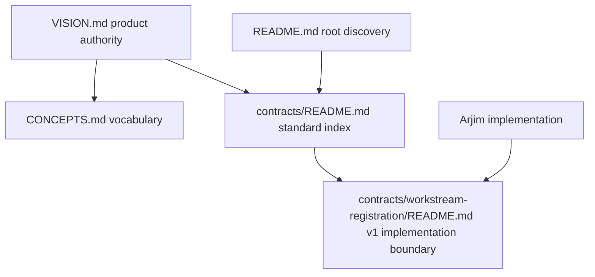

# Workstream Protocol Framing - Plan

## Goal Capsule

**Objective:** Establish that workstream is a **standard, not a product** under the name **Workstream Protocol**, with `contracts/` as its assistant-neutral home and Arjim as one conforming implementation.

**Product authority:** `VISION.md`; this plan resolves the framing for one capability of the broader Arjim product. The planned domains (projects, people, recurring responsibilities, operational processes) remain future headroom only.

**Trust boundary:** Documentation must preserve VISION's Conditions of trust, especially durable workspace authority, explicit uncertainty, assistant-neutral coordination, and no claim that a conversation or assistant cache is authoritative.

**Execution profile:** Documentation-only. The planned change may edit `VISION.md`, `CONCEPTS.md`, `contracts/README.md`, and `README.md`; it does not split the repository, rename or move `contracts/workstream-registration/`, change code, or alter the existing v1 contract surfaces.

**Stop condition:** The framing is complete only when all four planned documentation surfaces agree, the new standard index points to the existing v1 contract boundary, root readers can discover it, all links resolve, and no implementation scope has been introduced.

## Product Contract

### Summary

Arjim stops being the umbrella that owns workstreams. **Workstream Protocol** names the assistant-neutral standard that lives in `contracts/` (marker schema, registration protocol, result vocabulary, conformance corpus), and Arjim becomes one conforming implementation of it — so registered workstreams become one of the things Arjim, and any conforming assistant, can operate. This plan changes documentation framing only; no repo or code changes.

### Problem Frame

Arjim's vision and its first implemented capability are currently entangled. `contracts/` — the marker schema, registration protocol, result vocabulary, and conformance corpus — is where the assistant-neutral definition of a workstream already lives, but it carries an identity named after one implementation (`workstream-registration`). VISION.md and README.md frame Arjim as the umbrella product, with workstream registration as its first capability. That conflation makes the cross-assistant ground of VISION Outcome 6 (other people's assistants working the same workstreams) read as Arjim-internal detail rather than a shared standard anyone can implement.

The fix is a framing decision, not a structural one: separate the standard from the implementation in how the project describes itself, so the durable, assistant-neutral contract has its own identity and Arjim is positioned as a conforming consumer of it.

### Key Decisions

- **Workstream is a standard, not a product** — `contracts/` (marker schema, registration protocol, result vocabulary, conformance corpus) is the assistant-neutral standard. `(session-settled: user-directed — chosen over "spin off a standalone workstream product": the standard framing dissolves the product-boundary question entirely and matches Outcome 6.)`
- **Name the standard "Workstream Protocol"** — assistant-neutral, workstream-specific, signals a conformance surface other assistants implement against. `(session-settled: user-directed — chosen over "Workstream Standard": Protocol names the recognition/exchange mechanism the standard exists to serve and is more distinctive; Standard was the broader-coverage alternative.)`
- **Ownership is by conformance, not by layer** — there is no "standalone product owns machinery / Arjim owns assistant layer" split. The standard is assistant-neutral; Arjim is a conforming implementation. This supersedes the earlier layered-product framing.
- **Decouple the standard's identity from the implementation name** — `contracts/` is repositioned as the home of the Workstream Protocol, distinct from the `workstream-registration` implementation. Governs R2.
- **Keep the machinery workstream-specific for now** — the generic "managed thing" layer is deferred until a real second domain appears. Projects, people, recurring responsibilities, and processes stay as conceptual headroom only. Governs R3.

**Product Contract preservation:** Product Contract unchanged. The operator's doc-surface decision resolves the planning detail under R4 without changing the settled framing or requirements.

### Requirements

**Framing capture**

- R1. VISION.md states that workstream is a standard — the Workstream Protocol — implemented by Arjim and any conforming assistant, replacing the "Arjim is the umbrella that owns workstreams" framing where it conflicts. The "Conditions of trust", "How to use this vision", and outcome sections remain intact and consistent with this framing.
- R2. CONCEPTS.md records the Workstream Protocol as the assistant-neutral standard and clarifies that `contracts/` is its home, distinct from the Arjim implementation that conforms to it.
- R3. The planned domains (projects, people, recurring responsibilities, operational processes) are recorded as future headroom, not active scope — the standard stays workstream-specific until a real second domain appears.

**Positioning**

- R4. `contracts/` is described as the home of the Workstream Protocol standard — an assistant-neutral surface any conforming assistant can implement against — rather than Arjim-internal detail.
- R5. No repo split, rename, directory move, or code change results from this framing. The deliverable is documentation only.

### Scope Boundaries

**Deferred for later**

- Genericizing the standard into a "managed thing" protocol family with workstream as the first kind — only once a real second domain appears.
- Demonstrating conformance with a second assistant; the conformance corpus already exists but no cross-assistant demonstration is built here.
- Mapping the planned domains (projects, people, recurring responsibilities, operational processes) to the standard pattern.

**Outside this plan's identity**

- Any structural split, repository reorganization, or code refactor. This plan changes how the project describes itself, not how it is built.
- Renaming the `workstream-registration` implementation or its CLI surface; only the standard's identity is decoupled.

### Planning Resolution

The doc-surface question is settled by operator decision: create `contracts/README.md` as the standard's home and index, pointing into `contracts/workstream-registration/`, and add a root-level `README.md` pointer so repository readers discover the standard. `contracts/workstream-registration/README.md` remains the v1 implementation-boundary document and must remain consistent with the parent framing.

There are no blocking planning questions. Genericization, cross-assistant demonstration, planned-domain mapping, repository restructuring, and implementation changes remain outside this plan.

### Sources / Research

- `contracts/workstream-registration/v1/workstream.schema.json` — marker schema; fields are generic but the schema identity, title, and vocabulary are workstream-named.
- `docs/plans/2026-08-01-001-feat-workstream-registration-discovery-plan.md` — the implemented registration capability this framing repositions.
- `CONCEPTS.md` — already calls the marker "assistant-neutral" and defines "workstream" broadly; the seam this framing formalizes.
- `VISION.md` — Outcome 6 (cross-assistant coordination) is the ground the standard framing serves.

---

## Planning Contract

### Key Technical Decisions

- KTD1. **Use a parent contracts index as the standard surface.** Create `contracts/README.md` to own the Workstream Protocol identity and link to the versioned v1 implementation boundary; do not rename or move `contracts/workstream-registration/`. This instantiates R2 and R4.
- KTD2. **Keep the child README implementation-specific.** `contracts/workstream-registration/README.md` remains the concrete v1 contract and implementation-boundary document. The parent index may frame it as one versioned contract set, but neither document may claim that Arjim owns the standard. This instantiates R4 and R5.
- KTD3. **Use the root README as discovery, not a second standard specification.** Add a concise pointer to `contracts/README.md` and describe Arjim's registration capability as a conforming implementation. Preserve the existing tested-profile status and implementation details. This instantiates R1, R4, and R5.
- KTD4. **Make no structural or executable change.** The plan changes documentation identity and navigation only; it does not change contract files under `contracts/workstream-registration/v1/`, source code, tests, directory names, or repository layout. This instantiates R3 and R5.

### High-Level Technical Design

The documentation authority and discovery relationship is:

`contracts/README.md` is the only new standard-facing surface. The child README continues to explain the concrete v1 contract set. The root README points readers to the parent index while retaining the implementation description.

### Sequencing

1. **U1 - Canonical vision framing:** establish the exact Workstream Protocol and conformance language in `VISION.md` while preserving trust rules and success tests.
2. **U2 - Shared vocabulary alignment:** align the Workstream Protocol glossary entry in `CONCEPTS.md` with the canonical framing and future-headroom boundary.
3. **U3 - Standard home and boundary index:** create `contracts/README.md`, link it to the existing v1 contract directory, and verify coexistence with the child implementation-boundary README.
4. **U4 - Root discovery pointer:** update `README.md` to point readers to the standard index and describe Arjim as a conforming implementation without duplicating the standard.

The dependency graph is `U1 -> U2 -> U3 -> U4`. Each later surface consumes terminology established by the preceding surface; no unit changes executable artifacts.

### Risks & Dependencies

- **Framing drift:** Existing wording may accidentally restore Arjim ownership or call the standard a product. Mitigation: U1 owns the canonical wording and every later unit cites it.
- **Boundary confusion:** A parent index could be mistaken for a replacement of the v1 contract README. Mitigation: U3 explicitly labels the child as the implementation boundary and verifies both documents agree.
- **Overclaiming future scope:** The broad workstream definition could be read as active protocol support for projects, people, recurring responsibilities, or processes. Mitigation: retain R3 and repeat the future-headroom boundary only where needed for clarity.
- **Stale navigation:** A pointer could target the child directory and bypass the standard identity. Mitigation: U4 points to `contracts/README.md`; U3 verifies all relative links resolve.

### System-Wide Impact

The change affects repository readers, implementers of the v1 contracts, future conforming assistants, and anyone using `VISION.md` as product authority. It changes naming and navigation only. It does not alter marker schemas, registration behavior, result vocabulary, conformance fixtures, or the authority of workspace records.

---

## Implementation Units

### Unit Index

| U-ID | One-line title | Files touched | Depends on |
|---|---|---|---|
| U1 | Canonicalize vision framing | `VISION.md` | - |
| U2 | Align Workstream Protocol vocabulary | `CONCEPTS.md` | U1 |
| U3 | Create the contracts standard index | `contracts/README.md` (create), `contracts/workstream-registration/README.md` (review only) | U1, U2 |
| U4 | Add root-level standard discovery | `README.md` | U3 |

### U1. Canonicalize the VISION framing

**Execution position:** First.

- **Goal:** Make `VISION.md` clearly describe Workstream Protocol as the assistant-neutral standard and Arjim as one conforming implementation.
- **Requirements:** R1, R3, R4, R5; Outcome 6; Conditions of trust; Initial success tests; "How to use this vision".
- **Dependencies:** None.
- **Files:** Modify `VISION.md`.
- **Approach:**
  1. Replace only wording that frames Arjim as the owner of workstreams or `contracts/` as Arjim-internal detail.
  2. Preserve the broad definition of workstream, all outcomes, Conditions of trust, Initial success tests, and the three questions in "How to use this vision".
  3. State that the Workstream Protocol is workstream-specific for now and that Arjim conforms to it rather than owning it.
- **Patterns to follow:** Existing terminology in `CONCEPTS.md`; cross-assistant intent in `VISION.md` Outcome 6.
- **Test scenarios:**
  - The document names Workstream Protocol as a standard and identifies Arjim as a conforming implementation.
  - Outcome 6 still permits assistants to communicate and coordinate while the workspace remains durable authority.
  - Conditions of trust and Initial success tests remain present and do not acquire claims that documentation changes implement behavior.
  - Projects, people, recurring responsibilities, and operational processes remain future headroom rather than active protocol scope.
- **Verification:** `VISION.md` contains the canonical framing, all named trust and success sections remain intact, and no code, repository-structure, or implementation claim was added.

### U2. Align the Workstream Protocol glossary entry

**Execution position:** Second, after U1.

- **Goal:** Make `CONCEPTS.md` the concise vocabulary authority for the same standard-versus-implementation distinction.
- **Requirements:** R2, R3, R4, R5.
- **Dependencies:** U1.
- **Files:** Modify `CONCEPTS.md`.
- **Approach:**
  1. Retain the existing Workstream definition and Workstream Protocol entry as the basis for the change.
  2. Ensure the entry names `contracts/` as the standard's home, identifies the marker schema, registration protocol, result vocabulary, and conformance corpus, and says Arjim is one conforming implementation.
  3. Keep future domains as headroom and avoid turning the glossary into a protocol specification or implementation inventory.
- **Patterns to follow:** Existing glossary entry shape and the distinction between marker, workspace, and record source.
- **Test scenarios:**
  - The Workstream Protocol entry agrees with the language approved in U1 and does not reintroduce product ownership.
  - The entry distinguishes the parent standard home from `contracts/workstream-registration/` as a concrete v1 contract set.
  - Existing marker, workspace, record source, and registration definitions remain semantically unchanged.
- **Verification:** `CONCEPTS.md` uses the canonical names without contradictory synonyms, preserves the glossary boundary, and keeps future domains explicitly non-active.

### U3. Create the contracts standard index

**Execution position:** Third, after U1 and U2.

- **Goal:** Establish `contracts/README.md` as the discoverable home and index for the Workstream Protocol without replacing the existing v1 implementation-boundary document.
- **Requirements:** R2, R4, R5.
- **Dependencies:** U1, U2.
- **Files:** Create `contracts/README.md`; review `contracts/workstream-registration/README.md` for consistency without changing its implementation-boundary role.
- **Approach:**
  1. Introduce the Workstream Protocol as the assistant-neutral standard represented by the contract surfaces under `contracts/`.
  2. Point readers to `contracts/workstream-registration/README.md` as the current v1 contract and implementation boundary.
  3. Clarify that Arjim is a conforming implementation and that the parent index does not claim executable behavior, a repository split, or a generalized protocol family.
  4. Keep the child README as the detailed v1 implementation-boundary document; do not rename, move, or duplicate its contract inventory.
- **Patterns to follow:** The child README's plain-language contract boundary, active/deferred distinction, and repo-relative links.
- **Test scenarios:**
  - A reader starting at `contracts/README.md` can identify the Workstream Protocol, its assistant-neutral purpose, and its current v1 contract directory.
  - Every link in the new index resolves to an existing repository path, including `contracts/workstream-registration/README.md` and the relevant v1 entry point.
  - The parent index and child README agree that the child documents the concrete v1 implementation boundary and do not disagree about ownership.
  - The index does not claim that projects, people, recurring responsibilities, or operational processes are implemented protocol kinds.
- **Verification:** `contracts/README.md` exists, acts as the standard index, links into the v1 contract directory, and coexists with the unchanged child implementation-boundary document without contradiction.

### U4. Add root-level standard discovery

**Execution position:** Fourth, after U3.

- **Goal:** Let repository-root readers discover the Workstream Protocol before reading the Arjim-specific registration implementation details.
- **Requirements:** R1, R4, R5.
- **Dependencies:** U3.
- **Files:** Modify `README.md`.
- **Approach:**
  1. Add a concise pointer from the root README to `contracts/README.md`.
  2. Describe workstream registration as Arjim's conforming implementation of the standard rather than as the owner of the standard.
  3. Preserve the current implemented status, tested-profile details, command descriptions, conformance statement, and deferred machine-scan boundary.
  4. Avoid duplicating the full standard definition in the root README.
- **Patterns to follow:** Existing root README navigation and the implementation details already linked to `contracts/workstream-registration/`.
- **Test scenarios:**
  - A reader following the new root pointer reaches `contracts/README.md` without a broken relative link.
  - The root README identifies Arjim's registration capability as a conforming implementation and retains its truthful implementation status.
  - Existing implementation and conformance links remain valid and the root README does not claim broader domain support.
- **Verification:** Root readers can discover the standard in one link, the root README remains internally consistent with `VISION.md` and `CONCEPTS.md`, and no code or contract surface changed.

---

## Verification Contract

This is a documentation-only plan. Verification is review-based and link-based; the registration plan's executable gates do not apply because no source code, schemas, fixtures, or v1 contract files are changed.

| Gate | Applies to | Required outcome |
|---|---|---|
| Authority and requirement traceability | U1-U4 | Every active requirement R1-R5 is represented by at least one unit, and the settled standard/conformance decisions remain intact. |
| Vision preservation | U1 | Outcome 6, Conditions of trust, Initial success tests, and "How to use this vision" remain present and consistent with the new framing. |
| Terminology consistency | U1-U4 | Workstream Protocol, workstream, workspace, marker, record source, and conforming implementation are used consistently with `CONCEPTS.md`. |
| Standard boundary | U3-U4 | `contracts/README.md` is the standard index; `contracts/workstream-registration/README.md` remains the v1 implementation boundary; neither claims Arjim owns the standard. |
| Link integrity | U3-U4 | All new or changed relative links resolve, including the parent-to-child contract link and root-to-parent pointer. |
| Scope boundary | U1-U4 | No repository split, rename, directory move, code change, contract-surface change, generalized protocol family, or planned-domain implementation appears in the result. |
| Root discoverability | U4 | A reader starting at `README.md` can reach the Workstream Protocol standard in one step. |
| Documentation-only review | U1-U4 | Only `VISION.md`, `CONCEPTS.md`, `contracts/README.md`, and `README.md` are planned for content changes; no temporary or abandoned documentation artifacts remain. |

## Definition of Done

- `artifact_readiness` is `implementation-ready`, with the full ce-plan structure present and no blocking question remaining.
- The Workstream Protocol remains a standard, not a product, and Arjim is described as one conforming implementation.
- `VISION.md` captures the framing without weakening Outcome 6, Conditions of trust, Initial success tests, or "How to use this vision".
- `CONCEPTS.md` records the same framing and preserves the existing domain vocabulary.
- `contracts/README.md` exists as the standard's home and points to `contracts/workstream-registration/README.md` as the current v1 implementation boundary.
- `README.md` points root readers to `contracts/README.md` and retains truthful Arjim implementation and conformance details.
- The child `contracts/workstream-registration/README.md` remains an implementation-boundary document and does not contradict the parent standard framing.
- Future domains remain headroom only; no generalized managed-thing protocol is introduced.
- No repo split, rename, directory move, source-code change, test change, schema change, fixture change, or contract behavior change is included.
- All changed-document links resolve and the four documentation surfaces use consistent ownership and terminology.
- The plan contains no unresolved doc-surface question, implementation dispatch, or execution-time code scope.
