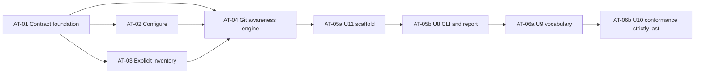

# Trustworthy Awareness Tier - Vertical-Slice Decomposition

> **Not authorized for execution (2026-08-16).** This decomposition inherits the
> source plan's status: `implementation-ready` describes sequencing completeness,
> not authorization. Do not begin AT-01. See the banner in
> `docs/plans/2026-08-09-001-feat-awareness-tier-plan.md` for the reasoning and
> for what survives regardless of pilot outcome.

## Purpose and Authority

This artifact decomposes `docs/plans/2026-08-09-001-feat-awareness-tier-plan.md` into independently reviewable implementation slices. The source plan remains authoritative for the Product Contract, Planning Contract, KTD1-KTD20, R0-R20 (including suffixed requirements), F1-F2, AE1-AE16, verification contract, stop conditions, and Definition of Done. If this decomposition and the source plan differ, stop and follow the source plan only after the difference receives a fresh readiness review and a dated operator decision.

The decomposition changes sequencing granularity only. It does not change product behavior, vocabulary, schemas, outcomes, exit codes, dependencies, files, or scope.

## Scope Boundary

The slices deliver the source plan's v1 on-demand awareness foundation: configure workspace-owned conventions, maintain an explicit inventory, check supported git sources read-only, derive honest portfolio/needs-me/changed answers, scaffold only missing declarations with confirmation, publish CLI and references-only reports, and prove conformance. The deferred and excluded work in the source plan remains deferred or excluded.

Vision grounding after the authorized redaction:

| Vision question | Decomposition answer |
|---|---|
| Which outcome becomes real? | Outcome 1 and the on-demand half of Outcome 2 become usable; the reference-not-copy and wipe-safe boundaries support Outcome 3. Proactive delivery, lifecycle state, and the dedicated current-status view remain deferred. |
| What could make this less trustworthy? | Claiming completeness outside explicit inventory, reporting unknown as nothing, advancing baselines after failure, copying workspace values into durable state or reports, mutating source data or the real git index, unsafe confirmed writes, or changing protected registration behavior. |
| How will reduced work be known? | V1 must answer portfolio, needs-me, and changed questions from one Arjim surface with explicit freshness and coverage. Visit-count measurement and the 75% pilot target remain outside v1 and require the separate pilot plan named by the source. |

## Grounding and Assumptions

- `AGENTS.md` governs this decomposition; `CONCEPTS.md` supplies canonical vocabulary.
- `VISION.md` is present in this checkout and was used only after its sensitive frontmatter value was replaced with `[REDACTED]` under operator authorization. The initial prompt's statement that it was absent no longer describes the checkout used for this artifact.
- `STRATEGY.md` is absent. No strategy content, active track, or strategic requirement is inferred.
- The checked-out source plan is the authoritative input. No source-plan text is normalized or rewritten.
- No direct contract contradiction was found during decomposition review. Traceability ownership that spans source units is retained as cross-slice ownership rather than silently reassigned.
- Implementation execution follows the repo's role-based dispatch guidance. Each slice receives a fresh, adversarial verifier in a separate context and preferably a different model family; a slice advances only after its commands exit 0 and the verifier confirms the evidence.

## Slice Decisions

| Slice | Source units | Decision | Independently verifiable vertical outcome |
|---|---|---|---|
| AT-01 | U1 | Keep as a foundation slice. | Produces an executable, versioned contract corpus that freezes all later implementation boundaries. It is the smallest safe boundary because U2-U7 consume these schemas, registry data, enums, and expectations. |
| AT-02 | U2 + U3 | Regroup. U2 alone is a horizontal filesystem lifecycle; U3 completes F1. | A registered workspace can complete or safely stop the confirmed configure flow, including create, conditional update, read-back, outcomes, and exits. |
| AT-03 | U4 | Keep. | The operator-curated explicit inventory can be added to, removed from, and listed with owner-only persistence and an executable JSON contract. Top-level full-surface wiring remains AT-05. |
| AT-04 | U5 + U6 + U7 | Regroup. U5 and U6 are horizontal adapter/store layers; U7 closes the domain loop. | Given inventory or one-shot paths, the engine produces one immutable, honest git-backed awareness observation, derives KTD9 states, and atomically finalizes eligible state and baselines. |
| AT-05 | U11 then U8 | Regroup while preserving source order. | Missing declarations can be safely scaffolded, then every configured awareness capability is exposed through the on-demand CLI and references-only report surface. U11 must pass before U8 begins. |
| AT-06 | U9 then U10 | Regroup as the final integration slice. | Canonical vocabulary lands, then executable conformance proves the complete tier and registration regression. U10 is the strictly-last implementation action. |

No source unit is duplicated. No source unit is split.

## Slice List

| Order | Slice | Subplan | Depends on |
|---:|---|---|---|
| 1 | AT-01 Contract foundation | `01-contract-foundation.md` | None |
| 2 | AT-02 Configure a workstream | `02-configure-workstream.md` | AT-01 |
| 3 | AT-03 Manage explicit inventory | `03-explicit-inventory.md` | AT-01 |
| 4 | AT-04 Produce honest git awareness | `04-git-awareness-engine.md` | AT-01, AT-02, AT-03 |
| 5 | AT-05 Scaffold declarations and publish surfaces | `05-scaffold-and-surfaces.md` | AT-04; U11 portion before U8 portion |
| 6 | AT-06 Vocabulary and final conformance | `06-final-conformance.md` | AT-01 through AT-05; U9 before strictly-last U10 |

## Dependency Graph

## Sequencing Rules

1. Implement AT-01 first; its schemas and frozen vocabulary gate every dependent slice.
2. AT-02 and AT-03 may proceed independently after AT-01, but both must be green before AT-04.
3. AT-04 must pass its adapter, database, rebuild, pipeline, freshness, aggregate, privacy, and atomicity gates before any workspace declaration offer or public awareness surface is wired.
4. In AT-05, complete and verify U11 before extending U8. This preserves the source plan's authoritative U11 placement.
5. In AT-06, add and verify only the U9 Awareness projection entry before U10 begins.
6. U10 is strictly last. Do not implement, extend, or run it as the final acceptance gate while any earlier slice remains incomplete.

## Frozen Cross-Slice Contracts

### Vocabularies and precedence

Per-source execution result is exactly:

`current | stale | failed | inaccessible | unsupported | not-checked | bootstrap`

Aggregate answer state is exactly:

`current | stale | incomplete | nothing-pending | unconfigured | no-needs-me-rules | bootstrap`

KTD9 is the single normative derivation source and is implemented in this exact priority:

| Priority | Condition | Aggregate |
|---:|---|---|
| 1 | No readable, supported conventions file; no per-source results. | `unconfigured` |
| 2 | Configured and any required source is `failed`, `inaccessible`, `unsupported`, or `not-checked`. | `incomplete` |
| 3 | Configured, complete, and any required source is `stale`. | `stale` |
| 4 | Configured, complete, fresh, and any required source is `bootstrap`. | `bootstrap` |
| 5 | Configured, complete, fresh, non-bootstrap, and enabled-rule count is zero. | `no-needs-me-rules` |
| 6 | Configured, complete, fresh, non-bootstrap, at least one enabled rule, and match count is zero. | `nothing-pending` |
| 7 | Configured, complete, fresh, non-bootstrap, at least one enabled rule, and match count is greater than zero. | `current` |

Canonical precedence is exactly `unconfigured > incomplete > stale > bootstrap > no-needs-me-rules > nothing-pending > current`. A disabled source is excluded from checking and aggregation; it never receives a synthetic result.

### Version spaces

The five independent names are exact and never collapse into a generic version key:

| Space | Field |
|---|---|
| Result envelope | `awareness_contract_version` |
| Conventions schema | `schema_version` |
| Recommendation tracking | `recommended_profile_revision` |
| Inventory schema | `inventory_contract_version` |
| Adapter dispatch | `adapter_contract_version` |

### KTD13 outcomes and exits

| Family | Exact outcomes |
|---|---|
| Configure | `configured | configured-existing-changed | cancelled | stopped | conventions-invalid | conventions-written-unverified | write-failed | schema-unsupported | not-registered` |
| Inventory | `inventory-added | inventory-replaced | inventory-removed | inventory-not-found | inventory-listed | already-in-inventory | not-registered` |
| Scaffold | `scaffolded | cancelled | stopped | scaffold-invalid | scaffold-write-failed | scaffold-written-unverified | path-outside-workspace | path-identity-changed | declaration-exists | not-registered` |
| View/state | `answered | answered-with-gaps | rebuilt | store-failed | report-write-failed` |

`answered`, `answered-with-gaps`, `rebuilt`, success outcomes, and idempotent `inventory-not-found` exit 0. `cancelled | stopped` exit 2. Configure/inventory/scaffold validation or authorization outcomes exit 3. `already-in-inventory` exits 4. Partial/write outcomes exit 5. Unexpected exceptions exit 6. The awareness map is separate from registration `OUTCOME_EXIT_CODE`.

### Trust and persistence

- Registration, generic marker parsing, and capability classification keep record-source references opaque. Only a supported awareness checking adapter may resolve one after type dispatch, validation, containment, identity checks, least-access enforcement, and redaction.
- Source access is read-only. Git uses an isolated temporary index and leaves the real index byte-identical.
- One immutable observation feeds every requested view. Adapters return candidate baselines without writing.
- Eligible per-source success state and its candidate baseline commit atomically. Failed or partial checks and failed report publication do not advance baselines.
- First success and reset cases are `bootstrap`; exact deltas use the prior committed tracking-ref endpoint. Raw branch/ref names are not serialized into baseline payloads.
- Freshness uses current conventions, a per-source override before the default, and `now < deadline`; equality is stale. Stored deadlines are diagnostic only.
- Inventory scope is `explicit-inventory`; global registration completeness remains `unknown`.
- Durable reports contain references, check time, freshness, and other allow-listed state, never copied declaration values.
- U11 creates only a missing declaration after confirmation, shared locking, identity revalidation, exclusive create, and exact read-back. It never changes an existing declaration or generates purpose prose.
- V1 is on demand only. No scheduler, timer, daemon, background thread, or OS scheduled-task registration is introduced.

### Protected registration files

The following files remain byte-equal to the source plan's pinned committed-state digests. The digest values remain solely in the authoritative source plan and U1 expectations data; this decomposition does not reproduce them.

- `src/workstream_registration/registration.py`
- `src/workstream_registration/filesystem.py`
- `src/workstream_registration/unregister.py`
- `src/workstream_registration/projection.py`
- `src/workstream_registration/validation.py`
- `src/workstream_registration/raw_guard.py`
- `src/workstream_registration/diagnostics.py`
- `src/workstream_registration/cli.py`

## Source-Unit Traceability

| U-ID | Owning slice | Mapping status |
|---|---|---|
| U1 | AT-01 | Kept intact as executable foundation. |
| U2 | AT-02 | Regrouped with U3 to complete F1. |
| U3 | AT-02 | Regrouped with U2 to complete F1. |
| U4 | AT-03 | Kept intact as explicit-inventory outcome. |
| U5 | AT-04 | Regrouped with U6 and U7 to close the check path. |
| U6 | AT-04 | Regrouped with U5 and U7 to close persistence and rebuild. |
| U7 | AT-04 | Regrouped with U5 and U6 to produce complete domain answers. |
| U8 | AT-05 | Regrouped after U11; implemented second within the slice. |
| U9 | AT-06 | Regrouped before U10; implemented first within the slice. |
| U10 | AT-06 | Strictly-last implementation action and final gate. |
| U11 | AT-05 | Regrouped before U8; implemented first within the slice. |

## Requirement Traceability

Primary ownership identifies where behavior first becomes executable. Supporting slices retain contract, rendering, or final-conformance responsibility.

| Requirement | Primary slice | Supporting/integration slices |
|---|---|---|
| R0 | AT-04 | AT-01, AT-06 |
| R1 | AT-02 | AT-04, AT-05, AT-06 |
| R2 | AT-02 | AT-04, AT-06 |
| R3, R3b | AT-02 | AT-05, AT-06 |
| R4 | AT-04 | AT-02, AT-05, AT-06 |
| R5, R5b | AT-03 | AT-04, AT-05, AT-06 |
| R6, R6b, R6c | AT-04 | AT-01, AT-05, AT-06 |
| R7, R7b | AT-04 | AT-01, AT-05, AT-06 |
| R8 | AT-04 | AT-01, AT-05, AT-06 |
| R9 | AT-04 | AT-01, AT-05, AT-06 |
| R10 | AT-04 | AT-01, AT-05, AT-06 |
| R11 | AT-04 | AT-01, AT-03, AT-05, AT-06 |
| R12 | AT-04 | AT-01, AT-06 |
| R12b | AT-02 | AT-04, AT-05, AT-06 |
| R13 | AT-04 | AT-01, AT-05, AT-06 |
| R14 | AT-01 | AT-02, AT-04, AT-05, AT-06 |
| R14b | AT-05 | AT-01, AT-04, AT-06 |
| R15 | AT-02 | AT-01, AT-04, AT-05, AT-06 |
| R16, R17, R18 | AT-05 | AT-06 |
| R19 | Cross-slice | AT-01, AT-02, AT-03, AT-04, AT-05, AT-06 |
| R20 | Cross-slice | AT-01, AT-02, AT-03, AT-04, AT-05, AT-06 |

## Flow and Acceptance Traceability

| Flow/example | Owning slices | Completion rule |
|---|---|---|
| F1 | AT-02 | Complete when create and conditional-update configure paths pass. |
| F2 | AT-04 + AT-05 | AT-04 owns the check/derivation half; AT-05 owns on-demand CLI/report publication. Full flow closes only after both. |
| AE1 | AT-04, AT-05, AT-06 | Engine, rendering, and final discriminator. |
| AE2 | AT-04, AT-05, AT-06 | Dispatch/aggregate, envelope rendering, final conformance. |
| AE3 | AT-04, AT-05, AT-06 | Rules/precedence, rendering, final discriminators. |
| AE4 | AT-04, AT-06 | Transactional rebuild and next-success bootstrap. |
| AE5 | AT-02, AT-04, AT-05, AT-06 | Re-settle write, gap derivation, rendering, conformance. |
| AE6 | AT-02, AT-06 | Confirmed create/read-back and partial-success behavior. |
| AE7, AE8 | AT-03, AT-04, AT-05, AT-06 | Inventory, domain projection, surface, conformance. |
| AE9 | AT-04, AT-05, AT-06 | Rule result and due-date omission, render, final proof. |
| AE10, AE11 | AT-04, AT-05, AT-06 | Delta/freshness engine, render, final proof. |
| AE12 | AT-02, AT-04, AT-05, AT-06 | Configure outcome, domain gap, view outcome, final split proof. |
| AE13 | AT-05, AT-06 | CLI/report parity and structural on-demand-only assertion. |
| AE14 | Cross-slice, finalized AT-06 | Each origin/sink is exercised by its owner; AT-06 runs the complete matrix without embedding sample values here. |
| AE15 | AT-04, AT-05, AT-06 | Live read-through, references-only report, final sink scan. |
| AE16 | AT-04, AT-05, AT-06 | Missing gap/offer, missing-only write and wiring, final proof. |

## KTD Traceability

| KTD | Owning slice(s) |
|---|---|
| KTD1 | AT-01 contract reference; AT-02 executable conventions lifecycle; AT-05 shared-lock scaffold enforcement |
| KTD2 | AT-01 contract shape; AT-02 version dispatch and durable recommendation tracking |
| KTD3 | AT-01 contract home, artifacts, and envelope fields |
| KTD4 | AT-01 registry declaration; AT-04 git-only implementation; AT-06 conformance |
| KTD5 | AT-01 registry data; AT-04 dispatch and path resolution; AT-06 conformance |
| KTD6 | AT-01 recommended profile; AT-02 recommendation loading; AT-04 freshness implementation; AT-06 conformance |
| KTD7 | AT-01 rules data; AT-04 rule implementation; AT-05 rendering; AT-06 conformance |
| KTD8 | AT-01 closed enum; AT-04 source-state implementation; AT-05 rendering; AT-06 conformance |
| KTD9 | AT-01 normative table; AT-04 derivation implementation; AT-05 rendering; AT-06 conformance |
| KTD10 | AT-02 attribution timestamps; AT-04 clock/freshness and due-date boundary; AT-05 scaffold/report timestamps; AT-06 conformance |
| KTD11 | AT-03 inventory database and contract-version dispatch; AT-06 conformance |
| KTD12 | AT-04 state database, atomic normal checks, and rebuild; AT-06 conformance |
| KTD13 | AT-02 configure family; AT-03 inventory family; AT-04 rebuild/store boundary; AT-05 scaffold/view families and complete CLI map; AT-06 conformance |
| KTD14 | AT-02 initial configure parser; AT-03 inventory handlers; AT-05 complete command surface; AT-06 conformance |
| KTD15 | AT-05 references-only report publication; AT-06 conformance |
| KTD16 | AT-02, AT-04, and AT-05 bounded error families; finalized AT-06 |
| KTD17 | AT-01 protocol contract; AT-04 baseline implementation; AT-05 surface boundary; finalized AT-06 |
| KTD18 | AT-06 U9 vocabulary portion and U10 coherence gate |
| KTD19 | AT-04 git locator/identity enforcement; finalized AT-06 |
| KTD20 | AT-01 exact names; enforced across AT-02 through AT-06 |

## Final Integration and Conformance Gates

After all slice-local gates pass, AT-06 runs these in order and requires exit 0:

1. `python -m pytest tests/python/test_awareness_conformance_runner.py -v`
2. `python -m awareness.conformance_runner`
3. `python -m workstream_registration.conformance_runner`

The final runner evidence must include both seven-value enums, every KTD9 row and discriminator, disabled-source exclusion, immutable observation and atomic baseline behavior, exact tracking-ref deltas, reset/bootstrap cases, freshness override/boundary/window-change cases, KTD13 outcomes, unsupported-version and unconfigured behavior, explicit-inventory scope, exact store columns, references-only reports, attribution, identity revalidation, real-index immutability, all required privacy origin/sink checks, scaffolding authorization and locking, no-background structure, five version spaces and generic-key rejection, corrupt-copy executable-coverage failure, protected-source checks, lifecycle/rebuild behavior, and registration regression.

## Final Definition of Done

The source plan's Definition of Done is not weakened. Completion requires all of the following:

1. U1-U11 are implemented exactly once through AT-01 through AT-06 and every unit/slice gate passes.
2. The corrupt copied-corpus self-test fails as intended, while the clean mandatory awareness corpus passes every executable assertion.
3. The registration conformance runner passes and all eight protected registration files match the source plan's pinned committed-state values.
4. Wiping only awareness state and reports leaves markers, conventions, declarations, and durable inventory intact; the next success is `bootstrap`, prior history is reported unavailable, and no prior state is fabricated.
5. The complete privacy matrix proves prohibited values absent from both databases and every prohibited output/error/report sink; branch-name persistence and declaration-report boundaries follow R19 exactly.
6. `CONCEPTS.md` contains the single new Awareness projection entry, the already-settled Record source and Checking adapter entries remain intact, and protected registration sources remain unchanged.
7. No abandoned implementation attempt, scratch artifact, commented-out adapter experiment, or debug flag remains in the shipped diff.
8. The implementation report records resolved planning questions, per-slice and per-unit test evidence, conformance results, and the disclosed clock, git-binary, baseline, and inventory limits.

## Global Stop and Escalation Conditions

Stop without improvising when any of these occur:

- A frozen Product Contract term, enum, KTD9 precedence row, version-space name, KTD13 outcome/exit, source-plan dependency, or protected-file boundary would need to change. Obtain fresh review and a dated operator decision before contract edits.
- An acceptance example cannot be reached without a new marker field, new product behavior, or a deferred adapter/capability.
- A required write would modify a protected registration file or an existing declaration under U11.
- The git binary is unavailable on the tested host or owner-only storage enforcement fails on a fresh host.
- A privacy fixture reaches a prohibited sink, a failed/partial check advances a baseline, a stale/incomplete check yields `current` or `nothing-pending`, or report failure advances state.
- Registration conformance or a protected-source check fails after awareness work.
- Any implementation step requires a path outside the source plan's files or a dependency not authorized by the source plan.
