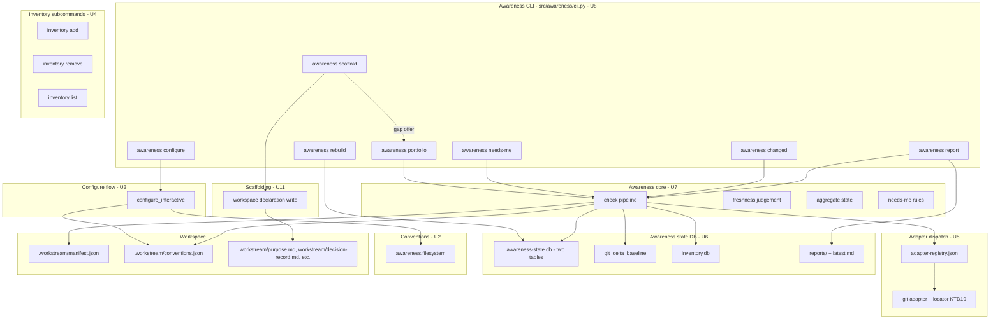
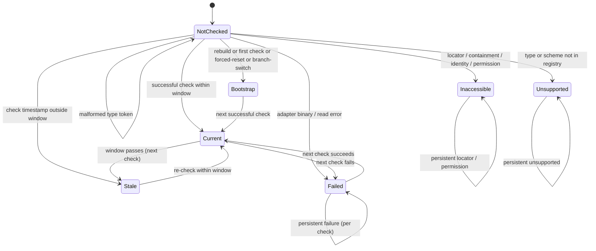
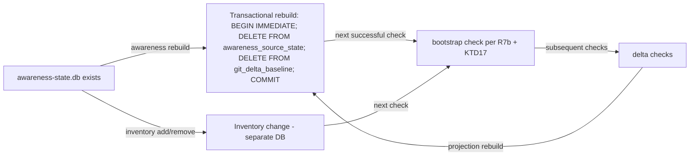
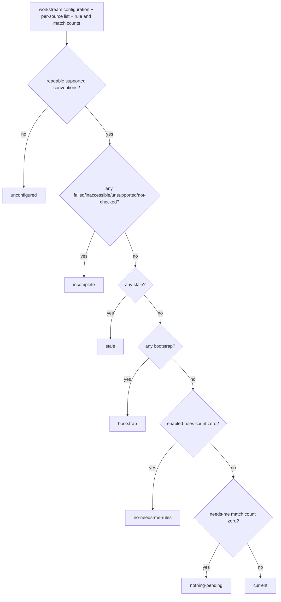

# Trustworthy Awareness Tier - Plan

> **Not authorized for execution (2026-08-16).** `artifact_readiness:
> implementation-ready` describes this artifact's internal completeness, not an
> authorization to build it. The 2026-08-15 direction brief
> (`docs/reviews/2026-08-15-001-arjim-direction-recommendation-brief.md`) is
> later evidence and governs: do not execute U1-U11 as one program. Treat this
> plan as a design reference and contract inventory until the pilot selects the
> first source and the operator approves a revised roadmap (brief R10, Phase 5).
>
> Two reasons, recorded so they are not re-derived: AT-01 freezes the version
> spaces, adapter registry, and git rule set *before* the evidence that is meant
> to inform them; and R18 plus AE13 mean a fully successful U1-U11 still
> terminates in a surface the operator must initiate, which cannot retire a
> recurring round.
>
> What survives regardless of pilot outcome: the two seven-value enums, the KTD9
> derivation table and precedence, the honesty rules (R8, R10, R13), the
> reference-not-copy and persistence allow-lists (R19, R20), the confirmed
> create-only write pattern (R3, R3b), and KTD19's read-only git isolation if git
> wins selection. Candidate follow-on work is tracked in
> `docs/ideation/2026-08-16-firstmate-derived-candidates.md`.
>
> Note also that `VISION.md` now states the operator's interface is Arjim itself
> and that all tooling is Arjim-operated; this plan's operator-invokes-the-CLI
> framing predates that and requires the C2b confirmation-evidence decision
> before AT-02.

## Goal Capsule

- **Objective:** Ship v1 of Arjim's honest on-demand awareness foundation. v1 is an honest on-demand foundation for Outcome 1 ("what needs me") and the on-demand half of Outcome 2 (portfolio and "what changed"), with honest freshness and coverage. v1 is not the fulfilled near-term promise: the proactive half of Outcome 2 ("keeps me posted" without waiting to be asked) lands when scheduled delivery arrives (deferred per R18); the current-status view (VISION.md:63, 69) lands with the lifecycle-state field; and the v1 needs-me coverage is the documented git minimum (merge / rebase / cherry-pick conflict state, behind its configured local tracking ref) — not change-as-needs-me, not commit-trailer issues.
- **Product authority:** VISION.md — near-term promise (VISION.md:30-34), Conditions of trust (VISION.md:129-170), initial success tests (VISION.md:172-210).
- **Execution profile:** Code. Adds `contracts/awareness/v1/`, `src/awareness/`, an awareness-owned CLI, one check-state database plus the separate durable inventory database, references-only report artifacts, conventions lifecycle, missing-only declaration scaffolding, and conformance. Git/source access is read-only under identity and index isolation; the eight protected registration modules are unchanged.
- **Open blockers:** None. All deferred-to-planning items are resolved in the Planning Contract. The CONCEPTS.md:46 amendment and the "Checking adapter" entry are in place (2026-08-09, applied during the requirements-only round); U9 adds only the "Awareness projection" entry.
- **Stop condition:** The awareness tier is complete when U1-U11 pass their unit gates and the final U10 gates: both seven-value closed enums; the canonical aggregate-derivation table and disabled-source exclusion; immutable single-observation / atomic-baseline behavior; exact tracking-ref deltas with branch-free tokens; freshness including exact-boundary, per-source-override, and window-change cases; KTD13 view outcomes; unsupported-version and unconfigured behavior; explicit-inventory scope; references-only reports; identity revalidation; the four-origin URI and author-email canary matrix across both databases and all other sinks; scaffolding authorization, shared locking, and attribution; the structural no-background assertion; version-space naming; the corrupt-copy executable-coverage self-test; protected-source SHA-256 checks; lifecycle and rebuild-after-projection-loss end-to-end runs; and both awareness and registration conformance runners exiting 0 on clean inputs. U9's single Awareness-projection CONCEPTS entry has landed, and the eight protected registration source files remain byte-equal to their pinned committed-state digests.

---

## Product Contract

### Summary

A source-read-only awareness tier: it never writes record sources or the real git index. Its only workspace writes are operator-confirmed conventions and missing-only declaration scaffolds; Arjim-local writes are the inventory, replaceable check state, and references-only reports. Every inventory workstream appears in portfolio, needs-me, and git-only changed views with freshness and coverage; unknown is never reported as nothing.

### Problem Frame

Registration is Arjim's only working capability (README.md:7). It answers one question — "is this a registered workstream?" — but the vision's promise is awareness: the operator should stop doing the rounds across tools, get one view of what needs attention, and know exactly what Arjim could and could not verify. Machine scan, registry consumption, status, progress, and freshness are explicitly deferred (README.md:23; contracts/workstream-registration/README.md:22-25). The awareness tier is the designed-but-unbuilt heart of the near-term promise: without it, registration produces an inventory that answers no questions.

### Key Decisions

- **Local/self-hosted sources first** — coverage now, connectors later. (session-settled: user-directed — chosen over external connectors in v1: checkable sources earn trust before API connectors do.) Governs R9.
- **Workspace-declared awareness semantics** — the workspace defines what "needs me" means and its own freshness windows; Arjim recommends and scaffolds defaults, never owns them. (session-settled: user-directed — chosen over Arjim-internal profiles: the declaration's durable home is the workspace, not Arjim's cache.) Governs R1, R2, R6, R6b, R6c, R11, R14.
- **Required configure step after registration** — conventions are settled by accepting recommended defaults or specifying the workspace's own; a registered-but-unconfigured workstream is a gap item, never silently checked. (session-settled: user-directed — chosen over optional scaffold: settlement is a lifecycle requirement, not polish.) Governs R1, R2, R3, R3b, R4.
- **Scaffold writes are confirmed and create-only** — the same trust pattern as registration; a conventions file is never overwritten. (session-settled: user-directed — chosen over print-only recommend: the confirmed-write path already exists and is trusted via the marker.) Governs R3, R3b, R14, R15.
- **Check state in the replaceable projection** — rebuild may reset awareness history; the answer is then unknown, never nothing, and re-derivation from the workspace is possible but not guaranteed. (session-settled: user-approved — the reset consequence was surfaced and accepted.) Governs R12, R12b, R7b.
- **Explicit path inventory** — awareness reads markers from operator-supplied workspace paths; machine scan stays deferred. (session-settled: user-directed — chosen over machine scan in v1: discovery is a later capability, and honest coverage starts from an explicit list.) Governs R5, R5b.
- **Git-only delta** — "what changed" covers git-backed sources; everything else reports unsupported. (session-settled: user-directed — chosen over file-snapshot delta and over deferring delta: one honest mechanism beats a weak generic one.) Governs R7, R7b.
- **Both CLI and report surfaces, on demand** — interactive answers plus a regenerated report artifact; no scheduler in v1. (session-settled: user-directed — chosen over CLI-only and over cadence: "keeps me posted" is served by the artifact, not a background process.) Governs R16, R17, R18.
- **Awareness-owned state vocabulary** — the six-state boundary (VISION.md:135-142) is expressed through two deterministic, awareness-owned, versioned closed vocabularies: a per-source execution result and a derived aggregate answer state, both defined in a new awareness-tier contract. The registration schema is not modified. (session-settled: user-directed — pressure-test recommendation: the registration vocabulary cannot express the boundary.) Governs R8, R10, R13.
- **Reference, never copy — wipe-safe awareness** — Arjim never stores durable copies of workspace-declared information that could drift; awareness reads by reference from workspace-owned declarations, and wiping Arjim data loses nothing of the workstream's records. Missing referenced information is flagged as a resolvable gap item and may be scaffolded into the workspace for adoption, never fabricated. (session-settled: user-directed — decided in the 2026-08-09 pressure-test review: reference-not-copy over carrying fields in the conventions file.) Governs R12, R12b, R14b, R19, R20.

### Requirements

**Boundary**

- R0. Awareness introduces checking adapters, a capability distinct from registration. Registration, generic marker parsing, and capability classification continue to treat record-source URIs as opaque, untrusted data and never dereference them. An awareness adapter may resolve and read a record source only after dispatching on a supported declared type, validating the type-specific locator, enforcing least access, and never echoing, persisting, or reporting raw URI content, credentials, or token material. Supported types and their check semantics are versioned and listed in the awareness contracts.

**Configure step**

- R1. A registered workstream produces no source-derived check results until its conventions are settled in a required configure step. The portfolio and configuration-gap evaluation still run for an unconfigured workstream; it appears as a resolvable gap item per R4 and is never silently checked.
- R2. The configure step settles conventions by accepting Arjim's recommended defaults or the workspace's own.
- R3. The first configure write is create-only and operator-confirmed, with read-back verification: the operator confirms the exact resulting file content under the registration trust pattern (in-memory digest, exclusive-create, fsync, reopen, re-validate, exact-identity verify); the file is read back and compared before the operation is reported complete. Changing an existing conventions file follows R3b. Any partial success (create ok, read-back failed, or a re-read mismatch) is reported under registration's retries-and-partial-success semantics, never silently treated as complete.
- R3b. Changing an existing conventions file is a confirmed conditional update: the current file is read and its exact content bound into the draft, the operator confirms the exact resulting content, the file is re-read and compared immediately before the write, and any difference stops the operation without writing. R3's create-only rule applies to the first write only. The conventions file carries two distinct version fields: `schema_version` (used for version dispatch, R14) and `recommended_profile_revision` (the most recent Arjim recommendation revision the workspace's conventions were settled against, supporting R15).
- R4. A registered-but-unconfigured workstream appears as a resolvable gap item; it is never silently checked under defaults.

**Awareness views**

- R5. The portfolio view shows every registered workstream from the explicit path inventory, with its label, the local workspace path (from the inventory — not the marker's literal workspace self-reference), and its record sources (Outcome 2).
- R5b. The portfolio is computed from a per-user, versioned, owner-only inventory file that lists the explicit workspace paths the operator has declared. The inventory file is the durable source of truth for the portfolio. One or more repeatable per-call `--path <workspace>` flags may override the inventory for a one-shot check, but they do not silently redefine the durable portfolio. A workspace with a valid marker that is not in the inventory is not shown in the portfolio; the portfolio states that it covers only inventory paths and reports global completeness as unknown, never claimed.
- R6. The "what needs me" view shows items requiring the operator's decision, approval, or help across workstreams, each tagged with workstream, record source, requested action, and due date when one exists (Outcome 1).
- R6b. A source observation becomes a needs-me item only when a versioned adapter rule, enabled by the workstream's conventions, maps it to an operator decision, approval, or help request. Arjim's recommended defaults ship with a documented minimum rule set per supported source type; the v1 git minimum covers unresolved merge / rebase / cherry-pick conflict state and locally observed behind-divergence from a configured local tracking ref (ahead-only divergence is a change signal, not a needs-me item) — new commits, branch movement, and dirty files are change signals only and do not by themselves produce needs-me items. A workstream whose conventions declare no enabled rules produces no needs-me items and is reported as `no-needs-me-rules`, never as `nothing-pending`.
- R6c. A needs-me item's due date, when present, comes only from the checked authoritative record's structured due-date field (or an operator-declared mapping in the conventions for an adapter that exposes one). Conventions may not supply a literal substitute due date, and due dates are never inferred from commit age, branch names, freshness windows, or prose. Absent a due date, the field is omitted; the answer is never fabricated.
- R7. The "what changed" view covers git-backed sources: new commits on the configured tracking ref, the working-tree state (clean / dirty), and the index state, plus the configured local tracking ref's reported divergence. R7b defines the baseline and bootstrap semantics; the registry versions the observable set per KTD5 (the earlier open-ended clause was removed because it was untestable).
- R7b. The "what changed" baseline is per (workstream, record source) and is a versioned opaque adapter token whose git payload captures the raw HEAD OID, SHA-256 digest of the configured branch name, raw `tracking_ref_oid_at_check`, deterministic digest of tracked refs, index state digest, and worktree state digest (KTD17). `tracking_ref_oid_at_check` is the tracking-ref OID observed while creating that candidate token; the next check reads it from the prior token as the delta's left endpoint. The branch name itself is never serialized into the token. An adapter returns an observation plus a candidate token and never persists either. After the immutable check observation is prepared, the pipeline commits the successful per-source result and candidate token atomically; failed or partial checks and failed report publication do not advance the token. The first successful check of a pair establishes a baseline and reports "change history before <baseline> unavailable"; after a projection rebuild, forced push, detached-HEAD transition, branch switch, or unborn-branch checkout invalidates the prior token, the next successful check is `bootstrap`, not a delta.
- R8. Every view answer shows when it was checked, which required record sources were checked, and the per-source execution state of every required source from the awareness-owned closed vocabulary (`current | stale | failed | inaccessible | unsupported | not-checked | bootstrap`, seven values); failed, inaccessible, unsupported, and not-checked sources are named, never silently omitted. The conventions artifact carries `sources: {<source-index>: {enabled: <boolean>}}`; entries with `enabled: true` form the required-source set, while an operator-disabled source is excluded rather than assigned a synthetic execution result. `current` and `stale` cover the prose reading of "checked"; `bootstrap` means the successful check is establishing a change-history baseline, not reporting a delta.

**Checking and trust metadata**

- R9. V1 checks local/self-hosted source types; any other declared type reports `unsupported` and never counts as checked. A declared type with no supporting adapter reports `unsupported`; an unrecognized or malformed type token reports `not-checked` with a structured code. The names `unsupported` and `not-checked` are reused unchanged from `registration-result.schema.json:784-791`; awareness emits them in its own envelope without depending on the registration schema.
- R10. "Nothing pending" is reported only when the aggregate answer state is `nothing-pending`, derived only when every required source is `current` within its window AND the conventions' enabled rules produce zero matching items. A workstream whose conventions declare no enabled rules reports `no-needs-me-rules`, never `nothing-pending`. A stale or incomplete aggregate is reported by name (`stale` / `incomplete`), never as "nothing pending" (VISION.md:51). Freshness is judged per record source: a source is `current` when it was checked within its declared freshness window (VISION.md:146).
- R11. Freshness windows are declared per record source in the workstream's conventions; a workstream may also declare a single default that applies to every record source without its own declaration. Arjim recommends defaults the workspace may override. A source is current when it was checked within its declared window; timestamps are ISO-8601 UTC, and clock-source and timezone behavior are defined at planning.
- R12. Check state (per-source execution results, last-check timestamps, last-error codes, and versioned per-(workstream, source) baseline tokens) lives in awareness-owned tables in a single replaceable SQLite database, `awareness-state.db` (one database, two tables, one transaction); the exact shape is defined at planning. Nothing in the awareness state database survives a rebuild; the next successful check is a bootstrap check per R7b. The conventions artifact (R3, R3b, R12b, R14b) is workspace-owned and survives a rebuild. The marker (`.workstream/manifest.json`) is the durable registration record owned by the workspace and is independent of awareness state.
- R12b. Operator gap dispositions (deferred, accepted) and the accepted Arjim recommendation revision are recorded in the conventions artifact, not in the projection; they are durable and survive a projection rebuild.
- R13. Awareness answers honor the six-state boundary rule of VISION.md:135-142 — current, stale, nothing after a complete check, required source inaccessible, required source unsupported, check not performed — with unknown never reported as nothing (VISION.md:144). The plan instantiates these through two closed, awareness-owned, versioned seven-value vocabularies defined in a new awareness-tier contract; the registration schema is not modified.

**Conventions artifact**

- R14. The conventions file is schema'd and versioned; readers dispatch on `schema_version`, and an unsupported `schema_version` is not interpreted, mirroring the marker rule. The result envelope uses `awareness_contract_version`; conventions use `schema_version`; recommended defaults use `recommended_profile_revision`; inventory uses `inventory_contract_version`; adapters use `adapter_contract_version`. These five version spaces are independent, and generic version keys are rejected.
- R14b. The conventions artifact declares, by reference, where the workspace itself declares the workstream's purpose and its designated decision record source; awareness reads bounded values from those references for a live CLI render and never stores value copies in markers, the projection, or durable reports. Reports carry the references plus check time and freshness only. Where a referenced declaration is missing, the workstream surfaces a resolvable gap item and the operator may invoke U11 only to create that missing declaration. A scaffolded purpose is operator-supplied or the empty documented placeholder; Arjim never generates purpose prose and never changes an existing declaration.
- R15. Arjim ships versioned recommended default conventions; when its recommendation advances, workspaces still on the older version surface a gap item the operator can resolve (R3b re-read/compare/two-phase confirm), defer, or knowingly accept. The conventions artifact records `recommended_profile_revision` and the operator disposition; both fields are durable and survive a projection rebuild.

**Surfaces**

- R16. Awareness answers are available as CLI commands on demand.
- R17. Awareness answers are also available as a generated report artifact the operator can regenerate on demand.
- R18. Awareness runs on demand only; there is no scheduled or proactive delivery in v1.
- R19. Awareness persists and renders only allow-listed fields. The awareness state database may store only: workstream identity; record-source index and type token; check status and stable code; check timestamps and a non-normative freshness deadline; and a versioned opaque baseline consisting of adapter type, `adapter_contract_version`, an adapter-serialized BLOB capped at 64 KiB, and establishment time. Raw HEAD OIDs and raw `tracking_ref_oid_at_check` values inside that opaque payload are intentional persistence carve-outs; configured branch/ref names are represented only by a SHA-256 digest and their raw values are never serialized into the payload. The state database stores neither conventions digests nor declaration references. The inventory database may store only `inventory_contract_version` schema metadata plus target handle, local workspace path capped at 1,024 UTF-8 bytes, registered flag, ordinal, and `last_modified` timestamp. Workspace conventions and scaffolded declarations may persist only bounded attribution metadata: `actor` (`operator-confirmed | assistant-drafted`), ISO-8601 UTC `recorded_at`, and a `sha256:<64-lowercase-hex>` confirmation reference. Neither database stores raw URI content, credentials, tokens, file contents, raw branch/ref names, commit messages or subjects, commit author name/email, filenames, or source free text. The CLI and report may render label; local workspace path capped at 1,024 UTF-8 bytes; record-source type/index; status; timestamps; commit OIDs; and branch/ref names capped at 128 UTF-8 bytes. A branch/ref canary must be absent from both database files; because branch/ref names are an explicit operator-facing render field, the capped value may appear in CLI/report output. Only the live CLI may render bounded purpose and designated-decision-source values by read-through; reports render their reference, check time, and freshness, never the values. Commit-subject collection and rendering are deferred from v1. Anything outside these allow-lists is neither persisted nor rendered.
- R20. Arjim never stores durable value copies of workspace-declared information that could drift (purpose, decision record source, or similar); awareness reads such information by reference. The awareness state database and generated reports are disposable Arjim-local check data; reports carry references and freshness metadata only. Markers, conventions, and adopted/scaffolded workspace declarations are workspace-owned durable artifacts and are not disposable awareness data. Recreating a missing marker requires `register`; recreating conventions requires `configure`; U11 may create only a missing declaration and never restores or rewrites an existing one. The inventory is Arjim-owned, operator-curated durable input that is not reconstructible in v1 without machine scan; losing it loses no workstream record but requires path re-declaration.

### How This Work Fits Together

<!-- ce-section: work-relationships -->

This plan owns the **awareness tier** (Outcomes 1+2) — the current active area from the vision's ordering. The broader breakdown is the current understanding, not a committed roadmap:

- Action tier (Outcome 4 — workstream admin, official filing, safe shared writes)
 - Depends on: awareness trust earned here; not active scope
- Machine scan of workspaces (registry consumption)
 - Depends on: the explicit-path inventory shape decided here (R5)
 - Enables: discovery without manual per-path entry
- External record-source connectors (Planner, SharePoint, email)
 - Depends on: the `unsupported` capability reporting defined here (R9)
- Proactive delivery (cadence, notifications)
 - Depends on: on-demand awareness working and the report artifact shape
- Cross-device (Outcome 5) and assistant coordination (Outcome 6)
 - Sequencing: per VISION.md:43-44 these outcomes are sequenced after the awareness tier; their internals do not block awareness work, and awareness work does not block them.

### Key Flows

- F1. Configure a workstream
 - **Trigger:** A workstream is registered and unconfigured.
 - **Steps:** Operator invokes configure; Arjim presents its recommended default conventions; operator accepts the defaults or provides the workspace's own; operator confirms the exact conventions; Arjim writes the conventions file create-only and verifies by read-back.
 - **Outcome:** The workstream is configured, or the operator defers and it remains a gap item per R4.
 - **Covers R1-R4, R3b, R12b, R14-R15.**

- F2. Run an awareness check
 - **Trigger:** Operator invokes an awareness command or report generation on demand.
 - **Steps:** Arjim loads the explicit path inventory; reads each marker and conventions; produces one immutable observation whose required sources use the KTD8 vocabulary; derives each workstream through the KTD9 table; then renders portfolio, needs-me, changed, and optional references-only report views from that same observation.
 - **Outcome:** Honest answers — "nothing pending" only when every required source was checked within its window; otherwise the boundary is shown per R13.
 - **Covers R5-R15, R16-R18, R19, R20; acceptance coverage is enumerated by AE1-AE16.**

### Acceptance Examples

- AE1. **Covers R1, R4, R6b.** Given a registered workstream with no readable conventions file, when the operator opens the portfolio or "what needs me", then the workstream aggregate is `unconfigured`, no per-source results are produced, and a gap item says needs-me rules cannot be evaluated until configuration; it is not presented as the configured `no-needs-me-rules` case or as nothing pending.
- AE2. **Covers R9, R10, R13.** Given a marker declaring a Planner URI, when an awareness check runs, then the source reports `unsupported` in the awareness per-source execution vocabulary (a name reused from the registration capability vocabulary, not a dependency on it), the coverage note shows it, and the aggregate is `incomplete`; "nothing pending" is not claimed.
- AE3. **Covers R10, R13, R6b.** Given a configured workstream whose enabled rules produce zero matches and whose required sources are all `current`, "what needs me" reports `nothing-pending` with check time and source list. Given a configured workstream with zero enabled rules, it reports `no-needs-me-rules`, never `nothing-pending`.
- AE4. **Covers R7b, R12, R12b.** Given a rebuild of the projection, when the operator asks what changed, then the next successful check is a bootstrap check reporting "change history before <baseline> unavailable"; prior check state is unknown (not empty); durable dispositions in the conventions file remain.
- AE5. **Covers R3b, R14, R15, R12b.** Given a workspace on conventions `schema_version` 1 with `recommended_profile_revision` 1 and Arjim's recommendation at revision 2, when the operator opens the portfolio, then a gap item surfaces the version difference; the operator may resolve it (R3b re-read/compare/two-phase confirm), defer it (R12b disposition in the conventions file), or knowingly accept it (R12b accepted disposition in the conventions file).
- AE6. **Covers R2, R3.** Given a configure invocation that settles conventions, when the write is attempted, then the file is created exclusive-create, the operator confirms the exact resulting content, and the file is read back and compared before the operation is reported complete; any partial success (create ok, read-back failed, or comparison mismatch) is reported with registration's partial-success semantics, never silently treated as complete.
- AE7. **Covers R5.** Given a workstream in the explicit path inventory, when the operator opens the portfolio, then the workstream appears with its label, the local workspace path from the inventory (not the marker's literal workspace self-reference), and its record sources.
- AE8. **Covers R5b.** Given a workspace with a valid marker that is not in the inventory, when the operator opens the portfolio, then it does not appear and the portfolio states that it covers only inventory paths and cannot confirm the inventory is complete — completeness is reported as unknown, never claimed.
- AE9. **Covers R6, R6b, R6c.** Given a v1 git observation matching an enabled rule, "what needs me" emits one item tagged with workstream, record source, and requested action and omits `due_date`, because the git adapter exposes no structured due-date field. Given zero enabled rules, it reports `no-needs-me-rules`. The positive due-date case is deferred to the first adapter that exposes an authoritative structured due-date field; that adapter must add a fixture proving the exact source value is used and no substitute is fabricated.
- AE10. **Covers R7, R7b, R11.** Given a workstream whose git record source has an established baseline and a new commit appears, "what changed" reports the commit. Given the first successful check of that record source, the answer is "change history before <baseline> unavailable", never "nothing changed". Given a check that fails before establishing a baseline, no baseline advances; a subsequent successful check establishes a new baseline.
- AE11. **Covers R8, R10, R11, R13.** Given a default freshness window and a shorter per-source override, the override governs that source. With deadline `last_success_at + window_seconds`, `now < deadline` is `current` and `now >= deadline` is `stale`; at the exact deadline the source and aggregate are `stale`, never checked or nothing pending.
- AE12. **Covers R14.** Given conventions with unsupported `schema_version`, the configure half returns `schema-unsupported` with stable code `UNSUPPORTED_CONVENTIONS_SCHEMA` and exit 3. The rendering half returns the view outcome `answered-with-gaps` with exit 0, workstream aggregate `unconfigured`, the same stable gap code, and no per-source status; neither `current` nor `nothing-pending` is claimed.
- AE13. **Covers R16, R17, R18.** A structural source-scan assertion proves that `src/awareness/` contains no scheduler, timer, daemon, background thread, or OS scheduled-task registration. Given a CLI invocation, the answer is available. Given a report-artifact regeneration, the answer is available. CLI and report render the same per-source states and the same aggregate answer state.
- AE14. **Covers R19.** Separate fixtures plant URI and author-email canaries in each origin channel: marker, conventions, git stdout/stderr, and scaffold input/output. Every fixture asserts absence from both `<store_dir>/awareness/awareness-state.db` and `<store_dir>/awareness/inventory.db` bytes, reports, stdout, JSON envelope, stderr, and bounded error objects. A third fixture plants a canary in a branch name and asserts it is absent from both database files and from the serialized candidate token; its capped value may appear on the explicitly allow-listed CLI/report render surfaces.
- AE15. **Covers R14b, R20.** Given referenced purpose and designated-decision-source declarations, a live portfolio CLI reads and renders their bounded values on demand. A generated durable report contains only each reference, check time, and freshness; a canary value present in either declaration is absent from the report file. Wiping Arjim-local check data and reports leaves the workspace declarations unchanged.
- AE16. **Covers R14b, R20, R4.** Given a missing referenced declaration, the portfolio flags a resolvable gap and may offer U11. U11 creates only the missing file after confirmation: purpose is operator-supplied or the empty documented placeholder, never Arjim-generated prose. If the declaration already exists, U11 returns `declaration-exists` without writing.

### Success Criteria

The awareness and coverage targets in VISION.md:176-183 bind, with the inventory scope clarification: every registered workstream **in the inventory** appears in the portfolio; the portfolio reports `explicit-inventory` scope and unknown global registration completeness; every answer shows check time, required sources, and incomplete states; `nothing-pending` requires complete fresh checks, at least one enabled rule, and zero matches; every needs-me item carries workstream, record source, requested action, and due date only when an authoritative structured field exists.

The reduced-management-effort targets in VISION.md:186-189 are binding in principle, evaluated as follows. The 75% reduction target (VISION.md:187) is a post-pilot evaluation target: a separate pilot plan must define and capture the 30-day baseline, qualifying visits, supported-source eligibility, and measurement method before it is evaluated; v1 contains no visit-counting requirement (effort baseline capture is deferred). The "answer three questions from one Arjim view" target (VISION.md:188) binds in v1 via R5-R7. The VISION.md:189 identification target binds in v1 as: workspace and authoritative record sources from the marker and the inventory (R5); purpose and designated decision record source by reference from workspace declarations where they exist, with missing declarations surfaced as resolvable gap items (R14b, R20); lifecycle state remains deferred (see note below).

The success test's "marked active" language (VISION.md:180) depends on a lifecycle-state field the marker does not carry in v1 (deferred per contracts/workstream-registration/README.md:24); v1 treats every registered workstream as active, and the distinction lands with the field. The success test's "every registered workstream appears in the portfolio" language (VISION.md:180) is constrained by v1's explicit-inventory scope (R5b, AE8): Arjim can only show what the inventory lists. A workstream with a valid marker that is not in the inventory is not silently included; the portfolio reports `global_registration_completeness: "unknown"` and surfaces the gap as a resolvable item.

### Scope Boundaries

**Deferred for later**

- Machine scan of workspaces and automatic discovery (inventory is explicit paths only, R5).
- External connectors (Planner, SharePoint, email) — reported as `unsupported` per R9.
- The action tier: workstream admin, official filing, safe shared writes (Outcome 4).
- Proactive/cadenced delivery (R18).
- Non-git delta ("what changed" is git-only, R7).
- Lifecycle-state field in the marker; the "marked active" distinction.
- A dedicated "where each workstream stands" current-status view (VISION.md:63, 69) — v1's portfolio shows inventory plus freshness and coverage metadata per workstream; a standalone status view is not a v1 deliverable and lands with the lifecycle-state field.
- Cross-device (Outcome 5) and assistant coordination (Outcome 6).
- The 75% effort-reduction target (VISION.md:187) — post-pilot evaluation, requires a separate pilot plan with a defined baseline, qualifying-visit definition, supported-source eligibility, and measurement method.
- Effort baseline capture (the 30-day pilot baseline) — no visit counting in v1 (the post-pilot evaluation requires its own plan).
- The 30-day baseline of the Awareness-Coverage metric; a separate pilot plan defines the baseline, qualifying-visit definition, supported-source eligibility, and measurement method before this target is evaluated.

**Outside this product's identity**

- Arjim performing the workstream's delivery work (VISION.md:95) — the awareness tier never writes to record sources.

### Dependencies / Assumptions

- Binding authority: VISION.md Conditions of trust #1 (VISION.md:133-142) and initial success tests (VISION.md:172-210) govern the trust behavior (R8, R10, R13).
- The v1 marker schema stays closed; the conventions file is a separate schema'd artifact, not a marker change.
- Record sources remain untrusted data to the registration path: it never dereferences or inspects URI content (CONCEPTS.md:46 as amended). Awareness checking adapters dereference only supported local source types under R0; capability is reported per source index, never by URI content.
- The marker carries no lifecycle state in v1, so the portfolio treats all registered workstreams as active (see Success Criteria note).
- Check state is fully cleared by a rebuild. The next successful check is a bootstrap check per R7b, not a delta result, and reports "change history before <baseline> unavailable"; reading the current git HEAD after a rebuild produces a new baseline, not a lost one, and the intervening history is reported unavailable.
- Markers, conventions, and workspace declarations are workspace-owned durable artifacts. Only Arjim-local check state and generated reports are disposable; the operator-curated inventory is durable Arjim input and non-reconstructible in v1 (R20).

### Outstanding Questions

**Deferred to Planning** (resolved in the Planning Contract below):

- Conventions file location and naming under the workspace: `.workstream/conventions.json` (KTD1).
- Exact CLI command names and the report artifact format: `awareness {configure,portfolio,needs-me,changed,report,rebuild,inventory add|remove|list,scaffold}`; report is timestamped immutable Markdown plus a `latest.md` pointer (KTD14, KTD15).
- Which local source types ship in v1 and their concrete check semantics: `git` only; the documented minimum rule set per R6b (KTD4, KTD7).
- Default freshness-window values and the recommended-default template contents: 24h default per record source with one workspace-level default override; recommended-profile revision 1 ships the git minimum (KTD6).
- The awareness state-vocabulary contract's schema: two closed seven-value enums in `contracts/awareness/v1/awareness-result.schema.json` (KTD8, KTD9).
- The home directory and version strategy of the new awareness-tier state-vocabulary contract: `contracts/awareness/v1/`, envelope `awareness_contract_version` integer dispatch; conventions `schema_version`; recommendation `recommended_profile_revision`; inventory `inventory_contract_version`; adapter `adapter_contract_version` carried in the conventions (KTD3, KTD20).

**Resolve Before Planning** (resolved):

- The home directory and version strategy of the new awareness-tier state-vocabulary contract (per R13). Resolved by KTD3 + KTD20.
- Decided (2026-08-09, operator): purpose and designated decision record source are read by reference from workspace declarations, never stored by Arjim — R14b, R20. No further decision required.
- Decided (2026-08-09, operator, applied during the requirements-only round): CONCEPTS.md:46 is amended to scope the no-dereference rule to registration, generic marker parsing, and capability classification; a "Checking adapter" CONCEPTS entry exists. U9 adds only the Awareness projection entry.

### Sources / Research

- VISION.md — product authority: near-term promise, conditions of trust, success tests.
- README.md:20-23 — current scope and explicit deferrals.
- contracts/workstream-registration/v1/registration-result.schema.json:778-801 — the capability-status vocabulary (`not-checked | unsupported | inaccessible`) R9 reuses by name only.
- contracts/workstream-registration/README.md:20-25 — deferred marker fields (purpose, lifecycle state, decision record source) and deferred status/freshness.
- src/workstream_registration/projection.py:33-40, 444-461 — explicit-path rebuild and the registration projection schema (the awareness state database mirrors the owner-only enforcement model, not the table shape).
- src/workstream_registration/registration.py:555-576, 864-915, 961-992 — confirmation envelope, exact-digest confirm, pre-write identity revalidation, create-only call, and validated read-back orchestration; the algorithm the awareness conventions and scaffold write paths mirror (no direct reuse of the marker-bound primitives).
- src/workstream_registration/filesystem.py:471-514 (atomic absent-parent step inside `_acquire_lock_once`, reachable only through the public `acquire_lock` / `registration_lock`), 517-553 (`acquire_lock`), 579-614 (`registration_lock` context manager), 665-695 (create-only write), 698-710 (read), 751-759 (absence verify), 729-748 (conditional delete) — the algorithm the awareness conventions write path mirrors; the awareness package re-implements the same algorithm against a different filename.
- src/workstream_registration/cli.py:107-120 — the frozen registration `OUTCOME_EXIT_CODE` table; the awareness CLI does NOT extend this table.
- docs/ideation/2026-08-01-arjim-improvement-ideation.md:102-108, 130-138 — ideas 5 (per-workstream freshness contract) and 7 (coverage gaps as primary feed) shaped R11 and R15. Idea 2 (coverage-driven authority escalation) belongs to the deferred action tier. Idea 4 (Effort Baseline Engine) is deferred per the post-pilot consensus.

---

## Planning Contract

### Key Technical Decisions

- KTD1. **Conventions file at `<workspace>/.workstream/conventions.json`, with awareness-owned filesystem primitives that mirror the registration algorithm.** The conventions file is a sibling of the manifest marker, reusing the `.workstream/` parent and shared lock. Registration's marker primitives are hardcoded to `manifest.json` (`filesystem.py:147-149, 665-710, 751-759`), so awareness owns filename-specific create/read/absence/conditional-update primitives. They mirror shared-lock acquisition (`filesystem.py:471-514, 517-553, 579-614`), exclusive create and fsync (`filesystem.py:665-695`), separate bounded reopen/read (`filesystem.py:698-710`), and registration's orchestration-level identity revalidation and validated read-back (`registration.py:864-915, 961-992`). Immediately before any create/replace, awareness recaptures workspace and destination-parent identities and rejects symlink/reparse substitution; read-back must observe the same identities. The registration source and marker-bound primitives remain untouched. (session-settled: user-directed — co-location preserves workspace self-description and the existing lock boundary without modifying registration.)
- KTD2. **Carry two version fields on the conventions artifact: `schema_version` and `recommended_profile_revision`.** `schema_version` drives version dispatch (mirrors the marker rule, R14); `recommended_profile_revision` records the most recent Arjim recommendation the workspace's conventions were settled against, supporting R15's gap reporting. The two are independent: a workspace can stay on `schema_version` 1 while advancing `recommended_profile_revision` as the recommendation evolves. (session-settled: user-directed — chosen over a single combined version field: a single field conflates contract evolution with operator-settled recommendation acceptance and forces a re-confirm cycle on every recommendation bump.)
- KTD3. **Awareness state-vocabulary contract at `contracts/awareness/v1/awareness-result.schema.json` with a parallel `awareness-protocol.md`, `conventions.schema.json`, `inventory.schema.json`, `adapter-registry.json`, `recommended-default-conventions.json`, and `compatibility.md`.** The contract is a sibling of `contracts/workstream-registration/`, not a subdirectory, and the awareness contract is a new domain that does not share versioning with the registration contract. The dispatch top-level field in the awareness result envelope is `awareness_contract_version` (integer); the conventions artifact's `schema_version` is independent; the recommended-default conventions carry `recommended_profile_revision`; the inventory artifact carries `inventory_contract_version`; the conventions may declare `adapter_contract_version` per adapter. The conventions artifact explicitly declares `sources: {<source-index>: {enabled: <boolean>}}`; enabled entries are required sources and disabled entries are outside check and aggregation. The five version spaces are independent. The vocabulary contract freezes the two closed seven-value enums and the result envelope shape (with `coverage_scope: "explicit-inventory"`, `inventory_entry_count`, and `global_registration_completeness: "unknown"`), not the adapter implementations.
- KTD4. **Ship the `git` checking adapter in v1; defer the `local-fs` adapter.** `git` covers the "what changed" view (R7, R7b) and the documented minimum needs-me rule set (KTD7). `local-fs` (a declarative ledger file in the workspace) is a planned adapter that lands when at least one need is named; the adapter dispatch framework (KTD5) and the opaque projection baseline schema (KTD12, KTD17) already accommodate it. A declared `local-fs` source reports `unsupported` until the adapter ships — same shape as AE2 for any other declared type. (session-settled: user-directed — chosen over shipping both and over shipping only local-fs: git is the only v1 source whose read semantics are both checkable and free of cross-platform secret-handling risk.)
- KTD5. **Dispatch adapters by `(record_source_type, adapter_contract_version)` and treat any unsupported pair as a structured `unsupported` per-source execution result.** Adapter dispatch is a single function that maps a declared `type` token and the conventions' declared `adapter_contract_version` (or, when absent, the awareness contract's pinned default) to an adapter instance; missing or unrecognized types raise a structured `UnsupportedTypeError` carrying the source index and the closed-enum `not-checked | unsupported` code (mirrors the registration capability vocabulary by name only, R9). The dispatch table is data, not code: a versioned JSON table in `contracts/awareness/v1/adapter-registry.json` lists the supported `(type, adapter_contract_version)` pairs and the adapter implementation path, mirroring the registration capability contract. New adapters are added by extending the registry, not by changing dispatch logic.
- KTD6. **Default freshness window is 24 hours, represented as integer seconds, with per-source overrides.** `freshness_windows` contains `default_seconds` and `per_source_seconds`; every value is a positive integer and a per-source value wins over the default. For deadline `last_success_at + selected_window_seconds`, `now < deadline` is current and `now >= deadline` is stale. Freshness judgement always recomputes that deadline from `last_success_at` and the conventions' currently declared window; any stored `freshness_deadline` is non-normative diagnostic data and never wins after a window change. ISO-8601 UTC timestamps remain governed by KTD10. The recommended profile ships `default_seconds: 86400`; this planning-time number may change with a later `recommended_profile_revision`.
- KTD7. **The v1 needs-me rule engine is a deterministic mapping from a checked observation to a structured needs-me item, evaluated under the workstream's conventions.** Rules live in the conventions artifact as a list of `{rule_id, source_type, match, action, due_date_field?}`. A rule is enabled exactly when it is present in that `rules` array; there is no second enable flag. `match` is an adapter-specific, versioned predicate expression (the registry's `rules_schema` declares the predicate language per adapter). `action` carries the operator-facing verb. **The v1 recommended git rules are the documented minimum: (1) `unresolved-conflict-state` — fires when the workspace is in a merge / rebase / cherry-pick conflict state (the git porcelain output reports `UU` / `AA` / `DD` / `AU` / `UA` / `DU` / `UD` patterns OR the `.git` directory reports a merge / rebase / cherry-pick state file); (2) `divergence-from-tracking-ref` — fires only when the local branch is behind its configured local tracking ref (`behind > 0`).** Ahead-only divergence remains a change signal: routine feature-branch work does not become a permanent needs-me item. A configured workstream with no enabled rules reports `no-needs-me-rules`, never `nothing-pending` (AE3, AE9). The positive due-date path is deferred until an adapter exposes an authoritative structured field.
- KTD8. **Per-source execution result is a closed enum of seven values: `current | stale | failed | inaccessible | unsupported | not-checked | bootstrap`.** `current` and `stale` cover the prose reading of "checked" (R8); `failed` is an observation failure; `inaccessible` means a required source cannot be reached on this device; `unsupported` and `not-checked` reuse registration capability names only (R9); `bootstrap` is a successful baseline-establishing change check, not a delta (R7b, KTD17). A source disabled in conventions is excluded from the required-source set and produces no per-source result; enabled rules with zero matches still have a normal source result. The awareness contract and conformance corpus freeze this exact enum.
- KTD9. **Aggregate answer state is a closed enum of seven values: `current | stale | incomplete | nothing-pending | unconfigured | no-needs-me-rules | bootstrap`.** The following table is the single normative aggregate-derivation source; diagrams, algorithms, examples, and fixtures must reference it rather than restating a different order.

| Priority | Condition evaluated in order | Aggregate |
|---:|---|---|
| 1 | No readable, supported conventions file; do not produce per-source results. | `unconfigured` |
| 2 | Configured and any required source is `failed`, `inaccessible`, `unsupported`, or `not-checked`. | `incomplete` |
| 3 | Configured, complete, and any required source is `stale`. | `stale` |
| 4 | Configured, complete, fresh, and any required source is `bootstrap`. | `bootstrap` |
| 5 | Configured, complete, fresh, non-bootstrap, and enabled-rule count is zero. | `no-needs-me-rules` |
| 6 | Configured, complete, fresh, non-bootstrap, at least one enabled rule, and match count is zero. | `nothing-pending` |
| 7 | Configured, complete, fresh, non-bootstrap, at least one enabled rule, and match count is greater than zero. | `current` |

Canonical precedence: `unconfigured > incomplete > stale > bootstrap > no-needs-me-rules > nothing-pending > current`. Required discriminators include mixed `bootstrap` + `failed` → `incomplete` and a workspace with no readable conventions plus a separately induced source failure → `unconfigured` with no source execution.
- KTD10. **Timestamps are ISO-8601 UTC, sourced from the system clock, and the convention is single-sourced in `src/awareness/clock.py`.** Freshness is computed against `now_utc()`; clock skew is an acknowledged operational risk disclosed in the implementation report, not a contract guarantee. The recommended-default conventions never supply a literal substitute due date (R6c); only structured adapter fields produce due dates, and absent a structured field, the field is omitted.
- KTD11. **The inventory file lives in a separate SQLite database, `<store_dir>/awareness/inventory.db`, with the same owner-only enforcement model the registration projection uses.** The inventory carries: a list of explicit workspace paths, each with the captured target handle (BLOB), a registered status flag (boolean), a stable `path` field (the operator-supplied path, length-capped), and an ordinal for stable ordering. The schema includes a `inventory_contract_version` pragma (distinct from `awareness_contract_version`) for version dispatch. There is no URI field and no record-source copy in the inventory — the inventory is the durable list of paths, not a record-source cache. A per-call repeatable `--path <workspace>` flag overrides the inventory for one shot but does not write the inventory. The durable inventory has NO `inventory_complete` boolean: the awareness result envelope carries `coverage_scope: "explicit-inventory"`, `inventory_entry_count: N`, and `global_registration_completeness: "unknown"`.
- KTD12. **Awareness check state lives in one owner-only SQLite database, `<store_dir>/awareness/awareness-state.db`, with normal-check and rebuild transactions.** `awareness_source_state` has exactly `(workstream_identity, source_index)` PK, `source_type`, `last_attempt_at`, nullable `last_success_at`, closed-enum `result_status`, nullable `result_code`, and nullable `freshness_deadline`. The stored `freshness_deadline` is a non-normative convenience/diagnostic column; every judgement recomputes from `last_success_at` and the currently declared window per KTD6. `git_delta_baseline` has exactly `(workstream_identity, source_index)` PK, `adapter_type`, `adapter_contract_version`, `token_payload BLOB` capped at 64 KiB, and `established_at`; the store never interprets the payload. Adapters return observations and candidate tokens without writing. After a source succeeds and any requested durable report is written and fsynced, the pipeline commits that source's result and candidate token in one transaction; an exception rolls both back. `awareness rebuild` deletes both tables in one separate transaction and performs no checks. Conventions and inventory are untouched.
- KTD13. **Awareness uses owned outcome families; shared control outcomes are intentional.** Configure: `configured | configured-existing-changed | cancelled | stopped | conventions-invalid | conventions-written-unverified | write-failed | schema-unsupported | not-registered`. Inventory: `inventory-added | inventory-replaced | inventory-removed | inventory-not-found | inventory-listed | already-in-inventory | not-registered`. Scaffold: `scaffolded | cancelled | stopped | scaffold-invalid | scaffold-write-failed | scaffold-written-unverified | path-outside-workspace | path-identity-changed | declaration-exists | not-registered`. View/state commands (`portfolio | needs-me | changed | report | rebuild`): `answered | answered-with-gaps | rebuilt | store-failed | report-write-failed`. `answered` and `rebuilt` map to exit 0; `answered-with-gaps` also maps to exit 0 because unconfigured, incomplete, stale, bootstrap, no-rules, and empty-inventory answers are honest domain results rather than CLI misuse; `store-failed | report-write-failed` map to exit 5. `cancelled` and `stopped` intentionally reuse frozen registration names because meaning and exit 2 are identical; all other awareness outcomes live only in `AWARENESS_OUTCOME_EXIT_CODE`. Success outcomes, including idempotent `inventory-not-found`, map to 0; `cancelled | stopped` to 2; configure/inventory/scaffold validation or authorization outcomes to 3; `already-in-inventory` to 4; partial/write outcomes to 5; unexpected exceptions to 6. `not-registered` means no valid marker at the supplied path; projection membership is never authoritative. The awareness table does not extend registration `OUTCOME_EXIT_CODE` (`cli.py:107-120`).
- KTD14. **Awareness CLI exposes `awareness configure`, `portfolio`, `needs-me`, `changed`, `report`, `rebuild`, `inventory add|remove|list`, and `scaffold`.** The four check-producing subcommands create one immutable observation per invocation; portfolio, needs-me, changed, and report views are pure consumers and never advance baselines independently. Each accepts repeatable `--path <workspace>` and `--json`. The awareness parser mirrors the existing registration `_Parser` repeatable-spec shape (`cli.py:405-483`) in a separate module solely because the eight protected registration modules remain byte-equal; repeatable support is not new. No scheduler or background process ships in v1.
- KTD15. **Reports are append-only timestamped Markdown plus one replaceable `latest.md` pointer, and they are reference-not-copy artifacts.** Each report is written and fsynced at `<store_dir>/awareness/reports/<timestamp>[-<counter>].md` without overwriting; only then may the normal-check transaction commit candidate baselines. An atomic temp-write/fsync/replace/directory-fsync updates `latest.md`. A report contains allow-listed state plus the purpose and designated-decision-source references, check time, and freshness; it never contains their values, commit subjects, source free text, URI content, filenames, or author identity. Live CLI rendering may read bounded declaration values on demand, but the immutable observation and report retain references only. A report-write failure leaves all candidate baselines uncommitted.
- KTD16. **Awareness owns bounded `AwarenessStoreError` and `AwarenessCheckError` families.** Store and adapter failures expose only stable codes. Conformance uses separate marker, conventions, git output/error, and scaffold input/output origins for URI and author-email canaries and scans both `awareness-state.db` and `inventory.db` bytes, reports, stdout, JSON, stderr, and bounded error objects.
- KTD17. **The git baseline is a versioned opaque per-(workstream, source) token.** The adapter-serialized payload captures raw HEAD OID, `sha256(configured_branch_name)` rather than the branch name, raw `tracking_ref_oid_at_check`, a deterministic digest of the sorted `(ref-name, OID)` tracked-ref list, index state digest, and worktree state digest. `tracking_ref_oid_at_check` is the tracking-ref OID observed during this check; the next check uses the value from this committed token as the delta's left endpoint, then writes its newly observed OID into its own candidate token. The raw OIDs are the intentional R19 persistence carve-outs needed to calculate exact deltas; the branch digest detects branch switches without persisting the name. The state database persists only adapter type, `adapter_contract_version`, bounded opaque BLOB, and establishment time. The adapter returns a candidate token without writing; U7 commits it atomically with the matching result. No usable token after rebuild, forced push, detached-HEAD transition, branch switch, or unborn branch yields `bootstrap` on the next successful check.
- KTD18. **U9 adds one Awareness projection glossary entry.** The entry describes replaceable device-local awareness state, `awareness rebuild`, and the non-reconstructible operator-curated inventory. It does not re-amend the already-settled no-dereference or Checking adapter entries.
- KTD19. **The git locator is workspace-relative and identity-bound.** `git+workspace-relative:<path>` must resolve inside the registered workspace (`filesystem.py:188-203`). U5 captures workspace, target, and repository identities/handles, rejects symlink/reparse substitution, and revalidates the same identities immediately before every git subprocess and while reading its result. All subprocesses receive a temporary isolated `GIT_INDEX_FILE` seeded from the repository index plus `GIT_OPTIONAL_LOCKS=0`; any refresh operates only on the temporary index. The real index SHA-256 is compared before/after and must be byte-identical. Unsupported schemes report `unsupported`; containment, identity, or replacement failures report `inaccessible` with stable codes.
- KTD20. **Five independent version spaces, named explicitly.** Envelope dispatch: `awareness_contract_version` (integer). Conventions schema dispatch: `schema_version` (integer). Recommendation tracking: `recommended_profile_revision` (integer). Inventory schema dispatch: `inventory_contract_version` (integer). Adapter dispatch: `adapter_contract_version` (integer), declared per adapter in conventions and also used for the v1 default. No generic version field is accepted.

### High-Level Technical Design

**Component topology (v1 awareness tier)**



**Check sequence (F2)**

```mermaid
sequenceDiagram
 participant OP as Operator
 participant CLI as Awareness CLI
 participant INV as Inventory
 participant WS as Workspace
 participant ADP as Adapter dispatch
 participant GIT as Git adapter
 participant CHK as Checks DB
 participant BSL as Baselines DB

 OP->>CLI: awareness portfolio [--path p ...]
 CLI->>INV: load explicit path list (or repeatable --path override)
 loop per workspace path
 CLI->>WS: capture target handle + read marker
 alt no marker
 CLI->>WS: log not-registered gap (marker authority; no source scan)
 else marker present
 CLI->>WS: read conventions (schema_version dispatch)
 alt unconfigured
 CLI->>CLI: aggregate = unconfigured; gap item
 else configured
 CLI->>ADP: dispatch (type, adapter_contract_version) per enabled required source
 alt supported git
 ADP->>GIT: check read-only (path, freshness window, isolated GIT_INDEX_FILE)
 GIT->>BSL: read opaque baseline token
 alt no baseline or rebuild
 GIT-->>CLI: observation + candidate baseline; per-source = bootstrap
 else baseline present
 GIT-->>CLI: observation + candidate baseline; per-source = current
 end
 else unsupported / not-checked
 ADP-->>CLI: per-source = unsupported / not-checked
 end
 CLI->>CLI: freeze one observation; derive via KTD9 table
 end
 end
 end
 CLI->>CLI: render all views from the observation
 opt report requested
 CLI->>CLI: write and fsync immutable report
 end
 CLI->>CHK: finalize all eligible result + candidate-baseline pairs exactly once
 CLI->>OP: publish prepared answer with coverage metadata
```

**Per-source execution result state machine (KTD8)**



**Awareness state database lifecycle (R12, R7b)**



**Aggregate derivation precedence (KTD9)**



### Assumptions

- The git adapter uses the system `git` binary; the tested profile is the same CPython 3.14.6 + Windows NTFS host that the registration plan declares. A pure-Python fallback (e.g., `pygit2` / `dulwich`) is not in v1 scope and is named as a future direction in the implementation report.
- Awareness state database lifecycle is independent of the registration projection lifecycle; the registration `rebuild` command does not rebuild awareness state, and `awareness rebuild` does not rebuild the registration projection. The two projections share a `store_dir` and owner-only enforcement model, not data.
- Git baseline tokens are derived read-only from raw HEAD OID (`git rev-parse --verify HEAD`), a SHA-256 digest of the configured branch (`git symbolic-ref --quiet --short HEAD`), raw `tracking_ref_oid_at_check` observed during the current check, tracked-refs digest (sorted `git for-each-ref --format='%(refname) %(objectname)'`), index digest (`git ls-files --stage` against a temporary isolated `GIT_INDEX_FILE`), and worktree digest (`git status --porcelain=v1 --untracked-files=no` with `GIT_OPTIONAL_LOCKS=0`). The next check uses the prior token's `tracking_ref_oid_at_check` as its delta left endpoint. The raw branch name is not serialized, and the real index SHA-256 must be identical before and after every adapter check (KTD17, KTD19).
- The per-call repeatable `--path <workspace>` flag is a separate flag per workspace; the awareness parser owns this and does not modify the registration `_Parser`. The flag is mutually exclusive with the inventory read for that one call only — the durable inventory is never silently rewritten by a flag.
- The awareness state database owner-only enforcement reuses the registration's `_enforce_owner_only` / `_verify_owner_only` helpers (`src/workstream_registration/projection.py:373-384`). No new platform-specific code paths.
- Awareness CLI exit codes reuse the registration `OUTCOME_EXIT_CODE` numeric exit-code convention but are not the same enum. A separate `AWARENESS_OUTCOME_EXIT_CODE` is owned by U8. The awareness outcomes NEVER modify or extend the registration `OUTCOME_EXIT_CODE` table (`src/workstream_registration/cli.py:107-120`).
- The CONCEPTS.md:46 amendment and the "Checking adapter" entry are in place (2026-08-09, applied during the requirements-only round). U9 adds only the "Awareness projection" entry.

### Implementation Constraints

- All new code is CPython 3.14.6 + `jsonschema` 4.26.0 (the registered tested profile; `contracts/workstream-registration/v1/compatibility.md:9-13`). No new third-party dependencies.
- Awareness reuses the registration trust algorithm (KTD1) but does NOT import or call the registration's marker-bound primitives (`write_marker_create_only`, `read_marker`, `verify_marker_absent` are not called from the awareness package). The shared lock is acquired via `filesystem.registration_lock` (filesystem.py:579-614, the public context manager). The atomic absent-parent step (filesystem.py:471-514) is private to `_acquire_lock_once` and reachable only through the public `acquire_lock` / `registration_lock` interface.
- The awareness package's source files are: `src/awareness/__init__.py`, `src/awareness/cli.py` (awareness-owned parser; the configure, portfolio, needs-me, changed, report, rebuild, inventory, and scaffold subcommands), `src/awareness/conventions.py`, `src/awareness/configure.py`, `src/awareness/filesystem.py` (awareness-owned primitives mirroring the registration algorithm), `src/awareness/inventory.py`, `src/awareness/cli_inventory.py`, `src/awareness/adapters/__init__.py`, `src/awareness/adapters/dispatch.py`, `src/awareness/adapters/git.py`, `src/awareness/adapters/types.py`, `src/awareness/check.py`, `src/awareness/needs_me.py`, `src/awareness/clock.py`, `src/awareness/projection.py`, `src/awareness/baselines.py` (co-located in the same `awareness-state.db`), `src/awareness/rebuild.py`, `src/awareness/report.py`, `src/awareness/recommended_defaults.py`, `src/awareness/scaffold.py`, `src/awareness/conformance_runner.py`, `src/awareness/__main__.py`, `src/awareness/errors.py`.
- The awareness contract is version-dispatched on a top-level `awareness_contract_version` integer; the conventions file is version-dispatched on `schema_version`; the inventory is version-dispatched on `inventory_contract_version`; the recommended profile is version-dispatched on `recommended_profile_revision`; adapter dispatch uses `adapter_contract_version`. Five independent version spaces, five independent compatibility declarations in `contracts/awareness/v1/compatibility.md`.
- The registration source modules `src/workstream_registration/{registration,filesystem,unregister,projection,validation,raw_guard,diagnostics,cli}.py` are unchanged; the registration `OUTCOME_EXIT_CODE` table (`cli.py:107-120`) is unchanged.
- Conformance fixtures live under `tests/contracts/awareness/` and are executed by an `AwarenessConformanceRunner` modeled on `src/workstream_registration/conformance_runner.py:1192`. Mandatory clean-corpus fixtures assert both seven-value enums; the KTD9 table including mixed bootstrap+failed and unconfigured+induced-failure discriminators; disabled-source exclusion and rule-presence enablement; immutable observation and atomic candidate-baseline semantics; exact tracking-ref deltas and branch-free tokens; exact freshness boundaries, per-source override, and window change; KTD13 view outcomes and unsupported version; explicit inventory and exact store columns; references-only reports; attribution; identity revalidation and index immutability; all four URI/author-email canary origins and both-database branch-name exclusion; scaffolding authorization/locking; the structural no-background assertion; the five named version spaces and rejection of a generic version key; pinned protected-source SHA-256; lifecycle and rebuild behavior; and registration regression. The coverage-corruption fixture is used only by the separate pytest against a temporary corpus copy.
- All file paths in plan content are repo-relative.

### Sequencing

The eleven implementation units land in dependency order. Each unit's verification gates the next; the conformance runner asserts the whole corpus at the end.

1. **U1 — Awareness contract** (no dependencies): defines both seven-value enums, the result envelope, conventions/inventory schemas including source/rule enablement, adapter registry/rules data, behind-only recommended defaults, compatibility declaration, initial expectations manifest with the eight protected-source SHA-256 digests, and generic-version-key rejection. Registry implementation and rules-schema path resolution are deferred to U5.
2. **U2 — Conventions file lifecycle** (depends on U1): `src/awareness/filesystem.py` (awareness-owned primitives mirroring the registration algorithm), `src/awareness/conventions.py` (read / write / conditional update), version dispatch, awareness outcome family. Gated by AE6-configure-half, AE12-configure-half.
3. **U3 — Configure flow** (depends on U2): `src/awareness/configure.py` plus the `awareness configure` subcommand under `src/awareness/cli.py`. Independent of the registration CLI. Gated by F1, AE5-configure-half, AE6.
4. **U4 — Inventory file** (depends on U1): `src/awareness/inventory.py` and `src/awareness/cli_inventory.py`. SQLite records `inventory_contract_version`; `inventory.schema.json` governs only `inventory list --json` and rejects completeness claims. Gated by AE7/AE8 inventory halves and exact store columns.
5. **U5 — Adapter dispatch + git adapter** (depends on U1, U4): implements KTD19 identity-bound locator checks, exhaustive read-only git collection under isolated `GIT_INDEX_FILE`, exact tracking-ref deltas, behind-only KTD7 rules, branch-free KTD17 candidate baseline tokens, registry implementation/rules-schema resolution, and canary/index-immutability gates.
6. **U6 — Awareness state database** (depends on U1, the existing owner-only helpers): `src/awareness/projection.py`, `src/awareness/baselines.py` (co-located in `awareness-state.db`), and `src/awareness/rebuild.py` (the `awareness rebuild` command). The `awareness rebuild` command clears the database in one transaction and performs no source checks. Gated by AE4-half, the unit's own bootstrap-baseline test logical-equality verification.
7. **U7 — Check pipeline, freshness judgement, aggregate derivation, needs-me rule engine, read-through render** (depends on U2, U3 (only via `src/awareness/recommended_defaults.py`, not via the configure CLI), U4, U5, U6): `src/awareness/check.py`, `src/awareness/needs_me.py`, `src/awareness/clock.py`. The aggregate derivation implements the aggregate precedence; U7 owns the requirements listed in U7's Requirements line plus F2 — it does NOT own R16-R18 (U8 owns them). Gated by AE1, AE3, AE7-rendering-half, AE8-rendering-half, AE9, AE11, AE12-rendering-half, AE15, AE16-rendering-half conformance cases.
8. **U11 — Workspace declaration scaffolding** (depends on U2, U3, U7): creates missing declarations only, with operator-supplied/empty-placeholder purpose, bounded attribution, handle-based identity revalidation, create-only/read-back semantics, and scaffold-origin canaries. U7 surfaces the offer; U11 owns the write.
9. **U8 — Awareness CLI subcommands + report artifact** (depends on U7, U11): extends the U3-created awareness CLI with repeatable `--path`, all remaining wiring, one-observation view rendering, and references-only reports. Gated by AE5/AE13-AE16 surface tests and report-write/no-baseline-advance behavior.
10. **U9 — CONCEPTS.md Awareness projection entry** (depends on the 2026-08-09 amendment already in place): adds only the "Awareness projection" CONCEPTS entry. Gated by the entry's presence and the eight protected registration source files remaining unchanged.
11. **U10 — Awareness conformance runner + expectations manifest** (strictly last; depends on U1-U9 and U11): extends U1's expectations manifest, binds every R/AE to a named executable assertion, runs the corrupt-copy coverage pytest and all mandatory clean fixtures, verifies pinned protected-source SHA-256 digests, and runs both conformance runners.

The conformance runner (`python -m awareness.conformance_runner`) and the existing registration conformance runner (`python -m workstream_registration.conformance_runner`) are run as the final gate.

---

## Implementation Units

### U1. Awareness state-vocabulary contract, conventions schema, inventory schema, adapter registry, recommended defaults, compatibility declaration

- **Goal:** Stand up the awareness contract set as a sibling of `contracts/workstream-registration/`. It freezes both seven-value enums, the KTD9 derivation table, result/conventions/inventory envelopes, adapter registry data, recommended defaults, attribution metadata, compatibility declaration, and the expectations manifest's protected-source digest baseline. It does not implement adapter behavior.
- **Requirements:** R8, R9, R10, R11, R12, R13, R14, R14b, R15, R19, R20.
- **Dependencies:** None.
- **Files:**
 - `contracts/awareness/v1/awareness-result.schema.json` (new)
 - `contracts/awareness/v1/awareness-protocol.md` (new)
 - `contracts/awareness/v1/conventions.schema.json` (new)
 - `contracts/awareness/v1/inventory.schema.json` (new)
 - `contracts/awareness/v1/adapter-registry.json` (new)
 - `contracts/awareness/v1/git/rules-v1.json` (new)
 - `contracts/awareness/v1/recommended-default-conventions.json` (new)
 - `contracts/awareness/v1/compatibility.md` (new)
 - `contracts/awareness/README.md` (new)
 - `contracts/README.md` (extend to list the awareness contract)
 - `tests/python/test_awareness_contracts.py`
 - `tests/contracts/awareness/fixtures/minimal-awareness-result.json`
 - `tests/contracts/awareness/expectations.json` (new: U1 creates contract metadata and protected-source digests; U10 extends executable fixture entries)
- **Approach:**
 1. Create `contracts/awareness/v1/awareness-result.schema.json` with the result envelope: `awareness_contract_version` (int), `check_started_at`, `check_completed_at`, per-workstream entries (identity, label, local_workspace_path, per-source execution results, aggregate_state), and a portfolio-level block carrying `coverage_scope: "explicit-inventory"`, `inventory_entry_count: N`, `global_registration_completeness: "unknown"`. There is NO `inventory_complete` boolean.
 2. Define the two exact closed enums from KTD8 and KTD9 and encode the KTD9 table as the only normative derivation contract.
 3. Define `conventions.schema.json` with `schema_version`, `recommended_profile_revision`, per-adapter `adapter_contract_version`, `sources: {<source-index>: {enabled: <boolean>}}`, rules, `freshness_windows: {default_seconds, per_source_seconds}`, declaration references, dispositions, and bounded `attribution: {actor, recorded_at, confirmation_reference}`. Enabled source entries are required and disabled entries are excluded from checking/aggregation; a rule is enabled by presence in the rules array. `actor` is `operator-confirmed | assistant-drafted`; the confirmation reference is a SHA-256 digest reference, never confirmation text.
 4. Define `inventory.schema.json` as the stable `awareness inventory list --json` envelope, not the SQLite store schema: `inventory_contract_version`, `last_modified`, and ordered `workspace_paths` containing capped path, target handle, registered flag, and ordinal. Store shape is verified separately in U4. There is no completeness boolean.
 5. Define `adapter-registry.json` as a data file: a list of `{type, adapter_contract_version, implementation, rules_schema}` tuples. v1 ships one entry: `{type: "git", adapter_contract_version: 1, implementation: "src.awareness.adapters.git", rules_schema: "git/rules-v1.json"}`; the referenced rules schema is shipped as contract data.
 6. Define `recommended-default-conventions.json` (revision 1) as the recommended profile: `recommended_profile_revision: 1`, all marker sources explicitly enabled, `freshness_windows.default_seconds: 86400`, and the KTD7 rule set (`unresolved-conflict-state` + behind-only `divergence-from-tracking-ref`, with named `tracking_ref: "main"`). Its rationale states that behind divergence requests integration action, while ahead-only feature work remains a change signal and must not create a permanent needs-me item.
 7. `awareness-protocol.md` describes both enums, references the KTD9 table, documents KTD17 opaque candidate tokens, exact freshness comparison, KTD7 dispatch, references-only reports, attribution, canary matrix, five named version spaces, inventory scope, and missing-declaration-only scaffolding.
 8. `compatibility.md` declares the same tested profile as `contracts/workstream-registration/v1/compatibility.md` and names the git binary dependency.
 9. Extend `contracts/README.md` to list the new awareness contract with a one-line summary, mirroring the workstream-registration entry.
 10. `tests/python/test_awareness_contracts.py` validates each schema and rejects both an inventory-list completeness claim and any generic version key.
 11. Create `tests/contracts/awareness/expectations.json` with SHA-256 over the raw Git-clean checked-out bytes on the declared Windows profile (`core.autocrlf=true`): `registration.py` `31f7924b470edfbb8ea97f3cf137f9ee33d8d5e2a93e50100fa68eb0175903ad`; `filesystem.py` `a28600fb67f96a7a3cc44b1611405bd66b06f067623ee17c61f54e32e83993d4`; `unregister.py` `485131abb0922b7471b35e6bbeb7d6d0211e7100810bd58c8f7365a64c6c00db`; `projection.py` `bfc12f48d7b4c6d25279aaaf59c12abb074faa30e3cd490ca4c52b483bf12515`; `validation.py` `4e6ccac5ff2069bb3ff9794607783d60db79fadc2742dce24d4626b7af6b384f`; `raw_guard.py` `f604a8a91e55affa2827d003f6514a6c6f6b6a61843105efb6f1690a8607dd17`; `diagnostics.py` `8363db07529b60c957dd18b3ef8822aab06e02586bf82a05f7299d908db95655`; `cli.py` `442799f66e31ad05ee2af567caad530f9090de99f22a2a2495c59cc155c79a15`. U10 recomputes raw working-tree bytes on the same tested profile; any checkout-mode change must deliberately regenerate the manifest rather than silently normalizing the comparison.
- **Test scenarios:**
 - Happy path: bundled `Draft202012Validator` accepts the bundled `awareness-result.schema.json`, `conventions.schema.json`, and `inventory.schema.json` against their minimal-valid fixtures.
 - Edge case: a convention instance with `schema_version: 99` is accepted syntactically (version is a reader-side concern) but a reader stub returns `schema-unsupported`.
 - Edge case: an aggregate envelope where one source reports `unsupported` and another reports `current` is schema-valid and the aggregate derivation function (in U7) returns `incomplete` (KTD9).
 - Edge case: an inventory list with 1, 8, and 32 entries is schema-valid; one with 0 entries is schema-valid only when the result envelope sets `inventory_entry_count: 0` and `global_registration_completeness: "unknown"`.
 - Attribution schema: both `operator-confirmed` and `assistant-drafted` validate with bounded UTC time and SHA-256 confirmation reference; arbitrary actor text or free-text confirmation data fails.
 - Source/rule semantics: enabled and disabled source entries validate; recommended rules are enabled by presence in the rules array, and `git/rules-v1.json` validates their shape.
 - Error path: an inventory-list envelope that claims completeness fails validation.
 - Error path: a result envelope with `awareness_contract_version: 0` or a generic version key is schema-invalid.
 - Integration boundary: U1 validates the registry entry's data shape and import-path syntax only; U5 owns resolving that path after the implementation exists.
 - Integrity: the expectations manifest contains exactly the eight protected paths and the pinned lowercase SHA-256 values above.
- **Verification:** Schemas and fixtures validate; both negative fixtures fail; the KTD9 table and seven-value enums are exact; protected paths/digests are exact; registry data is syntactically valid; compatibility and contract discovery remain consistent. Implementation-path resolution is not a U1 gate.

### U2. Conventions file lifecycle (read, parse, validate, create-only write, conditional update)

- **Goal:** Provide the read and write paths for `.workstream/conventions.json` using awareness-owned filesystem primitives (`src/awareness/filesystem.py`) that mirror the registration algorithm. The create-only write uses exclusive-create / fsync / reopen / read-back. The conditional update path (R3b) re-reads, compares, and re-writes through the same primitives via a temp-write / fsync / atomic-replace / directory-fsync / exact-read-back sequence. The registration package's marker-bound primitives are NOT called.
- **Requirements:** R3, R3b, R12b, R14, R15.
- **Dependencies:** U1.
- **Files:**
 - `src/awareness/__init__.py` (new)
 - `src/awareness/filesystem.py` (new; awareness-owned primitives mirroring `filesystem.py:471-514, 665-695, 698-710, 751-759`)
 - `src/awareness/conventions.py` (new)
 - `src/awareness/errors.py` (new: `AwarenessStoreError`, `AwarenessCheckError` per KTD16)
 - `tests/python/test_awareness_conventions.py` (new)
 - `tests/contracts/awareness/conventions/valid/minimal-conventions.json` (new)
 - `tests/contracts/awareness/conventions/invalid/invalid-schema-version.json` (new)
 - `tests/contracts/awareness/conventions/invalid/invalid-rules-shape.json` (new)
- **Approach:**
 1. `src/awareness/filesystem.py` exposes `conventions_path(workspace)`, `write_conventions_create_only(workspace, conventions_bytes)`, `read_conventions(workspace)`, `verify_conventions_absent(workspace)`, and `update_conventions_conditional(workspace, new_bytes, expected_existing_bytes)`. The primitives mirror the registration algorithm in `src/workstream_registration/filesystem.py:471-514, 665-695, 698-710, 751-759`. The shared `.workstream` lock is acquired via `filesystem.registration_lock` (filesystem.py:579-614, public context manager) — the lock file is `.workstream/.registration.lock` and is shared with the registration package. The registration package's `write_marker_create_only` / `read_marker` / `verify_marker_absent` (filesystem.py:665, 698, 751) are NOT called.
 2. `src/awareness/conventions.py` exposes read/create/conditional-update operations. A frozen confirmation envelope mirrors `registration.py:555-576` and binds parsed fields, target handles, observed presence, transition, and bounded attribution metadata. Immediately before write it recaptures and compares workspace/destination identities as in `registration.py:864-915`; validated read-back follows `registration.py:961-992`. The in-process confirmation digest is referenced as `sha256:<hex>` in the durable attribution block; confirmation text and operator identity free text are never stored.
 3. Version dispatch: readers dispatch on `schema_version` first, then on the per-adapter `adapter_contract_version` for embedded rules. Unsupported `schema_version` reports `schema-unsupported` (KTD13). Envelope and conventions version fields remain distinct, and generic version keys are rejected.
 4. Implement KTD13's configure outcomes and exit map. `cancelled` and `stopped` are the only intentionally shared registration names; all other awareness outcomes remain distinct. `not-registered` is decided by reading a valid marker at the supplied path, never by projection membership.
 5. Persist `attribution.actor = operator-confirmed` for operator-supplied conventions and `assistant-drafted` for accepted recommended defaults, with `recorded_at` and the confirmation digest reference.
- **Test scenarios:**
 - **Covers AE6-configure-half:** given a draft, the file is created exclusive-create, the operator confirms the exact content, the file is read back and compared; any partial success is reported as `conventions-written-unverified` or `write-failed`, never silently treated as `configured`.
 - **Covers AE12-configure-half:** configuring conventions with unsupported `schema_version` returns `schema-unsupported`, stable code `UNSUPPORTED_CONVENTIONS_SCHEMA`, and exit 3 without writing.
 - Given a conventions file with `schema_version: 99`, `read_conventions_dict` reports `schema-unsupported` and never returns a parsed dict; `read_conventions_dict` of an absent file returns `None` (caller decides).
 - **Covers R3b:** a conditional update binds the current file content into the draft; if the file is modified between bound and write, the write is stopped and `stopped` is reported; the read-back after a successful write equals the draft byte-for-byte.
 - Edge case: a corrupt conventions file (raw-guard fail or schema invalid) reports `conventions-invalid` (the awareness vocabulary's term; `occupied-invalid` is the registration vocabulary's term for the marker path) and is never overwritten.
 - Error path: filesystem-level write failure (read-only workspace) is reported as `write-failed` and is never silently treated as `configured`.
 - Integration: the write path re-uses the same `.workstream` lock as the marker; a configure that runs concurrently with a register serializes through the lock.
 - Identity attack: replacing the destination parent with a symlink/reparse target between confirmation and create/update yields a stable identity-changed failure and no write; read-back identity must equal the pre-write identity.
 - Attribution: operator-supplied and accepted-recommendation writes produce `operator-confirmed` and `assistant-drafted` respectively, each with bounded timestamp and confirmation reference.
- **Verification:** Unit tests pass; schemas validate; corrupt edits and identity substitutions fail closed; byte and identity read-back comparisons are exact; KTD13 names/codes and attribution cases pass; protected registration sources remain unchanged.

### U3. Configure flow (interactive CLI, awareness-owned)

- **Goal:** Add the `awareness configure <workspace>` subcommand under `src/awareness/cli.py` (awareness-owned). The flow drives the U2 primitives interactively: present Arjim's recommended defaults (KTD6, R2), let the operator accept or supply their own (R2), confirm the exact content (R3, R3b), write create-only (R3) or conditional-update (R3b), verify by read-back, and report under the U2 outcome family. The `src/workstream_registration/cli.py` file is NOT modified.
- **Requirements:** R1, R2, R3, R3b, R4, R14, R15, F1, AE5-configure-half, AE6.
- **Dependencies:** U2.
- **Files:**
 - `src/awareness/configure.py` (new)
 - `src/awareness/cli.py` (new: awareness-owned parser; the `awareness configure` subcommand)
 - `src/awareness/recommended_defaults.py` (new: loads the bundled `recommended-default-conventions.json` and renders the preview)
 - `src/awareness/conventions.py` (extend: `recommend_defaults(workspace, marker)` materializes `freshness_windows.per_source_seconds` entries when needed)
 - `tests/python/test_awareness_configure.py` (new)
 - `tests/contracts/awareness/configure/transitions/result-configured.json` (new)
 - `tests/contracts/awareness/configure/transitions/result-configured-existing-changed.json` (new)
- **Approach:**
 1. The interactive flow under `src/awareness/cli.py`: read the supplied path's marker as authority; no valid marker yields `not-registered` exit 3 regardless of projection membership. Existing supported conventions use R3b conditional update; absent conventions preview recommended defaults.
 2. Default rendering reads the bundled profile, marks every marker source explicitly `enabled: true`, retains `default_seconds: 86400`, and adds only explicit integer `per_source_seconds` overrides. The bounded preview shows exact content; the operator accepts its digest or supplies workspace-owned content.
 3. The result envelope serializes the awareness outcome, `schema_version`, `recommended_profile_revision`, attribution, and bounded diagnostics; it does not persist or render a conventions-content digest.
 4. The written conventions include bounded attribution: accepted defaults are `assistant-drafted`; operator-supplied content is `operator-confirmed`; both carry the UTC write time and confirmation digest reference.
- **Test scenarios:**
 - **Covers AE6:** a happy-path configure writes the conventions file and reports `configured` (exit 0); the read-back compare is exact.
 - **Covers AE5-configure-half:** a workspace on `recommended_profile_revision` 1 with the recommendation at revision 2 surfaces a gap item in the portfolio (rendering half in U7) and offers a re-settle path through R3b; the conditional-update write reports `configured-existing-changed`.
 - **Covers R4:** a register flow that completes without a follow-up configure leaves the workstream in `unconfigured`; the configure flow on an unconfigured workspace previews the recommended defaults and lets the operator accept or supply their own.
 - Edge case: cancellation (EOF or `confirm <wrong-digest>`) reports `cancelled` (exit 2) with no write.
 - Error path: a configure on a workspace with no marker reports `not-registered` (exit 3) without entering the draft path (distinct from the registration's `unregistered` success outcome).
 - Attribution: accepting bundled defaults and supplying operator content produce the two distinct attribution actors without storing operator identity free text.
 - Integration: a configure that runs against a workspace whose `.workstream` parent was just created by `register` succeeds without re-creating the parent; the atomic absent-parent step in `filesystem.py:471-514` (reachable through the public `acquire_lock` / `registration_lock`) is reused via the shared lock.
- **Verification:** Unit tests pass; the configure outcome family maps to the new exit codes through `AWARENESS_OUTCOME_EXIT_CODE`; the registration `OUTCOME_EXIT_CODE` table is unchanged; the recommended defaults are a frozen bundled resource and a test asserts the bundled revision is what the test expects.

### U4. Inventory file (per-user, owner-only, version-dispatched)

- **Goal:** Persist explicit paths in owner-only SQLite and expose add/remove/list. SQLite records `inventory_contract_version`; `inventory.schema.json` governs only the stable `inventory list --json` envelope. Neither layer carries a completeness claim or completion command.
- **Requirements:** R5, R5b, R11, R19, R20.
- **Dependencies:** U1.
- **Files:**
 - `src/awareness/inventory.py` (new)
 - `src/awareness/cli_inventory.py` (new)
 - `tests/python/test_awareness_inventory.py` (new)
 - `tests/contracts/awareness/inventory-list/valid/minimal-inventory-list.json` (new: CLI JSON-envelope fixture, not a store dump)
- **Approach:**
 1. Reuse `_enforce_owner_only` and `_verify_owner_only` from `src/workstream_registration/projection.py:373-384`; the inventory database lives at `<store_dir>/awareness/inventory.db` and inherits `default_store_dir` resolution from `src/workstream_registration/projection.py:161-175` plus the `WORKSTREAM_REGISTRATION_STORE_DIR` test override. The database records `inventory_contract_version` for dispatch.
 2. The schema: `inventory` table with `(target_handle BLOB PRIMARY KEY, path TEXT NOT NULL, registered INTEGER NOT NULL, ordinal INTEGER NOT NULL, last_modified TEXT NOT NULL)`. The target handle is captured via `filesystem.capture_target_handle`; an inventory `add` is rejected if the target handle collides with an existing entry, unless the operator passes `--replace` (the durable inventory is never silently rewritten by a flag; `--replace` is a deliberate, confirmed edit).
 3. CLI subcommands:
 - `awareness inventory add <path>...` — capture target handle, verify the workspace is registered (read marker; reject unregistered paths with `not-registered` exit 3 unless `--no-verify` is set for one-shot inventory), upsert, return a stable envelope.
 - `awareness inventory remove <path>...` — capture target handle, delete; if the path is not in the inventory, no-op (idempotent).
 - `awareness inventory list [--json]` — render the durable inventory in ordinal order.
 4. The repeatable `--path <workspace>` flag on the four awareness commands (KTD14) is plumbed through here: it captures target handles for the supplied paths, runs the check pipeline against those handles only, and never writes the inventory.
- **Test scenarios:**
 - **Covers AE7-inventory-half:** a workstream in the inventory stores the captured target handle and the local path; the inventory's enumerated entries are the portfolio's source list.
 - **Covers AE8-inventory-half:** an inventory with one entry of two valid registered workspaces means the portfolio's `inventory_entry_count: 1`; the other workspace is not silently included.
 - Edge case: a symlink alias collapses to one inventory entry; the ordinal of the first input is retained (mirrors the registration projection behavior in `src/workstream_registration/projection.py:625-639`).
 - Error path: an `add` against a target handle that already exists in the inventory reports `already-in-inventory` and is not silently overwritten without `--replace`.
 - Error path: an `add` against an unregistered workspace reports `not-registered` (exit 3) unless `--no-verify` is passed; the durable inventory stays unchanged.
 - Integration: the inventory database owner-only enforcement fails closed (`AwarenessStoreError`) when the test fixture cannot establish the ACL — the same way the registration projection fails closed.
 - Contract boundary: `inventory.schema.json` validates `awareness inventory list --json`; it is never used to validate SQLite bytes or rows.
 - Store shape: `PRAGMA table_info(inventory)` returns exactly `target_handle`, `path`, `registered`, `ordinal`, `last_modified`, with the declared affinity/nullability/PK properties.
 - Negative fixture: an inventory-list JSON envelope that claims completeness is schema-invalid.
- **Verification:** Unit tests pass; ACL and exact five-column `PRAGMA table_info` gates pass; the repeatable `--path` override does not write; renamed inventory-list fixtures validate the CLI envelope and reject completeness claims.

### U5. Adapter dispatch + git adapter

- **Goal:** Implement registry-driven dispatch and the v1 git adapter. The adapter validates KTD19 locator and identity constraints, runs an exhaustive read-only command set under an isolated temporary index, returns an immutable observation plus optional KTD17 candidate baseline, and never writes projection state itself. Commit subjects and author identity are not collected in v1.
- **Requirements:** R0, R6b, R7, R7b, R9, R11, R19, R20, KTD7, KTD17, KTD19.
- **Dependencies:** U1, U4.
- **Files:**
 - `src/awareness/adapters/__init__.py` (new)
 - `src/awareness/adapters/git.py` (new)
 - `src/awareness/adapters/dispatch.py` (new)
 - `src/awareness/adapters/types.py` (new: the `SourceObservation` and `SourceCheck` frozen dataclasses)
 - `src/awareness/needs_me.py` (new: U5 creates the v1 git rule engine; U7 extends integration)
 - `tests/python/test_awareness_git_adapter.py` (new)
 - `tests/python/test_awareness_adapter_dispatch.py` (new)
 - `tests/contracts/awareness/adapters/canary/canary-git-uri.json` (new)
 - `tests/contracts/awareness/adapters/canary/canary-git-author-email.json`
 - `tests/contracts/awareness/adapters/canary/canary-git-stdout-stderr.json`
 - `tests/contracts/awareness/adapters/canary/canary-branch-name.json`
 - `tests/contracts/awareness/adapters/git/tracking-ref-head-different.json`
- **Approach:**
 1. Adapter dispatch (`dispatch.py`): `dispatch(source_type, adapter_contract_version, workspace, locator)` reads `contracts/awareness/v1/adapter-registry.json`, looks up the `(type, adapter_contract_version)` pair, and returns an adapter callable. Unknown types raise a structured `UnsupportedTypeError` carrying the source index and the closed-enum `not-checked | unsupported` code (mirrors the registration capability vocabulary by name only, R9). Malformed type tokens are also structured; the error never includes the type-token value (R19).
 2. **Git locator and identity (KTD19):** resolve `git+workspace-relative:<path>` inside the captured workspace; capture workspace, target, `.git`, and real-index identities; reject symlink/reparse targets. Revalidate all identities immediately before every subprocess. Read results only while the same identities remain valid; replacement yields bounded `inaccessible`/identity-changed output.
 3. **Read-only discipline:** before commands, hash the real index bytes (or record verified absence), copy it to a temporary file outside the workspace, and set `GIT_INDEX_FILE` to that copy plus `GIT_OPTIONAL_LOCKS=0` for every subprocess. Any necessary `git update-index --refresh` runs only against this temporary index. Delete the temporary file after collection and require the real index byte state and SHA-256 to match the pre-check value exactly.
 4. **Exhaustive normative collection:** the adapter may execute only `git rev-parse --verify HEAD`; `git symbolic-ref --quiet --short HEAD`; `git for-each-ref --format=%(refname) %(objectname)`; `git update-index --refresh` against the isolated index; `git ls-files --stage`; `git status --porcelain=v1 --untracked-files=no`; `git rev-list --left-right --count <tracking-ref>...HEAD`; and `git log --format=%H <prior-token.tracking_ref_oid_at_check>..<tracking-ref>` for new commit OIDs. It may inspect only the bounded merge/rebase/cherry-pick sentinel paths under the identity-verified `.git` directory. No invocation contains `%s`, `%an`, `%ae`, or another log format, and no filename or raw stderr is exposed.
 5. **Candidate baseline (KTD17):** decode any prior opaque payload, determine bootstrap/delta, and return `SourceObservation` plus a bounded serialized candidate token containing raw HEAD OID, configured-branch SHA-256 digest, raw `tracking_ref_oid_at_check` observed during this check, tracked-refs digest, index digest, and worktree digest. A delta reads the prior token's `tracking_ref_oid_at_check` as its left endpoint; the new candidate always records the newly observed tracking-ref OID so the window advances after commit. The serialized token must not contain the raw configured branch substring. The adapter never calls the store. Missing/unusable tokens, forced push, detached HEAD, branch switch, and unborn branch return a successful `bootstrap` observation with a candidate token; U7 owns atomic persistence.
 6. U5 resolves every registry implementation path and every `rules_schema` path, validates the shipped recommended rules against the resolved schema, and proves unknown pairs produce structured outcomes; this integration gate moved from U1 because the implementation first exists here.
 7. The minimum needs-me rules for git ship in `contracts/awareness/v1/git/rules-v1.json` and are loaded by the needs-me rule engine in U7. The rules are the KTD7 documented minimum, including behind-only tracking-ref divergence.
- **Test scenarios:**
 - **Covers AE2-half:** a marker declaring a Planner URI passes through dispatch; the per-source execution result is `unsupported`; the aggregate answer state is `incomplete` (KTD9). The awareness envelope carries the per-source result in its own per-source execution field, not the registration vocabulary's per-source field.
 - **Covers AE10-half:** first check returns `bootstrap` plus a candidate token but performs no store write; later delta returns commit OIDs only; reset cases bootstrap; failures return no candidate eligible for commit. In a fixture where HEAD differs from the tracking ref, two commits land on that ref and the first `<prior-token.tracking_ref_oid_at_check>..<tracking-ref>` delta reports exactly those two OIDs. After that candidate is committed, two more commits land on the tracking ref; the second delta reports exactly the latter two OIDs and does not repeat the first pair, proving that `tracking_ref_oid_at_check` advances on every committed check.
 - **Covers AE14:** git stdout and stderr fixtures contain both URI and author-email canaries; neither appears in observation, bounded errors, either database file, report, stdout, JSON, or stderr. A branch-name canary is absent from the serialized candidate token and both database files and may appear only as the capped allow-listed render field.
  - **Covers locator failure modes:** a locator that names a path outside the workspace reports `inaccessible` (containment); a locator that names a non-`.git`-bearing directory reports `inaccessible` (identity); a locator that names a remote reports `unsupported` (scheme); the adapter never silently substitutes the workspace root.
 - Edge case: a workspace with no `.git` directory reports `inaccessible` (was previously `failed` in the draft); the per-source execution result is `inaccessible` with a stable code.
 - Edge case: a git binary that returns a non-zero exit code is reported as `failed`; the raw `stderr` is bounded to a stable code and never echoed.
 - Read-only: a dirty/indexed repository's real index bytes and SHA-256 are identical before and after success, failure, timeout, and malformed-output checks; the isolated index is cleaned up.
 - TOCTOU: swapping workspace, git target, `.git`, or index through symlink/reparse replacement between validation and execution returns identity-changed and runs no git command against the replacement.
 - Integration: a git adapter invocation with `--path <workspace>` produces the same observation as an inventory-driven invocation, modulo the dispatch path.
 - Contract integration: every registry `rules_schema` path resolves inside the contract tree and validates the recommended rules; the behind-only rule fires for `behind > 0` and does not fire for ahead-only divergence.
- **Verification:** Unit tests pass; registry implementation/rules-schema resolution, exhaustive-command blacklist, no `%s`/`%an`/`%ae`, exact tracking-ref delta, identity revalidation, index byte equality, candidate-token no-write/no-branch-substring behavior, reset/bootstrap matrix, four locator modes, and git-origin canaries all pass.

### U6. Awareness state database (single file, two tables, one transaction)

- **Goal:** Persist per-source results and opaque versioned baseline tokens in one owner-only SQLite database. Normal checks atomically commit each successful source result with its candidate token; rebuild atomically clears both tables without checking sources. Conventions and inventory remain untouched.
- **Requirements:** R7b, R11, R12, R12b, R19, KTD12.
- **Dependencies:** U1, the existing `_enforce_owner_only` helpers.
- **Files:**
 - `src/awareness/projection.py` (new)
 - `src/awareness/baselines.py` (new; co-located in the same `awareness-state.db`)
 - `src/awareness/rebuild.py` (new; the `awareness rebuild` command)
 - `tests/python/test_awareness_projection.py` (new)
 - `tests/python/test_awareness_baselines.py` (new)
 - `tests/python/test_awareness_rebuild.py`
 - `tests/contracts/awareness/projection/canary/canary-projection-row.json` (new)
- **Approach:**
 1. One database: `<store_dir>/awareness/awareness-state.db`, owner-only enforced. Reuse the `default_store_dir` resolution from `src/workstream_registration/projection.py:161-175` with the `WORKSTREAM_REGISTRATION_STORE_DIR` env override; awareness uses a sibling `awareness` subdirectory.
 2. Create exactly the KTD12 columns. `awareness_source_state` contains no conventions digest or declaration path. `git_delta_baseline` contains `adapter_type`, `adapter_contract_version`, capped opaque `token_payload BLOB`, and `established_at`, never decoded fields.
 3. Expose `commit_source_success(result, candidate_token)` as one `BEGIN IMMEDIATE` transaction that upserts the matching result and baseline together; rollback leaves both previous rows logically equal. A result without an eligible candidate may update result state alone only for a completed non-delta source; a git success always couples both rows. Adapters have no write-capable store handle.
 4. **Rebuild:** `awareness rebuild` runs `BEGIN IMMEDIATE; DELETE FROM awareness_source_state; DELETE FROM git_delta_baseline; COMMIT;` and performs no source checks. The next git success is bootstrap. This is separate from registration `rebuild` (`cli.py:600-617`).
 5. **Verification of partial-failure invariance:** when a rebuild fails partway through, the test asserts logical equality of the previous database state by full row-set dump (not byte-equality, which is flaky under WAL — `projection.py:444`), not by file size or byte identity.
 6. The projection enforces R19's exact allow-list and 64 KiB token cap. Raw HEAD OIDs and `tracking_ref_oid_at_check` values are permitted only inside the opaque token payload; a configured-branch canary is absent from the candidate token and persisted database bytes. Database-byte scans cover canaries from marker, conventions, git output/error, and scaffold channels.
- **Test scenarios:**
 - **Covers AE4-half:** `awareness rebuild` clears both tables in one transaction; the next successful check is bootstrap, reports unavailable prior history, and atomically commits the new result/candidate token; conventions dispositions remain.
 - **Covers AE11-half:** `last_success_at` and the non-normative diagnostic deadline are stored; U7, not U6, decides freshness by recomputing against the currently declared window.
  - **Covers partial-failure invariance:** a rebuild that fails to open the store raises `AwarenessStoreError` and leaves the previous database logically unchanged (full row-set dump); the partial transaction is rolled back.
 - Error path: a write that fails the owner-only check fails closed; the row is not written.
 - Integration: after `inventory remove` followed by the next check, the removed workspace produces no source-state or baseline rows and all remaining workspace rows are unchanged; inventory removal itself does not masquerade as `awareness rebuild`.
 - **Covers normal-check atomicity:** injected failures between result and token upserts roll back both; adapter code cannot write either table.
 - **Covers rebuild atomicity:** rebuild is one `BEGIN IMMEDIATE` transaction and partial clear rolls back.
 - Privacy boundary: a candidate token carrying the configured-branch digest and OID carve-outs persists successfully, while the raw branch substring is absent from the token and `awareness-state.db` bytes.
- **Verification:** Unit tests pass; exact table shapes and token cap pass; normal result/token atomicity and rebuild logical-equality rollback pass; inventory-removal invariant passes; database-byte canary scans pass; bootstrap after rebuild is correct.

### U7. Check pipeline, freshness judgement, aggregate derivation, needs-me rule engine, read-through render

- **Goal:** Implement a prepare/finalize check pipeline that ties inventory, marker, conventions, dispatch, rules, freshness, and projection into one immutable observation consumed by every requested view. It implements the KTD9 table verbatim and commits successful source results plus candidate baselines only at the shared success boundary. U7 owns the requirements listed in its Requirements line plus F2; U8 owns R16-R18.
- **Requirements:** R0, R1, R2, R4, R5, R5b, R6, R6b, R6c, R7, R7b, R8, R10, R11, R12, R12b, R13, R14, R14b, R15, R19, R20, F2.
- **Dependencies:** U2 (conventions), U3 (only via `src/awareness/recommended_defaults.py`, not via the configure CLI), U4 (inventory), U5 (adapter dispatch + git), U6 (projection tables).
- **Files:**
 - `src/awareness/check.py` (new)
 - `src/awareness/needs_me.py` (extend: U5 created the rule engine; U7 integrates it)
 - `src/awareness/clock.py` (new: `now_utc()` — single-sourced, per KTD10)
 - `tests/python/test_awareness_check.py` (new)
 - `tests/python/test_awareness_needs_me.py` (new)
 - `tests/contracts/awareness/check/transitions/result-current.json` (new)
 - `tests/contracts/awareness/check/transitions/result-incomplete.json` (new)
 - `tests/contracts/awareness/check/transitions/result-bootstrap.json` (new)
 - `tests/contracts/awareness/check/transitions/result-unconfigured.json` (new)
 - `tests/contracts/awareness/check/transitions/result-mixed-bootstrap-failed.json`
 - `tests/contracts/awareness/check/transitions/result-nothing-pending.json`
 - `tests/contracts/awareness/check/transitions/result-no-needs-me-rules.json`
- **Approach:**
 1. `check.py` exposes `prepare_check(workspace_paths, *, check_time=None) -> PendingAwarenessObservation` and `finalize_check(pending, publication_receipt) -> AwarenessCheckResult`. Preparation captures handles, validates markers/conventions, builds the required-source set from conventions entries with `enabled: true`, calls adapters only for that set, evaluates present rules/freshness, and freezes all view inputs plus candidate tokens without writing baselines. Portfolio, needs-me, changed, JSON, and report renderers consume this same object; no renderer may rerun a source or advance state.
 2. **Aggregate derivation:** implement the KTD9 table directly with canonical precedence `unconfigured > incomplete > stale > bootstrap > no-needs-me-rules > nothing-pending > current`. The workstream-level readable-conventions guard runs before per-source dispatch; an unconfigured workstream produces no per-source results. The rule-count gate runs before the match-count gate.
 3. `needs_me.py`: `evaluate_rules(observation, rules) -> list[NeedsMeItem]` evaluates the workstream's needs-me rules against the observation and returns one item per match. Each item carries `workstream_identity`, `record_source_index`, `record_source_type`, `requested_action`, and an optional `due_date` derived from the adapter's structured field (R6c). The function never fabricates a due date.
 4. Freshness uses integer seconds selected from the conventions currently being read, with `per_source_seconds` before `default_seconds`; `is_current` recomputes from `last_success_at` and returns true exactly when `now < last_success_at + window_seconds`, so equality is stale. A stored diagnostic deadline is never an input to the judgement.
 5. **Reference read-through:** preparation reads declaration references from conventions and may load bounded values for the live CLI view. The immutable report projection contains reference, read time, and freshness only. Neither projection nor report stores declaration values.
 6. **Success boundary:** render all requested in-memory views from the pending observation. For `report`, create/fsync the immutable timestamped report before finalization; any report-write failure aborts without committing candidate tokens. `finalize_check` then uses U6 transactions to commit each successful result/candidate pair exactly once. Reusing the observation for multiple views is idempotent and cannot advance twice.
- **Test scenarios:**
 - **Covers AE1:** no readable conventions yields aggregate `unconfigured`, a configuration gap message, and zero per-source results even when a source-failure canary is otherwise inducible.
 - **Covers AE3:** a workstream with every required source `current` AND the conventions' enabled rules producing zero matching items reports `nothing-pending`; a workstream with no enabled rules reports `no-needs-me-rules` — never `nothing-pending`.
 - **Covers AE7-rendering-half, AE8-rendering-half:** the portfolio reads paths from the inventory; a workspace with a marker that is not in the inventory does not appear; the portfolio reports `coverage_scope: "explicit-inventory"`, `inventory_entry_count: N`, and `global_registration_completeness: "unknown"`.
 - **Covers AE9:** v1 git rule matches omit due date and never infer one; zero rules yields `no-needs-me-rules`. The positive structured-due-date fixture is an explicit compatibility gate for the first adapter that exposes such a field, not a fake v1 git fixture.
 - **Covers AE10-rendering-half:** the first check of a (workspace, git source) is `bootstrap`; subsequent checks produce deltas; a failed check does not advance the baseline; a forced-push, detached-HEAD, branch-switch, or unborn-branch transition produces `bootstrap` on the next check.
 - **Covers AE11-rendering-half:** per-source override beats default; one tick before deadline is current, exact deadline and later are stale.
 - **Covers AE11 window-change:** after a successful check, shortening or lengthening the conventions window changes the next rendered freshness judgement according to `last_success_at + current window`; the previously stored diagnostic deadline has no authority.
 - **Covers AE12-rendering-half:** unsupported `schema_version` yields `answered-with-gaps`, stable `UNSUPPORTED_CONVENTIONS_SCHEMA`, aggregate `unconfigured`, and zero per-source results.
 - **Covers AE15:** live CLI may contain bounded read-through values; report projection contains only reference/time/freshness, and declaration-value canaries are absent from report bytes.
 - **Covers AE16-rendering-half:** a missing referenced declaration surfaces a gap item; the function offers the operator the `awareness scaffold` command (U11); the information is never fabricated.
  - **Covers aggregate precedence:** fixtures execute every row of KTD9, mixed `bootstrap` + `failed` → `incomplete`, and unconfigured + induced source failure → `unconfigured` with no per-source scan.
 - **Covers disabled-source semantics:** a conventions source with `enabled: false` is not dispatched, produces no per-source result, and cannot alter the aggregate derived from enabled required sources.
 - Destructive-read guard: requesting portfolio, needs-me, changed, and report together produces one observation and one finalization; a report-write failure leaves the prior baseline and source result unchanged.
  - **Covers R16-R18 ownership:** U7 owns the requirements listed in its Requirements line; U8 owns R16-R18. U7 depends on U3 only via `src/awareness/recommended_defaults.py`, not via the configure CLI.
 - Edge case: an invalid marker yields a bounded workstream gap code and no per-source result; an unsupported conventions version uses AE12's exact observable.
 - Integration: a check run that is preceded by a `register` of a new workspace reads the new marker from the inventory path; a check run that is followed by an `unregister` purges the corresponding projection rows on the next rebuild.
- **Verification:** Unit tests pass; the conformance fixtures in `tests/contracts/awareness/check/transitions/` validate the stable result envelope; the canary no-echo scan is a conformance fixture that runs a full check with a canary URI and a canary author email and asserts absence in the result envelope.

### U8. Awareness CLI subcommands + report artifact

- **Goal:** Expose the awareness subcommands (`configure`, `portfolio`, `needs-me`, `changed`, `report`, `rebuild`, `inventory add|remove|list`, `scaffold`) as the operator-facing surfaces. Render the same per-source states and the same aggregate state on both the CLI and the report. Render only allow-listed fields (R19). The `awareness-state.db` is a separate database from the registration projection; `awareness rebuild` is a separate command. The registration CLI (`src/workstream_registration/cli.py`) is NOT modified.
- **Requirements:** R5, R5b, R6, R6b, R6c, R7, R7b, R8, R10, R11, R13, R16, R17, R18, R19, F2, AE5-rendering-half, AE12-rendering-half, AE13, AE14, AE15-rendering-half, AE16-rendering-half.
- **Dependencies:** U7, U11.
- **Files:**
 - `src/awareness/cli.py` (extend: U3 created the awareness-owned parser/configure command; add remaining commands, repeatable `--path`, and `--json`)
 - `src/awareness/report.py` (new: timestamped + `latest.md` pointer)
 - `src/awareness/__main__.py` (new: enables `python -m awareness`)
 - `pyproject.toml` (extend: add an `awareness` console script entry)
 - `tests/python/test_awareness_cli.py` (new)
 - `tests/python/test_awareness_report.py` (new)
 - `tests/contracts/awareness/cli/canary/canary-cli-output.json` (new)
 - `tests/contracts/awareness/cli/transitions/result-portfolio.json` (new)
 - `tests/contracts/awareness/cli/transitions/result-answered-with-gaps.json` (new)
 - `tests/contracts/awareness/cli/transitions/result-rebuilt.json` (new)
- **Approach:**
 1. Extend the U3-created awareness parser using the same `repeatable` argument-spec shape proven in registration `_Parser` (`cli.py:405-483`); registration remains byte-equal. Implement KTD13's separate outcome map, including the view/state family and intentional shared control outcomes.
 2. Every surface consumes one U7 pending observation. Build all requested render strings first. `report.py` writes/fsyncs the immutable references-only report, then finalization atomically commits results/candidate baselines once; report-write failure publishes no state advance. `latest.md` is updated atomically after the durable timestamped file exists.
 3. Live CLI output may contain bounded declaration values; report files never do. A declaration-value canary is asserted absent from both timestamped and latest report bytes.
 4. The complete AE14 origin matrix scans report, stdout, JSON, stderr, bounded errors, and both `awareness-state.db` and `inventory.db` bytes; the serialized candidate token and both databases exclude the branch-name canary per R19.
 5. Portfolio, needs-me, changed, JSON, and report metadata expose identical per-source/aggregate states from the same observation.
- **Test scenarios:**
 - **Covers AE13:** CLI and report state metadata derive from the same immutable observation; report regeneration writes a new timestamped references-only file plus atomic `latest.md`.
 - **Covers AE12-rendering-half:** portfolio over unsupported conventions returns `answered-with-gaps` exit 0 with aggregate `unconfigured` and the stable gap code; configure retains `schema-unsupported` exit 3.
 - **Covers AE14:** URI/author-email canaries from marker, conventions, git output/error, and scaffold channels are absent from all prohibited sinks; branch canary follows R19's explicit render exception.
 - **Covers AE15:** purpose and decision-source values shown live are absent from report bytes, which retain only reference/time/freshness.
  - **Covers `--path` repeatable:** a `portfolio` with `--path <a> --path <b>` lists only the supplied paths; the durable inventory is unchanged; the registration `_Parser` is unmodified.
 - Edge case: a `report` with no `--path` covers the full inventory; a `report` with `--path` covers only the supplied paths.
 - Outcome family: complete view answers return `answered` exit 0; honest domain gaps, including empty inventory and unsupported conventions, return `answered-with-gaps` exit 0; successful rebuild returns `rebuilt` exit 0; store/report publication failures return their KTD13 exit-5 outcomes.
 - Error path: a `portfolio` against an empty inventory reports "no workstreams in inventory" as `answered-with-gaps` (exit 0, not exit 3 — the inventory is the durable state, the absence of paths is honest coverage).
 - Integration: a `register` followed by an `inventory add` followed by a `portfolio` shows the new workstream; a `configure` followed by a `portfolio` shows the conventions-settled state.
 - Failure boundary: injected report create/fsync failure leaves source rows and baselines logically unchanged; multiple view renders finalize once.
- **Verification:** Unit tests pass; stable envelopes, shared-observation equality, references-only reports, no-advance-on-report-failure, canary matrix, repeatable flags, KTD13 exits, and registration source digests pass.

### U9. CONCEPTS.md Awareness projection entry (companion to the 2026-08-09 amendment)

- **Goal:** Add the "Awareness projection" CONCEPTS entry. The CONCEPTS.md:46 no-dereference amendment and the "Checking adapter" entry are already in place (2026-08-09, applied during the requirements-only round) and must NOT be re-amended.
- **Requirements:** R0, R20, KTD18.
- **Dependencies:** (the 2026-08-09 amendment is already applied).
- **Files:**
 - `CONCEPTS.md` (extend: add the "Awareness projection" entry; do not re-amend the Record source entry or the Checking adapter entry)
 - `tests/python/test_awareness_concepts.py` (new: assert the Awareness projection entry and unchanged registration vocabulary/source digests)
- **Approach:**
 1. Add a new "Awareness projection" entry that records: the awareness state database's role as replaceable device-local state distinct from the registration projection, that the projection is wiped by `awareness rebuild`, and that the inventory is Arjim-owned durable input that is not reconstructible in v1 without machine scan.
 2. The amendment is a single CONCEPTS.md edit; it does not change the marker trust path, the registration projection, or the registration package.
- **Test scenarios:**
 - Test expectation: none — documentation-only. A code-search test asserts that the CONCEPTS.md change is present and that the registration source code in `src/workstream_registration/{registration,filesystem,unregister,projection,validation,raw_guard,diagnostics,cli}.py` is unchanged.
- **Verification:** `tests/python/test_awareness_concepts.py` asserts the new entry, the already-settled registration vocabulary, and the eight protected-source SHA-256 values.

### U10. Awareness conformance runner + expectations manifest

- **Goal:** Land the strictly-last awareness conformance runner and extend U1's expectations manifest with named executable assertions. The runner verifies the entire contract, including semantic coverage rather than metadata-only tags, pinned protected-source SHA-256, and both conformance suites.
- **Requirements:** R6b, R7b, R8, R10, R11, R13, R14, R18, R19, AE12, AE13, AE14.
- **Dependencies:** U1-U9, U11.
- **Files:**
 - `src/awareness/conformance_runner.py` (new; modeled on `src/workstream_registration/conformance_runner.py:1192`)
 - `tests/contracts/awareness/expectations.json` (extend: U1 created contract metadata/digests; U10 adds executable fixture bindings)
 - `tests/python/test_awareness_conformance_runner.py` (new: coverage-gate negative self-test and runner failure modes)
 - `tests/contracts/awareness/fixtures/closed-enum-source.json` (new)
 - `tests/contracts/awareness/fixtures/closed-enum-aggregate.json` (new)
 - `tests/contracts/awareness/fixtures/canary-uri.json` (new)
 - `tests/contracts/awareness/fixtures/canary-author-email.json`
 - `tests/contracts/awareness/fixtures/bootstrap-baseline.json`
 - `tests/contracts/awareness/fixtures/precedence-bootstrap-failed.json`
 - `tests/contracts/awareness/fixtures/precedence-incomplete-stale.json`
 - `tests/contracts/awareness/fixtures/precedence-unconfigured-failed-canary.json`
 - `tests/contracts/awareness/fixtures/precedence-rules-zero.json`
 - `tests/contracts/awareness/fixtures/precedence-matches-zero.json`
 - `tests/contracts/awareness/fixtures/disabled-source-excluded.json`
 - `tests/contracts/awareness/fixtures/scaffold-trust-path.json`
 - `tests/contracts/awareness/fixtures/version-space-naming.json`
 - `tests/contracts/awareness/fixtures/canary-marker-origin.json`
 - `tests/contracts/awareness/fixtures/canary-conventions-origin.json`
 - `tests/contracts/awareness/fixtures/canary-git-output-error-origin.json`
 - `tests/contracts/awareness/fixtures/canary-scaffold-input-output-origin.json`
 - `tests/contracts/awareness/fixtures/canary-branch-name.json`
 - `tests/contracts/awareness/fixtures/coverage-corrupt-assertion.json` (negative-test input consumed only by `test_awareness_conformance_runner.py` through a temporary copied corpus; excluded from the mandatory clean corpus)
- **Approach:**
 1. Model runner structure on `src/workstream_registration/conformance_runner.py:1192`, but strengthen coverage beyond its tag union (`conformance_runner.py:189-190, 809-849`). Each expectation binds `covers` to a unique `assertion_id`; coverage counts only an assertion that executed and passed. Duplicate/missing/unknown assertion IDs fail.
 2. Execute both exact seven-value enums; every KTD9 row with canonical precedence `unconfigured > incomplete > stale > bootstrap > no-needs-me-rules > nothing-pending > current`; disabled-source exclusion; immutable observation and atomic result/token cases; reset/bootstrap cases; freshness override, window-change, and one-tick-before/exact-boundary; AE12's configure/view split; KTD13's complete view/state family; inventory-list envelope plus exact five SQLite columns; references-only report; attribution; identity revalidation/index immutability; scaffolding authorization; the R18 structural no-background scan; and five-name version checks with generic-key rejection.
 3. For URI and author-email canaries, run separate marker, conventions, git stdout/stderr, and scaffold input/output origins. Scan both `awareness-state.db` and `inventory.db` bytes, timestamped/latest reports, stdout, JSON, stderr, and bounded error objects. The branch-name fixture asserts absence from the candidate token and both databases plus capped render behavior.
 4. First require Git to report all eight protected files clean against `HEAD`; then recompute raw-byte SHA-256 on the declared checkout profile, compare every U1 value, and run the registration conformance runner.
 5. Add a negative self-test in `tests/python/test_awareness_conformance_runner.py` that copies the otherwise-clean corpus to a temporary directory, injects `coverage-corrupt-assertion.json` while keeping all `covers` tags, and requires the runner over that copy to exit nonzero. The corrupt fixture is excluded from the mandatory corpus used by the normal `python -m awareness.conformance_runner` gate. This makes metadata-only coverage impossible without making the clean run self-contradictory.
- **Test scenarios:**
 - The runner exits 0 on a clean corpus; exits nonzero on any mandatory fixture failure; reports the per-fixture outcome.
 - Canary origins and sink scans execute as specified in AE14; author-email stderr and bounded-error assertions are mandatory.
 - Aggregate fixtures assert the exact KTD9 table, mixed bootstrap+failed → incomplete, zero rules → no-needs-me-rules, enabled zero matches → nothing-pending, and unconfigured+failed-canary → unconfigured with no source execution.
 - Disabled-source fixture proves an `enabled: false` source is neither dispatched nor represented and cannot affect the aggregate.
 - AE13 binds an executed structural scan proving no scheduler, timer, daemon, background thread, or OS scheduled-task registration exists in `src/awareness/`.
 - Version fixtures accept only `awareness_contract_version`, `schema_version`, `recommended_profile_revision`, `inventory_contract_version`, and `adapter_contract_version` in their respective positions and reject a generic version key.
 - Coverage self-test retains every tag while corrupting an assertion and requires nonzero exit.
 - Protected-source test modifies one in-memory byte per digest input and requires the comparison to fail, then passes on repository bytes.
- **Verification:** `python -m pytest tests/python/test_awareness_conformance_runner.py -v` proves the corrupt-copy negative case; `python -m awareness.conformance_runner` exits 0 on the clean mandatory corpus; `python -m workstream_registration.conformance_runner` still exits 0.

### U11. Workspace declaration scaffolding

- **Goal:** Keep scaffolding in v1 within its authorization: create a missing workspace declaration only, after identity-bound confirmation and read-back. Purpose content is operator-supplied or the empty documented placeholder; Arjim never generates purpose prose. Existing declarations are never changed by scaffolding.
- **Requirements:** R14b, R20, AE16-scaffold.
- **Dependencies:** U2, U3, U7.
- **Files:**
 - `src/awareness/scaffold.py` (new)
 - `contracts/awareness/v1/declaration.schema.json` (new; closed declaration schema for the two v1 kinds)
 - `tests/python/test_awareness_scaffold.py` (new)
 - `tests/contracts/awareness/scaffold/canary/canary-scaffold-output.json` (new)
 - `tests/contracts/awareness/scaffold/canary/canary-scaffold-input.json` (new)
 - `tests/contracts/awareness/scaffold/transitions/result-scaffolded.json` (new)
 - `tests/contracts/awareness/scaffold/transitions/result-declaration-exists.json` (new)
- **Approach:**
 1. **Closed declaration schema:** define `purpose` and `decision_record_source` with bounded attribution. Purpose accepts only operator-supplied text or the exact empty placeholder; decision record source accepts an operator-selected source index. Both carry `attribution: {actor, recorded_at, confirmation_reference}`.
 2. **Bounded workspace-relative paths:** scaffold writes land at `<workspace>/.workstream/purpose.md` or `<workspace>/.workstream/decision-record.md` (or a workspace-supplied alternative path, containment-checked).
 3. **Containment and identity checks:** containment mirrors `filesystem.py:188-203`, but is only the first gate. Capture workspace and destination-parent handles; reject symlink/reparse components; immediately before exclusive create, recapture and compare identities as in `registration.py:864-915`; during read-back, require the same identity as in `registration.py:961-992`. Replacement yields `path-identity-changed` and no write.
 4. **Operator confirmation:** the draft is rendered (with its bounded fields, its destination path, and its in-memory HMAC digest under the process-ephemeral key — same algorithm as the registration envelope: key at `registration.py:150`, HMAC digest at `registration.py:173-175`, canonical envelope serialization at `registration.py:555-576`); the operator confirms the exact content; the file is written create-only.
 5. **Missing-only create, shared lock, and read-back:** acquire the same `<workspace>/.workstream/.registration.lock` through `filesystem.registration_lock` (`filesystem.py:579-614`) before the absence check and hold it through create/read-back. If the declaration exists at confirmation or pre-write revalidation, return `declaration-exists` without opening for write. Otherwise exclusive-create/fsync/reopen/validate/identity-compare. There is no conditional-update or re-settle path in U11.
 6. **Purpose provenance and attribution:** prompt for purpose text; no input selects the exact empty placeholder, never generated prose. Operator text records actor `operator-confirmed`; the empty template records `assistant-drafted`; both include UTC time and confirmation digest reference. Decision-source selection is `operator-confirmed`.
 7. **Privacy and outcomes:** apply the scaffold input/output URI and author-email canary fixtures across all AE14 sinks. Use KTD13's scaffold outcomes and exit codes exactly.
- **Test scenarios:**
 - **Covers AE16-scaffold:** a workspace with a missing referenced declaration; the operator invokes `awareness scaffold`; the draft is rendered; the operator confirms; the file is created exclusive-create; the file is read back and compared; the read-back byte compare is exact.
  - **Covers containment:** a scaffold path that resolves outside the workspace (e.g., a path with `..` segments) reports `path-outside-workspace` and never writes.
  - **Covers privacy:** URI and author-email canaries in scaffold input/output do not reach any prohibited sink.
 - **Covers authorization:** an existing declaration yields `declaration-exists`, is byte-identical afterward, and no update/re-settle prompt exists.
 - **Covers provenance:** operator purpose is preserved exactly and attributed `operator-confirmed`; no purpose input writes the exact empty placeholder attributed `assistant-drafted`; no test accepts Arjim-generated prose.
 - **Covers TOCTOU:** symlink/reparse replacement before create or during read-back yields `path-identity-changed` and never reports `scaffolded`.
 - Edge case: cancellation (EOF or `confirm <wrong-digest>`) reports `cancelled` (exit 2) with no write.
 - Integration: a scaffold that runs against a workspace whose `.workstream` parent was just created by `register` succeeds without re-creating the parent; the atomic absent-parent step is reused.
 - Locking: concurrent register/configure/scaffold operations serialize through `.workstream/.registration.lock`; the scaffold never writes outside the shared lock interval.
- **Verification:** Unit tests pass; missing-only authorization, shared-lock discipline, provenance/attribution, containment, pre-write/read-back identity, create-only semantics, exact read-back, KTD13 outcomes, and scaffold-origin canaries all pass.

### Unit Index

| U-ID | Title | Files touched | Depends on |
|---|---|---|---|
| U1 | Awareness contract | `contracts/awareness/v1/*.json`, `contracts/awareness/v1/*.md`, `contracts/awareness/v1/git/rules-v1.json`, `contracts/awareness/README.md`, `contracts/README.md`, `tests/python/test_awareness_contracts.py`, `tests/contracts/awareness/expectations.json` (create) | — |
| U2 | Conventions file lifecycle | `src/awareness/filesystem.py`, `src/awareness/conventions.py`, `src/awareness/errors.py`, `tests/python/test_awareness_conventions.py`, `tests/contracts/awareness/conventions/*` | U1 |
| U3 | Configure flow | `src/awareness/configure.py`, `src/awareness/cli.py` (awareness-owned), `src/awareness/recommended_defaults.py`, `tests/python/test_awareness_configure.py`, `tests/contracts/awareness/configure/*` | U2 |
| U4 | Inventory file | `src/awareness/inventory.py`, `src/awareness/cli_inventory.py`, `tests/python/test_awareness_inventory.py`, `tests/contracts/awareness/inventory-list/*` | U1 |
| U5 | Adapter dispatch + git adapter | `src/awareness/adapters/{__init__,dispatch,git,types}.py`, `src/awareness/needs_me.py` (create), adapter tests/fixtures | U1, U4 |
| U6 | Awareness state database | `src/awareness/projection.py`, `src/awareness/baselines.py`, `src/awareness/rebuild.py`, `tests/python/test_awareness_projection.py`, `tests/contracts/awareness/projection/*` | U1 |
| U7 | Check pipeline + freshness + aggregate + needs-me | `src/awareness/check.py`, `src/awareness/needs_me.py` (extend), `src/awareness/clock.py`, check tests/fixtures | U2, U3, U4, U5, U6 |
| U11 | Workspace declaration scaffolding | `src/awareness/scaffold.py`, `contracts/awareness/v1/declaration.schema.json`, `tests/python/test_awareness_scaffold.py`, `tests/contracts/awareness/scaffold/*` | U2, U3, U7 |
| U8 | Awareness CLI + report | `src/awareness/cli.py` (extend), `src/awareness/report.py`, `src/awareness/__main__.py`, `pyproject.toml`, CLI/report tests/fixtures | U7, U11 |
| U9 | CONCEPTS.md Awareness projection entry | `CONCEPTS.md`, `tests/python/test_awareness_concepts.py` | (amendment already applied 2026-08-09) |
| U10 | Awareness conformance runner (strictly last) | `src/awareness/conformance_runner.py`, `tests/contracts/awareness/expectations.json` (extend), `tests/python/test_awareness_conformance_runner.py`, mandatory fixtures | U1-U9, U11 |

---

## Verification Contract

### Verification commands

The awareness tier's quality gates run as a single command sequence. Each command is a real, runnable command on the tested profile (CPython 3.14.6, Windows NTFS, `git` on PATH).

| Stage | Command | What it proves | U-IDs it gates |
|---|---|---|---|
| Contract parse | `python -m pytest tests/python/test_awareness_contracts.py -v` | Schemas, source/rule enablement shape, exact enums/KTD9 data, rules contract, expectations digest baseline, and negative generic-version/completeness fixtures pass. | U1 |
| Conventions read/write | `python -m pytest tests/python/test_awareness_conventions.py -v` | Read/write/update, identity, attribution, and KTD13 outcomes pass; only intentional control names are shared. | U2 |
| Configure flow | `python -m pytest tests/python/test_awareness_configure.py -v` | The interactive configure flow produces the right awareness outcomes; the registration CLI is not modified. | U3 |
| Inventory | `python -m pytest tests/python/test_awareness_inventory.py -v` | SQLite has exactly five declared columns; inventory-list JSON schema and repeatable `--path` behavior pass. | U4 |
| Adapter dispatch | `python -m pytest tests/python/test_awareness_adapter_dispatch.py tests/python/test_awareness_git_adapter.py -v` | Registry implementation/rules-schema resolution, exhaustive read-only commands, exact tracking-ref deltas, identity revalidation, index immutability, branch-free candidate tokens, behind-only rules, and adapter canaries pass. | U5 |
| Projection + rebuild | `python -m pytest tests/python/test_awareness_projection.py tests/python/test_awareness_baselines.py tests/python/test_awareness_rebuild.py -v` | Exact schemas, normal result/token atomicity, rebuild rollback, and inventory-removal invariant pass. | U6 |
| Check pipeline | `python -m pytest tests/python/test_awareness_check.py tests/python/test_awareness_needs_me.py -v` | One immutable observation, disabled-source exclusion, KTD9 derivation, current-window freshness recomputation, rules, and reference projections pass. | U7 |
| CLI + report | `python -m pytest tests/python/test_awareness_cli.py tests/python/test_awareness_report.py -v` | Shared observation, KTD13 view/state outcomes, references-only durable reports, no advance on report failure, and CLI wiring pass. | U8 |
| CONCEPTS.md | `python -m pytest tests/python/test_awareness_concepts.py -v` | The new "Awareness projection" entry is present; the eight protected registration source files are unchanged. | U9 |
| Scaffold | `python -m pytest tests/python/test_awareness_scaffold.py -v` | The `awareness scaffold` trust path works; shared lock, containment, identity, create-only, read-back, and privacy pass. | U11 |
| Conformance runner self-test | `python -m pytest tests/python/test_awareness_conformance_runner.py -v` | A temporary copied corpus with retained coverage tags and a corrupt assertion is rejected; the corrupt fixture is not in the mandatory clean corpus. | U10 |
| Conformance runner | `python -m awareness.conformance_runner` | Mandatory executable assertions, full canary matrix, KTD9/freshness/baseline/scaffold gates, protected SHA-256, lifecycle, and registration regression pass on the clean corpus. | U10 |
| Registration regression | `python -m workstream_registration.conformance_runner` | The existing registration conformance corpus still passes; the eight protected registration source files are unchanged. | Regression gate |

### Verification Contract (gates by U-ID)

| U-ID | Gate | Failure behavior |
|---|---|---|
| U1 | Schemas, source/rule enablement shape, exact enums/KTD9 data, registry/rules data shape, named-version negative gate, and eight protected SHA-256 entries pass; no implementation import is attempted. | Block U2, U4, U5, U6, U10. |
| U2 | AE6/AE12 configure halves, identity revalidation, attribution, create/update/read-back, and KTD13 outcomes pass. | Block U3, U7, U11, U10. |
| U3 | F1, AE5/AE6, marker-authority `not-registered`, configure attribution, and registration-source digest checks pass. | Block U7, U11, U10. |
| U4 | AE7/AE8 inventory halves, owner-only store, exact five columns, inventory-list envelope, and non-writing `--path` pass. | Block U5, U7, U10. |
| U5 | AE2/AE10 adapter halves, registry implementation/rules-schema resolution, exact tracking-ref delta, behind-only rule, locator/identity/index read-only discipline, branch-free candidate tokens, and canaries pass. | Block U7, U10. |
| U6 | AE4/AE11 storage halves, normal-check atomicity, rebuild rollback, inventory-removal invariant, and DB canaries pass. | Block U7, U10. |
| U7 | AE1/AE3/AE7-AE12/AE15/AE16 rendering halves, disabled-source exclusion, exact KTD9 table, current-window freshness boundary, single observation, atomic finalization, and report-failure no-advance pass. | Block U11, U8, U10. |
| U11 | AE16 scaffold missing-only authorization, shared-lock discipline, provenance, identity, create/read-back, outcomes, and canaries pass. | Block U8, U10. |
| U8 | AE5/AE12-AE16 surfaces, KTD13 view/state outcomes, references-only reports, shared observation, no-advance failure boundary, and protected-source digests pass. | Block U10. |
| U9 | Awareness projection test and protected-source digest checks pass. | Block U10. |
| U10 | The dedicated pytest rejects the corrupt copied corpus; both conformance runners exit 0 on clean inputs; every named executable assertion, canary origin/sink, and protected-source digest passes. | Final. |

### Behavioral skill evaluation

Awareness is a trust-bearing capability. The implementation must demonstrate, by the conformance runner, that:

1. **Boundary rule (R13, R10).** `nothing-pending` requires complete fresh non-bootstrap sources, at least one enabled rule, and zero matches; `current` requires the same coverage plus at least one match; zero enabled rules requires `no-needs-me-rules`.
2. **Canary no-echo (R19, AE14).** Separate marker, conventions, git output/error, and scaffold input/output fixtures plant both URI and author-email canaries. Both `awareness-state.db` and `inventory.db` bytes, reports, stdout, JSON, stderr, and bounded errors are scanned. A branch-name canary is absent from the serialized candidate token and both database files and follows the capped-render exception in R19; raw HEAD OIDs and `tracking_ref_oid_at_check` values are the only token OID carve-outs.
3. **Reference, never copy (R14b, R20, AE15, AE16).** Live CLI may render bounded declaration values. Projection and durable reports never contain them; reports contain reference, check time, and freshness only. Declaration-value canaries must be absent from timestamped and latest reports.
4. **Observation and baseline atomicity (R7b, AE4, AE10).** All views consume one immutable observation. Adapters return candidate tokens without writing. Each successful source result/token pair commits atomically once; failed checks and report publication failures do not advance it. Exact deltas use the prior token's `tracking_ref_oid_at_check`, including when HEAD differs from that ref, and the committed candidate advances that field to the OID observed during the current check. Rebuild and all reset cases yield bootstrap on the next success.
5. **Freshness window (R11, AE11).** Per-source integer seconds override the default. Judgement always recomputes from `last_success_at` plus the currently declared window; a stored diagnostic deadline has no authority. With a frozen clock, one tick before deadline is current and the exact deadline is stale, and changing the window changes the next judgement.
6. **Wipe-and-rebuild (R20, VISION.md:193-195).** Deleting only the awareness state database and reports leaves markers, conventions, and workspace declarations unchanged. The next check reports `bootstrap` and unavailable prior history; it does not reconstruct or fabricate earlier check state. Inventory remains durable, Arjim-owned, and non-reconstructible in v1.
7. **Aggregate derivation.** The runner executes every KTD9 row with canonical precedence `unconfigured > incomplete > stale > bootstrap > no-needs-me-rules > nothing-pending > current`, including mixed bootstrap+failed and unconfigured+induced-failure discriminators.
8. **Conventions enablement.** Only sources explicitly carrying `enabled: true` are required; disabled sources are not dispatched and cannot affect the aggregate. A needs-me rule is enabled exactly by presence in the rules array, and the recommended divergence rule fires only when behind.
9. **Scaffolding trust path (AE16).** Scaffold is missing-only and holds the shared `.workstream/.registration.lock`; purpose is operator input or the exact empty placeholder. Containment, pre-write/read-back identity, create-only behavior, attribution, privacy, and KTD13 outcomes are asserted. Existing declarations remain byte-identical.
10. **Version-space naming.** Only `awareness_contract_version`, `schema_version`, `recommended_profile_revision`, `inventory_contract_version`, and `adapter_contract_version` are accepted in their defined positions; a generic version key fails.
11. **Registration regression.** The runner recomputes and compares U1's SHA-256 baseline for all eight protected registration files and then requires the registration conformance runner to exit 0.
12. **Executable coverage.** Every R/AE coverage claim names an assertion that executed and passed. The dedicated pytest copies the clean corpus, injects the corrupt-assertion fixture while retaining tags, and requires the runner to fail; the corrupt fixture is excluded from the normal mandatory corpus.
13. **On-demand-only execution (R18, AE13).** An executable structural scan finds no scheduler, timer, daemon, background thread, or OS scheduled-task registration in `src/awareness/`.
14. **Attribution.** Operator-supplied and assistant-drafted durable workspace writes carry the correct bounded actor, UTC timestamp, and confirmation digest reference; no operator identity free text is invented or stored.

### Verification Contract (boundary)

A unit of work is verified only when its `Verification` block passes, the corresponding Verification Contract gates pass, and the conformance runner asserts the full corpus. No partial-ship.

---

## Definition of Done

### Global done criteria

The awareness tier is done when:

1. All eleven implementation units (U1-U11) are implemented and pass their unit and conformance tests.
2. The dedicated conformance-runner pytest rejects the temporary corrupt-assertion corpus, and the full awareness runner passes the clean mandatory corpus: every named executable assertion, exact enum/KTD9/source-enablement/current-window-freshness gate, exact tracking-ref delta, observation/baseline transaction gate, identity/index gate, inventory schema/store gate, view outcomes, no-background scan, report/scaffold/attribution gate, canary matrix, lifecycle, and rebuild test.
3. The registration runner passes; raw-byte SHA-256 for the eight protected modules equals U1's pinned committed-state baseline.
4. The wipe-and-rebuild test deletes only Arjim-local state DB and reports. Markers, conventions, and workspace declarations remain unchanged; the next check is `bootstrap` with "change history before <baseline> unavailable" and no prior check state is reconstructed or fabricated. Inventory remains durable and non-reconstructible in v1.
5. URI and author-email canaries from marker, conventions, git output/error, and scaffold input/output are absent from both awareness database files, reports, stdout, JSON, stderr, and bounded errors. The branch canary is absent from candidate-token bytes and both databases and obeys R19's capped-render rule. Values present in referenced declarations are absent from report bytes.
6. CONCEPTS.md carries the "Awareness projection" entry; the CONCEPTS.md:46 no-dereference amendment and the "Checking adapter" entry are in place (2026-08-09, applied during the requirements-only round); the eight protected registration source files are unchanged. This deliberately matches the pinned gate rather than making a broader claim about unpinned registration files.
7. All abandoned-attempt code is removed; the diff carries no `tmp/`, no commented-out adapter experiments, no `--print-debug` flags left in.
8. The implementation report documents: the resolved planning questions (conventions file location, CLI command names, report format, v1 local source types, default freshness windows, contract home/version, recommended-default template), the per-unit test results, the conformance runner output, and any disclosed operational limits (clock skew, git binary dependency, baseline-token interpretation, the inventory-not-reconstructible-in-v1 limit).

### Per-unit done criteria

| U-ID | Done when |
|---|---|
| U1 | Schemas, source/rule enablement shape, exact seven-value enums, KTD9 contract data, registry/rules data shape, compatibility, generic-version/completeness negatives, and eight protected SHA-256 entries pass. |
| U2 | Conventions create/update, pre-write/read-back identity, attribution, AE6/AE12 halves, and KTD13 outcomes pass. |
| U3 | Configure flow, marker authority, attribution variants, recommended defaults, and protected-source checks pass. |
| U4 | Owner-only inventory DB has exactly five columns; inventory-list JSON contract, AE7/AE8 halves, and non-writing repeatable override pass. |
| U5 | Registry implementation/rules-schema resolution, exhaustive read-only git commands, exact tracking-ref delta, behind-only rule, isolated-index byte equality, identity revalidation, branch-free candidate tokens, AE2/AE10, and adapter canaries pass. |
| U6 | Exact tables, normal result/token transaction rollback, rebuild rollback, inventory-removal invariant, and database canaries pass. |
| U7 | One observation, disabled-source exclusion, exact KTD9 derivation, current-window freshness boundary/override/change, AE1/AE3/AE7-AE12/AE15/AE16 halves, reference projection, and no-advance failure cases pass. |
| U8 | Shared-state CLI/report rendering, KTD13 view/state outcomes, references-only report, report-failure no advance, AE5/AE12-AE16 surfaces, and protected-source checks pass. |
| U9 | `test_awareness_concepts.py` proves the entry and unchanged registration vocabulary/digests. |
| U10 | The dedicated pytest rejects the corrupt copied corpus; both runners exit 0 on clean inputs; every executable assertion, canary origin/sink, and SHA-256 gate passes. |
| U11 | Missing-only scaffold authorization, shared-lock discipline, operator/placeholder provenance, identity, create/read-back, attribution, KTD13 outcomes, and canaries pass. |

### Stop conditions

- **Pause for product blocker** if any AE is unreachable because the v1 marker schema lacks a required field, or because the git binary is unavailable on the tested host, or because the registration projection's owner-only enforcement fails on a fresh host. These are disclosed in the implementation report, not silently substituted.
- **Pause for trust violation** if any test fixture demonstrates a canary echo, a baseline advance on a failed check, a `current` aggregate with a `stale` source, or a "nothing pending" report without a complete check. The conformance runner fails the run; the implementation is reverted to the last green state.
- **Pause for registration regression** if the registration conformance runner fails after an awareness change. The awareness tier is reverted until the registration tier passes again.

---

## Appendix

### Resolved planning questions

The "Outstanding Questions" subsection in the Product Contract listed six items "Deferred to Planning" and one item "Resolve Before Planning." The Planning Contract resolves all seven:

| Question | Resolution | Reference |
|---|---|---|
| Conventions file location and naming | `.workstream/conventions.json` (sibling of manifest marker; awareness-owned filesystem primitives mirror the registration algorithm) | KTD1, U2 |
| Exact CLI command names | `awareness {configure,portfolio,needs-me,changed,report,rebuild,inventory add\|remove\|list,scaffold}`; awareness-owned parser with repeatable `--path` | KTD14, U8 |
| Report artifact format | Timestamp immutable Markdown file at `<store_dir>/awareness/reports/<timestamp>.md` plus atomic `latest.md` pointer; collisions append `-<counter>` | KTD15, U8 |
| v1 local source types | `git` only; the documented minimum rule set (unresolved-conflict-state + behind-only divergence-from-tracking-ref); `local-fs` deferred (reports `unsupported` until shipped) | KTD4, KTD7, U5 |
| Default freshness windows | 24h default, per-source override, workspace-level default override | KTD6, U7 |
| Awareness state-vocabulary contract schema | Two closed seven-value enums plus the normative KTD9 derivation table in `contracts/awareness/v1/awareness-result.schema.json` and protocol | KTD3, U1, KTD8, KTD9 |
| Contract home and version strategy | `contracts/awareness/v1/`, five independent version spaces (envelope `awareness_contract_version`; conventions `schema_version`; recommendation `recommended_profile_revision`; inventory `inventory_contract_version`; adapter `adapter_contract_version`) | KTD3, KTD20, U1 |

### Per-AE trace

Regenerated from each unit's actual deliverables and tests; each cell points to a named test/fixture.

| AE | Unit halves that cover it | Verification stage |
|---|---|---|
| AE1 (R1, R4, R6b) | U7 applies the pre-source readable-conventions guard and produces `unconfigured` with no source rows; U8 renders the configuration gap distinctly from `no-needs-me-rules`. | U7 pytest/conformance, U8 conformance, U10 discriminator fixture |
| AE2 (R9, R10, R13) | **Dispatch half:** U5 (dispatch + git adapter produce `unsupported` for Planner URI); **Rendering half:** U7 (aggregate derivation produces `incomplete`); **CLI half:** U8 (envelope carries the per-source result) | U5 pytest, U7 conformance, U8 conformance |
| AE3 (R10, R13, R6b) | U5 evaluates rules present in the conventions array, including behind-only recommended divergence; U7 applies KTD9's rule-count gate before match-count and excludes disabled sources; U8 renders configured zero-rules and enabled-zero-match cases distinctly. | U5 pytest, U7 conformance, U8 conformance, U10 discriminator/disabled-source fixtures |
| AE4 (R7b, R12, R12b) | U6 transactionally rebuilds state while preserving conventions; U7 treats the next successful KTD17 token as bootstrap without fabricating prior state. | U6 pytest, U7 conformance, U10 conformance |
| AE5 (R3b, R14, R15, R12b) | **Configure half:** U3 (conditional update produces `configured-existing-changed`); **Rendering half:** U7 (gap item surfaces the version difference) + U8 (CLI renders the gap item) | U3 pytest, U7 conformance, U8 conformance |
| AE6 (R2, R3) | U2 (conventions write, conditional update, partial-success family) + U3 (configure flow uses the U2 primitives) | U2 pytest, U3 pytest, U10 conformance |
| AE7 (R5) | **Inventory half:** U4 (inventory stores captured target handle + local path); **Rendering half:** U7 (portfolio reads from the inventory) + U8 (CLI renders) | U4 pytest, U7 conformance, U8 conformance |
| AE8 (R5b) | U4 owns inventory/store and list-envelope scope; U7/U8 render `coverage_scope`, count, and unknown global completeness without a completeness claim. | U4 pytest, U7/U8 conformance, U10 conformance |
| AE9 (R6, R6b, R6c) | U5/U7 emit git needs-me items without due dates and never infer them; U8 renders omission. The first structured-due-date adapter owns the deferred positive compatibility fixture. | U5/U7 pytest, U8/U10 conformance |
| AE10 (R7, R7b, R11) | U5 returns observations/candidate tokens, uses the prior token's `tracking_ref_oid_at_check` for exact deltas even when HEAD differs, and advances the field to the OID observed during each committed check; U6 atomically stores them; U7 uses one observation and all reset cases bootstrap; U8 renders commit OIDs only. | U5/U6 pytest, U7/U8/U10 conformance |
| AE11 (R8, R10, R11, R13) | U6 stores `last_success_at` plus a non-normative diagnostic deadline; U7 recomputes from the current per-source/default window, including window changes, and applies exact `now < deadline`; U8 renders stale. | U6 pytest, U7/U8/U10 conformance |
| AE12 (R14) | **Configure half:** U2 returns `schema-unsupported`/exit 3. **Rendering half:** U7 produces `UNSUPPORTED_CONVENTIONS_SCHEMA`, aggregate `unconfigured`, and no source rows; U8 returns `answered-with-gaps`/exit 0 and renders that exact observable. | U2 pytest, U7/U8/U10 conformance |
| AE13 (R16, R17, R18) | U8 CLI + report produce the same states (timestamped + `latest.md`; collisions append `-<counter>`); U10 executes the structural no-scheduler/timer/daemon/background-thread/OS-task scan. | U8 pytest, U10 structural assertion/conformance |
| AE14 (R19) | U1 defines sinks; U5-U8/U11 exercise marker, conventions, git output/error, scaffold input/output, and branch origins; U10 scans both database files and every other required sink, including candidate-token branch absence. | U10 origin/sink matrix and branch fixture |
| AE15 (R14b, R20) | U7 performs live read-through and constructs references-only report data; U8 proves declaration values absent from durable reports; U10 scans projection/report bytes. | U7/U8/U10 conformance |
| AE16 (R14b, R20, R4) | U7 surfaces only missing-declaration gaps; U11 creates missing files with operator/placeholder provenance and never changes existing declarations; U8 wires/render offers. | U7/U8/U11/U10 conformance |

### Disclosed operational limits

- **System clock dependency.** Freshness is judged against the system clock (KTD10). On a host with significant clock skew or a misconfigured timezone, the aggregate state may report `stale` or `current` inconsistently. The awareness check uses `datetime.now(timezone.utc)` exclusively and never interprets local time.
- **Git binary dependency.** The v1 git adapter requires a `git` binary on the host `PATH`. The compatibility declaration names this dependency. A pure-Python fallback is not in v1 scope.
- **Versioned baseline semantics.** The git adapter serializes raw HEAD OID, configured-branch SHA-256 digest, raw `tracking_ref_oid_at_check`, tracked-refs digest, index digest, and worktree digest into an opaque bounded token. Each check uses the prior token's `tracking_ref_oid_at_check` as the delta left endpoint and records the currently observed tracking-ref OID in its new candidate, so committed delta windows advance. Raw OIDs enable exact tracking-ref deltas; the raw branch name is absent. The adapter returns candidates without writing and uses an isolated temporary index. Reset cases bootstrap; the real workspace index remains byte-identical.
- **Inventory is the durable source of truth AND is not reconstructible in v1.** The durable portfolio is the inventory, not the projection. A projection rebuild does not change the inventory. An `inventory add` is a deliberate, confirmed edit; the awareness tier never silently rewrites the inventory from a flag. The inventory is Arjim-owned, operator-curated durable input; losing it loses no workstream record but requires the operator to re-declare paths — disclosed v1 limit against VISION.md:193-195 (machine scan is deferred).
- **Marker and conventions are workspace-owned durable artifacts.** Wiping the awareness state database and reports loses nothing of the workstream's records. Recreating the marker requires `register`; recreating the conventions file requires `configure`; the workspace declarations (purpose, decision record source) live in the workspace, not in Arjim. The awareness tier is a thin layer over the workspace's self-description.
- **Convention recommendations are frozen bundled resources.** The recommended default conventions ship as a frozen bundled resource (`contracts/awareness/v1/recommended-default-conventions.json`, revision 1). Advancing the recommendation is a versioned contract change that ships with a new `recommended_profile_revision` and a new gap-item surface in the portfolio.
- **Awareness CLI parser is awareness-owned.** It mirrors the existing repeatable argument-spec shape in registration `_Parser` (`cli.py:405-483`) while the protected registration file remains byte-equal.
- **Due-date positive case is deferred.** Git exposes no authoritative structured due date, so v1 items omit it. The first adapter that exposes one must add AE9's positive fixture.
- **Scaffolding is a constrained first-class workspace write.** It stays in v1 for missing declarations only. Purpose is operator-supplied or the exact empty placeholder; existing declarations are never changed; attribution, identity revalidation, create-only semantics, and read-back are mandatory.
