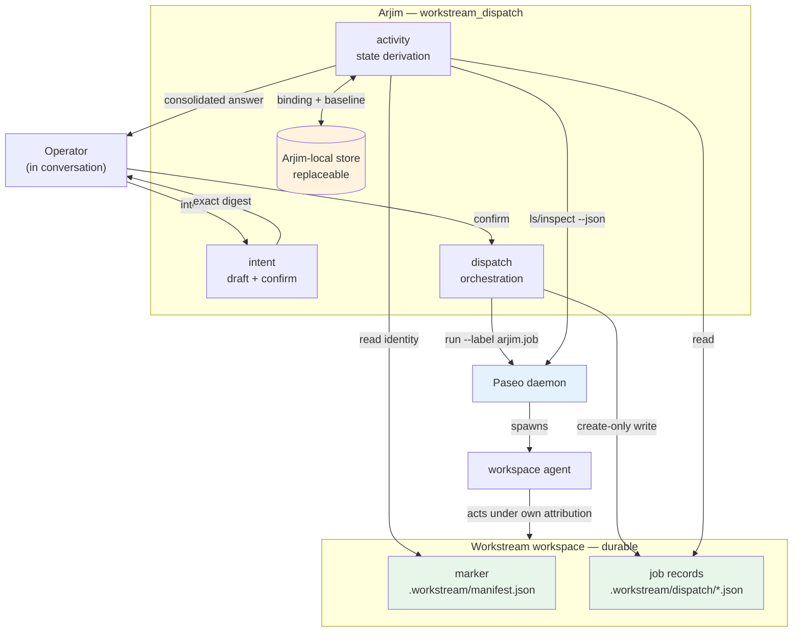
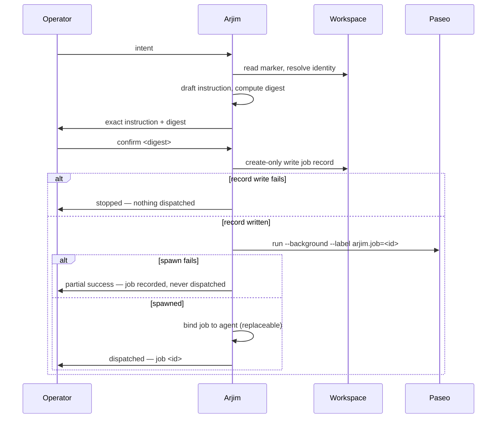

# Workstream Dispatch Loop - Plan

## Goal Capsule

- **Objective:** Ship the smallest loop in which the operator asks Arjim for work to be done in a registered workstream, Arjim translates that intent into a workspace-agent instruction, dispatches it through Paseo after operator confirmation, and later answers "how is everything going?" honestly for every dispatched job — including proposing the next step of a chain. Delivery is pull-based: nothing advances without the operator asking.
- **Product authority:** `VISION.md` — Outcome 1 (`VISION.md:54-64`), Outcome 3 (`VISION.md:80-90`), Outcome 4 (`VISION.md:92-104`), Conditions of trust (`VISION.md:136-179`). This plan is the current active milestone and replaces the awareness-only pilot recommended in `docs/reviews/2026-08-15-001-arjim-direction-recommendation-brief.md`.
- **Open blockers:** None. Two items are deferred to implementation with named checks (Q1, Q2 in Open Questions); neither blocks unit sequencing.
- **Stop condition:** U1-U9 pass their unit gates; the dispatch conformance runner and the existing registration conformance runner both exit 0; the structural no-scheduler assertion passes; the canary scan finds no credential, raw-instruction, or record-source content in any persisted file or output surface; and a wipe of Arjim-local state leaves every job record readable from the workspace.

---

## Product Contract

### Summary

Arjim gains a dispatch tier: turn operator intent into a confirmed instruction, spawn a Paseo agent in the target workstream's workspace to carry it out, and answer "what did you set in motion and where does it stand?" on demand. Job records are workspace-owned and immutable; job status is derived live from Paseo and never stored.

### Problem Frame

Registration is Arjim's only working capability (`README.md:7-23`). It answers "is this a registered workstream?" and nothing else. The operator's actual daily burden is not answered by that: work gets started in several workspaces, by several agents, and the operator carries the map of what is running where.

The 2026-08-15 direction brief proposed validating awareness first — observe the operator's checking rounds, pick one record source, prove a needs-me answer. That sequencing assumed the operator's burden is *watching*. The burden named since is *starting and tracking work*: dispatching agents into workspaces and remembering what was dispatched. An awareness pilot that only reads git conflict state would not have touched it.

`VISION.md:92-104` sequences workstream administration (Outcome 4) after awareness trust is earned, and the direction brief explicitly warns against rebuilding FirstMate's execution supervision. Both constraints survive here, because this plan does not supervise anything: it files a request, records it durably, and reads status when asked. The trust that Outcome 4 requires before Arjim *writes to authoritative records* is not spent, because Arjim writes no authoritative records — the dispatched agent does its own work under its own attribution.

### Key Decisions

- **Paseo is the dispatch substrate now; other tools later.** (session-settled: user-directed — chosen over designing a tool-neutral dispatch abstraction up front: one working path beats a generalization with one implementation.) Governs R5, R6, R11.
- **File-and-walk-away, not supervision.** Arjim spawns the agent and stops; it never watches a run, tracks turns, or maintains a wake queue. (session-settled: user-directed — chosen over FirstMate-style execution supervision: the supervising machinery is the thing the direction brief says not to duplicate.) Governs R6, R7, R21, R22.
- **The translated instruction is confirmed before any agent is spawned.** (session-settled: user-directed — chosen over dispatch-on-request: a misread intent is cheap to catch before an agent starts and expensive after.) Governs R2, R3, R4.
- **Chains advance only when the operator asks.** A chain step is proposed during a status answer, never triggered by a background process. (session-settled: user-directed — chosen over auto-advance-on-completion: auto-advance requires a watcher, which is the excluded scheduler.) Governs R13, R14, R15.
- **Take what Paseo gives; build only what it does not.** Correlation uses Paseo labels rather than an Arjim-owned registry, and no orchestration primitive is reimplemented. (session-settled: user-directed — chosen over an Arjim-owned job/agent registry: Paseo already indexes agents by label.) Governs R6, R17.
- **Dispatched work is the subject; other workspace change gets a coarse signal only.** (session-settled: user-directed — chosen over full awareness semantics: "a change happened and it was not mine" is sufficient to start.) Governs R12.
- **This milestone replaces the awareness-only pilot.** The 2026-08-15 direction brief becomes a design reference, the way it made the awareness tier plan a design reference. (session-settled: user-directed.) Governs R24.
- **Job records are workspace-owned and immutable; status is never stored.** A dispatch request is workstream memory and must survive an Arjim wipe; a run's live state is not memory and must never be cached into a stale answer. Governs R7, R16, R17, R18, R19.

### Requirements

**Dispatch**

- R1. Arjim translates operator intent into a workspace-agent instruction naming the target workstream, the requested outcome, and any operator-stated constraints. The instruction is prose intended for an agent, not a command line.
- R2. The exact instruction is presented for confirmation before any agent is spawned, and dispatch proceeds only on an exact-digest confirmation. A rejected or mismatched confirmation spawns nothing and writes nothing.
- R3. Every job record carries bounded attribution: `actor` (`operator-confirmed` | `assistant-drafted`), an ISO-8601 UTC `recorded_at`, and a `sha256:<64-lowercase-hex>` reference to the confirmed instruction. Arjim never records `operator-confirmed` for a confirmation it produced itself.
- R4. The durable job record is written before the agent is spawned. A record written whose dispatch then fails is reported as a partial success naming the job, never as a completed dispatch and never silently discarded.
- R5. Dispatch targets a registered workstream, resolved through the existing registration identity. An unregistered or invalid-marker workspace is refused with a stable code; dispatch never registers a workstream as a side effect.
- R6. Dispatch is non-blocking: Arjim spawns the agent in the workstream's workspace and returns without waiting for the work to finish.

**Activity and status honesty**

- R7. Job status is derived live at answer time from Paseo and is never persisted. No answer is served from a stored status value.
- R8. Every job reports one value from a closed, versioned job-state vocabulary: `running | idle | needs-operator | not-found | unreachable | superseded | never-dispatched` (seven values). The vocabulary is defined in the dispatch contract and is independent of the registration outcome vocabulary.
- R9. `idle` means the agent is not currently working. It does not mean the requested work succeeded, and Arjim never renders it as done, complete, or successful. Where the operator needs the outcome, Arjim directs them to the agent's own record rather than asserting one.
- R10. An agent with a pending permission request reports `needs-operator`, and the answer names the workstream and job so the operator can act.
- R11. When Paseo cannot be reached, every job whose state depends on it reports `unreachable` and the answer states that coverage is incomplete. An unreachable substrate is never rendered as zero running jobs or as nothing happening.
- R12. For each workspace holding a dispatched job, the answer carries a coarse change signal derived from git: changed since the last observation, unchanged, `bootstrap` (no prior observation), or `unsupported` (workspace is not git-backed). The signal states whether an Arjim job was dispatched into that workspace within the observed window and never asserts that a job caused an observed change.

**Chained follow-up**

- R13. A job record may declare that it follows another job by that job's identity. The relationship is recorded once at creation and never mutated.
- R14. A follow-on step is proposed only within an operator-initiated status answer. No timer, daemon, scheduled task, or background thread advances a chain.
- R15. A follow-on step is proposed whether the predecessor is `idle`, `needs-operator`, `not-found`, or `unreachable`. The proposal names the predecessor's observed state so the operator decides with that in view; Arjim never withholds a proposal because the predecessor's outcome is unknown or unfavorable.

**State ownership and durability**

- R16. The job record is workspace-owned, durable, and the authority for what was requested: target workstream, instruction, attribution (R3), creation time, and any `follows` link.
- R17. The job-to-agent binding and the per-workspace change baseline are Arjim-local, replaceable state. Losing them degrades affected answers to `not-found` or `bootstrap` and never to an empty or successful answer.
- R18. Wiping all Arjim-local state leaves every job record readable from its workspace. No job record exists only inside Arjim.
- R19. A job record is written create-only and is never modified or deleted by Arjim after creation.

**Boundaries and trust**

- R20. Arjim's only workspace writes are job records under the workstream's `.workstream/` directory. Arjim performs no authoritative-record write, no commit, and no source-tree edit; the dispatched agent acts under its own attribution.
- R21. The dispatch package contains no scheduler, timer, daemon, background thread, or OS scheduled-task registration. This is asserted structurally, not only behaviorally.
- R22. Arjim never re-dispatches, retries, or recovers a failed or stalled job on its own. A failure is reported; the operator decides.
- R23. Instruction text, record-source URIs, credentials, and agent output are never persisted outside the job record's own instruction field, and never appear in diagnostics. Diagnostics are bounded and carry stable codes, not raw content.
- R24. The existing registration capability is unchanged. No file under `src/workstream_registration/` or `contracts/workstream-registration/` is modified, and the registration conformance suite remains the regression gate.

### Key Flows

- F1. **Dispatch work into a workstream**
  - **Trigger:** The operator asks Arjim to get something done in a registered workstream.
  - **Steps:** Arjim resolves the workstream through registration; drafts the instruction from the operator's intent; presents the exact instruction with its digest; the operator confirms; Arjim writes the job record create-only into the workspace; Arjim spawns a labelled background Paseo agent in that workspace; Arjim reports the job identity.
  - **Outcome:** A durable job record plus a running agent, or a named partial success per R4.
  - **Covers R1-R6, R16, R19, R20.**

- F2. **Ask how everything is going**
  - **Trigger:** The operator asks what Arjim has set in motion.
  - **Steps:** Arjim reads job records from the workspaces it knows; resolves each job's agent by label; queries Paseo for status and pending permissions; derives each job's state through the KTD5 table; computes the coarse change signal per workspace; renders one consolidated answer with explicit coverage.
  - **Outcome:** Per-job state with honest unknowns, plus per-workspace change signal. Silence about a job is impossible; an unreachable substrate is named.
  - **Covers R7-R12, R17.**

- F3. **Advance a chain**
  - **Trigger:** A status answer (F2) finds a job that another intended step follows.
  - **Steps:** Arjim names the predecessor's observed state and proposes the next step's instruction with its digest; the operator confirms; the flow rejoins F1 from the record-write step, with `follows` set.
  - **Outcome:** The next job is dispatched, or the operator declines and nothing is written.
  - **Covers R13-R15, R2, R3.**

### Acceptance Examples

- AE1. **Covers R2, R4.** Given a drafted instruction, when the operator supplies a digest that does not match exactly, then no job record is written, no agent is spawned, and the result is a cancellation outcome — not a partial success.
- AE2. **Covers R4.** Given a confirmed instruction whose record write succeeds and whose Paseo spawn then fails, the result names the job identity, reports partial success with a stable code, and the job later resolves to `never-dispatched` in a status answer.
- AE3. **Covers R5.** Given a workspace with no marker, or with a marker that fails validation, dispatch is refused with a stable code and nothing is written.
- AE4. **Covers R8, R9.** Given a dispatched agent that Paseo reports as `idle`, the answer renders `idle` and states that the outcome of the work is not established by that state. No rendering path emits done, complete, finished, or succeeded for a job.
- AE5. **Covers R10.** Given a dispatched agent with a non-empty pending-permission list, the job reports `needs-operator` and the answer names its workstream and job identity.
- AE6. **Covers R11.** Given a stopped Paseo daemon, every job reports `unreachable`, the answer states that coverage is incomplete, and no job is reported as absent, finished, or idle.
- AE7. **Covers R7, R17.** Given a wiped Arjim-local store and intact workspaces, a status answer still lists every job record; jobs whose agents cannot be resolved by label report `not-found`, and the change signal reports `bootstrap` — never unchanged.
- AE8. **Covers R18.** Given a wipe of Arjim-local state, every job record remains readable from its workspace with instruction, attribution, and creation time intact.
- AE9. **Covers R12.** Given a git-backed workspace whose HEAD moved since the last observation, the answer reports changed and states whether an Arjim job was dispatched into that workspace in the window, without asserting that the job produced the change. Given a workspace that is not git-backed, the signal is `unsupported`, never unchanged.
- AE10. **Covers R14, R15.** Given a chain whose predecessor reports `needs-operator`, a status answer proposes the follow-on step and names that predecessor state. Given no operator request, no proposal is produced and no agent is spawned.
- AE11. **Covers R19.** Given an existing job record, any write path targeting that identity fails create-only and the operation stops; the stored record's bytes are unchanged.
- AE12. **Covers R3.** Given a dispatch Arjim initiated without an operator confirmation in hand, the record carries `actor: assistant-drafted`. No code path writes `operator-confirmed` without a confirmation supplied from outside the process.
- AE13. **Covers R21.** A structural source scan proves the dispatch package registers no scheduler, timer, daemon, background thread, or OS scheduled task.
- AE14. **Covers R23.** Fixtures plant credential-shaped and record-source canaries in marker content, instruction input, and Paseo output; every canary is absent from the Arjim-local store bytes, stdout, stderr, the JSON envelope, and bounded diagnostics.
- AE15. **Covers R24.** The registration conformance runner exits 0 and no file under `src/workstream_registration/` or `contracts/workstream-registration/` differs from its committed state.

### Scope Boundaries

**Deferred for later**

- Automated scheduling, cadence, or proactive delivery of any kind.
- Retry, recovery, or re-dispatch automation for failed or stalled jobs.
- Full awareness semantics: freshness windows, per-source trust vocabulary, needs-me rule engines, portfolio views (`docs/plans/2026-08-09-001-feat-awareness-tier-plan.md` remains the design reference).
- Dispatch substrates other than Paseo.
- Reading the dispatched agent's work product to summarize or judge its outcome.
- Machine discovery of workspaces; the job-record scan covers workspaces already known through registration.

**Outside this milestone's identity**

- Execution supervision: watchers, wake queues, turn-end guards, semantic busy state, teardown gating. This is FirstMate's product, and duplicating it is the direction brief's explicit non-recommendation (`docs/reviews/2026-08-15-001-arjim-direction-recommendation-brief.md:67-69`).
- Arjim performing the workstream's delivery work itself, or writing to any authoritative record source.

<!-- ce-section: work-relationships -->
### How This Work Fits Together

This plan owns the **dispatch tier** — the current active area. The broader breakdown is the current understanding, not a committed roadmap:

- Awareness tier (`docs/plans/2026-08-09-001-feat-awareness-tier-plan.md`)
  - Shares: the honesty rules this plan instantiates for job state (unknown is never nothing), and the reference-not-copy discipline
  - Can proceed independently of: this plan's dispatch path; neither blocks the other
  - Still to decide: whether its explicit-inventory and freshness machinery is justified once dispatch answers are in use
- Durable attention-item ledger (`docs/ideation/2026-08-16-firstmate-derived-candidates.md`, C1)
  - Enables: distinguishing a job the operator has already seen from a new one
  - Can proceed independently of: this milestone, which reports every job every time
- Conversational confirmation evidence (`docs/ideation/2026-08-16-firstmate-derived-candidates.md`, C2b)
  - Shares: R3's attribution shape, which is this plan's minimum instantiation of it
  - Still to decide: how a conversational confirmation is carried into a tool invocation as evidence Arjim cannot forge
- Action tier (Outcome 4 — authoritative writes, official filing)
  - Depends on: trust earned by this tier and awareness; not active scope

---

## Planning Contract

### Key Technical Decisions

- **KTD1. New package `src/workstream_dispatch/`, registration untouched.** Registration is frozen as the regression gate; a sibling package keeps that guarantee mechanical rather than aspirational. `workstream_dispatch` imports `workstream_registration` for identity resolution and confirmation primitives but never modifies it. Governs R5, R24.
- **KTD2. Paseo is reached by CLI subprocess with `--json`, not by an MCP or HTTP client.** The repo has no HTTP client, MCP client, or async runtime in `src/`; it does have an established subprocess convention in `src/workstream_registration/projection.py:258-323` (fixed argv lists, an explicit timeout constant, `except (OSError, subprocess.TimeoutExpired)` converted to a bounded content-free error). Dispatch mirrors that convention exactly. Governs R6, R11, R23.
- **KTD3. Jobs correlate to agents by the Paseo label `arjim.job=<job-id>`.** `paseo run --label k=v` and `paseo ls --label k=v` provide the index for free, so Arjim owns no durable agent registry. The Arjim-local binding (KTD4) is a disposable accelerator that also disambiguates `never-dispatched` from `not-found`; losing it costs precision, never correctness. Governs R17.
- **KTD4. Three state tiers with distinct authority.** Workspace-owned durable: one immutable JSON job record per job at `.workstream/dispatch/<job-id>.json`. Arjim-local replaceable: a SQLite store holding the job-to-agent binding and the per-workspace change baseline, following `projection.py`'s store-dir, WAL, `BEGIN IMMEDIATE`, and owner-only pattern. Live, never stored: Paseo status. Governs R7, R16, R17, R18.
- **KTD5. Job state is derived through a closed table, not stored.** Inputs: whether the local binding exists, whether a label lookup resolves an agent, the agent's `status`, whether its pending-permission list is non-empty, and whether it is archived. The seven R8 values are the only outputs; `idle` is terminal-looking but asserts nothing about success (R9). The table is the single owner of the mapping; the CLI and any renderer read it.
- **KTD6. The coarse change signal is a git HEAD-plus-worktree digest baseline.** The baseline stores the raw HEAD OID and a digest of worktree/index state per workspace in the replaceable store. Absent baseline yields `bootstrap`; a workspace with no git directory yields `unsupported`. Branch and ref names are not persisted. Governs R12.
- **KTD7. Chains are derived from immutable `follows` links, never a mutable state machine.** A chain is reconstructed at answer time by joining job records on `follows` and overlaying derived state. Nothing to migrate, nothing to corrupt, and no advance can happen without a read. Governs R13, R14.
- **KTD8. Confirmation reuses registration's digest primitives by import.** `registration.envelope_digest` and the confirm-then-consume shape (`src/workstream_registration/registration.py:173-178`, `:638-648`) are imported unchanged. Known limitation: the process-ephemeral HMAC key is shared across a fork boundary (repo issue #5); dispatch inherits that and does not work around it in this milestone.
- **KTD9. A new closed outcome vocabulary and exit-code table in its own version space.** Registration's outcome enum is frozen and has no dispatch member; extending it would break its contract. `contracts/workstream-dispatch/v1/` declares its own outcomes, job-state enum, and a frozen outcome-to-exit-code table mirroring `src/workstream_registration/cli.py:107-120`. Governs R8.

### High-Level Technical Design

Component and authority boundaries:



Green is durable workspace authority, amber is replaceable Arjim-local state, blue is the external substrate. Arjim reaches the workspace only through the two green nodes; the agent, not Arjim, touches everything else.

Dispatch ordering (F1) — the record precedes the spawn so no work runs without a durable record:



Job-state derivation (KTD5), the single owner of the R8 mapping:

| Local binding | Label resolves an agent | Agent condition | Derived state |
|---|---|---|---|
| any | Paseo unreachable | — | `unreachable` |
| any | yes | pending permissions non-empty | `needs-operator` |
| any | yes | `status = running` | `running` |
| any | yes | `status = idle`, not archived | `idle` |
| any | yes | archived | `superseded` |
| present | no | — | `not-found` |
| absent | no | — | `never-dispatched` |

`unreachable` is evaluated first so a dead daemon can never be mistaken for absent work. The `never-dispatched` row is why the replaceable binding is worth keeping: without it, a record whose spawn failed is indistinguishable from one whose agent was deleted.

### Output Structure

```
contracts/workstream-dispatch/
  README.md
  v1/
    job-record.schema.json
    dispatch-result.schema.json
    job-state.md
src/workstream_dispatch/
  __init__.py
  cli.py
  records.py
  store.py
  paseo_adapter.py
  intent.py
  dispatch.py
  activity.py
  chain.py
  conformance_runner.py
tests/python/
  test_dispatch_records.py
  test_dispatch_store.py
  test_paseo_adapter.py
  test_dispatch_intent.py
  test_dispatch.py
  test_dispatch_activity.py
  test_dispatch_chain.py
  test_dispatch_cli.py
  test_dispatch_conformance_runner.py
tests/contracts/workstream-dispatch/
  expectations.json
  valid/ invalid/ raw/ transitions/
```

The per-unit `**Files:**` lists remain authoritative; this tree is the expected shape, not a constraint.

---

## Implementation Units

### U1. Dispatch contract and closed vocabularies

- **Goal:** Establish `contracts/workstream-dispatch/v1/` as the version space for the job record, the result envelope, and the two closed vocabularies, before any code depends on their shape.
- **Requirements:** R3, R8, R13, R16, R19; KTD9.
- **Dependencies:** none.
- **Files:** `contracts/workstream-dispatch/README.md`, `contracts/workstream-dispatch/v1/job-record.schema.json`, `contracts/workstream-dispatch/v1/dispatch-result.schema.json`, `contracts/workstream-dispatch/v1/job-state.md`
- **Approach:**
  1. Define the job-record schema as a closed document: `schema_version` (int, dispatch-dispatched), `job_id`, `workstream_identity`, `instruction`, `follows` (optional job id), `actor`, `recorded_at`, `confirmation_ref`, `created_at`. Cap `instruction` length explicitly; forbid additional properties.
  2. Define the result envelope mirroring `contracts/workstream-registration/v1/registration-result.schema.json`'s shape — version, outcome, effects, optional diagnostics with the same bounded caps — but with a dispatch-local outcome enum. Do not reference the registration schema.
  3. Write the job-state vocabulary and the KTD5 derivation table into `job-state.md` as the normative statement, with a fenced machine-readable table the conformance runner can extract (mirroring the state-table pattern in `contracts/workstream-registration/v1/registration-protocol.md`).
  4. Declare the version-dispatch rule: a reader dispatches on `schema_version` before applying the closed schema, and an unsupported version is not interpreted.
- **Patterns to follow:** `contracts/workstream-registration/v1/registration-result.schema.json` for envelope shape and diagnostic caps; `contracts/workstream-registration/README.md` for the contract-document structure; `contracts/workstream-registration/v1/compatibility.md` for the support-profile statement.
- **Test scenarios:**
  - A minimal valid job record validates.
  - A job record with an unknown top-level property is rejected.
  - A job record missing `actor` is rejected.
  - `actor` outside `{operator-confirmed, assistant-drafted}` is rejected.
  - `instruction` exceeding the declared cap is rejected.
  - A `follows` value that is not a well-formed job id is rejected.
  - The job-state fenced table parses and contains exactly the seven R8 values.
- **Verification:** Both schemas load under `Draft202012Validator` with no external references, and the fenced state table extracts to exactly seven states.

### U2. Job record store — create-only confirmed write and read

- **Goal:** Write and read workspace-owned job records with the registration trust pattern, so a dispatch request is durable before anything runs.
- **Requirements:** R3, R4, R16, R19, R20, R23.
- **Dependencies:** U1.
- **Files:** `src/workstream_dispatch/records.py`, `tests/python/test_dispatch_records.py`
- **Approach:**
  1. Resolve the job-record directory as `.workstream/dispatch/` under a workspace path; create it only when writing the first record.
  2. Write with the exclusive-create sequence used by `filesystem.write_marker_create_only`: `os.open(..., O_CREAT|O_EXCL|O_WRONLY)`, write loop, `os.fsync`, close in `finally`. A collision returns a distinct outcome and never overwrites.
  3. Read back after write: reopen, re-validate against the U1 schema, and compare the recorded `job_id` and bytes before reporting success. Any mismatch reports written-unverified, never success.
  4. Provide a bounded directory read that returns records sorted by `created_at`, skipping and counting unreadable or schema-invalid entries rather than raising.
- **Patterns to follow:** `src/workstream_registration/filesystem.py:665-696` (exclusive create plus fsync), `src/workstream_registration/registration.py:961-992` (read-back and re-validate), `src/workstream_registration/validation.py:146-155` (bare validator, no resolver).
- **Test scenarios:**
  - Writing a record into a workspace with no `.workstream/dispatch/` creates the directory and the file.
  - Writing a record whose `job_id` already exists fails create-only and leaves the existing file byte-identical (`Covers AE11`).
  - A record whose read-back bytes differ from the written bytes reports written-unverified.
  - Reading a directory containing one valid and one malformed record returns the valid one and counts the skip, without raising.
  - Reading a workspace with no dispatch directory returns an empty list, not an error.
  - A record containing a credential-shaped canary in its instruction never appears in any diagnostic emitted by this module (`Covers AE14`).
- **Verification:** Records survive process restart; a collision never mutates existing bytes.

### U3. Arjim-local replaceable store — job binding and change baseline

- **Goal:** Hold the job-to-agent binding and the per-workspace git baseline in disposable local state whose loss degrades answers honestly.
- **Requirements:** R12, R17, R18.
- **Dependencies:** U1.
- **Files:** `src/workstream_dispatch/store.py`, `tests/python/test_dispatch_store.py`
- **Approach:**
  1. Resolve the store directory with a dispatch-specific env var and the same platform fallbacks as `projection.default_store_dir()`; enforce owner-only permissions on creation and verify before every use.
  2. Create two tables in one database with `CREATE TABLE IF NOT EXISTS` and a stamped `PRAGMA user_version`: a binding table keyed by `job_id` holding agent id and dispatch timestamp, and a baseline table keyed by workspace target handle holding the HEAD OID and a worktree-state digest.
  3. Wrap every mutation in the `BEGIN IMMEDIATE` / commit / rollback / verify-sidecars transaction helper shape.
  4. Persist no branch names, no ref names, no instruction text, and no record-source content — only the allow-listed columns above.
- **Patterns to follow:** `src/workstream_registration/projection.py:161-175` (store-dir resolution), `:439-470` (connect, WAL, idempotent DDL, user_version), `:478-494` (transaction helper), `:239-360` (owner-only enforcement and verification).
- **Test scenarios:**
  - A fresh store is created lazily on first write and is owner-only.
  - Binding a job to an agent and reading it back round-trips.
  - Reading a binding for an unknown job returns absent, not an error.
  - Recording and re-reading a workspace baseline round-trips the HEAD OID.
  - Deleting the database file and re-opening yields an empty store rather than an exception.
  - A canary planted in an instruction and in a record-source URI is absent from the database file bytes (`Covers AE14`).
- **Verification:** Deleting the store loses only bindings and baselines; no job record is affected.

### U4. Paseo adapter — bounded dispatch and status queries

- **Goal:** Wrap the Paseo CLI as the sole egress point, converting its output into bounded internal values and its failures into an explicit unreachable signal.
- **Requirements:** R6, R11, R23; KTD2, KTD3.
- **Dependencies:** U1.
- **Files:** `src/workstream_dispatch/paseo_adapter.py`, `tests/python/test_paseo_adapter.py`
- **Approach:**
  1. Expose three operations: spawn a background labelled agent in a working directory, resolve agents by label, and inspect an agent.
  2. Build fixed argv lists only — never a shell string — with an explicit module-level timeout constant, mirroring the icacls call shape.
  3. Parse `--json` defensively: `paseo ls --json` returns camelCase keys (`id`, `status`, `cwd`) while `paseo inspect --json` returns PascalCase (`Id`, `Status`, `PendingPermissions`). Normalize case-insensitively and treat any missing key as unknown rather than assuming a shape.
  4. Convert `OSError`, `TimeoutExpired`, a non-zero exit, and unparseable output into one bounded unreachable result carrying a stable code and no captured content.
  5. Emit no agent output, no instruction text, and no captured stderr into diagnostics.
- **Patterns to follow:** `src/workstream_registration/projection.py:258-330` (fixed argv, timeout constant, bounded error conversion); `tests/python/test_projection.py:340-392` (monkeypatching `<module>.subprocess.run` to simulate an external tool).
- **Test scenarios:**
  - A successful label lookup returns the agent id and status.
  - A lookup returning an empty array resolves to no agent, distinct from unreachable.
  - `subprocess.run` raising `OSError` produces unreachable with a stable code (`Covers AE6`).
  - `subprocess.run` raising `TimeoutExpired` produces unreachable, not a hang or a traceback.
  - A non-zero exit with content on stderr produces unreachable and the stderr content is absent from the returned object.
  - Unparseable stdout produces unreachable rather than raising.
  - An inspect payload with PascalCase keys and one with camelCase keys both normalize to the same internal shape.
  - A non-empty `PendingPermissions` list is surfaced as a boolean flag without copying its contents.
  - Argv construction places the instruction as a single argument and never interpolates it into a shell string.
- **Verification:** Every failure mode of the external CLI produces exactly one bounded unreachable value; no test observes raw external output escaping the adapter.

### U5. Intent translation, confirmation, and dispatch orchestration

- **Goal:** Turn operator intent into a confirmed instruction and execute the record-first dispatch ordering with honest partial-success reporting.
- **Requirements:** R1, R2, R3, R4, R5, R6, R20, R22.
- **Dependencies:** U2, U3, U4.
- **Files:** `src/workstream_dispatch/intent.py`, `src/workstream_dispatch/dispatch.py`, `tests/python/test_dispatch_intent.py`, `tests/python/test_dispatch.py`
- **Approach:**
  1. Draft: resolve the workstream through `registration.inspect`, refuse anything not in the linked-existing state, and compose the instruction naming workstream, requested outcome, and operator constraints. Compute its digest with `registration.envelope_digest`.
  2. Confirm: exact string equality against `confirm <digest>`; anything else returns cancellation and writes nothing. Consume the confirmation before any write so it cannot be replayed.
  3. Set `actor` from whether a confirmation was supplied from outside the process; never derive `operator-confirmed` internally.
  4. Dispatch in strict order — write the record (U2), then spawn (U4), then bind (U3). A record-write failure stops before spawning. A spawn failure after a successful write returns partial success naming the job. A bind failure after a successful spawn returns success with a degraded-binding note, because the label still resolves the agent.
  5. Never retry a failed spawn.
- **Execution note:** Implement the ordering guarantees test-first — the partial-success paths are the units' whole reason for existing and are easy to lose to a refactor.
- **Patterns to follow:** `src/workstream_registration/registration.py:583-648` (draft, digest, confirm), `:843-919` (revalidate, consume, lock, write, read back), `src/workstream_registration/unregister.py:299-362` (compare-before-act ordering).
- **Test scenarios:**
  - A digest mismatch writes nothing and spawns nothing (`Covers AE1`).
  - A confirmation reused a second time is rejected as expired.
  - Dispatch against a workspace with no marker is refused with a stable code (`Covers AE3`).
  - Dispatch against an invalid marker is refused with a stable code (`Covers AE3`).
  - A successful write followed by an adapter unreachable result returns partial success naming the job id (`Covers AE2`).
  - A record-write failure returns stopped and the adapter is never called.
  - A bind failure after a successful spawn returns success and the job still resolves by label.
  - Dispatch without an externally supplied confirmation records `assistant-drafted` (`Covers AE12`).
  - A failed spawn is not retried within the call.
- **Verification:** The three-step ordering holds under every injected failure; no path spawns before the record exists.

### U6. Activity answer — state derivation, coverage, and change signal

- **Goal:** Produce one consolidated answer whose unknowns are explicit and whose coverage is stated.
- **Requirements:** R7, R8, R9, R10, R11, R12, R17.
- **Dependencies:** U2, U3, U4.
- **Files:** `src/workstream_dispatch/activity.py`, `tests/python/test_dispatch_activity.py`
- **Approach:**
  1. Read job records from each known workspace (U2) and resolve each job's agent by label (U4), consulting the local binding (U3) only to distinguish `not-found` from `never-dispatched`.
  2. Derive each job's state through the KTD5 table as the single owner of that mapping; store nothing.
  3. Compute the per-workspace change signal: read HEAD and a worktree-state digest, compare against the stored baseline, and classify as changed, unchanged, `bootstrap`, or `unsupported`. Advance the baseline only after a successful observation.
  4. Attach to each changed workspace whether an Arjim job was dispatched into it within the observed window, phrased as co-occurrence and never as cause.
  5. Render coverage explicitly: how many workspaces were read, which were unreadable, and whether Paseo was reachable. Suppress no job for any reason.
- **Patterns to follow:** `src/workstream_registration/diagnostics.py:195-274` (bounded items and count re-derivation); `src/workstream_registration/projection.py:599-676` (resolve-outside-then-commit ordering) for the baseline advance.
- **Test scenarios:**
  - An agent reporting `running` derives `running`.
  - An agent reporting `idle` derives `idle`, and no rendered string in the answer contains done, complete, finished, or succeeded for that job (`Covers AE4`).
  - An agent with pending permissions derives `needs-operator` and the answer names its workstream and job (`Covers AE5`).
  - An archived agent derives `superseded`.
  - An adapter unreachable result derives `unreachable` for every job and the answer states incomplete coverage (`Covers AE6`).
  - A job with a local binding whose label resolves nothing derives `not-found`.
  - A job with no local binding whose label resolves nothing derives `never-dispatched`.
  - A wiped local store yields `not-found` for bound jobs and `bootstrap` for every workspace, never unchanged (`Covers AE7`).
  - A git workspace whose HEAD moved reports changed with the co-occurrence statement and no causal claim (`Covers AE9`).
  - A workspace with no git directory reports `unsupported`, never unchanged (`Covers AE9`).
  - A failed observation does not advance the baseline; the next successful observation still reports the change.
  - An unreadable workspace is named in coverage rather than omitted.
- **Verification:** No answer path can emit an empty or all-clear result while any job is `unreachable`, `not-found`, or `never-dispatched`.

### U7. Chained follow-up proposal

- **Goal:** Propose the next step of a chain inside an operator-initiated answer, with the predecessor's observed state in view.
- **Requirements:** R13, R14, R15, R2, R3.
- **Dependencies:** U5, U6.
- **Files:** `src/workstream_dispatch/chain.py`, `tests/python/test_dispatch_chain.py`
- **Approach:**
  1. Reconstruct chains at answer time by joining job records on `follows`; overlay each predecessor's derived state from U6.
  2. Propose a follow-on step whenever the predecessor is not `running`, naming its observed state in the proposal.
  3. Route acceptance back through U5's draft-confirm-dispatch path with `follows` set; a declined proposal writes nothing.
  4. Expose no entry point that advances a chain without an answer having been requested.
- **Patterns to follow:** U5's draft-confirm-dispatch sequence, reused rather than duplicated.
- **Test scenarios:**
  - A predecessor reporting `idle` produces a proposal naming that state.
  - A predecessor reporting `needs-operator` still produces a proposal naming that state (`Covers AE10`).
  - A predecessor reporting `unreachable` still produces a proposal naming that state.
  - A predecessor reporting `running` produces no proposal.
  - A declined proposal writes no record and spawns no agent (`Covers AE10`).
  - An accepted proposal writes a record whose `follows` names the predecessor.
  - A chain of three records reconstructs in order from records alone, with the local store empty.
  - No module-level or exported function advances a chain without an answer request.
- **Verification:** Chain state is reproducible from job records alone; advancing always requires a fresh confirmation.

### U8. CLI surface and result envelope

- **Goal:** Expose dispatch and activity as Arjim-operated commands emitting the U1 envelope with a frozen outcome-to-exit-code mapping.
- **Requirements:** R2, R4, R8, R11, R23; KTD9.
- **Dependencies:** U5, U6, U7.
- **Files:** `src/workstream_dispatch/cli.py`, `src/workstream_dispatch/__init__.py`, `pyproject.toml`, `tests/python/test_dispatch_cli.py`
- **Approach:**
  1. Reuse the hand-rolled bounded parser shape from `cli.py:405-534` so usage errors exit 3 rather than argparse's 2; declare subcommands for dispatching work, listing activity, and showing one job.
  2. Freeze the outcome-to-exit-code table as a module constant and return `TABLE[result.outcome]` from every handler so envelope and exit code cannot diverge.
  3. Provide injectable `emit` and `read_line` seams for the interactive confirmation, matching `register_interactive_cli`'s signature shape; the confirmation preview ends with the literal `confirm <digest>` line.
  4. Redact record-source URIs in previews as `cli.py:166-171` does; render the instruction, which is the thing being confirmed.
  5. Catch-all to a safe internal failure exit with no traceback.
  6. Add a second console script entry point without altering the existing one.
- **Patterns to follow:** `src/workstream_registration/cli.py:97-143` (exit codes, frozen table, redaction constant), `:174-232` (interactive seams and preview construction), `:380-403` (exact confirm matching), `:686-736` (main, help, catch-all).
- **Test scenarios:**
  - Each outcome maps to its documented exit code and the `--json` envelope agrees with it.
  - A usage error exits 3 and emits no envelope.
  - An unknown subcommand exits 3.
  - The confirmation preview ends with the exact `confirm <digest>` line.
  - Supplying a wrong digest exits with the cancellation code and spawns nothing.
  - A record-source canary is absent from the preview, from the JSON envelope, and from combined stdout and stderr (`Covers AE14`).
  - An unreachable Paseo daemon produces an envelope naming incomplete coverage and a non-success exit code (`Covers AE6`).
  - The new console script is reachable via `shutil.which` and via `python -m`.
  - The existing `workstream-registration` console script still resolves.
- **Verification:** Envelope and exit code never diverge; both console scripts resolve after an editable install.

### U9. Conformance runner, fixtures, docs, and vocabulary

- **Goal:** Make the dispatch contract independently checkable and record the new vocabulary and the direction change.
- **Requirements:** R21, R23, R24; all AEs.
- **Dependencies:** U1-U8.
- **Files:** `src/workstream_dispatch/conformance_runner.py`, `tests/contracts/workstream-dispatch/expectations.json`, `tests/contracts/workstream-dispatch/{valid,invalid,raw,transitions}/`, `tests/python/test_dispatch_conformance_runner.py`, `CONCEPTS.md`, `README.md`, `contracts/workstream-dispatch/README.md`, `docs/reviews/2026-08-15-001-arjim-direction-recommendation-brief.md`
- **Approach:**
  1. Build a manifest-driven runner mirroring `conformance_runner.py`: validate the manifest, assert unique ids and existing fixture files, and bidirectionally glob fixture directories to flag orphans.
  2. Add the structural no-scheduler assertion — scan `src/workstream_dispatch/` for scheduler, timer, daemon, thread, and OS scheduled-task registration, and fail on any hit (`Covers AE13`).
  3. Add a canary scan over all captured runner output plus the local store bytes, seeded from a manifest `canaries` map in the same shape as the registration corpus.
  4. Add a coverage assertion that every R-id and AE-id in this plan appears in some fixture's `covers` tags.
  5. Add a registration-untouched gate asserting the registration conformance runner exits 0 and that no file under `src/workstream_registration/` or `contracts/workstream-registration/` differs from committed state (`Covers AE15`).
  6. Add `CONCEPTS.md` entries for Dispatch, Job record, Workspace agent, Job state, and Chained dispatch, following the existing entry format.
  7. Add a supersession note atop the 2026-08-15 direction brief pointing to this plan, mirroring the note that brief's adoption placed atop the awareness tier plan.
- **Patterns to follow:** `src/workstream_registration/conformance_runner.py:276-424` (manifest load, validate, inventory assertion), `:947-960` (canary values and scan), `:809` (coverage report), `:153-156` (runner exit codes); the superseded-header style at `docs/plans/2026-08-09-001-feat-awareness-tier-plan.md:15-39`.
- **Test scenarios:**
  - A manifest with a duplicate id fails inventory.
  - A fixture file present on disk with no manifest entry fails as an orphan.
  - A manifest entry pointing at a missing fixture fails.
  - A planted canary in captured output fails the scan with a non-zero exit.
  - A source file containing a scheduler registration fails the structural assertion (`Covers AE13`).
  - An R-id with no fixture coverage fails the coverage report.
  - The runner exits 0 on the clean corpus.
- **Verification:** Both conformance runners exit 0; `CONCEPTS.md` and the direction brief carry their updates; `README.md` names dispatch alongside registration.

---

## Verification Contract

- `python -m workstream_registration.conformance_runner` exits 0 — the frozen regression gate (R24).
- `python -m workstream_dispatch.conformance_runner` exits 0, including the inventory, canary, coverage, structural no-scheduler, and registration-untouched assertions.
- `pytest` passes with the new `tests/python/test_dispatch_*.py` files alongside the existing suite.
- `git status --porcelain src/workstream_registration contracts/workstream-registration` is empty at the end of the work.
- A manual wipe check: delete the Arjim-local store directory, then run the activity command and confirm every job record still lists, with `not-found` or `bootstrap` states and no empty or all-clear answer (R18, AE7, AE8).
- Both console scripts resolve after `pip install -e ".[dev]"`.

---

## Definition of Done

- The operator can ask Arjim to get something done in a registered workstream, see the exact instruction before anything runs, confirm it, and have a Paseo agent working in that workspace.
- The operator can ask how things are going and receive one answer covering every dispatched job, with unknowns named rather than smoothed over, and a coarse per-workspace change signal.
- A chain step is proposed inside that answer, carrying the predecessor's observed state, and advances only on a fresh confirmation.
- Wiping Arjim's local state loses no job record.
- Registration is byte-unchanged and its conformance suite is green.
- `CONCEPTS.md` carries the new vocabulary and the 2026-08-15 direction brief carries its supersession note.

---

## Assumptions

Recorded rather than confirmed, because this run skipped the scoping-confirmation gate. Each is cheap to correct before U2 lands.

- A1. Job records are committed to the workspace's repository rather than gitignored, consistent with the marker being workspace-durable. If the operator wants them ignored, only U2's directory handling and Q2 change.
- A2. The workspaces Arjim scans for job records are those already known through registration. No machine discovery is added here.
- A3. One dispatch produces one agent. Fan-out (one intent, several parallel agents) is not modeled in the job record.
- A4. The instruction is authored by Arjim from conversation and stored as prose. No structured task schema is imposed on it.
- A5. The support profile stays CPython 3.14.6 on Windows, matching `contracts/workstream-registration/v1/compatibility.md`. Paseo is assumed installed and on `PATH`; its absence is an unreachable result, not an install step Arjim performs.

---

## Risks and Dependencies

- **Paseo's JSON shape is not a contract.** `paseo ls --json` emits camelCase and `paseo inspect --json` emits PascalCase; neither is versioned. A Paseo upgrade can silently change keys. Mitigated by U4's case-insensitive normalization and missing-key-is-unknown rule, so drift degrades to `unreachable` rather than to a wrong answer.
- **`idle` genuinely cannot prove completion.** Paseo has no finished state; a completed agent and an agent that never started both read `idle`. This is why R9 exists. The residual cost is real: the operator must open the agent to learn outcomes, which caps how much round-retiring this milestone can deliver. Accepting that cap is the point of keeping the milestone small.
- **Arjim can still misattribute its own confirmation.** R3 records `operator-confirmed` versus `assistant-drafted`, but nothing structurally prevents Arjim from claiming the former. Closing that gap is candidate C2b (`docs/ideation/2026-08-16-firstmate-derived-candidates.md`); this plan implements the record shape it will need and no more.
- **First external-service dependency in the codebase.** Nothing in `src/` currently reaches a network service or a third-party CLI. Daemon-down, version-skew, and slow-response behavior have no precedent here. Mitigated by routing every external call through U4 with one timeout constant and one failure value.
- **Agent deletion erases the run's history.** Archiving frees memory (`docs/solutions/workflow-issues/paseo-worker-verifier-loop-operations.md`) but an archived agent derives `superseded` and a deleted one derives `not-found`. The job record survives either way; the outcome does not.
- **Dependency:** Paseo installed, authenticated, and its daemon running on the operator's host.
- **Dependency:** Registration remains frozen for the duration; a registration change invalidates the U24 gate's premise.

---

## Alternatives Considered

- **Keep job records Arjim-local only.** Simpler — no workspace writes, no schema, no create-only path. Rejected: `VISION.md:80-90` makes wipe-survival non-negotiable, and "what did I ask for" is workstream memory. A local-only record makes an Arjim reset erase the operator's own request history.
- **Supervise the run (watcher, wake queue, durable status).** Would answer "is it done?" properly, which R9 concedes this plan cannot. Rejected: it is FirstMate's machinery, explicitly non-recommended in the direction brief, and it needs the trust `VISION.md:104` sequences after awareness. Revisit if the pull-based answer proves too weak in use.
- **Advance chains with Paseo schedules or heartbeats.** Paseo offers both, and they would make chains self-advancing at no build cost. Rejected: that is the scheduler the operator ruled out, and it converts the loop from pull to push without the delivery-honesty work that push requires.
- **Reach Paseo through its MCP server instead of the CLI.** Richer surface and structured results. Rejected: the repo has no MCP or HTTP client and pinned, minimal dependencies; the CLI reuses the existing subprocess precedent and keeps the dependency set unchanged. Reconsider if the CLI's JSON drift becomes costly.
- **Extend the registration outcome vocabulary rather than opening a new version space.** Fewer contracts. Rejected: that vocabulary is frozen and its exit-code table is asserted by the registration conformance runner; extending it breaks the gate this plan depends on.

---

## Open Questions

**Resolve Before Implementation**

- Q1. Should job records be committed to the workstream's repository or gitignored? A1 assumes committed. This is the operator's call and it changes U2's directory handling and the documentation in U9.

**Deferred to Implementation**

- Q2. Does `paseo run --background --json` return the created agent id in its payload? If it does, U5 binds directly and the label is a fallback; if it does not, the label lookup immediately after spawn is the only binding path. Check by dispatching one throwaway agent during U4 and reading the payload — do not assume either shape.
- Q3. What is the full set of values Paseo's `status` field can take? Only `running` and `idle` were observed on a live daemon. KTD5 treats any unrecognized value as unknown; confirm during U4 whether a distinct error or blocked state exists that deserves its own row.

---

## Sources and Research

- `VISION.md` — product authority; Outcome 1 (`:54-64`), Outcome 3 (`:80-90`), Outcome 4 (`:92-104`), Conditions of trust (`:136-179`), operator-interface rule (`:21-27`).
- `docs/reviews/2026-08-15-001-arjim-direction-recommendation-brief.md` — the superseded direction; its FirstMate non-recommendation (`:67-69`) and freeze-registration guidance (`:36-45`) both survive.
- `docs/plans/2026-08-09-001-feat-awareness-tier-plan.md` — design reference for the honesty vocabularies and the reference-not-copy discipline; not executed.
- `docs/ideation/2026-08-16-firstmate-derived-candidates.md` — C1 (attention ledger) and C2b (confirmation evidence) are the named follow-ons.
- `docs/solutions/workflow-issues/paseo-worker-verifier-loop-operations.md` — established that finish notifications are lost and verdicts must be pulled from the timeline; the reason R9 exists.
- `docs/solutions/workflow-issues/paseo-agent-cross-workspace-handoff.md` — agents are workspace-pinned; dispatch must target a workspace at spawn time, not relocate later.
- Live tooling probe (2026-08-17): `paseo --help`, `paseo run --help`, `paseo ls --json`, `paseo inspect --json`, `paseo workspace ls --json` — confirmed no chain primitive, the `--label` correlation path, the workspace `cwd` join key, and the absence of a finished status.
- `src/workstream_registration/` — the trust, subprocess, projection, CLI, and conformance patterns this plan mirrors; specific line references appear in each unit's Patterns to follow.
