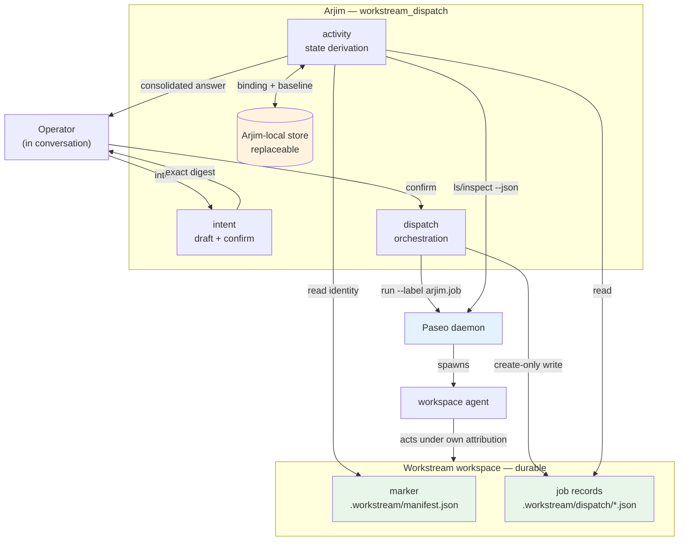
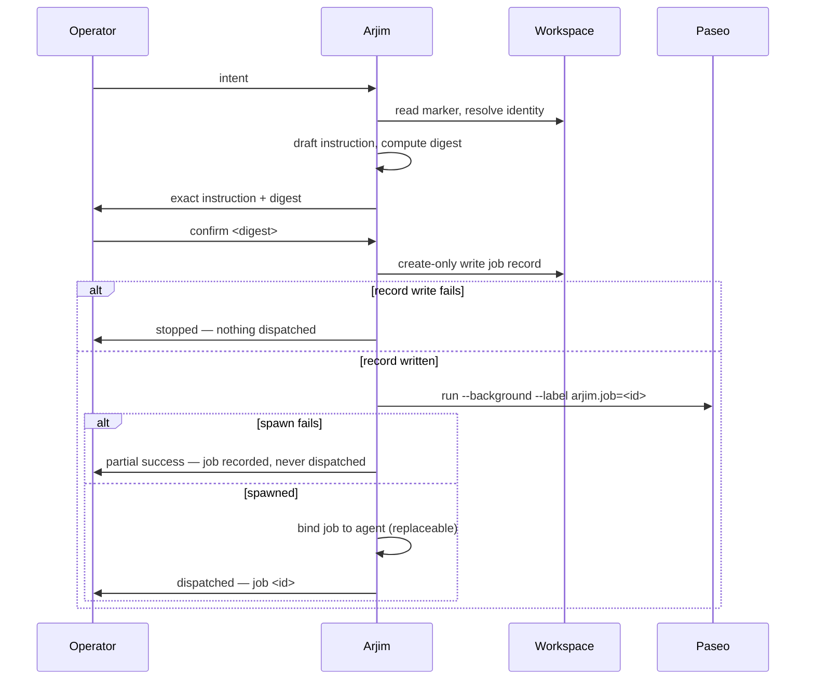

# Workstream Dispatch Loop - Plan

## Goal Capsule

- **Objective:** Ship the smallest loop in which the operator asks Arjim for work to be done in a registered workstream, Arjim translates that intent into a workspace-agent instruction, dispatches it through Paseo after operator confirmation, and later answers "how is everything going?" honestly for every dispatched job — including proposing the next step of a chain. Delivery is pull-based: nothing advances without the operator asking.
- **Product authority:** `VISION.md` — Outcome 1 (`VISION.md:54-64`), Outcome 2 (`VISION.md:66-78`), Outcome 3 (`VISION.md:80-90`), Outcome 4 (`VISION.md:92-104`), Conditions of trust (`VISION.md:136-179`). Outcome 2's "without waiting for me to ask" is met here only for pull-based delivery surfaces — the operator asks and gets one consolidated answer without having to name what to check — not as proactive push; this milestone is a partial, on-demand instantiation of Outcome 2, and the push half stays deferred. This plan is the current active milestone and replaces the awareness-only pilot recommended in `docs/reviews/2026-08-15-001-arjim-direction-recommendation-brief.md`.
- **Open blockers:** None. Q1 is a disclosure decision to settle before U2 lands (A1 records the assumed answer); Q2-Q4 are deferred to implementation with named checks. Neither set blocks unit sequencing.
- **Stop condition:** U1-U9 pass their unit gates; the dispatch conformance runner and the existing registration conformance runner both exit 0; the structural no-scheduler assertion passes; the canary scan finds no credential, raw-instruction, or record-source content in any persisted file or output surface (the confirmation preview exempted for instruction text per AE14); no instruction can reach Paseo's agent metadata because every spawn passes a fixed content-free title (U4); confirmed instruction bytes are provably identical to dispatched bytes, no instruction can reach the external CLI as a flag, and no dispatch path spawns a command interpreter, so instruction text is never re-parsed as shell syntax (KTD2); and a wipe of Arjim-local state leaves every job record readable from the workspace.

---

## Product Contract

### Summary

Arjim gains a dispatch tier: turn operator intent into a confirmed instruction, spawn a Paseo agent in the target workstream's workspace to carry it out, and answer "what did you set in motion and where does it stand?" on demand. Job records are workspace-owned and immutable; job status is derived live from Paseo and never stored.

### Problem Frame

Registration is Arjim's only working capability (`README.md:7-23`). It answers "is this a registered workstream?" and nothing else. The operator's actual daily burden is not answered by that: work gets started in several workspaces, by several agents, and the operator carries the map of what is running where.

The 2026-08-15 direction brief proposed validating awareness first — observe the operator's checking rounds, pick one record source, prove a needs-me answer. That sequencing assumed the operator's burden is *watching*. The burden named since is *starting and tracking work*: dispatching agents into workspaces and remembering what was dispatched. An awareness pilot that only reads git conflict state would not have touched it.

`VISION.md:45-52` sequences awareness before doing, and `VISION.md:92-104` sequences workstream administration (Outcome 4) after awareness trust is earned; `VISION.md:102` draws the delivery-work boundary. This plan deviates from both, and the deviation is operator-accepted rather than argued away: dispatch ships before the awareness tier that VISION:45-52 puts first, and it puts Arjim into the act of starting delivery work — spawning an agent that does the workstream's work — which VISION:102 keeps on the other side of the boundary. The narrowing that makes the deviation survivable is that Arjim supervises nothing and writes no authoritative record: it files a request, records it durably, and reads status when asked; the dispatched agent does its own work under its own attribution. Evidence that the deviation was wrong: the operator stops trusting a status answer enough to act on it without opening the agent (dispatch outpaced awareness); a dispatched agent produces a workspace change the operator did not want and Arjim's record does not explain (the boundary was load-bearing); or the confirmation gate degrades into a rubber stamp the operator clicks through (authority was ceded, not delegated). Any one of those says awareness should have come first.

### Key Decisions

- **Paseo is the dispatch substrate now; other tools later.** (session-settled: user-directed — chosen over designing a tool-neutral dispatch abstraction up front: one working path beats a generalization with one implementation.) Governs R5, R6, R11.
- **File-and-walk-away, not supervision.** Arjim spawns the agent and stops; it never watches a run, tracks turns, or maintains a wake queue. (session-settled: user-directed — chosen over FirstMate-style execution supervision: the supervising machinery is the thing the direction brief says not to duplicate.) Governs R6, R7, R21, R22.
- **The translated instruction is confirmed before any agent is spawned.** (session-settled: user-directed — chosen over dispatch-on-request: a misread intent is cheap to catch before an agent starts and expensive after.) Governs R2, R3, R4.
- **Chains advance only when the operator asks.** A chain step is proposed during a status answer, never triggered by a background process. (session-settled: user-directed — chosen over auto-advance-on-completion: auto-advance requires a watcher, which is the excluded scheduler.) Governs R13, R14, R15.
- **Take what Paseo gives; build only what it does not.** Correlation uses Paseo labels rather than an Arjim-owned registry, and no orchestration primitive is reimplemented. (session-settled: user-directed — chosen over an Arjim-owned job/agent registry: Paseo already indexes agents by label.) Governs R6, R17.
- **Dispatched work is the subject; other workspace change gets a coarse signal only.** (session-settled: user-directed — chosen over full awareness semantics: "a change happened and it was not mine" is sufficient to start.) Governs R12.
- **This milestone replaces the awareness-only pilot, as an accepted deviation from VISION's sequencing.** The 2026-08-15 direction brief becomes a design reference, the way it made the awareness tier plan a design reference. Shipping dispatch before awareness departs from `VISION.md:45-52`, and spawning an agent that performs delivery work departs from `VISION.md:102`; the operator accepted both rather than the plan reconciling them. The Problem Frame names the evidence that would say the deviation was wrong. (session-settled: user-directed.) Governs R24.
- **Job records are workspace-owned and immutable; status is never stored.** A dispatch request is workstream memory and must survive an Arjim wipe; a run's live state is not memory and must never be cached into a stale answer. Governs R7, R16, R17, R18, R19.
- **The dispatched agent is asked to leave its own completion evidence in the workspace.** Paseo cannot report completion, so the agent is instructed to write an outcome note beside its job record; Arjim reads that note when asked. The note is best-effort — its absence keeps the honest unknown, never a completion claim. Governs R9, R25, R26.
- **The operator chooses the dispatched agent's dispatch posture per dispatch, and it is recorded.** Model, mode, and thinking are chosen per dispatch; the provider is pinned (KTD12). How much authority and reasoning depth an agent has in a workspace is the operator's call, not a default Arjim picks silently. Governs R27, R28.

### Requirements

**Dispatch**

- R1. Arjim translates operator intent into a workspace-agent instruction naming the target workstream, the requested outcome, and any operator-stated constraints. The instruction is prose intended for an agent, not a command line.
- R2. The exact instruction is presented for confirmation before any agent is spawned, and dispatch proceeds only on an exact-digest confirmation. A rejected or mismatched confirmation spawns nothing and writes nothing.
- R3. Every job record carries bounded attribution: `actor` (`operator-confirmed` | `assistant-drafted`), an ISO-8601 UTC `recorded_at`, and a `sha256:<64-lowercase-hex>` reference to the confirmed instruction. Arjim never records `operator-confirmed` for a confirmation it produced itself.
- R4. The durable job record is written before the agent is spawned. A record written whose dispatch then fails is reported as a partial success naming the job, never as a completed dispatch and never silently discarded.
- R5. Dispatch targets a registered workstream, resolved through the existing registration identity. An unregistered or invalid-marker workspace is refused with a stable code; dispatch never registers a workstream as a side effect.
- R6. Dispatch is non-blocking: Arjim spawns the agent in the workstream's workspace and returns without waiting for the work to finish.

**Activity and status honesty**

- R7. Job status is derived live at answer time from Paseo and is never persisted. No answer is served from a stored status value.
- R8. Every job reports one value from a closed, versioned job-state vocabulary: `running | idle | needs-operator | not-found | unreachable | superseded | never-dispatched | failed` (eight values). The vocabulary is defined in the dispatch contract and is independent of the registration outcome vocabulary. `failed` means Paseo reported the agent's status as `error`; it asserts no retry, recovery, or outcome (R9, R22).
- R9. `idle` means the agent is not currently working. It does not mean the requested work succeeded, and Arjim never renders it as done, complete, or successful. Where the operator needs the outcome, Arjim directs them to the agent's own record rather than asserting one.
- R10. An agent with a pending permission request reports `needs-operator`, and the answer names the workstream and job so the operator can act. An agent whose status value the KTD5 table cannot classify likewise reports `needs-operator`: the table never guesses a state that could render a failed or unclassifiable agent as idle (R9).
- R11. When Paseo cannot be reached, every job whose state depends on it reports `unreachable` and the answer states that coverage is incomplete. An unreachable substrate is never rendered as zero running jobs or as nothing happening.
- R12. For each workspace holding a dispatched job, the answer carries a coarse change signal derived from git: changed since the last observation, unchanged, `bootstrap` (no prior observation), or `unsupported` (workspace is not git-backed). The signal states whether an Arjim job was dispatched into that workspace within the observed window and never asserts that a job caused an observed change.

**Chained follow-up**

- R13. A job record may declare that it follows another job by that job's identity. The relationship is recorded once at creation and never mutated.
- R14. A follow-on step is proposed only within an operator-initiated status answer. No timer, daemon, scheduled task, or background thread advances a chain.
- R15. A follow-on step is proposed whenever the predecessor is not `running`, naming its observed state in the proposal so the operator decides with that in view; Arjim never withholds a proposal because the predecessor's outcome is unknown or unfavorable.

**State ownership and durability**

- R16. The job record is workspace-owned, durable, and the authority for what was requested: target workstream, instruction, confirmed dispatch posture (R27, R28), attribution (R3), creation time, and any `follows` link. It does not carry the outcome-note path, which Arjim derives from `job_id` (R26) rather than storing where an agent-writable field could steer a read.
- R17. The job-to-agent binding and the per-workspace change baseline are Arjim-local, replaceable state. Losing them degrades affected answers to `not-found` or `bootstrap` and never to an empty or successful answer.
- R18. Wiping all Arjim-local state leaves every job record readable from its workspace. No job record exists only inside Arjim. Coverage is scoped to registered workstreams: the scan list derives from registration's projection (U6), so a workspace removed from registration exits coverage by design — its job records remain intact on disk but are no longer surfaced, and the coverage line keeps that visible (AE7).
- R19. A job record is written create-only and is never modified or deleted by Arjim after creation.

**Boundaries and trust**

- R20. Arjim's only workspace writes are job records under the workstream's `.workstream/` directory. Arjim performs no authoritative-record write, no commit, and no source-tree edit; the dispatched agent acts under its own attribution.
- R21. The dispatch package contains no scheduler, timer, daemon, background thread, or OS scheduled-task registration. This is asserted structurally, not only behaviorally.
- R22. Arjim never re-dispatches, retries, or recovers a failed or stalled job on its own. A failure is reported; the operator decides.
- R23. Instruction text, record-source URIs, credentials, and agent output are never persisted outside the job record's own instruction field, and never appear in diagnostics. The confirmation preview is the sole sanctioned stdout surface for instruction text (R2); everywhere else — stderr, the JSON envelope, the Arjim-local store, and Paseo's agent metadata (guaranteed by the fixed content-free spawn title, U4) — instruction text appears nowhere. Diagnostics are bounded and carry stable codes, not raw content.
- R24. The existing registration capability is unchanged. No file under `src/workstream_registration/` or `contracts/workstream-registration/` is modified, and the registration conformance suite remains the regression gate.

**Agent context, authority, and instruction integrity**

- R25. The dispatched agent receives the instruction, the target workstream's label and identity, and the path of its own job record. It does not receive record-source URIs, which registration holds as opaque never-dereferenced data.
- R26. The instruction asks the agent to write an outcome note at a path Arjim derives from the job's own `job_id`, beside its job record. The note path is never recorded in the job record and never read from one: no field the dispatched agent can write determines which file Arjim opens. Before reading, Arjim fully resolves the derived path, requires the resolved result to sit inside the job record's own dispatch directory, and refuses any path whose resolution traverses a symlink, junction, or other reparse point — a refused path is not read at all. Arjim reads a note that survives those checks, passes it through the R29 code-point guard, cross-checks that the note's `job_id` equals the record's `job_id`, and reports its content as an unverified workspace note associated with this job — nothing proves who wrote it, and Arjim never asserts authorship. The note is one mutable snapshot per job, not a history: a later write at the same derived path replaces what the next answer reads, and the schema (U1) defines only that current state, never a log of prior versions. Every note reports one value from a closed note-status vocabulary that is orthogonal to the R8 job state and changes no job state: `present | absent | unreadable | schema-invalid | guard-failed | mismatched | path-refused` (seven values). None of the non-`present` values is ever rendered as completion. A guard-failed note is not sanitized and re-rendered: it renders as "note present, unrenderable — open the agent" with a stable code, distinct from absent, because the operator must learn that a claim exists which Arjim will not repeat. A note whose `job_id` differs from the record's is `mismatched` and is never rendered, under that job or any other. `path-refused` means the note's location failed the containment or reparse-point check and its bytes were never read; it is distinct from `guard-failed`, which means a note was read and its content rejected, and distinct from `absent`, because the operator must learn that something occupies the note's path which Arjim declined to open. The answer states its own observation time in UTC and renders each note's `reported_at` beside the claim it carries, so the operator judges a claim's age from stated times; Arjim declares no freshness window and never labels a note fresh or stale on the operator's behalf.
- R27. The dispatched agent's dispatch posture — the tuple of dispatch provider, model, mode, and thinking — is presented in the confirmation. Model, mode, and thinking are chosen per dispatch by the operator; the provider is pinned (KTD12) and is not an operator choice. Arjim never selects the most permissive available model, mode, or thinking setting on the operator's behalf, and never dispatches without a complete tuple recorded. The mode and the thinking setting are each validated against the live CLI at draft time, never a frozen enum.
- R28. The dispatch posture recorded in the job record — provider, model, mode, and thinking — is the one the operator confirmed. No path dispatches at a provider, model, mode, or thinking setting other than the confirmed ones.
- R29. An instruction is guarded before it is shown for confirmation: C0 and C1 control characters and bidirectional-formatting code points are rejected, and a byte cap is enforced. The bytes the operator confirms are the bytes dispatched.
- R30. The instruction is passed to the external CLI so that it cannot be interpreted as an option or flag, whatever its leading characters.
- R31. A job record whose recorded workstream identity no longer matches its workspace's current marker is reported as unattributable and named in coverage. It is never silently attributed to the workstream currently registered there.

### Key Flows

- F1. **Dispatch work into a workstream**
  - **Trigger:** The operator asks Arjim to get something done in a registered workstream.
  - **Steps:** Arjim resolves the workstream through registration; drafts and guards the instruction from the operator's intent; presents the exact instruction, the context the agent will receive, and the agent's dispatch posture (provider, model, mode, thinking), with a digest; the operator confirms; Arjim writes the job record create-only into the workspace; Arjim spawns a labelled background Paseo agent at the confirmed posture in that workspace; Arjim reports the job identity.
  - **Outcome:** A durable job record plus a running agent, or a named partial success per R4.
  - **Covers R1-R6, R16, R19, R20, R25-R30.**

- F2. **Ask how everything is going**
  - **Trigger:** The operator asks what Arjim has set in motion.
  - **Steps:** Arjim reads job records from the workspaces it knows; resolves each job's agent by label; queries Paseo for status and pending permissions; reads any outcome note left beside each record; derives each job's state through the KTD5 table; computes the coarse change signal per workspace; renders one consolidated answer with explicit coverage.
  - **Outcome:** Per-job state with honest unknowns, the unverified workspace note associated with the job where one is present, plus per-workspace change signal. Silence about a job is impossible; an unreachable substrate is named.
  - **Covers R7-R12, R17, R26, R31.**

- F3. **Advance a chain**
  - **Trigger:** A status answer (F2) finds a job that another intended step follows.
  - **Steps:** Arjim names the predecessor's observed state and proposes the next step's instruction with its digest; the operator confirms; the flow rejoins F1 from the record-write step, with `follows` set.
  - **Outcome:** The next job is dispatched, or the operator declines and nothing is written.
  - **Covers R13-R15, R2, R3.**

### Acceptance Examples

- AE1. **Covers R2, R4.** Given a drafted instruction, when the operator supplies a digest that does not match exactly, then no job record is written, no agent is spawned, and the result is a cancellation outcome — not a partial success.
- AE2. **Covers R4.** Given a confirmed instruction whose record write succeeds and whose Paseo spawn then fails, the result names the job identity, reports partial success with a stable code, and the job later resolves to `never-dispatched` in a status answer.
- AE3. **Covers R5.** Given a workspace with no marker, or with a marker that fails validation, dispatch is refused with a stable code and nothing is written.
- AE4. **Covers R8, R9.** Given a dispatched agent that Paseo reports as `idle`, the answer renders `idle` and states that the outcome of the work is not established by that state. No rendering path emits done, complete, finished, or succeeded for a job.
- AE5. **Covers R10.** Given a dispatched agent with a non-empty pending-permission list, the job reports `needs-operator` and the answer names its workstream and job identity.
- AE6. **Covers R11.** Given a stopped Paseo daemon, every job reports `unreachable`, the answer states that coverage is incomplete, and no job is reported as absent, finished, or idle.
- AE7. **Covers R7, R17.** Given a wiped Arjim-local store and intact registered workspaces, a status answer still lists every job record; jobs whose agents cannot be resolved by label report `not-found`, and the change signal reports `bootstrap` — never unchanged. The wipe targets the dispatch store (U3); the scan list derives from registration's projection, which the wipe does not remove.
- AE8. **Covers R18.** Given a wipe of Arjim-local state, every job record remains readable from its workspace with instruction, attribution, and creation time intact.
- AE9. **Covers R12.** Given a git-backed workspace whose HEAD moved since the last observation, the answer reports changed and states whether an Arjim job was dispatched into that workspace in the window, without asserting that the job produced the change. Given a workspace that is not git-backed, the signal is `unsupported`, never unchanged.
- AE10. **Covers R14, R15.** Given a chain whose predecessor reports `needs-operator`, a status answer proposes the follow-on step and names that predecessor state. Given no operator request, no proposal is produced and no agent is spawned.
- AE11. **Covers R19.** Given an existing job record, any write path targeting that identity fails create-only and the operation stops; the stored record's bytes are unchanged.
- AE12. **Covers R3.** Given a dispatch Arjim initiated without an operator confirmation in hand, the record carries `actor: assistant-drafted`. No code path writes `operator-confirmed` without a confirmation supplied from outside the process.
- AE13. **Covers R21.** A structural source scan proves the dispatch package registers no scheduler, timer, daemon, background thread, or OS scheduled task.
- AE14. **Covers R23.** Fixtures plant credential-shaped and record-source canaries in marker content, instruction input, and Paseo output; every canary is absent from the Arjim-local store bytes, stderr, the JSON envelope, and bounded diagnostics. Instruction canaries are absent from stdout with one explicit exception: the confirmation preview, which necessarily contains the instruction (R2). The canary scan either excludes the preview lines or asserts instruction canaries only against surfaces where the instruction must never appear.
- AE15. **Covers R24.** The registration conformance runner exits 0 and no file under `src/workstream_registration/` or `contracts/workstream-registration/` differs from its committed state.
- AE16. **Covers R25.** Given a workstream whose marker declares record sources, the payload handed to the dispatched agent contains the workstream label, identity, and job-record path, and contains no record-source URI. A canary planted in a record-source URI is absent from the dispatched payload.
- AE17. **Covers R26, R9.** Given a job whose agent is `idle` and whose outcome note exists, the answer reports the note as an unverified workspace note associated with the job. Given a job whose agent is `idle` and whose note is absent, the answer reports `idle` with the outcome unknown and asserts no completion.
- AE18. **Covers R27, R28.** Given a dispatch whose confirmation named a restricted posture, the spawn uses that exact provider/model/mode/thinking tuple. No path selects the most permissive posture without it appearing in the confirmed text, and a dispatch attempted with no recorded posture is refused.
- AE19. **Covers R29.** Given an instruction containing a right-to-left override or a C0 control character, the draft is refused before confirmation with a stable code. Given a confirmed instruction, the bytes dispatched are byte-identical to the bytes whose digest was confirmed.
- AE20. **Covers R30.** Given an instruction beginning with `--mode` or another option-shaped token, the spawn either refuses or passes it such that the external CLI treats it as instruction text; the agent's resulting posture is the confirmed one, never one named inside the instruction.
- AE21. **Covers R31.** Given a workspace whose marker was replaced by a different workstream identity, its existing job records report unattributable and appear in coverage rather than under the newly registered workstream.
- AE22. **Covers R8, R9.** Given a dispatched agent that Paseo reports as `error`, the job derives `failed`, and no rendering path emits done, complete, finished, or succeeded for it; `failed` asserts only that Paseo reported a fault, never an outcome, a retry, or a recovery.
- AE23. **Covers R8.** Given a dispatched agent that Paseo reports as `closed`, the job derives `superseded` rather than `failed` or `idle`, and the answer claims nothing about whether the requested work was done.

### Scope Boundaries

**Deferred for later**

- Automated scheduling, cadence, or proactive delivery of any kind. This is the half of Outcome 2 (`VISION.md:66-78`) this milestone does not deliver: "without waiting for me to ask" is satisfied for pull-based surfaces only — the operator asks once and need not name what to check — and nothing here pushes.
- Retry, recovery, or re-dispatch automation for failed or stalled jobs.
- Full awareness semantics: freshness windows, per-source trust vocabulary, needs-me rule engines, portfolio views (`docs/plans/2026-08-09-001-feat-awareness-tier-plan.md` remains the design reference).
- Dispatch substrates other than Paseo.
- Reading the dispatched agent's work product, transcript, or diffs to summarize or judge its outcome. Arjim reads only the outcome note at the path it derives from `job_id` (R26) and relays it as an unverified workspace note associated with the job.
- Machine discovery of workspaces; the job-record scan covers workspaces already known through registration. A workspace removed from registration exits scan coverage by design; its job records remain intact on disk but are no longer surfaced (R18, AE7).

**Outside this milestone's identity**

- Execution supervision: watchers, wake queues, turn-end guards, semantic busy state, teardown gating. This is FirstMate's product, and duplicating it is the direction brief's explicit non-recommendation (`docs/reviews/2026-08-15-001-arjim-direction-recommendation-brief.md:67-69`).
- Arjim performing the workstream's delivery work itself, or writing to any authoritative record source.

<!-- ce-section: work-relationships -->
### How This Work Fits Together

This plan owns the **dispatch tier** — the current active area. The broader breakdown is the current understanding, not a committed roadmap:

- Awareness tier (`docs/plans/2026-08-09-001-feat-awareness-tier-plan.md`)
  - Shares: the honesty rules this plan instantiates for job state (unknown is never nothing), and the reference-not-copy discipline
  - Can proceed independently of: this plan's dispatch path; neither blocks the other
  - Still to decide: whether its explicit-inventory and freshness machinery is justified once dispatch answers are in use
- Durable attention-item ledger (`docs/ideation/2026-08-16-firstmate-derived-candidates.md`, C1)
  - Enables: distinguishing a job the operator has already seen from a new one
  - Can proceed independently of: this milestone, which reports every job every time
- Conversational confirmation evidence (`docs/ideation/2026-08-16-firstmate-derived-candidates.md`, C2b)
  - Shares: R3's attribution shape, which is this plan's minimum instantiation of it
  - Still to decide: how a conversational confirmation is carried into a tool invocation as evidence Arjim cannot forge
- Action tier (Outcome 4 — authoritative writes, official filing)
  - Depends on: trust earned by this tier and awareness; not active scope

---

## Planning Contract

### Key Technical Decisions

- **KTD1. New package `src/workstream_dispatch/`, registration untouched.** Registration is frozen as the regression gate; a sibling package keeps that guarantee mechanical rather than aspirational. `workstream_dispatch` imports `workstream_registration` for identity resolution, confirmation primitives, and the projection listing but never modifies it. Governs R5, R24.
- **KTD2. Paseo is reached by CLI subprocess with `--json`, not by an MCP or HTTP client.** The repo has no HTTP client, MCP client, or async runtime in `src/`; it does have an established subprocess convention in `src/workstream_registration/projection.py:258-323` (fixed argv lists, an explicit timeout constant, `except (OSError, subprocess.TimeoutExpired)` converted to a bounded content-free error). Dispatch mirrors that convention with one Windows correction the `icacls` precedent never needed: on Windows the `paseo` name on `PATH` resolves to npm shims (`paseo.ps1`, `paseo.cmd`), which `CreateProcess` cannot execute directly. **The interpreter hop is prohibited.** No dispatch path spawns `cmd.exe /c`, PowerShell, or any other command interpreter, and no call site uses `shell=True`. `cmd.exe` re-parses its own command line, so `&`, `|`, `^`, `%VAR%`, and embedded quotes carried inside an instruction would become metacharacters executing on the operator's host at Arjim's privileges — outside the posture R27 exists to bound, and a class neither KTD13 (which targets deception — C0/C1, bidi, Tag block, zero-width, variation selectors — not shell syntax) nor R30/AE20 (leading option-shaped tokens only) covers. U4 therefore resolves the shim to its node entry and invokes `node <cli-js>` directly, which removes the re-parsing step rather than guarding it. Measured on this machine (2026-08-19, node v24.17.0, paseo 0.4.0): `shutil.which("paseo")` resolves to the npm shim `paseo.ps1` under the npm prefix; the sibling `paseo.cmd` names the entry `<npm-prefix>/node_modules/@getpaseo/cli/bin/paseo`; and `node <entry> ls --json` returns well-formed JSON on stdout with empty stderr and propagates a non-zero exit on an unknown subcommand. The residual cost is resolution brittleness — deriving the node entry depends on the npm layout, where `shutil.which` alone did not — and it is bounded: an init that cannot derive the node entry refuses with a stable code and never falls back to an interpreter. A bare `paseo` name is never used in argv. Governs R6, R11, R23.
- **KTD3. Jobs correlate to agents by the Paseo label `arjim.job=<job-id>`.** `paseo run --label k=v` and `paseo ls --label k=v` provide the index for free, so Arjim owns no durable agent registry. The Arjim-local binding (KTD4) is a disposable accelerator that also disambiguates `never-dispatched` from `not-found`; losing it costs precision, never correctness. The `job-id` format is pinned in U1 (uuid4-shaped, regex-constrained in the job-record schema), so the label value, the binding key, and `follows` references all share one definition. Governs R17.
- **KTD4. Three state tiers with distinct authority.** Workspace-owned durable: one immutable JSON job record per job at `.workstream/dispatch/<job-id>.json`. Arjim-local replaceable: a SQLite store holding the job-to-agent binding and the per-workspace change baseline, following `projection.py`'s store-dir, WAL, `BEGIN IMMEDIATE`, and owner-only pattern. Live, never stored: Paseo status. Governs R7, R16, R17, R18.
- **KTD5. Job state is derived through a closed table, not stored.** Inputs: whether the local binding exists, whether a label lookup resolves an agent, the agent's `status`, whether its pending-permission list is non-empty, and whether it is archived. The eight R8 values are the only outputs; `idle` is terminal-looking but asserts nothing about success (R9). The observed Paseo status set is `running`, `idle`, `closed`, `error` (measured on the live daemon, 2026-08-18: idle 34, closed 4, error 2, running 1): `error` derives `failed`, `closed` derives `superseded`, and any status outside the observed set derives `needs-operator` — the table never guesses a state that could render a failed or unclassifiable agent as idle (R9). The table is the single owner of the mapping; the CLI and any renderer read it.
- **KTD6. The coarse change signal is a git HEAD-plus-worktree digest baseline.** The baseline stores the raw HEAD OID and a digest of worktree/index state per workspace in the replaceable store. Absent baseline yields `bootstrap`; a workspace with no git directory yields `unsupported`. Branch and ref names are not persisted. Git is a second external CLI and receives the KTD2 egress discipline: fixed argv lists, a module-level timeout constant, and bounded error conversion — git missing from `PATH`, a non-zero exit, or a timeout derives `unsupported` for that workspace with a coverage note, never a crash and never a changed/unchanged claim. Governs R12.
- **KTD7. Chains are derived from immutable `follows` links, never a mutable state machine.** A chain is reconstructed at answer time by joining job records on `follows` and overlaying derived state. Nothing to migrate, nothing to corrupt, and no advance can happen without a read. Governs R13, R14.
- **KTD8. Confirmation reuses registration's digest primitives by import.** `registration.envelope_digest` and the confirm-then-consume shape (`src/workstream_registration/registration.py:173-178`, `:638-648`) are imported unchanged. Known limitation: the process-ephemeral HMAC key is shared across a fork boundary (repo issue #5); dispatch inherits that and does not work around it in this milestone.
- **KTD9. A new closed outcome vocabulary and exit-code table in its own version space.** Registration's outcome enum is frozen and has no dispatch member; extending it would break its contract. `contracts/workstream-dispatch/v1/` declares its own outcomes, job-state enum, note-status enum (R26, orthogonal to job state), and a frozen outcome-to-exit-code table mirroring `src/workstream_registration/cli.py:107-120`. Governs R8.
- **KTD10. The agent's context payload is deliberately narrow: instruction, workstream label and identity, job-record path.** Record-source URIs stay out. Registration's whole posture is that a URI is untrusted data no component dereferences (`src/workstream_registration/validation.py:23-26`); handing them to an autonomous agent would make Arjim the cause of the first dereference and widen blast radius for no gain this milestone needs. The job-record path is included because it is what makes R26 possible. Governs R25.
- **KTD11. The outcome note is a workspace file the agent writes, not a status Arjim infers, and its path is derived rather than declared.** Paseo reports no completion, so the honest options were to leave "did it finish?" unanswerable or to have the answer live where Arjim already reads. A note beside the job record adds no watcher and keeps the trust rule intact because Arjim reports it as an unverified workspace note associated with the job rather than as a verified claim of authorship or truth. The path is a pure function of `job_id` and is not stored in the record: the dispatched agent has write access to `.workstream/dispatch/`, so a recorded path field would have let the agent choose which file Arjim opens and print its bytes into a status answer — an arbitrary-read primitive aimed by the very party whose claims the note exists to carry. Deriving the path removes the field rather than validating it, and the resolution checks in R26 close the residual case where the agent plants a link at the derived name. Job-record immutability (R19) is unaffected — the note is a sibling file, and R19 constrains Arjim's writes, not the agent's. Governs R26.
- **KTD12. Dispatch posture is an operator decision surfaced in the confirmation text, as a provider/model/mode/thinking tuple.** Paseo's posture vocabulary is provider-specific and operator-extensible, so the mode and the thinking setting are each an open string validated against the live CLI at draft time — never a frozen schema enum. The dispatch provider is pinned as a module constant to **`opencode`**, and the model is chosen per dispatch, defaulting to **`opencode-go/mimo-v2.5`** — the operator's workhorse model. Provider and model are two distinct fields and are not interchangeable: measured on this machine (2026-08-20, paseo 0.4.0), `paseo provider ls --json` returns exactly `claude`, `codex`, `copilot`, `opencode`, `pi`, and `omp`, and `paseo provider models opencode --json` returns both the default `opencode-go/mimo-v2.5` ("MiMo V2.5") and `deepseek/deepseek-v4-flash` as model `id`s under `opencode` — the latter being the value KTD12 originally mistook for a provider name. Pinning the provider while leaving the model per-dispatch is deliberate: the provider determines which mode vocabulary and which CLI surface apply, so pinning it keeps U4's validation query and U1's schema constraint against one known shape, while the model is the dimension the operator actually varies per job. Thinking is the chosen model's own reasoning-depth setting, enumerated per model as `thinkingOptionIds` (U4) rather than assumed constant across models or providers: when the chosen model exposes exactly one thinking option (for example, only `none`), Arjim does not ask — it records that option without prompting, because there is nothing for the operator to choose between. When the chosen model exposes more than one, Arjim drafts a default and shows it in the confirmation text in plain language (for example, "thinking: extended") rather than as a raw option id, so the operator confirms a real choice rather than an opaque token. An Arjim-chosen default for any field in this tuple would be Arjim deciding how much authority and reasoning depth an agent gets in the operator's workspace, which `VISION.md:155-161` reserves to the operator. Recording the full tuple in the job record makes what was authorized auditable. Governs R27, R28.
- **KTD13. The instruction is a new untrusted-input class and gets its own dispatch-local guard, a strict superset of registration's.** Registration guards marker bytes through `raw_guard` before schema validation, including C0/C1 and the bidirectional-formatting set at `src/workstream_registration/raw_guard.py:89-103`. A free-text instruction that renders one way in the confirmation preview and another way to the agent would defeat R2, which is the plan's only authority gate. The dispatch guard imports that code point set rather than inventing one and extends it locally, inside `src/workstream_dispatch/`, with three classes registration never needed because a marker is machine-authored and an instruction is not: the Unicode Tag block (U+E0000–U+E007F, which renders as nothing and survives a copy-paste into the agent's prompt), zero-width characters (U+200B–U+200D, U+2060, U+FEFF), and variation selectors (U+FE00–U+FE0F, U+E0100–U+E01EF). Registration's `raw_guard` is not edited, extended in place, or parameterized — R24 freezes it, and a shared guard would make the registration conformance gate depend on dispatch's code point set. The guard also normalizes CRLF to LF before the digest is computed, so a terminal or clipboard that rewrites line endings cannot turn a faithful confirmation into a digest mismatch or, worse, a preview that differs bytewise from what is dispatched. Governs R29, R24.
- **KTD14. The instruction reaches the external CLI as data, never as a possible option.** Whether that is an explicit `--` end-of-options separator or a leading-dash refusal is settled in U4 against the real binary (Q4); the requirement is posture-independent so a Paseo parser change cannot silently reopen it. Governs R30.

### High-Level Technical Design

Component and authority boundaries:



Green is durable workspace authority, amber is replaceable Arjim-local state, blue is the external substrate. Arjim reaches the workspace only through the two green nodes; the agent, not Arjim, touches everything else.

Dispatch ordering (F1) — the record precedes the spawn so no work runs without a durable record:



Job-state derivation (KTD5), the single owner of the R8 mapping:

| Local binding | Label resolves an agent | Agent condition | Derived state |
|---|---|---|---|
| any | Paseo unreachable | — | `unreachable` |
| any | yes | pending permissions non-empty | `needs-operator` |
| any | yes | `status = running` | `running` |
| any | yes | `status = idle`, not archived | `idle` |
| any | yes | `status = error` | `failed` |
| any | yes | `status = closed` | `superseded` |
| any | yes | `status = archived` | `superseded` |
| any | yes | status outside the observed set | `needs-operator` |
| present | no | — | `not-found` |
| absent | no | — | `never-dispatched` |

`unreachable` is evaluated first so a dead daemon can never be mistaken for absent work. The `error`, `closed`, and unrecognized-status rows are part of the closed table, not implementation choices: a failed agent is never rendered as idle, and an unclassifiable one is surfaced to the operator. The `never-dispatched` row is why the replaceable binding is worth keeping: without it, a record whose spawn failed is indistinguishable from one whose agent was deleted.

### Output Structure

```
contracts/workstream-dispatch/
  README.md
  v1/
    job-record.schema.json
    outcome-note.schema.json
    dispatch-result.schema.json
    job-state.md
src/workstream_dispatch/
  __init__.py
  cli.py
  records.py
  store.py
  paseo_adapter.py
  git_adapter.py
  intent.py
  dispatch.py
  activity.py
  chain.py
  conformance_runner.py
tests/python/
  test_dispatch_records.py
  test_dispatch_store.py
  test_paseo_adapter.py
  test_git_adapter.py
  test_dispatch_intent.py
  test_dispatch.py
  test_dispatch_activity.py
  test_dispatch_chain.py
  test_dispatch_cli.py
  test_dispatch_conformance_runner.py
tests/contracts/workstream-dispatch/
  expectations.json
  valid/ invalid/ raw/ transitions/
```

The per-unit `**Files:**` lists remain authoritative; this tree is the expected shape, not a constraint.

---

## Implementation Units

### U1. Dispatch contract and closed vocabularies

- **Goal:** Establish `contracts/workstream-dispatch/v1/` as the version space for the job record, the result envelope, and the two closed vocabularies, before any code depends on their shape.
- **Requirements:** R3, R8, R13, R16, R19, R26, R27, R28; KTD9.
- **Dependencies:** none.
- **Files:** `contracts/workstream-dispatch/README.md`, `contracts/workstream-dispatch/v1/job-record.schema.json`, `contracts/workstream-dispatch/v1/outcome-note.schema.json`, `contracts/workstream-dispatch/v1/dispatch-result.schema.json`, `contracts/workstream-dispatch/v1/job-state.md`
- **Approach:**
  1. Define the job-record schema as a closed document: `schema_version` (int), `job_id`, `workstream_identity`, `instruction`, `dispatch_posture`, `follows` (optional job id), `actor`, `recorded_at`, `confirmation_ref`, `created_at`. The record carries no outcome-note path field: Arjim derives that path from `job_id` (R26, KTD11), so no agent-writable value decides which file a status answer opens, and `additionalProperties: false` makes a reintroduced `outcome_note_path` a validation failure rather than a silently honoured field. Pin `job_id` as a uuid4-shaped token (lowercase hex with hyphens) with a regex constraint — it keys the U3 binding, the Paseo label value `arjim.job=<job_id>`, the `follows` reference, and the record filename. Cap `instruction` length explicitly; model `dispatch_posture` as a closed object with four required fields — `provider`, `model`, `mode`, and `thinking` — not a string enum (KTD12): `provider` is constrained by `const` to the pinned dispatch provider `opencode` (KTD12), so a record naming any other provider fails validation, `model` is a bounded non-empty string the schema does not enumerate because the live model list is queried at draft time (U4), `mode` is an open non-empty string the schema does not enumerate because it is validated against the live CLI at draft time (U4), and `thinking` is an open non-empty string the schema does not enumerate because it is validated per-model against the live CLI's `thinkingOptionIds` at draft time (U4, KTD12); forbid additional properties on both the record and the posture object.
  1b. Define the outcome-note schema as a separate closed document the dispatched agent writes and Arjim only reads: `schema_version`, `job_id` (same pinned format as the record's), a bounded free-text `summary`, and a required ISO-8601 UTC `reported_at` timestamp that answers render beside the claim (R26). Nothing in it is trusted as verified truth or as a confirmed claim of authorship; it is reported as an unverified workspace note associated with the job. The note is one mutable snapshot per job, not a history — the schema defines only that current state, and a later write at the same derived path replaces it for the next read. The `summary` is an untrusted input passed through the dispatch-local guard at read time (U6, KTD13). Alongside it, define the note-status vocabulary as a third closed vocabulary in this version space — `present | absent | unreadable | schema-invalid | guard-failed | mismatched | path-refused` (seven values) — explicitly orthogonal to the R8 job-state enum: a note status is reported per job in addition to its job state and never substitutes for one, and no note status changes a derived job state. `guard-failed` is distinct from `absent` by design (the operator learns a claim exists that Arjim will not repeat, rendered with a stable code and never sanitized into a rendered claim), `mismatched` means the note's `job_id` differs from its record's, which makes it unrenderable under any job, and `path-refused` means the derived note path failed the containment or reparse-point check in U2 so its bytes were never read at all — distinct from `guard-failed`, which means a note was read and its content rejected, and distinct from `absent`, because something occupies the path and Arjim declined to open it.
  2. Define the result envelope mirroring `contracts/workstream-registration/v1/registration-result.schema.json`'s shape — version, outcome, effects, optional diagnostics with the same bounded caps — but with a dispatch-local outcome enum. Do not reference the registration schema.
  3. Write the job-state vocabulary, the note-status vocabulary, and the KTD5 derivation table into `job-state.md` as the normative statement — with the note-status table stated as orthogonal to the job-state table, so no reader can infer a job state from a note status — with a fenced machine-readable table the conformance runner can extract (mirroring the state-table pattern in `contracts/workstream-registration/v1/registration-protocol.md`). Record the rationale for the two Paseo-status rows the operator is most likely to question: `error` → `failed` because a failed agent must never render as idle (R9), and `closed` → `superseded` rather than `failed` because a closed agent's run ended without Paseo asserting a fault — `superseded` claims nothing about the work's outcome, which `failed` would.
  4. Declare the version-dispatch rule: a reader dispatches on `schema_version` before applying the closed schema, and an unsupported version is not interpreted.
- **Patterns to follow:** `contracts/workstream-registration/v1/registration-result.schema.json` for envelope shape and diagnostic caps; `contracts/workstream-registration/README.md` for the contract-document structure; `contracts/workstream-registration/v1/compatibility.md` for the support-profile statement.
- **Test scenarios:**
  - A minimal valid job record validates.
  - A job record with an unknown top-level property is rejected.
  - A job record carrying an `outcome_note_path` property is rejected, so the dropped field cannot be reintroduced by any writer without failing validation.
  - A job record missing `actor` is rejected.
  - `actor` outside `{operator-confirmed, assistant-drafted}` is rejected.
  - `instruction` exceeding the declared cap is rejected.
  - A `follows` value that does not match the pinned `job_id` format is rejected.
  - A record missing `dispatch_posture` is rejected; a posture whose `provider` is not the pinned `opencode` is rejected, including one naming a model id such as `opencode-go/mimo-v2.5` in the provider field; a `model` that is not a bounded non-empty string is rejected; a `mode` that is not a non-empty string is rejected; a `thinking` that is not a non-empty string is rejected, and a posture missing `thinking` entirely is rejected.
  - A minimal valid outcome note validates; one with an unknown top-level property is rejected; one missing `reported_at` is rejected.
  - The job-state fenced table parses and contains exactly the eight R8 values, including the `error` → `failed` and `closed` → `superseded` rows (`Covers AE22`, `Covers AE23`).
  - The note-status fenced table parses and contains exactly the seven R26 values, including `path-refused`, and no note-status value appears in the job-state table or vice versa.
- **Verification:** Both schemas load under `Draft202012Validator` with no external references, and the fenced state table extracts to exactly eight states.

### U2. Job record store — create-only confirmed write and read

- **Goal:** Write and read workspace-owned job records with the registration trust pattern, so a dispatch request is durable before anything runs.
- **Requirements:** R3, R4, R16, R19, R20, R23, R26.
- **Dependencies:** U1.
- **Files:** `src/workstream_dispatch/records.py`, `tests/python/test_dispatch_records.py`
- **Approach:**
  1. Resolve the job-record directory as `.workstream/dispatch/` under a workspace path; create it only when writing the first record.
  2. Write with the exclusive-create sequence used by `filesystem.write_marker_create_only`: `os.open(..., O_CREAT|O_EXCL|O_WRONLY)`, write loop, `os.fsync`, close in `finally`. A collision returns a distinct outcome and never overwrites.
  3. Read back after write: reopen, re-validate against the U1 schema, and compare the recorded `job_id` and bytes before reporting success. Any mismatch reports written-unverified, never success.
  4. Provide a bounded directory read that returns records sorted by `created_at`, skipping and counting unreadable or schema-invalid entries rather than raising.
  5. Provide a read-only outcome-note reader whose target path is derived from the record's `job_id` — `<job-id>.note.json` inside the same `.workstream/dispatch/` directory — and never read from a field on the record or from any other agent-writable source (R26, KTD11). The reader takes a `job_id`, not a path, so no call site can pass one in.
  5b. Gate the read on path resolution before opening anything. Fully resolve both the derived note path and the dispatch directory, require the resolved note path to be a direct child of the resolved dispatch directory, and reject any path whose resolution traverses a symlink, junction, or other reparse point — tested per component with `os.path.islink` and, on Windows, with the `FILE_ATTRIBUTE_REPARSE_POINT` bit of `os.lstat(...).st_file_attributes`, because a directory junction is not a symlink and would otherwise pass. Resolve and open through one handle sequence rather than re-resolving after the check, so the check-to-open window stays as narrow as the platform allows. A failed check returns `path-refused`: the file is never opened or read, and the returned value carries a stable code and no fragment of the resolved path. Only a path that passes is opened and validated against the U1 outcome-note schema, returning absent for a missing note and the corresponding U1 status for an unreadable or invalid one. This module never writes an outcome note — the dispatched agent does.
- **Patterns to follow:** `src/workstream_registration/filesystem.py:665-696` (exclusive create plus fsync), `src/workstream_registration/registration.py:961-992` (read-back and re-validate), `src/workstream_registration/validation.py:146-155` (bare validator, no resolver).
- **Test scenarios:**
  - Writing a record into a workspace with no `.workstream/dispatch/` creates the directory and the file.
  - Writing a record whose `job_id` already exists fails create-only and leaves the existing file byte-identical (`Covers AE11`).
  - A record whose read-back bytes differ from the written bytes reports written-unverified.
  - Reading a directory containing one valid and one malformed record returns the valid one and counts the skip, without raising.
  - Reading a workspace with no dispatch directory returns an empty list, not an error.
  - The note reader opens the path derived from `job_id` and exposes no parameter through which a caller, or a field on the record, can supply a different path.
  - A symlink planted at the derived note path, pointing at a file outside the dispatch directory, returns `path-refused` and the target file is never opened.
  - A Windows directory junction on the path to the dispatch directory returns `path-refused`, not a successful read.
  - A note path resolving outside the dispatch directory returns `path-refused` with a stable code, and no fragment of the resolved path appears in the returned value.
  - A regular note file at the derived path, with no link on its resolution, reads normally — the containment check does not refuse the ordinary case.
  - A record containing a credential-shaped canary in its instruction never appears in any diagnostic emitted by this module (`Covers AE14`).
- **Verification:** Records survive process restart; a collision never mutates existing bytes.

### U3. Arjim-local replaceable store — job binding and change baseline

- **Goal:** Hold the job-to-agent binding and the per-workspace git baseline in disposable local state whose loss degrades answers honestly.
- **Requirements:** R12, R17, R18.
- **Dependencies:** U1.
- **Files:** `src/workstream_dispatch/store.py`, `tests/python/test_dispatch_store.py`
- **Approach:**
  1. Resolve the store directory with a dispatch-specific env var and the same platform fallbacks as `projection.default_store_dir()`; enforce owner-only permissions on creation and verify before every use.
  2. Create two tables in one database with `CREATE TABLE IF NOT EXISTS` and a stamped `PRAGMA user_version`: a binding table keyed by `job_id` — the same uuid4-shaped format pinned in U1's schema, so the binding key, the `arjim.job` label value, and `follows` references are one definition rather than three conventions — holding agent id and dispatch timestamp, and a baseline table keyed by workspace target handle holding the HEAD OID and a worktree-state digest.
  3. Wrap every mutation in the `BEGIN IMMEDIATE` / commit / rollback / verify-sidecars transaction helper shape.
  4. Persist no branch names, no ref names, no instruction text, and no record-source content — only the allow-listed columns above.
- **Patterns to follow:** `src/workstream_registration/projection.py:161-175` (store-dir resolution), `:439-470` (connect, WAL, idempotent DDL, user_version), `:478-494` (transaction helper), `:239-360` (owner-only enforcement and verification).
- **Test scenarios:**
  - A fresh store is created lazily on first write and is owner-only.
  - Binding a job to an agent and reading it back round-trips.
  - Reading a binding for an unknown job returns absent, not an error.
  - Recording and re-reading a workspace baseline round-trips the HEAD OID.
  - Deleting the database file and re-opening yields an empty store rather than an exception.
  - A canary planted in an instruction and in a record-source URI is absent from the database file bytes (`Covers AE14`).
- **Verification:** Deleting the store loses only bindings and baselines; no job record is affected.

### U4. Paseo adapter — bounded dispatch and status queries

- **Goal:** Wrap the Paseo CLI as the sole egress point, converting its output into bounded internal values and its failures into an explicit unreachable signal.
- **Requirements:** R6, R11, R23, R27, R28, R30; KTD2, KTD3, KTD14.
- **Dependencies:** U1.
- **Files:** `src/workstream_dispatch/paseo_adapter.py`, `tests/python/test_paseo_adapter.py`
- **Approach:**
  1. Expose five operations: spawn a background labelled agent in a working directory at a caller-supplied provider/model/mode/thinking tuple, list all `arjim.job`-labelled agents in one batched `paseo ls --json -a -g` invocation, resolve a single agent by label, inspect an agent, and enumerate the pinned provider's available models, modes, and per-model thinking options for draft-time posture validation (`paseo provider models opencode --json` for models and each model's `thinkingOptionIds`, `paseo provider ls --json` for the provider's mode list and default mode).
  1b. Posture validation is live, not schematic: expose a bounded query against the real CLI that returns `opencode`'s accepted model ids (from `paseo provider models opencode --json`, matching on the `id` field, not the human-readable `model` label), its accepted modes and default mode (from the `modes` and `defaultMode` fields of its `paseo provider ls --json` entry), and each model's accepted thinking options (from that model's `thinkingOptionIds`), and have U5's draft path validate the operator's chosen model, mode, and thinking setting against that live set before the confirmation is offered (R27, KTD12). Thinking is validated against the chosen model's own `thinkingOptionIds`, never a provider-wide or frozen list, because thinking options vary per model. When a model's `thinkingOptionIds` contains exactly one value, U5's draft records it without prompting the operator; when it contains more than one, U5 selects a default and renders it in plain language in the confirmation text (KTD12). An unreachable or unparseable validation query refuses the draft with a stable code rather than falling back to an assumed model, mode, or thinking set — Arjim never dispatches at a posture it could not confirm the provider accepts.
  1c. Do not assume `defaultMode` is a member of `modes`. Measured on this machine (2026-08-20), `opencode` reports `defaultMode: "default"` while its `modes` list is `Build, Plan, Builder, Debian-linux-expert, Free, Paseo-orchestrator, Software-delivery-architect, Ui-design-strategist` — the default is absent from the list, and the list is title-cased where the mode a spawn accepts may not be. Settle during U4, against the real binary, what string `paseo run` actually accepts for `--mode` and how it relates to both fields; validating naively against `modes` alone would refuse the provider's own default. Whatever the resolution, it is recorded here and asserted by a test rather than inferred.
  2. Build fixed argv lists only — never a shell string — with an explicit module-level timeout constant, mirroring the icacls call shape. Resolve the executable once at init: locate the CLI via `shutil.which`, derive its node entry from the npm shim, and construct every argv in the form `[<node-path>, <cli-js-path>, ...]`. No command interpreter is ever spawned — no `cmd.exe /c`, no PowerShell, no `shell=True` — so an instruction's `&`, `|`, `^`, `%VAR%`, or quote characters have no parser to reach (KTD2). An init that resolves the shim but cannot derive its node entry refuses with a stable code rather than falling back to an interpreter. Every spawn passes a fixed, content-free `--title` (e.g. `Arjim job <job-id>`) so Paseo never derives a title from instruction text (R23). Settle Q4 here: determine against the real binary whether an end-of-options separator stops flag parsing, and if it does not, refuse option-shaped instructions outright. The instruction must be unable to alter the spawn's own flags (R30).
  3. Parse `--json` defensively: `paseo ls --json` returns camelCase keys (`id`, `status`, `cwd`) while `paseo inspect --json` returns PascalCase (`Id`, `Status`, `PendingPermissions`). Normalize case-insensitively and treat any missing key as unknown rather than assuming a shape.
  3b. Build the label lookup as `paseo ls --json -a -g --label arjim.job=<job-id>`: `ls` excludes archived agents by default, so without `-a` the KTD5 `superseded` row can never be reached and every archived job misreports as `not-found`. The archived flag itself comes from `paseo inspect --json` (`Archived`) — `ls --json` does not carry it. Status answers use one batched `paseo ls --json -a -g` listing correlated by label in memory (filtered to the `arjim.job` prefix), never one lookup per job — KTD2's sequential subprocess shape would otherwise cost 2N calls per answer. `inspect` is reserved for the fields the listing does not carry. Confirm during U4 that the pinned `job_id` charset (U1) is accepted in a label value. Total budget is a stated consequence, not a separate mechanism: the module-level timeout constant bounds each individual call, so an answer's worst-case wall time is that constant multiplied by the calls the batched shape actually makes — one listing plus one inspect per job needing an archived flag or pending-permission check — and the answer reports incomplete coverage rather than exceeding it silently.
  4. Convert `OSError`, `TimeoutExpired`, a non-zero exit, and unparseable output into one bounded unreachable result carrying a stable code and no captured content.
  5. Emit no agent output, no instruction text, and no captured stderr into diagnostics.
- **Patterns to follow:** `src/workstream_registration/projection.py:258-330` (fixed argv, timeout constant, bounded error conversion); `tests/python/test_projection.py:340-392` (monkeypatching `<module>.subprocess.run` to simulate an external tool).
- **Test scenarios:**
  - A successful label lookup returns the agent id and status.
  - The batched list returns every `arjim.job`-labelled agent in one invocation; an empty listing resolves to no agents, distinct from unreachable.
  - On Windows, the constructed argv never uses a bare `paseo` name and never names a command interpreter: it is `[<node-path>, <cli-js-path>, ...]`, and a live-machine probe succeeds against the real CLI (KTD2).
  - An instruction carrying `&`, `|`, `^`, `%PATH%`, and embedded double quotes reaches the argv as one inert element; the constructed argv contains no interpreter, no call site passes `shell=True`, and nothing in the instruction executes (KTD2).
  - An init that resolves the shim but cannot derive its node entry refuses with a stable code and never constructs an interpreter-based argv.
  - Every spawn argv carries the fixed content-free `--title`, never text derived from the instruction (R23).
  - `subprocess.run` raising `OSError` produces unreachable with a stable code (`Covers AE6`).
  - `subprocess.run` raising `TimeoutExpired` produces unreachable, not a hang or a traceback.
  - A non-zero exit with content on stderr produces unreachable and the stderr content is absent from the returned object.
  - Unparseable stdout produces unreachable rather than raising.
  - An inspect payload with PascalCase keys and one with camelCase keys both normalize to the same internal shape.
  - A non-empty `PendingPermissions` list is surfaced as a boolean flag without copying its contents.
  - Argv construction places the instruction as a single argument and never interpolates it into a shell string.
  - An instruction beginning `--mode bypassPermissions` does not change the spawn's posture; the confirmed posture is what appears in the constructed argv (`Covers AE20`).
  - An instruction beginning with a single dash is handled by whichever mechanism Q4 settled, and the test asserts that mechanism rather than assuming a separator.
  - The posture-validation query returns `opencode`'s model ids, modes, and each model's `thinkingOptionIds` from the live CLI; a model absent from that live set is refused at draft time, a mode absent from it is refused, and a thinking value absent from the chosen model's `thinkingOptionIds` is refused, rather than any of the three being matched against a frozen enum; an unreachable validation query refuses rather than assuming a model, mode, or thinking set.
  - The provider's own `defaultMode` is accepted by the draft path even when it does not appear in the provider's `modes` list, per whatever U4 settles in step 1c against the real binary.
  - A posture naming a model id in the provider field is refused before any argv is constructed.
  - A model whose `thinkingOptionIds` contains exactly one value is recorded without prompting the operator; a model whose `thinkingOptionIds` contains more than one value causes the draft to select a default and render it in plain language for confirmation.
  - The spawn passes the caller-supplied provider/model/mode/thinking tuple — the confirmed provider, model, mode, and thinking appear in the constructed argv — and refuses to construct argv when any part of the tuple is missing (`Covers AE18`).
- **Verification:** Every failure mode of the external CLI produces exactly one bounded unreachable value; no test observes raw external output escaping the adapter; no instruction content can reach the argv as a flag; and no argv this module constructs invokes a command interpreter.

### U5. Intent translation, confirmation, and dispatch orchestration

- **Goal:** Turn operator intent into a confirmed instruction and execute the record-first dispatch ordering with honest partial-success reporting.
- **Requirements:** R1, R2, R3, R4, R5, R6, R20, R22, R25, R26, R27, R28, R29.
- **Dependencies:** U2, U3, U4.
- **Files:** `src/workstream_dispatch/intent.py`, `src/workstream_dispatch/dispatch.py`, `tests/python/test_dispatch_intent.py`, `tests/python/test_dispatch.py`
- **Approach:**
  1. Draft: resolve the workstream through `registration.inspect`, refuse anything not in the linked-existing state, and compose the instruction naming workstream, requested outcome, and operator constraints. Normalize CRLF to LF in the composed instruction first, so every later step — guard, digest, record, preview, spawn — sees one byte sequence (KTD13). Then guard the normalized instruction per R29 with the dispatch-local superset (KTD13): the imported code-point set at `src/workstream_registration/raw_guard.py:89-103` plus the Unicode Tag block, zero-width characters, and variation selectors, defined inside `src/workstream_dispatch/` and never by editing registration's `raw_guard` (R24). Refuse before confirmation on any hit. Assemble the R25 context payload and the R26 outcome-note request into the instruction body. Compute the digest with `registration.envelope_digest` over the exact bytes that will be dispatched.
  1b. Carry the provider/model/mode/thinking posture tuple through the draft so it appears in the confirmed text, and refuse to draft without a complete tuple (R27, R28). When the chosen model's `thinkingOptionIds` (U4) contains exactly one value, record it without prompting the operator; when it contains more than one, select a default and render it in plain language in the confirmation text rather than as a raw option id (KTD12).
  2. Confirm: exact string equality against `confirm <digest>`; anything else returns cancellation and writes nothing. Consume the confirmation before any write so it cannot be replayed.
  3. Set `actor` from whether a confirmation was supplied from outside the process; never derive `operator-confirmed` internally.
  4. Dispatch in strict order — write the record (U2), then spawn (U4), then bind (U3). A record-write failure stops before spawning. A spawn failure after a successful write returns partial success naming the job. A bind failure after a successful spawn returns success with a degraded-binding note, because the label still resolves the agent.
  5. Never retry a failed spawn.
- **Execution note:** Implement the ordering guarantees test-first — the partial-success paths are the units' whole reason for existing and are easy to lose to a refactor.
- **Patterns to follow:** `src/workstream_registration/registration.py:583-648` (draft, digest, confirm), `:843-919` (revalidate, consume, lock, write, read back), `src/workstream_registration/unregister.py:299-362` (compare-before-act ordering).
- **Test scenarios:**
  - A digest mismatch writes nothing and spawns nothing (`Covers AE1`).
  - A confirmation reused a second time is rejected as expired.
  - Dispatch against a workspace with no marker is refused with a stable code (`Covers AE3`).
  - Dispatch against an invalid marker is refused with a stable code (`Covers AE3`).
  - A successful write followed by an adapter unreachable result returns partial success naming the job id (`Covers AE2`).
  - A record-write failure returns stopped and the adapter is never called.
  - A bind failure after a successful spawn returns success and the job still resolves by label.
  - Dispatch without an externally supplied confirmation records `assistant-drafted` (`Covers AE12`).
  - A failed spawn is not retried within the call.
  - An instruction containing a right-to-left override is refused at draft time with a stable code, before any confirmation is offered (`Covers AE19`).
  - An instruction containing a C0 control character is refused at draft time.
  - The bytes whose digest was confirmed are byte-identical to the bytes passed to the adapter (`Covers AE19`).
  - The assembled context payload carries workstream label, identity, and job-record path, and no record-source URI; a canary planted in a record source is absent from it (`Covers AE16`).
  - The confirmed provider/model/mode/thinking tuple is the tuple handed to the adapter, and a draft without a complete tuple is refused (`Covers AE18`).
  - A model exposing exactly one thinking option is recorded without prompting the operator; a model exposing more than one thinking option causes the draft to select a default thinking value and render it in plain language in the confirmation text.
- **Verification:** The three-step ordering holds under every injected failure; no path spawns before the record exists; confirmed bytes and dispatched bytes are provably identical.

### U6. Activity answer — state derivation, coverage, and change signal

- **Goal:** Produce one consolidated answer whose unknowns are explicit and whose coverage is stated.
- **Requirements:** R7, R8, R9, R10, R11, R12, R17, R26, R31.
- **Dependencies:** U2, U3, U4.
- **Files:** `src/workstream_dispatch/activity.py`, `src/workstream_dispatch/git_adapter.py`, `tests/python/test_dispatch_activity.py`, `tests/python/test_git_adapter.py`
- **Approach:**
  1. Enumerate the scan list: registered workspaces via `registration`'s projection (`list_projection`, `src/workstream_registration/projection.py:678`), with bounded error handling — a failed enumeration reports incomplete coverage, never a silent empty list. This path inherits the projection store's store-dir dependency alongside dispatch's own store (U3). The projection is not part of the dispatch-store wipe (AE7), and a workspace removed from registration exits coverage by design; the coverage line reports workspaces read so a drop is visible (R18).
  2. Read job records from each scanned workspace (U2) and resolve each job's agent in memory from one batched list call (U4), correlating by label; consult the local binding (U3) only to distinguish `not-found` from `never-dispatched`. Compare each record's recorded workstream identity against the workspace's current marker and mark mismatches unattributable per R31.
  2b. Read the outcome note beside each job record when present and resolve exactly one note status from the U1 vocabulary. The resolution order is fixed and the path gate comes first: if U2's derived-path check refuses the location, the status is `path-refused` and no later check runs, because no bytes were read. Otherwise validate against the U1 note schema, apply the dispatch-local guard (KTD13), and cross-check the note's `job_id` against the record's. A note whose `job_id` differs is `mismatched` and its content is never rendered — not under that job and not under the job it names, because a note is only evidence where it sits. A note that fails the guard is `guard-failed`: it is reported as note present but unrenderable with a stable code, distinct from `absent`, and is never sanitized, escaped, or partially rendered. A note whose location was refused is `path-refused`: it renders as note location refused with a stable code, distinct from both `absent` and `guard-failed`, and the refused path is not echoed into the answer. Only a `present` note is attached, as an unverified workspace note associated with the job rather than as a verified claim of authorship, and it is attached with the note's `reported_at`. No note status alters the derived job state or adds completion language (R26).
  3. Derive each job's state through the KTD5 table as the single owner of that mapping; store nothing.
  4. Compute the per-workspace change signal through the bounded git adapter (KTD6): read HEAD and a worktree-state digest, compare against the stored baseline, and classify as changed, unchanged, `bootstrap`, or `unsupported`. Advance the baseline only after a successful observation.
  5. Attach to each changed workspace whether an Arjim job was dispatched into it within the observed window, phrased as co-occurrence and never as cause.
  6. Render coverage explicitly: the answer's own observation time in ISO-8601 UTC, how many workspaces were read, which were unreadable, note statuses other than `present` counted by status, and whether Paseo was reachable. Every rendered claim is anchored in stated time — the answer's observation time for derived state, each note's `reported_at` for the note's claim — rather than in a freshness window: Arjim computes no staleness threshold and never labels an observation or a note fresh, stale, or recent. Suppress no job for any reason.
- **Patterns to follow:** `src/workstream_registration/diagnostics.py:195-274` (bounded items and count re-derivation); `src/workstream_registration/projection.py:599-676` (resolve-outside-then-commit ordering) for the baseline advance.
- **Test scenarios:**
  - An agent reporting `running` derives `running`.
  - An agent reporting `idle` derives `idle`, and no rendered string in the answer contains done, complete, finished, or succeeded for that job (`Covers AE4`).
  - A status answer over many jobs issues one batched list call plus inspects only for fields the listing lacks, never one lookup per job.
  - An agent with pending permissions derives `needs-operator` and the answer names its workstream and job (`Covers AE5`).
  - An archived agent derives `superseded`.
  - An agent reporting `error` derives `failed`, and no rendering path emits done, complete, finished, or succeeded for it (R9).
  - An agent reporting `closed` derives `superseded`.
  - An agent reporting a status outside the observed set derives `needs-operator`, never `idle`.
  - An adapter unreachable result derives `unreachable` for every job and the answer states incomplete coverage (`Covers AE6`).
  - A job with a local binding whose label resolves nothing derives `not-found`.
  - A job with no local binding whose label resolves nothing derives `never-dispatched`.
  - A wiped local store yields `not-found` for bound jobs and `bootstrap` for every workspace, never unchanged (`Covers AE7`).
  - A git workspace whose HEAD moved reports changed with the co-occurrence statement and no causal claim (`Covers AE9`).
  - A workspace with no git directory reports `unsupported`, never unchanged (`Covers AE9`).
  - Git missing from `PATH`, timing out, or exiting non-zero reports `unsupported` with a coverage note, never a crash and never a changed/unchanged claim.
  - A failed observation does not advance the baseline; the next successful observation still reports the change.
  - An unreadable workspace is named in coverage rather than omitted.
  - An `idle` job with a valid outcome note reports it as an unverified workspace note associated with the job; an `idle` job with no note reports the outcome as unknown (`Covers AE17`).
  - An outcome note failing schema validation reports `schema-invalid`, is counted in coverage, and is not rendered as a claim.
  - An outcome note containing a C0, bidirectional-formatting, Unicode Tag, zero-width, or variation-selector code point reports `guard-failed`, renders as note present but unrenderable with a stable code, is distinguishable in the output from an absent note, and no fragment of its `summary` appears in the answer (R26, KTD13).
  - A note path that resolves outside the dispatch directory, or through a symlink or junction, reports `path-refused`; the job's derived state is unchanged, the status is distinguishable in the output from both `absent` and `guard-failed`, and neither the resolved path nor any byte of the target file appears in the answer.
  - An outcome note whose `job_id` differs from its record's reports `mismatched`, its `summary` appears nowhere in the answer under any job, and the job's derived state is unchanged (R26).
  - A `present` note renders its `reported_at` beside the claim, and the answer carries its own observation time; no rendered string labels a note or an observation fresh, stale, or recent (R26).
  - A job record whose recorded identity differs from the workspace's current marker reports unattributable and appears in coverage (`Covers AE21`).
- **Verification:** No answer path can emit an empty or all-clear result while any job is `unreachable`, `not-found`, `never-dispatched`, `failed`, `needs-operator`, or unattributable; no path renders completion without a valid outcome note.

### U7. Chained follow-up proposal

- **Goal:** Propose the next step of a chain inside an operator-initiated answer, with the predecessor's observed state in view.
- **Requirements:** R13, R14, R15, R2, R3.
- **Dependencies:** U5, U6.
- **Files:** `src/workstream_dispatch/chain.py`, `tests/python/test_dispatch_chain.py`
- **Approach:**
  1. Reconstruct chains at answer time by joining job records on `follows`; overlay each predecessor's derived state from U6.
  2. Propose a follow-on step whenever the predecessor is not `running`, naming its observed state in the proposal.
  3. Route acceptance back through U5's draft-confirm-dispatch path with `follows` set; a declined proposal writes nothing.
  4. Expose no entry point that advances a chain without an answer having been requested.
- **Patterns to follow:** U5's draft-confirm-dispatch sequence, reused rather than duplicated.
- **Test scenarios:**
  - A predecessor reporting `idle` produces a proposal naming that state.
  - A predecessor reporting `needs-operator` still produces a proposal naming that state (`Covers AE10`).
  - A predecessor reporting `unreachable` still produces a proposal naming that state.
  - A predecessor reporting `running` produces no proposal.
  - A declined proposal writes no record and spawns no agent (`Covers AE10`).
  - An accepted proposal writes a record whose `follows` names the predecessor.
  - A chain of three records reconstructs in order from records alone, with the local store empty.
  - No module-level or exported function advances a chain without an answer request.
- **Verification:** Chain state is reproducible from job records alone; advancing always requires a fresh confirmation.

### U8. CLI surface and result envelope

- **Goal:** Expose dispatch and activity as Arjim-operated commands emitting the U1 envelope with a frozen outcome-to-exit-code mapping.
- **Requirements:** R2, R4, R8, R11, R23, R29; KTD9, KTD13.
- **Dependencies:** U5, U6, U7.
- **Files:** `src/workstream_dispatch/cli.py`, `src/workstream_dispatch/__init__.py`, `pyproject.toml`, `tests/python/test_dispatch_cli.py`
- **Approach:**
  1. Reuse the hand-rolled bounded parser shape from `cli.py:405-534` so usage errors exit 3 rather than argparse's 2; declare subcommands for dispatching work, listing activity, and showing one job.
  2. Freeze the outcome-to-exit-code table as a module constant and return `TABLE[result.outcome]` from every handler so envelope and exit code cannot diverge.
  3. Provide injectable `emit` and `read_line` seams for the interactive confirmation, matching `register_interactive_cli`'s signature shape. The preview renders the instruction's byte length beside the digest — an operator who sees a short line and a long byte count has the one cheap signal that invisible code points survived (KTD13) or that the preview is not the whole instruction — and ends with the literal `confirm <digest>` line.
  4. Redact record-source URIs in previews as `cli.py:166-171` does. The redaction transform applies to record-source URIs only and is never applied to the instruction field, on any path: the instruction is rendered verbatim because it is the thing being confirmed, and a preview that redacted, truncated, wrapped, or otherwise rewrote instruction bytes would make the confirmed bytes and the dispatched bytes differ while looking identical, which is exactly the failure R2 exists to prevent. Redaction is applied to the record-source fields by name, never by pattern-matching over the rendered preview.
  5. Catch-all to a safe internal failure exit with no traceback.
  6. Add a second console script entry point without altering the existing one.
- **Patterns to follow:** `src/workstream_registration/cli.py:97-143` (exit codes, frozen table, redaction constant), `:174-232` (interactive seams and preview construction), `:380-403` (exact confirm matching), `:686-736` (main, help, catch-all).
- **Test scenarios:**
  - Each outcome maps to its documented exit code and the `--json` envelope agrees with it.
  - A usage error exits 3 and emits no envelope.
  - An unknown subcommand exits 3.
  - The confirmation preview ends with the exact `confirm <digest>` line, and the rendered byte length equals the instruction's actual byte length.
  - End-to-end byte identity: for an instruction exercising multi-byte UTF-8, embedded newlines, and leading/trailing whitespace, the preview's instruction segment, the bytes the digest was computed over, the `instruction` stored in the job record, and the argv element handed to the spawn are all four byte-identical (`Covers AE19`).
  - A record-source URI is redacted in the preview while the instruction in the same preview is rendered verbatim, including characters the redaction transform would otherwise rewrite.
  - Supplying a wrong digest exits with the cancellation code and spawns nothing.
  - A record-source canary is absent from the preview, from the JSON envelope, and from combined stdout and stderr (`Covers AE14`).
  - An unreachable Paseo daemon produces an envelope naming incomplete coverage and a non-success exit code (`Covers AE6`).
  - The new console script is reachable via `shutil.which` and via `python -m`.
  - The existing `workstream-registration` console script still resolves.
- **Verification:** Envelope and exit code never diverge; both console scripts resolve after an editable install.

### U9. Conformance runner, fixtures, docs, and vocabulary

- **Goal:** Make the dispatch contract independently checkable and record the new vocabulary and the direction change.
- **Requirements:** R21, R23, R24; all AEs.
- **Dependencies:** U1-U8.
- **Files:** `src/workstream_dispatch/conformance_runner.py`, `tests/contracts/workstream-dispatch/expectations.json`, `tests/contracts/workstream-dispatch/{valid,invalid,raw,transitions}/`, `tests/python/test_dispatch_conformance_runner.py`, `CONCEPTS.md`, `README.md`, `contracts/workstream-dispatch/README.md`, `docs/reviews/2026-08-15-001-arjim-direction-recommendation-brief.md`
- **Approach:**
  1. Build a manifest-driven runner mirroring `conformance_runner.py`: validate the manifest, assert unique ids and existing fixture files, and bidirectionally glob fixture directories to flag orphans.
  2. Add the structural no-scheduler assertion — scan `src/workstream_dispatch/` for scheduler, timer, daemon, thread, and OS scheduled-task registration, and fail on any hit (`Covers AE13`).
  3. Add a canary scan over all captured runner output plus the local store bytes, seeded from a manifest `canaries` map in the same shape as the registration corpus, with the confirmation-preview lines exempted for instruction canaries (AE14).
  4. Add a coverage assertion that every R-id and AE-id in this plan appears in some fixture's `covers` tags.
  5. Add a registration-untouched gate asserting the registration conformance runner exits 0 and that no file under `src/workstream_registration/` or `contracts/workstream-registration/` differs from committed state (`Covers AE15`).
  6. Add `CONCEPTS.md` entries for Dispatch, Job record, Workspace agent, Job state, and Chained dispatch, following the existing entry format.
  7. Add a supersession note atop the 2026-08-15 direction brief pointing to this plan, mirroring the note that brief's adoption placed atop the awareness tier plan.
- **Patterns to follow:** `src/workstream_registration/conformance_runner.py:276-424` (manifest load, validate, inventory assertion), `:947-960` (canary values and scan), `:809` (coverage report), `:153-156` (runner exit codes); the superseded-header style at `docs/plans/2026-08-09-001-feat-awareness-tier-plan.md:15-39`.
- **Test scenarios:**
  - A manifest with a duplicate id fails inventory.
  - A fixture file present on disk with no manifest entry fails as an orphan.
  - A manifest entry pointing at a missing fixture fails.
  - A planted canary in captured output fails the scan with a non-zero exit.
  - A source file containing a scheduler registration fails the structural assertion (`Covers AE13`).
  - An R-id with no fixture coverage fails the coverage report.
  - The runner exits 0 on the clean corpus.
- **Verification:** Both conformance runners exit 0; `CONCEPTS.md` and the direction brief carry their updates; `README.md` names dispatch alongside registration.

---

## Verification Contract

- `python -m workstream_registration.conformance_runner` exits 0 — the frozen regression gate (R24).
- `python -m workstream_dispatch.conformance_runner` exits 0, including the inventory, canary, coverage, structural no-scheduler, and registration-untouched assertions.
- `pytest` passes with the new `tests/python/test_dispatch_*.py` files alongside the existing suite.
- `git status --porcelain src/workstream_registration contracts/workstream-registration` is empty at the end of the work.
- A manual wipe check: delete the Arjim-local store directory, then run the activity command and confirm every job record still lists, with `not-found` or `bootstrap` states and no empty or all-clear answer (R18, AE7, AE8).
- Both console scripts resolve after `pip install -e ".[dev]"`.

---

## Definition of Done

- The operator can ask Arjim to get something done in a registered workstream, see the exact instruction and the agent's dispatch posture before anything runs, confirm both, and have a Paseo agent working in that workspace.
- The operator can ask how things are going and receive one answer covering every dispatched job, with unknowns named rather than smoothed over, the agent's own outcome note where it left one, and a coarse per-workspace change signal.
- A chain step is proposed inside that answer, carrying the predecessor's observed state, and advances only on a fresh confirmation.
- Wiping Arjim's local state loses no job record.
- Registration is byte-unchanged and its conformance suite is green.
- `CONCEPTS.md` carries the new vocabulary and the 2026-08-15 direction brief carries its supersession note.

---

## Assumptions

Recorded rather than confirmed, because this run skipped the scoping-confirmation gate. Each is cheap to correct before U2 lands.

- A1. Job records are committed to the workspace's repository rather than gitignored, consistent with the marker being workspace-durable. If the operator wants them ignored, only U2's directory handling and U9's documentation change (Q1).
- A2. The workspaces Arjim scans for job records are those already known through registration, enumerated from registration's projection (U6). No machine discovery is added here, and a workspace removed from registration exits coverage by design — R18 and AE7 are scoped to registered workspaces.
- A3. One dispatch produces one agent. Fan-out (one intent, several parallel agents) is not modeled in the job record.
- A4. The instruction is authored by Arjim from conversation and stored as prose. No structured task schema is imposed on it.
- A5. The support profile stays CPython 3.14.6 on Windows, matching `contracts/workstream-registration/v1/compatibility.md`. Paseo is assumed installed and on `PATH`; its absence is an unreachable result, not an install step Arjim performs.

---

## System-Wide Impact

**Surfaces this change touches beyond its own package**

- `pyproject.toml` gains a second console script and a second discovered package. The existing `workstream-registration` entry point and the `where = ["src"]` discovery must both keep working; an editable reinstall is required before the new script resolves. This is the only *code* file outside the new package that the plan modifies; U9 additionally updates `CONCEPTS.md`, `README.md`, and the 2026-08-15 brief.
- A new Arjim-local store directory appears alongside the registration projection, under its own env var and its own subdirectory. The two stores share the platform base path and the owner-only enforcement path, including the `icacls` behavior on Windows — a machine where registration's ACL enforcement already fails will fail here identically, and repo issue #7 (partial ACL state on verification failure) applies to the new store too.
- A new directory `.workstream/dispatch/` appears inside operator workspaces beside the existing marker. Anything that treats `.workstream/` as registration-only — backup rules, ignore rules, tooling that assumes a single file — sees a directory that grows over time. There is no pruning path in this milestone by design (R19), so the directory is append-only for the life of the workstream.
- Registration's lock files are untouched. Dispatch takes no registration lock and must not: a dispatch that blocked on the registration lock would couple two independent lifecycles. Concurrent `register` and dispatch against the same workspace are therefore possible, which R31 and the create-only job-record write are what make safe.

**Failure propagation**

- Every external failure converges on one value. Paseo missing from `PATH`, daemon stopped, timeout, non-zero exit, and unparseable JSON all become `unreachable` (U4), which the activity answer renders as incomplete coverage rather than as absence. Git failure — missing from `PATH`, timeout, or non-zero exit — converges on `unsupported` for that workspace (KTD6). There is no partial-parse path that yields a confident wrong answer.
- A record-write failure stops before any agent is spawned; a spawn failure after a written record surfaces as partial success; a bind failure after a successful spawn degrades precision only. The three ordering guarantees in U5 are what keep every failure legible rather than silently lossy.
- The dispatched agent's own failures do not propagate to Arjim at all — Arjim never sees them. They surface as `idle` with no outcome note, which is exactly the honest-unknown case R9 exists for.

**State lifecycle across the three tiers**

- Job records outlive Arjim installs, machine moves, and projection rebuilds; they are the only tier with that property, and R18's wipe check is what proves it.
- Bindings and baselines are per-machine and disposable. Two machines dispatching into the same workspace each see the other's job records but not the other's bindings, so a job dispatched from machine A reads as `never-dispatched` on machine B. This is honest but non-obvious, and Q3 tracks whether it needs its own reported state.
- Paseo's own agent lifecycle is outside Arjim's control. Archiving frees memory and yields `superseded`; deletion yields `not-found`. Neither touches the job record.

---

## Risks and Dependencies

- **Paseo's JSON shape is not a contract.** `paseo ls --json` emits camelCase and `paseo inspect --json` emits PascalCase; neither is versioned. A Paseo upgrade can silently change keys. Mitigated by U4's case-insensitive normalization and missing-key-is-unknown rule, so drift degrades to `unreachable` rather than to a wrong answer.
- **`idle` genuinely cannot prove completion.** Paseo has no finished state; a completed agent and an agent that never started both read `idle`. This is why R9 exists. The residual cost is real: the operator must open the agent to learn outcomes, which caps how much round-retiring this milestone can deliver. Accepting that cap is the point of keeping the milestone small.
- **Arjim can still misattribute its own confirmation.** R3 records `operator-confirmed` versus `assistant-drafted`, but nothing structurally prevents Arjim from claiming the former. Closing that gap is candidate C2b (`docs/ideation/2026-08-16-firstmate-derived-candidates.md`); this plan implements the record shape it will need and no more. The concrete exposure: a confused or compromised Arjim can dispatch an agent into a real workspace and record it as operator-authorized. R27's per-dispatch posture is the compensating control — it caps what that agent can do — but it does not close the attribution gap.
- **The confirmation digest is HMAC under a process-ephemeral key, which is stronger than this use needs and weaker than it looks.** `registration.envelope_digest` (`src/workstream_registration/registration.py:150-176`) makes a digest unguessable without the process, so echoing `confirm <digest>` proves the operator saw *this* draft from *this* process rather than a precomputed value. Repo issue #5 (key survives a fork) means a forked child can mint digests for drafts the parent never showed. For dispatch the practical exposure is small — the operator still has to echo a digest they were shown — but the plan inherits the issue rather than fixing it, and the guard that actually protects the gate is R29, not the digest.
- **Instruction rendering is the real attack on the confirmation gate.** A bidirectional-override or control character can make the confirmed preview read differently from the bytes handed to the agent, turning R2 into theatre. R29 and KTD13 close this by reusing registration's existing code-point set; the risk is that the guard gets applied to the stored record but not to the preview path, or vice versa, so U5's tests assert byte-identity across both.
- **Option-shaped instructions.** The instruction is operator-derived free text passed as an argv element to a Node CLI whose parser treats leading-dash tokens as flags. An instruction beginning `--mode bypassPermissions` could escalate the spawned agent's authority past what was confirmed. R30 and AE20 cover it; Q4 settles the mechanism against the real binary rather than assuming `--` works.
- **Instruction text lands in a file inside the operator's repository.** If job records are committed (assumption A1), every dispatch instruction becomes repository history — including anything sensitive the operator phrased into a request. Q1 is therefore a disclosure decision, not a preference. The canary work in R23 and AE14 covers credentials Arjim handles, not content the operator authors into an instruction.
- **The dispatched agent can overwrite its own job record.** R19 constrains Arjim's writes, not the agent's, and the agent runs in the workspace with write access to `.workstream/dispatch/`. A confused or misdirected agent can rewrite the record that says what it was asked to do, and Arjim — which reads records rather than remembering them — would report the rewritten text as the original request. Nothing in this milestone detects that: the R26 `job_id` cross-check catches a note pointing at the wrong job, not a record edited in place. Version control is the only tamper-evidence available (assumption A1 puts records under git), and it only helps if the workspace is a repository and the operator looks. Accepted for this milestone; a hash chain or an Arjim-side digest of each record at write time is the follow-on if it bites.
- **A moved or re-registered workspace orphans its job records.** Job records carry the workstream identity at dispatch time; re-registration mints a new identity. Without R31 those records would be silently attributed to whatever workstream now lives at that path, which is a wrong answer rather than an unknown one.
- **First external-service dependency in the codebase.** Nothing in `src/` currently reaches a network service or a third-party CLI; this milestone adds two (the Paseo CLI and git). Daemon-down, version-skew, and slow-response behavior have no precedent here. Mitigated by routing every Paseo call through U4 with one timeout constant and one failure value, and by giving git the same egress discipline (KTD6).
- **Agent deletion erases the run's history.** Archiving frees memory (`docs/solutions/workflow-issues/paseo-worker-verifier-loop-operations.md`) but an archived agent derives `superseded` and a deleted one derives `not-found`. The job record survives either way; the outcome does not.
- **Dependency:** Paseo installed, authenticated, and its daemon running on the operator's host.
- **Dependency:** Registration remains frozen for the duration; a registration change invalidates the R24 registration-untouched gate (U9 step 5) premise.

---

## Alternatives Considered

- **Keep job records Arjim-local only.** Simpler — no workspace writes, no schema, no create-only path. Rejected: `VISION.md:80-90` makes wipe-survival non-negotiable, and "what did I ask for" is workstream memory. A local-only record makes an Arjim reset erase the operator's own request history.
- **Supervise the run (watcher, wake queue, durable status).** Would answer "is it done?" properly, which R9 concedes this plan cannot. Rejected: it is FirstMate's machinery, explicitly non-recommended in the direction brief, and it needs the trust `VISION.md:104` sequences after awareness. Revisit if the pull-based answer proves too weak in use.
- **Advance chains with Paseo schedules or heartbeats.** Paseo offers both, and they would make chains self-advancing at no build cost. Rejected: that is the scheduler the operator ruled out, and it converts the loop from pull to push without the delivery-honesty work that push requires.
- **Reach Paseo through its MCP server instead of the CLI.** Richer surface and structured results. Rejected: the repo has no MCP or HTTP client and pinned, minimal dependencies; the CLI reuses the existing subprocess precedent and keeps the dependency set unchanged. Reconsider if the CLI's JSON drift becomes costly.
- **Extend the registration outcome vocabulary rather than opening a new version space.** Fewer contracts. Rejected: that vocabulary is frozen and its exit-code table is asserted by the registration conformance runner; extending it breaks the gate this plan depends on.

---

## Open Questions

**Resolve Before Implementation**

- Q1. Should job records be committed to the workstream's repository or gitignored? A1 assumes committed. This is a disclosure decision, not a preference: committing makes every dispatch instruction part of repository history, including anything sensitive the operator phrased into a request. It changes U2's directory handling and the documentation in U9.

**Deferred to Implementation**

- Q2. Does `paseo run --background --json` return the created agent id in its payload? If it does, U5 binds directly and the label is a fallback; if it does not, the label lookup immediately after spawn is the only binding path. Check by dispatching one throwaway agent during U4 and reading the payload — do not assume either shape.
- Q3. (Status set resolved by review 2026-08-18: the live daemon also exposes `closed` and `error`; KTD5 now maps `error` → `failed`, `closed` → `superseded`, and any unrecognized status → `needs-operator`.) Remaining open: whether a job dispatched from another machine — job record present, local binding absent — should keep reading `never-dispatched` or earn its own reported state.
- Q4. Does the Paseo CLI honor an end-of-options separator so an option-shaped instruction is passed as data? Settle against the real binary in U4. If it does not, R30 is satisfied by refusing option-shaped instructions instead. Do not assume the separator works.

---

## Sources and Research

- `VISION.md` — product authority; Outcome 1 (`:54-64`), Outcome 3 (`:80-90`), Outcome 4 (`:92-104`), Conditions of trust (`:136-179`), operator-interface rule (`:21-27`).
- `docs/reviews/2026-08-15-001-arjim-direction-recommendation-brief.md` — the superseded direction; its FirstMate non-recommendation (`:67-69`) and freeze-registration guidance (`:36-45`) both survive.
- `docs/plans/2026-08-09-001-feat-awareness-tier-plan.md` — design reference for the honesty vocabularies and the reference-not-copy discipline; not executed.
- `docs/ideation/2026-08-16-firstmate-derived-candidates.md` — C1 (attention ledger) and C2b (confirmation evidence) are the named follow-ons.
- `docs/solutions/workflow-issues/paseo-worker-verifier-loop-operations.md` — established that finish notifications are lost and verdicts must be pulled from the timeline; the reason R9 exists.
- `docs/solutions/workflow-issues/paseo-agent-cross-workspace-handoff.md` — agents are workspace-pinned; dispatch must target a workspace at spawn time, not relocate later.
- Live tooling probe (2026-08-17): `paseo --help`, `paseo run --help`, `paseo ls --json`, `paseo inspect --json`, `paseo workspace ls --json` — confirmed no chain primitive, the `--label` correlation path, the workspace `cwd` join key, and the absence of a finished status.
- `src/workstream_registration/` — the trust, subprocess, projection, CLI, and conformance patterns this plan mirrors; specific line references appear in each unit's Patterns to follow.

---

## Review Amendments (2026-08-18)

Ten `ce-doc-review` findings were accepted on 2026-08-18 and applied to this document, followed by eight further amendments accepted the same day (second block). Each row names the finding and where it landed.

| Finding | Applied in |
|---|---|
| P0: bare-name `paseo` fails on Windows (`.CMD` shim) | KTD2, U4: `shutil.which` resolution; shim resolved to its node entry and invoked as `node <cli-js>`; live-machine test. The `cmd.exe /c` alternative this row originally allowed was removed by SEC-1 (2026-08-20 block) and is now prohibited outright. |
| P1: KTD5 lacks `error`/`closed` rows | R8 gains `failed` (eighth value); KTD5 table maps `error` → `failed`, `closed` → `superseded`, unrecognized status → `needs-operator`; measured status counts folded into KTD5; U1 records the mapping rationale in `job-state.md`; Q3 status set resolved |
| P1: no unit produces the workspace scan list | U6 step 1 enumerates via registration's projection; unregister exits coverage by design; R18/AE7 scoped to registered workspaces; coverage line makes drops visible |
| P1: `--provider`/`--model` never chosen; frozen enum unimplementable | R27, R28, KTD12, U1, U4, U5: posture is a confirmed provider/model/mode tuple recorded as a closed object; provider pinned; U4 exposes the live model/mode query U5's draft validates against, so no frozen enum exists; AE18 asserts the tuple |
| P1: status answer costs 2N sequential CLI calls | U4 gains a batched list-with-labels operation and states the total-time budget as a consequence of the per-call timeout; U6 correlates in memory; `inspect` reserved for fields the listing lacks |
| P1: AE14 contradicts R2 | AE14, R23, stop condition: the confirmation preview is the sole stdout surface for instruction text; canary scan exempts it |
| P2: outcome notes are unguarded agent text | U1, U6, R26: note `summary` passes the R29 guard at read time; guard failures get their own `guard-failed` status (superseded by PL-2) |
| P2: git is an undeclared second external CLI | KTD6, U6, failure propagation: git receives the same egress discipline; failure → `unsupported`, never a crash |
| P2: `job_id` format unpinned | U1 pins a uuid4-shaped regex; KTD3, U3, and `follows` validation cite it; U4 probes label-value acceptance |
| P2: missing `--title` persists instruction text in Paseo metadata | U4: every spawn passes a fixed content-free title; stop condition updated |
| PL-1: VISION deviation was argued away as "both constraints survive" | Problem Frame and Key Decisions: an explicit operator-accepted deviation from VISION:45-52 (ordering) and VISION:102 (delivery-work boundary), with the evidence that would say it was wrong |
| PL-2: guard-failed notes were collapsed into absent | R26, U1 (note-status vocabulary, orthogonal to R8), U6 step 2b and tests: `guard-failed` renders as note present but unrenderable with a stable code, never sanitized, never reported as absent |
| PL-3: claims were unanchored in time | R26, U6 steps 2b and 6: the answer states its observation time in UTC and renders each note's `reported_at` beside the claim; no freshness window, no fresh/stale labelling |
| PL-5: Outcome 2 read as fully delivered | Goal Capsule product authority and Scope Boundaries: "without waiting for me to ask" is met for pull-based surfaces only; the milestone is a partial, on-demand instantiation |
| ADV-1: registration's `raw_guard` set is insufficient for free-text instructions | KTD13, U5 step 1, U8 steps 3-4: a dispatch-local superset adding the Unicode Tag block, zero-width characters, and variation selectors, defined without editing registration's `raw_guard` (R24); CRLF→LF normalization before the digest; byte length rendered in the preview |
| ADV-3: a note could be attributed to the wrong job | R26, U6 step 2b and tests: `job_id` cross-check, mismatched notes never rendered; Risks records that the dispatched agent can overwrite its own job record and that version control is the only tamper-evidence |
| ADV-5: byte identity was asserted per-hop, never end to end | U8 step 4 (redaction applies to record-source URIs only, never to the instruction field) and U8 tests: one scenario asserts preview segment, digest input, stored instruction, and spawn argument are all byte-identical |
| SG-2: U9's coverage gate had no AE for the `error`/`closed` rows | Acceptance Examples: AE22 (`error` → `failed`, never rendered as done) and AE23 (`closed` → `superseded`), both covering R8; U1's state-table test cites them |

## Security Amendments (2026-08-20)

Two security findings were settled with the operator and applied to this document.

| Finding | Decision | Applied in |
|---|---|---|
| SEC-1: the Windows shim hop re-parsed instruction text through a command interpreter | Prohibit the interpreter hop; resolve the npm shim to its node entry and invoke `node <cli-js>` directly | KTD2, U4 step 2, stop condition, U4 tests and verification; the P0 amendment row above is corrected to match |
| SEC-2: `outcome_note_path` was an agent-writable field that decided which file Arjim opened and printed into a status answer — an arbitrary-read primitive aimed by the party whose claims the note carries | (a) Drop the field and derive the path from `job_id`; (b) fully resolve the path, require containment in the record's own dispatch directory, and refuse any resolution traversing a symlink, junction, or reparse point; (c) refuse the read and report a distinct `path-refused` status rather than reading or reusing `guard-failed` | R16, R26, KTD11; U1 step 1 (field removed, reintroduction fails validation), step 1b (`path-refused` as the seventh note status) and tests; U2 steps 5 and 5b (derivation, containment, reparse rejection) and tests; U6 step 2b (path gate ordered first) and tests |
| FEA-1: KTD12 pinned `deepseek/deepseek-v4-flash` as the *provider*, but the live CLI shows it is a model `id` under provider `opencode` — an unimplementable pin, since U1's schema constraint and U4's validation query both key off the provider name | Pin provider to `opencode`; model stays operator-chosen per dispatch, defaulting to `opencode-go/mimo-v2.5` | KTD12 (pin corrected, live provider and model lists recorded), U1 step 1 (`provider` constrained by `const` to `opencode`) and tests, U4 steps 1, 1b and new 1c (live model-id and mode queries named explicitly; `defaultMode`-not-in-`modes` trap recorded as a U4 probe) and tests |
