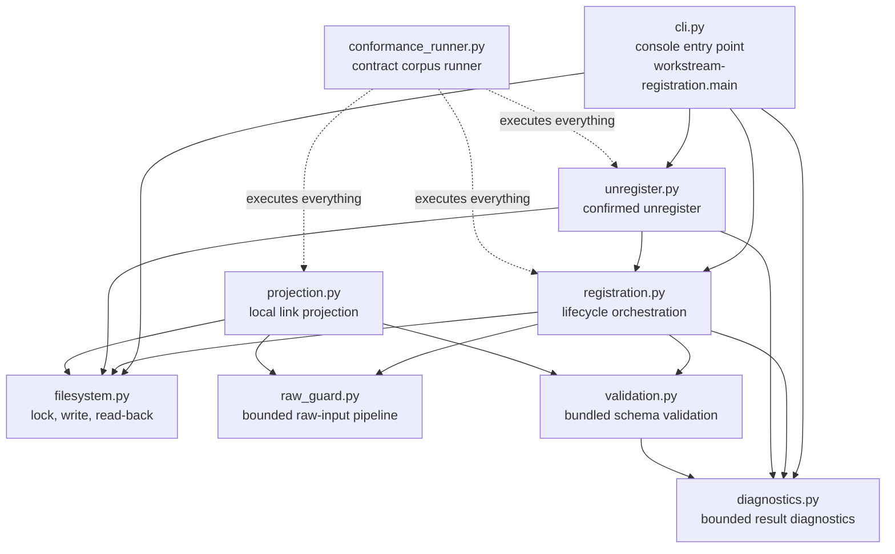
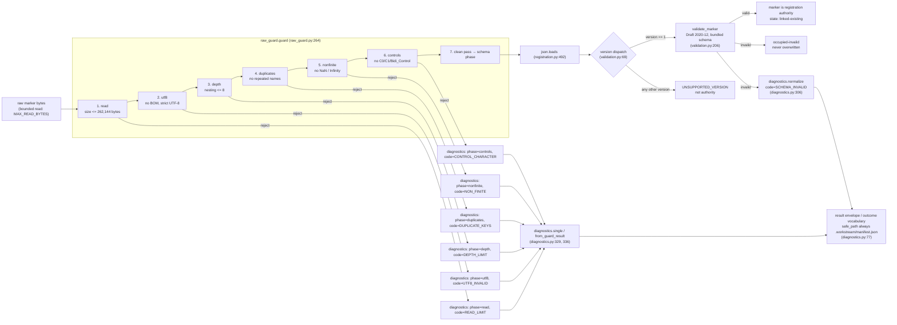

# How Workstream Registration Works

This page explains what the workstream-registration v1 package is, how the pieces fit together, and what happens — step by step — when you register a workspace. It is the "why and how it works" companion to the [operator guide](guide.md) (how to do things), the [reference](reference.md) (commands, exit codes, envelopes), and the [quickstart](quickstart.md) (first registration). Everything below is grounded in the actual source: every module, function, and line number cited here exists in `src/workstream_registration/` and can be opened to verify the claim. The [contracts](../../contracts/workstream-registration/) are the authority; when this page and a contract disagree, the contract wins.

## The one-sentence version

Workstream registration is a small Python CLI that turns an ordinary folder into a **registered workstream** by writing one durable, assistant-neutral JSON document — the **marker** — at `.workstream/manifest.json` inside that folder, and only after you confirm the exact bytes it is about to write.

The marker is the point of the feature. It is plain JSON inside the workspace, so it survives any assistant, device, or local-state rebuild: wiping the assistant's cache, switching machines, or replacing the tool never destroys the registration, because the registration lives in the workspace itself. Everything else the CLI does — the stable target handle, the confirmation digest, the lock, the read-back, the local projection — exists to make that one write safe and verifiable.

## The module map

The package is nine small modules. The CLI is the only operator-facing surface; everything below it is a strict pipeline.



| Module | Responsibility (one line) | Key public symbols |
|---|---|---|
| `cli.py` | Console entry point: parses the seven commands, runs the interactive preview/confirm sessions, emits the result envelope or human summary, and maps outcomes to exit codes. | `main` (cli.py:686), `register_interactive_cli` (cli.py:174), `unregister_interactive_cli` (cli.py:233), `resolve_invalid_interactive_cli` (cli.py:271), `recover_lock_interactive_cli` (cli.py:314), `OUTCOME_EXIT_CODE` (cli.py:107) |
| `registration.py` | Orchestrates the register lifecycle: inspect → draft → confirm → create-only write → read-back → verify → projection link, plus linking, resolution envelopes, and `resolve-invalid`. | `inspect` (registration.py:418), `draft` (registration.py:583), `confirm` (registration.py:638), `register` (registration.py:843), `link` (registration.py:1005), `resolve_invalid` (registration.py:1088), `install_default_projection_hook` (registration.py:356) |
| `unregister.py` | Confirmed conditional unregister: the KTD10 confirmed conditional delete with two-phase re-read, lock, and absence read-back. | `unregister_envelope` (unregister.py:111), `confirm_unregister` (unregister.py:157), `unregister` (unregister.py:279) |
| `projection.py` | Replaceable, device-local routing state: a transactional SQLite database under an owner-only directory; never registration authority. | `Projection.update` (projection.py:425), `Projection.rebuild` (projection.py:526), `Projection.remove` (projection.py:493), `default_store_dir` (projection.py:161) |
| `filesystem.py` | Filesystem lifecycle primitives: the stable target handle, the per-workspace lock, create-only marker writes, bounded read-back, absence verification. | `marker_path` (filesystem.py:147), `capture_target_handle` (filesystem.py:255), `write_marker_create_only` (filesystem.py:665), `read_marker` (filesystem.py:698), `conditional_delete_marker` (filesystem.py:729), `verify_marker_absent` (filesystem.py:751), `registration_lock` (filesystem.py:579), `recover_lock` (filesystem.py:622) |
| `raw_guard.py` | Runs a strictly ordered set of bounded checks over raw bytes *before* any JSON Schema materialization: size, strict UTF-8, nesting depth, duplicate names, non-finite constants, control characters. | `guard` (raw_guard.py:264), `guard_decoded_text` (raw_guard.py:283), `MAX_READ_BYTES` (raw_guard.py:61), `MAX_DEPTH` (raw_guard.py:62), `BIDI_CONTROL_POINTS` (raw_guard.py:89) |
| `validation.py` | Bundled Draft 2020-12 validation of markers and result envelopes, with version dispatch before schema application; never fetches a remote `$ref`. | `validate_marker` (validation.py:206), `validate_result_envelope` (validation.py:221), `load_bundled_schema` (validation.py:100), `SUPPORTED_MARKER_VERSION` (validation.py:69) |
| `diagnostics.py` | Normalizes failures into a small bounded vocabulary: phase, stable code, bounded `safe_path` — never native validator messages, instance values, URI content, or secrets. | `normalize` (diagnostics.py:306), `single` (diagnostics.py:329), `from_guard_result` (diagnostics.py:336), `SAFE_PATH_MARKER = ".workstream/manifest.json"` (diagnostics.py:77) |
| `conformance_runner.py` | Executes the contract corpus (87 fixtures), asserts the state table, the result vocabulary, caps, and the no-echo canary tripwire; exits 0 only when everything passes. | `run` (conformance_runner.py:1192), `main` (conformance_runner.py:1347) |

Dependency directions are real imports: `cli.py:75-78` imports `diagnostics`, `filesystem`, `registration`, and `unregister`; `registration.py:64-67` imports `diagnostics`, `filesystem`, `raw_guard`, and `validation`; `projection.py:62-65` imports `filesystem`, `raw_guard`, `validation`, and `registration.ProjectionResult`; `unregister.py:51-53` imports `diagnostics`, `filesystem`, and `registration`.

### What each module protects

- **`filesystem.py` owns the identity and the write.** The **stable target handle** (filesystem.py:206-252, captured at filesystem.py:255) is a packed platform directory/file identity pair — not a path string — plus the identity of the `.workstream` parent, or the explicit `ABSENT` sentinel when the parent does not exist yet (filesystem.py:101). Confirmation is bound to that handle, so a path that changes identity between preview and write invalidates the confirmation. The marker write is **create-only**: `write_marker_create_only` opens with exclusive-create semantics and never replaces an existing file (filesystem.py:665-695), and `conditional_delete_marker` deletes only when the on-disk bytes match the confirmed identity exactly (filesystem.py:729-748).
- **`raw_guard.py` + `validation.py` own "is this document trustworthy?"** Raw bytes must pass the six bounded phases before they are even parsed into JSON, and a marker must pass version dispatch and the bundled v1 schema (validation.py:206) before it is treated as registration authority. Unsupported versions never become authority (see the outcome overview below).
- **`diagnostics.py` owns "what may the failure say?"** The no-echo rule is structural: diagnostics carry only a phase, a code, and the fixed bounded `safe_path` `.workstream/manifest.json` (diagnostics.py:77). The normalizer reads only the validator keyword and path from jsonschema errors (diagnostics.py:289-326), so instance values, property names, URI content, and secrets are structurally impossible in the output.
- **`projection.py` owns "where is it locally?"** — and is deliberately *not* authority. The SQLite projection holds marker identity, label, marker version, target handle, routing path, state, and an input ordinal — and **no URI field at all** (projection.py:17-20), so record-source content is never copied into it. Deleting the projection database never unregisters anything; a rebuild begins from the markers (`Projection.rebuild`, projection.py:526).

## The register lifecycle, step by step

The sequence below is the real call path for a first registration. Every step is cited to its implementation; the protocol's state names (`inspection`, `draft-ready`, `writing`, `registered` — see the state table in `contracts/workstream-registration/v1/registration-protocol.md` §13) map onto it.

```mermaid
sequenceDiagram
    autonumber
    participant Op as Operator (terminal)
    participant Cli as cli.py<br/>register_interactive_cli
    participant Reg as registration.py
    participant Fs as filesystem.py
    participant Prj as projection.py

    Op->>Cli: workstream-registration register <ws> --label ... --record-source ...
    Cli->>Reg: install_default_projection_hook() (cli.py:191)
    Cli->>Reg: inspect(ws) (registration.py:418)
    Reg->>Fs: capture_target_handle(ws) (filesystem.py:255)
    Fs-->>Reg: TargetHandle(workspace, parent | ABSENT)
    Reg-->>Cli: Inspection(state=draft-ready)
    Cli->>Reg: draft(label, record_sources, kind) (registration.py:583)
    Reg-->>Cli: Draft(envelope, digest) — fresh identity (registration.py:610)
    Cli-->>Op: preview + "confirm <digest>" (cli.py:217-229)
    Op->>Cli: confirm <digest> (exact line only)
    Cli->>Reg: confirm(draft, digest) (registration.py:638)
    Cli->>Reg: register(ws, draft, confirmation) (registration.py:843)
    Reg->>Fs: registration_lock(ws) — acquire (filesystem.py:579)
    Note over Reg,Fs: pre-write revalidation; confirmation consumed<br/>(registration.py:870-890)
    Reg->>Fs: write_marker_create_only(ws, bytes, handle) (filesystem.py:665)
    Reg->>Fs: read_marker(ws) — reopen (filesystem.py:698)
    Note over Reg: raw guard + schema re-run; exact identity +<br/>read-back target handle verified<br/>(_readback_and_project, registration.py:961-1002)
    Reg->>Prj: Projection.update(ProjectionInput) (projection.py:425)
    Prj-->>Reg: ProjectionResult(status=linked)
    Reg-->>Cli: RegistrationResult(outcome=registered, identity)
    Cli-->>Op: outcome: registered / identity: <uuid> / exit 0 (cli.py:544-575)
```

The prose version, with the details the diagram compresses:

1. **Install the projection hook once** (`register_interactive_cli` calls `reg.install_default_projection_hook()`, cli.py:191, which wires `Projection().update` at registration.py:356-367). An unset hook would map a completed write to `registered-unlinked` instead.
2. **Inspect, read-only** (`registration.inspect`, registration.py:418-466): capture the stable target handle, observe marker presence and validity. Missing/inaccessible/non-directory workspaces stop with `WORKSPACE_INACCESSIBLE`; identity API failures fail closed (registration.py:427-444). A marker-absent workspace is `draft-ready`; a valid supported marker degrades to linking; an invalid/partial/unsupported one is `occupied-invalid` and is never touched.
3. **Draft the canonical confirmation envelope** (`registration.draft`, registration.py:583-635): generate a fresh RFC 4122 v4 identity (registration.py:610), build the marker document, validate the draft through the raw guard and schema *before* it is ever shown, and digest the canonical envelope with an HMAC-SHA-256 key generated once per process (registration.py:173-182). The key and digest are in-memory only — which is why a digest from one invocation is always rejected by the next.
4. **Preview and confirm** (cli.py:217-229): the CLI prints the field summary — label and local paths shown, record-source URI content always `<redacted>` (cli.py:166-171) — and asks for the exact line `confirm <digest>`. Only that exact line permits a write; anything else, EOF, or a mismatched digest cancels cleanly with no write (cli.py:380-397, registration.py:638-648).
5. **Register: revalidate, lock, write create-only, read back** (`registration.register`, registration.py:843-918): the workspace identity is re-captured and compared, the marker must still be absent, and the single-use confirmation is consumed (registration.py:864-890). Inside the lock (filesystem.py:579-614), the marker is written with exclusive-create semantics and `os.fsync` (filesystem.py:665-695), then reopened and re-read (`_readback_and_project`, registration.py:961-1002): raw guard and schema re-run, exact identity verified, and the read-back target handle compared. A create collision degrades to linking (`_collision_result`, registration.py:921-958); a read-back failure reports `written-unverified` and the identity is never regenerated.
6. **Link the projection** (`_project`, registration.py:761-829): the hook upserts the row keyed by `(identity, target_handle)` (projection.py:425-491). Linked → `registered`; a projection failure → `registered-unlinked` (marker stays authoritative); a different identity already on that target → `conflict`, the only in-scope duplicate signal (projection.py:442-443).
7. **Report** (`cli._emit_result`, cli.py:536-552): human `outcome: registered` + `identity`, or the compact JSON envelope with `--json`. The exit code is derived from the outcome via `OUTCOME_EXIT_CODE` (cli.py:107-120) — the `--json` outcome and the exit code can never diverge.

Unregister inverts the same shape: `unregister_envelope` (unregister.py:111) binds the confirmation to the marker's exact bytes, identity, target handle, and observed presence; `unregister` (unregister.py:279-362) acquires the cooperative lock, re-reads and compares the marker **twice** (post-lock and immediately pre-delete), conditionally deletes only on an exact byte match, and completes only when absence read-back verifies the marker is gone (unregister.py:353-360). Any change at any comparison stops without deleting (`changed-marker-stopped`, unregister.py:360).

## The data flow: raw bytes to result vocabulary

Everything the CLI reads or validates flows through the same bounded pipeline. The raw-input guard runs **before** any JSON parsing — malformed, oversized, or hostile documents are rejected without ever materializing into JSON Schema terms.



Three properties of this flow matter operationally:

- **The guard terminates, it never "fixes".** Each phase rejects with a stable code mapped onto the closed diagnostic vocabulary (`GUARD_CODE_MAP`, diagnostics.py:169-177). The guard phases are exactly the first six entries of the closed phase enum (raw_guard.py:71-79, diagnostics.py:88-101), so a diagnostic's `phase` tells you which guard check failed.
- **Version dispatch happens before schema application** (validation.py:7-9): `validate_marker` dispatches on the `version` field first; anything other than `1` is `UNSUPPORTED_VERSION`, never interpreted as authority. A missing version falls through to the schema, which rejects it as `SCHEMA_INVALID`.
- **The schema never sees URI content as data it must handle.** Generic format assertion is disabled by construction (validation.py:22-26), so URIs are syntax-accepted and never fetched, dereferenced, or echoed. Any well-formed URI is a valid record source; an unsupported scheme stays valid but non-dereferenceable.

## The outcome overview: twelve outcomes, terminal or recovery

Every registration, inspection, linking, and unregister operation reports exactly one outcome from the frozen v1 vocabulary (defined in `registration.py:118-127` and frozen by the result contract). There is deliberately no `invalid-marker` outcome: any invalid marker at the path reports `occupied-invalid`.

| Outcome | Kind | Exit | What it means | Recovery |
|---|---|---|---|---|
| `registered` | Terminal success | 0 | Marker written, read back, verified, linked. | Re-running `register` degrades to linking. |
| `linked-existing` | Terminal success | 0 | A valid supported marker was read unchanged and linked; no write. | None needed; idempotent. |
| `unregistered` | Terminal success | 0 | Confirmed conditional delete + verified absence. | Fresh registration (fresh identity). |
| `invalid-marker-resolved` | Terminal success | 0 | Confirmed resolution delete + verified absence. | Fresh registration. |
| `cancelled` | No-write stop | 2 | Rejection, EOF, or digest mismatch at a confirmation point. | Fresh inspection → new draft → new confirmation. |
| `stopped` | No-write stop | 2 | Operational stop: missing/inaccessible workspace, redirected marker components, identity APIs unavailable. | Correct the input condition; re-inspect. |
| `occupied-invalid` | Invalid input | 3 | A marker is present but invalid, partial, or unsupported; never overwritten. | Operator-confirmed `resolve-invalid`. |
| `conflict` | Conflict | 4 | Projection write-time conflict: the captured target already holds a different identity. Marker unchanged. | Operator resolves duplicates; v1 has no auto-resolution. |
| `changed-marker-stopped` | Conflict | 4 | During unregister/resolution: cooperation unavailable, or a changed marker/target/identity observed. No delete. | Fresh inspection → new draft → new confirmation. |
| `written-unverified` | Partial | 5 | Write succeeded but read-back failed. Marker may exist and be valid; identity never regenerated. | Fresh inspection: valid → link, partial → resolve, absent → new draft. |
| `registered-unlinked` | Partial | 5 | Marker written and verified, but the projection link failed. Marker stays authoritative. | `link` or `rebuild` restores routing state. |
| `invalid-deleted-unverified` | Partial | 5 | Resolution delete succeeded but absence read-back failed. Nothing rewritten. | Re-inspect: absent = resolved, present = fresh `resolve-invalid`. |

Terminal outcomes end the protocol run for that command; partial and conflict outcomes carry an explicit recovery path. The recovery relationships are exactly those in the protocol's state/transition table (`contracts/workstream-registration/v1/registration-protocol.md` §13): `written-unverified → inspection`, `registered-unlinked → linked-existing`, `changed-marker-stopped → inspection`, `invalid-deleted-unverified → inspection`. Exit codes come from `cli.OUTCOME_EXIT_CODE` (cli.py:107-120), which the conformance runner asserts against the corpus.

`rebuild` and `recover-lock` are deliberately **not** result-vocabulary operations — the frozen outcome set has no rebuild or lock-recovery outcome — so they report their own stable surfaces: `{status, entries, detail}` for rebuild (projection.py:144-158, cli.py:600-617) and `{workspace, lock_state}` with `absent | recovered | held` for recover-lock (cli.py:131-143, 314-377).

## Why confirmation exists (and why the digest works the way it does)

The marker is **authoritative**: once written, any conforming reader treats the workspace as a registered workstream. An unconfirmed or wrong draft must never become that. So the protocol draws a hard line between "a draft exists in memory" and "the workspace is now registered": nothing is written before the operator confirms the exact draft, and the confirmation is bound to everything that could change underneath it — the marker fields, the stable target handle, the observed marker absence, and the expected `.workstream` parent transition (`_build_envelope`, registration.py:555-576).

The digest is HMAC-SHA-256 under a **process-ephemeral key** (`envelope_digest`, registration.py:173-175; key at registration.py:178-182). Three consequences, all deliberate:

- **In-memory only** — the key and digest are never persisted or logged, so there is no digest artifact an attacker (or a tired operator) could replay.
- **Same-process only** — the key differs per invocation, so copying a digest from an earlier run is always rejected. This is why the `confirm` line must come from the preview currently on your screen.
- **Single-use** — the confirmation is consumed by the write it authorizes; a new inspection, a second write attempt, a terminal transition, or a marker-state change expires an unused confirmation (registration.py:864-890).

The same mechanism, with the presence precondition inverted, guards unregister: `unregister`'s confirmation is bound to the marker's exact bytes and identity, and the delete happens only after two re-read comparisons inside the lock (unregister.py:329-354). A changed marker between confirmation and delete is exactly the condition those comparisons exist to catch.

## What is deliberately out of scope (v1)

The contracts claim nothing beyond registration:

- **Machine scan of workspaces.** Every command operates on explicit operator-supplied paths; v1 never auto-discovers roots. The operator must know where each workspace lives, including any proxy workspace.
- **Registry consumption.** Registry publishing is designed but deferred; registries are read-only discovery aids that point to metadata, never hold it.
- **Marker fields not in the v1 schema.** Purpose, lifecycle state, and a designated decision record source are deferred; the closed schema has no such fields.
- **Workstream status, progress, next actions, freshness.** This version registers and links; it does not answer "what needs me".
- **Cross-device root rediscovery and wipe-and-rebuild proof.** Designed later; not in this version.
- **Any second runtime.** CPython 3.14.x is the only implementation.
- **Automatic duplicate handling.** Duplicates are the operator's call; v1's only duplicate signal is the projection write-time `conflict` outcome.

There is also one disclosed residual limitation, not a claimed guarantee: the check-then-act window is safe against *cooperating* writers (the lock protocol), but a non-cooperating external writer racing the window is a documented residual race — if you hand-edit marker files alongside the CLI, you own that race (protocol §11, "Residual limitation").

## How to verify all of this yourself

- `python -m workstream_registration.conformance_runner` (conformance_runner.py:1192) executes the full 87-fixture corpus, asserts the state table and result vocabulary, runs the canary no-echo tripwire, and exits 0 only when everything passes.
- `pytest` from the repository root runs the full test suite.
- The authoritative definitions live under `contracts/workstream-registration/v1/` — the marker schema (`workstream.schema.json`), the result envelope schema (`registration-result.schema.json`), the protocol state table (`registration-protocol.md` §13), and the compatibility declaration (`compatibility.md`).

From here: [install it](installation.md) → [first registration (quickstart)](quickstart.md) → [how to use it day to day (guide)](guide.md) → [commands, exit codes, envelopes (reference)](reference.md).
